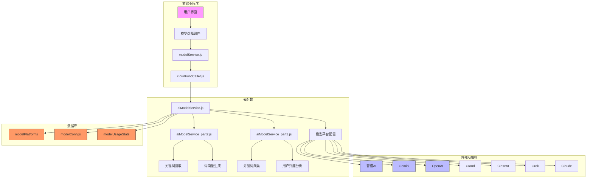

# AI模型配置管理

<cite>
**本文档引用文件**   
- [model-config.md](file://doc/开发文档/database/model-config.md)
- [aiModelService.js](file://cloudfunctions/analysis/aiModelService.js)
- [aiModelService_part2.js](file://cloudfunctions/analysis/aiModelService_part2.js)
- [aiModelService_part3.js](file://cloudfunctions/analysis/aiModelService_part3.js)
- [modelService.js](file://miniprogram/services/modelService.js)
- [cloudFuncCaller.js](file://miniprogram/services/cloudFuncCaller.js)
</cite>

## 目录
1. [简介](#简介)
2. [数据库设计](#数据库设计)
3. [核心功能实现](#核心功能实现)
4. [API接口设计](#api接口设计)
5. [缓存策略](#缓存策略)
6. [安全控制](#安全控制)
7. [智能模型选择](#智能模型选择)
8. [使用统计与监控告警](#使用统计与监控告警)
9. [前端模型管理](#前端模型管理)
10. [系统架构图](#系统架构图)
11. [性能优化建议](#性能优化建议)

## 简介
本文档详细说明了AI模型配置管理系统的设计与实现，涵盖`modelPlatforms`、`modelConfigs`和`modelUsageStats`三个核心集合的结构与使用方式。系统支持动态配置管理、智能模型选择、使用统计分析和监控告警等功能，旨在为多AI平台集成提供灵活、可扩展的解决方案。

**Section sources**
- [model-config.md](file://doc/开发文档/database/model-config.md#L1-L195)

## 数据库设计
系统通过三个核心集合实现AI模型的集中化管理，支持多平台、多模型的统一配置与监控。

### modelPlatforms（模型平台表）
存储AI模型提供商的基础信息，包括API地址、认证方式等平台级配置。

**字段结构**
```javascript
{
  _id: "平台ID",                    // string, 主键，使用platformKey
  platformKey: "平台键名",          // string, 唯一标识符，如ZHIPU、GEMINI等
  name: "平台名称",                 // string, 显示名称
  baseUrl: "API基础地址",            // string, API服务的基础URL
  apiKeyEnv: "API密钥环境变量名",    // string, 环境变量名
  authType: "认证类型",              // string, Bearer/api-key等
  status: 1,                       // number, 状态：1启用/0禁用
  priority: 1,                     // number, 优先级，数字越小优先级越高
  description: "平台描述",          // string, 平台功能描述
  createTime: "创建时间",            // date, 记录创建时间
  updateTime: "更新时间"             // date, 记录更新时间
}
```

**索引设计**
- **唯一索引**: platformKey（确保平台键名唯一）
- **普通索引**: status（用于状态筛选）
- **普通索引**: priority（用于优先级排序）

### modelConfigs（模型配置表）
存储具体的AI模型配置信息，包括模型能力、定价、限制等详细信息。

**字段结构**
```javascript
{
  _id: "配置ID",                    // string, 主键，自动生成
  platformKey: "平台键名",          // string, 关联到modelPlatforms.platformKey
  modelId: "模型ID",               // string, 模型在平台中的唯一标识
  name: "模型名称",                 // string, 显示名称
  description: "模型描述",          // string, 模型功能描述
  capabilities: ["能力列表"],       // array, 支持的能力：chat、reasoning、coding、analysis、multimodal
  maxTokens: 128000,               // number, 最大支持token数
  isDefault: false,                // boolean, 是否为平台默认模型
  status: 1,                       // number, 状态：1启用/0禁用
  priority: 1,                     // number, 在平台内的优先级
  pricing: {                       // object, 定价信息
    input: 0.0005,                 // number, 输入token单价（元/1k tokens）
    output: 0.0015                 // number, 输出token单价（元/1k tokens）
  },
  createTime: "创建时间",            // date, 记录创建时间
  updateTime: "更新时间"             // date, 记录更新时间
}
```

**索引设计**
- **复合唯一索引**: platformKey + modelId（确保同一平台下模型ID唯一）
- **普通索引**: status（用于状态筛选）
- **普通索引**: capabilities（用于能力筛选）

### modelUsageStats（模型使用统计表）
记录模型的使用情况和性能统计数据，用于监控和优化。

**字段结构**
```javascript
{
  _id: "统计ID",                    // string, 主键，自动生成
  platformKey: "平台键名",          // string, 使用的平台
  modelId: "模型ID",               // string, 使用的模型
  userId: "用户ID",                 // string, 使用用户
  usageCount: 100,                 // number, 使用次数
  totalTokens: 50000,              // number, 总token使用量
  totalCost: 25.5,                 // number, 总成本（元）
  successCount: 95,                // number, 成功调用次数
  errorCount: 5,                   // number, 失败调用次数
  avgResponseTime: 1500,           // number, 平均响应时间（毫秒）
  lastUsedTime: "最后使用时间",     // date, 最后一次使用时间
  createTime: "创建时间",            // date, 统计记录创建时间
  updateTime: "更新时间"             // date, 统计记录更新时间
}
```

**索引设计**
- **复合索引**: platformKey + modelId + userId（用于查询特定用户的模型使用情况）
- **普通索引**: lastUsedTime（用于时间范围查询）
- **普通索引**: userId（用于用户级别统计）

**Section sources**
- [model-config.md](file://doc/开发文档/database/model-config.md#L20-L195)

## 核心功能实现
系统通过云函数模块实现了统一的AI模型调用接口，支持多种AI平台的集成与管理。

### 统一模型服务架构
`aiModelService.js`模块提供了统一的AI模型调用接口，支持智谱AI、Google Gemini、OpenAI、Crond、CloseAI、Grok、Claude等多种模型平台。

#### 模型平台配置
系统通过`MODEL_PLATFORMS`常量定义了各平台的配置信息，包括：
- **平台名称与键名**：如ZHIPU、GEMINI等
- **API基础地址**：各平台的API服务URL
- **API密钥环境变量**：从环境变量中读取密钥
- **默认模型与支持模型列表**
- **认证类型**：Bearer或API Key
- **API端点映射**

#### 动态配置支持
系统支持运行时动态添加/修改模型配置，无需重启云函数即可生效，便于A/B测试和灰度发布。

**Section sources**
- [aiModelService.js](file://cloudfunctions/analysis/aiModelService.js#L20-L100)

## API接口设计
系统提供了完整的CRUD接口和统计功能，支持模型配置的全生命周期管理。

### 云函数主要接口
| 接口名称 | 功能描述 | 请求参数 | 返回结果 |
|--------|--------|--------|--------|
| `getPlatforms` | 获取平台列表 | 无 | 平台信息数组 |
| `getConfigs` | 获取模型配置列表 | platformKey（可选） | 模型配置数组 |
| `getRecommendedModels` | 获取推荐模型 | 用户偏好、使用场景 | 推荐模型列表 |
| `createConfig` | 创建模型配置 | 新配置对象 | 创建结果 |
| `updateConfig` | 更新模型配置 | 配置ID、更新字段 | 更新结果 |
| `deleteConfig` | 删除模型配置 | 配置ID | 删除结果 |
| `updateUsage` | 更新使用统计 | 使用记录对象 | 更新结果 |
| `getUsageStats` | 获取使用统计 | 查询条件 | 统计结果 |

### 错误处理与重试机制
系统实现了完善的错误处理机制：
- **429错误自动重试**：遇到请求过多时自动延迟重试，重试次数递减
- **指数退避策略**：重试间隔随失败次数指数增长
- **详细日志记录**：开发环境下输出详细请求和响应日志

**Section sources**
- [aiModelService.js](file://cloudfunctions/analysis/aiModelService.js#L101-L662)
- [aiModelService_part2.js](file://cloudfunctions/analysis/aiModelService_part2.js#L1-L316)
- [aiModelService_part3.js](file://cloudfunctions/analysis/aiModelService_part3.js#L1-L478)

## 缓存策略
系统采用多级缓存策略提升性能，减少数据库和API调用压力。

### 内存缓存
- **模型配置缓存**：默认缓存5分钟，减少数据库查询
- **缓存键设计**：采用`platformKey + modelId`作为缓存键
- **缓存失效机制**：支持手动刷新和自动过期

### 前端本地缓存
小程序端通过`wx.setStorageSync`实现本地缓存：
- **模型类型缓存**：键名为`selected_model_type`
- **模型列表缓存**：键名为`model_list_${modelType}`，有效期24小时
- **选择模型缓存**：键名为`selected_model_${modelType}`

**Section sources**
- [modelService.js](file://miniprogram/services/modelService.js#L1-L335)

## 安全控制
系统实施了多层次的安全控制措施，确保数据和调用的安全性。

### 数据安全
- **API密钥隔离**：所有API密钥存储在环境变量中，不硬编码在代码里
- **敏感信息保护**：数据库操作权限严格控制，避免敏感信息泄露
- **通信加密**：所有API调用通过HTTPS加密传输

### 访问控制
- **基于角色的访问控制**（RBAC）：不同角色拥有不同操作权限
- **API调用频率限制**：防止恶意刷量和滥用
- **异常行为监控**：实时监控异常调用模式

**Section sources**
- [model-config.md](file://doc/开发文档/database/model-config.md#L150-L170)
- [aiModelService.js](file://cloudfunctions/analysis/aiModelService.js#L150-L200)

## 智能模型选择
系统支持基于多种因素的智能模型选择策略，优化用户体验和成本效益。

### 选择策略
- **成本优先**：根据定价信息选择性价比最高的模型
- **性能优先**：根据响应时间选择性能最优的模型
- **能力匹配**：根据任务需求（如多模态、推理等）选择合适模型
- **用户偏好**：尊重用户自定义的模型选择偏好

### 推荐算法
系统可根据以下因素生成推荐模型列表：
- 用户历史使用习惯
- 当前任务类型（情感分析、关键词提取等）
- 实时性能指标（响应时间、错误率）
- 成本预算限制

**Section sources**
- [model-config.md](file://doc/开发文档/database/model-config.md#L80-L90)
- [modelService.js](file://miniprogram/services/modelService.js#L1-L335)

## 使用统计与监控告警
系统全面记录模型使用情况，支持精细化的监控和告警功能。

### 统计维度
- **使用频率**：各模型的调用次数统计
- **资源消耗**：token使用量、成本统计
- **性能指标**：平均响应时间、成功率
- **错误分析**：各类错误的分布和趋势

### 监控告警
- **成本预警**：当使用成本超过阈值时触发告警
- **性能下降**：当响应时间显著增加时告警
- **服务异常**：当错误率超过正常范围时告警
- **使用趋势分析**：识别使用模式的变化趋势

**Section sources**
- [model-config.md](file://doc/开发文档/database/model-config.md#L100-L120)
- [aiModelService.js](file://cloudfunctions/analysis/aiModelService.js#L500-L600)

## 前端模型管理
小程序端通过`modelService.js`模块实现了模型选择和管理功能。

### 主要功能
- **获取当前模型**：从本地缓存读取用户选择的模型
- **设置模型选择**：保存用户选择并同步到本地缓存
- **获取可用模型列表**：支持动态获取各平台的模型列表
- **模型连接测试**：提供测试接口验证模型可用性
- **模型信息展示**：显示模型的名称、功能特点和描述

### 模型类型常量
系统定义了标准化的模型类型常量：
```javascript
const MODEL_TYPES = {
  ZHIPU: 'zhipu',     // 智谱AI
  GEMINI: 'gemini',   // Gemini
  OPENAI: 'openai',   // ChatGPT
  CROND: 'crond',     // ChatGPT (Crond)
  CLOSEAI: 'closeai', // DeepSeek
  GROK: 'grok',       // Grok
  CLAUDE: 'claude'    // Claude
};
```

**Section sources**
- [modelService.js](file://miniprogram/services/modelService.js#L1-L335)

## 系统架构图


**Diagram sources**
- [modelService.js](file://miniprogram/services/modelService.js#L1-L335)
- [aiModelService.js](file://cloudfunctions/analysis/aiModelService.js#L1-L662)
- [model-config.md](file://doc/开发文档/database/model-config.md#L1-L195)

## 性能优化建议
为确保系统高效稳定运行，建议采取以下性能优化措施：

### 查询优化
- **合理使用索引**：确保常用查询字段都有适当索引
- **避免全表扫描**：通过索引优化查询性能
- **分页查询**：对大数据集采用分页查询方式

### 并发处理
- **支持并发请求**：确保服务能处理高并发场景
- **防止缓存击穿**：采用互斥锁或逻辑过期策略
- **降级处理机制**：在服务异常时提供降级方案

### 扩展性设计
- **水平扩展**：支持多实例部署和负载均衡
- **数据库分片**：在数据量大时考虑分片策略
- **功能扩展**：预留接口支持更多AI平台的接入

**Section sources**
- [model-config.md](file://doc/开发文档/database/model-config.md#L130-L150)
- [aiModelService.js](file://cloudfunctions/analysis/aiModelService.js#L200-L300)