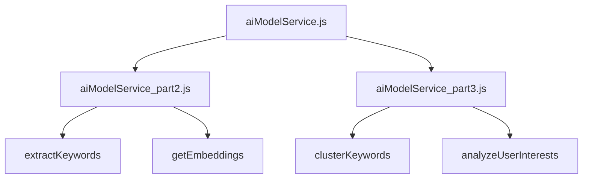
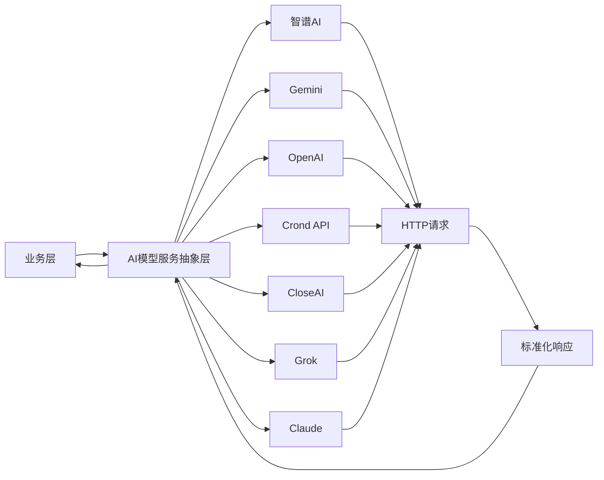
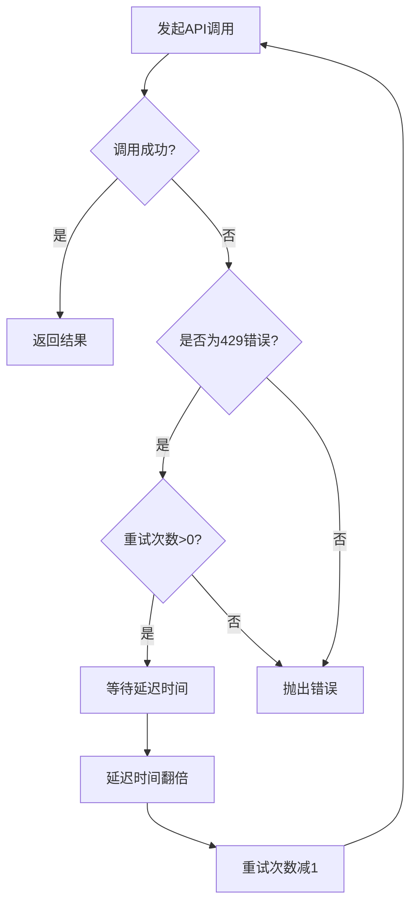
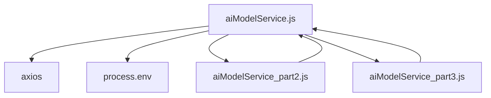

# AI模型服务抽象层

<cite>
**本文档引用文件**  
- [aiModelService.js](file://cloudfunctions/analysis/aiModelService.js)
- [aiModelService_part2.js](file://cloudfunctions/analysis/aiModelService_part2.js)
- [aiModelService_part3.js](file://cloudfunctions/analysis/aiModelService_part3.js)
- [Gemini_API集成开发文档.md](file://doc/开发文档/Gemini_API集成开发文档.md)
- [统一AI模型服务设计文档.md](file://doc/开发文档/统一AI模型服务设计文档.md)
</cite>

## 目录
1. [简介](#简介)
2. [项目结构](#项目结构)
3. [核心组件](#核心组件)
4. [架构概述](#架构概述)
5. [详细组件分析](#详细组件分析)
6. [依赖分析](#依赖分析)
7. [性能考虑](#性能考虑)
8. [故障排除指南](#故障排除指南)
9. [结论](#结论)

## 简介
AI模型服务抽象层是HeartChat项目中的核心模块，旨在为多种AI模型平台（包括智谱AI、Google Gemini、OpenAI、Crond API、CloseAI等）提供统一的调用接口。通过该服务，上层业务逻辑无需关心底层模型的具体实现差异，即可实现跨平台的AI能力调用。本服务支持情感分析、关键词提取、词向量生成、兴趣分析等多种功能，并具备模型路由、失败降级、请求标准化等高级特性，极大提升了系统的灵活性与可维护性。

## 项目结构
AI模型服务主要位于`cloudfunctions/analysis/`目录下，采用分文件模块化设计，以提升代码可读性和维护性。主文件`aiModelService.js`负责统一接口导出和基础配置，`aiModelService_part2.js`和`aiModelService_part3.js`分别封装了关键词提取、词向量生成、聚类分析和用户兴趣分析等具体功能模块。

**图示来源**  
- [aiModelService.js](file://cloudfunctions/analysis/aiModelService.js#L646-L661)
- [aiModelService_part2.js](file://cloudfunctions/analysis/aiModelService_part2.js#L1-L10)
- [aiModelService_part3.js](file://cloudfunctions/analysis/aiModelService_part3.js#L1-L10)

**本节来源**  
- [aiModelService.js](file://cloudfunctions/analysis/aiModelService.js#L1-L48)
- [项目结构](file://.)

## 核心组件
AI模型服务抽象层的核心在于其统一的接口设计和灵活的平台适配机制。核心组件包括：
- **MODEL_PLATFORMS**：定义了所有支持的AI平台的配置信息，如基础URL、API密钥环境变量、默认模型、支持的模型列表等。
- **callModelApi**：统一的API调用函数，负责构建请求、处理认证、发送HTTP请求并解析响应，同时内置重试机制。
- **analyzeEmotion**：情感分析主接口，根据不同平台调用相应的API并标准化返回结果。
- **辅助函数**：如`getApiKey`、`getPlatformConfig`、`delay`等，为上层功能提供基础支持。

**本节来源**  
- [aiModelService.js](file://cloudfunctions/analysis/aiModelService.js#L48-L661)

## 架构概述
该服务采用分层架构设计，实现了高度的解耦和可扩展性。上层业务通过统一的函数接口（如`analyzeEmotion`、`extractKeywords`）发起调用，服务层根据配置选择合适的AI平台，通过`callModelApi`进行适配和调用，最终将不同平台的异构响应统一为标准化的JSON格式返回。

**图示来源**  
- [aiModelService.js](file://cloudfunctions/analysis/aiModelService.js#L48-L661)
- [统一AI模型服务设计文档.md](file://doc/开发文档/统一AI模型服务设计文档.md#L0-L247)

## 详细组件分析
### 模型平台配置与路由
服务通过`MODEL_PLATFORMS`常量对象集中管理所有AI平台的配置。每个平台配置包含名称、基础URL、API密钥环境变量名、默认模型、支持的模型列表、认证类型和接口端点等信息。模型路由逻辑由调用方通过`options.platform`参数指定，若未指定则使用默认平台（如Gemini）。此设计使得添加新平台仅需在`MODEL_PLATFORMS`中添加新配置，无需修改核心调用逻辑。

**本节来源**  
- [aiModelService.js](file://cloudfunctions/analysis/aiModelService.js#L48-L150)

### 失败降级与重试策略
服务内置了针对429错误（请求过多）的自动重试机制。当`callModelApi`捕获到429状态码时，会执行指数退避重试策略：等待指定延迟时间后重试，并将延迟时间翻倍，重试次数递减。此机制有效应对了API限流问题，提高了服务的健壮性。对于其他错误或重试次数耗尽的情况，则直接抛出异常，由上层业务处理。

**图示来源**  
- [aiModelService.js](file://cloudfunctions/analysis/aiModelService.js#L298-L338)

**本节来源**  
- [aiModelService.js](file://cloudfunctions/analysis/aiModelService.js#L298-L338)

### 请求参数标准化机制
不同AI平台的API请求格式存在差异，服务通过`callModelApi`函数内部的条件判断实现了请求参数的标准化。例如，Gemini使用`contents`和`generationConfig`字段，而OpenAI系列平台使用`messages`和`max_tokens`等标准字段。服务根据`platformKey`判断平台类型，动态构建符合各平台要求的请求体和请求头，从而对外提供统一的参数接口。

**本节来源**  
- [aiModelService.js](file://cloudfunctions/analysis/aiModelService.js#L250-L295)

### 功能接口实现
#### 情感分析
`analyzeEmotion`函数是情感分析的核心接口。它根据指定平台构建不同的系统提示词（system prompt），并将用户输入文本和历史消息上下文整合后发送给AI模型。对于Gemini，使用`contents`格式；对于OpenAI等平台，则使用`messages`数组格式。响应解析后，服务将结果统一为包含主要情感、次要情感、强度、愉悦度、唤醒水平、趋势、注意力水平、雷达维度、关键词、触发词、建议和摘要等字段的标准化JSON对象。

**本节来源**  
- [aiModelService.js](file://cloudfunctions/analysis/aiModelService.js#L340-L645)

#### 关键词提取与词向量
`extractKeywords`函数负责从文本中提取关键词及其权重。`getEmbeddings`函数用于获取文本的词向量表示。值得注意的是，由于Gemini不支持词向量功能，当请求非智谱AI平台时，服务会使用本地模拟算法生成伪随机向量，确保接口的可用性。

**本节来源**  
- [aiModelService_part2.js](file://cloudfunctions/analysis/aiModelService_part2.js#L150-L316)

#### 聚类分析与用户兴趣
`clusterKeywords`和`analyzeUserInterests`函数分别实现了关键词聚类和用户兴趣分析。它们通过构造特定的提示词，引导AI模型对文本进行深度分析，并将结果结构化返回。

**本节来源**  
- [aiModelService_part3.js](file://cloudfunctions/analysis/aiModelService_part3.js#L1-L478)

## 依赖分析
AI模型服务的主要依赖包括：
- **axios**：用于发起HTTP请求，是与外部AI平台通信的基础。
- **环境变量**：通过`process.env`读取各平台的API密钥，确保密钥安全。
- **子模块**：`aiModelService_part2.js`和`aiModelService_part3.js`通过`require`引入，并通过`init`函数接收主模块的辅助函数引用，实现功能解耦。

**图示来源**  
- [aiModelService.js](file://cloudfunctions/analysis/aiModelService.js#L3-L661)
- [aiModelService_part2.js](file://cloudfunctions/analysis/aiModelService_part2.js#L1-L10)
- [aiModelService_part3.js](file://cloudfunctions/analysis/aiModelService_part3.js#L1-L10)

**本节来源**  
- [aiModelService.js](file://cloudfunctions/analysis/aiModelService.js#L3-L661)

## 性能考虑
服务在性能方面进行了多项优化：
- **重试机制**：指数退避重试避免了在限流时的无效高频请求。
- **请求合并**：将多个参数（如温度、最大输出长度）合并到单个请求中。
- **连接复用**：底层`axios`库支持HTTP连接复用，减少握手开销。
- **模拟降级**：在词向量功能不可用时，提供模拟实现，避免功能完全中断。

## 故障排除指南
- **API密钥未设置**：确保在云函数环境中正确配置了`ZHIPU_API_KEY`、`GEMINI_API_KEY`等环境变量。
- **429错误频繁**：检查API调用频率是否超出平台配额，可适当调整重试延迟或增加API密钥。
- **响应解析失败**：检查AI模型返回的内容是否为有效JSON，提示词设计是否可能导致模型输出非JSON格式。
- **模型连接超时**：检查网络连接或API基础URL是否正确。

**本节来源**  
- [aiModelService.js](file://cloudfunctions/analysis/aiModelService.js#L298-L338)
- [chat/index.js](file://cloudfunctions/chat/index.js#L1203-L1247)
- [chat/index.js](file://cloudfunctions/chat/index.js#L1333-L1383)

## 结论
AI模型服务抽象层通过统一的接口、灵活的配置和健壮的错误处理机制，成功地将多种异构的AI模型平台整合为一个易于使用的服务。其模块化设计和清晰的职责划分，使得系统具有良好的可扩展性和可维护性。开发者可以轻松地扩展新AI模型的接入，只需在`MODEL_PLATFORMS`中添加配置，并根据需要调整请求/响应的适配逻辑即可。该服务为HeartChat提供了稳定、灵活的AI能力支撑。