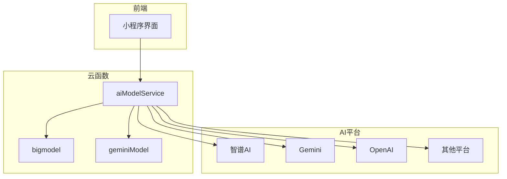
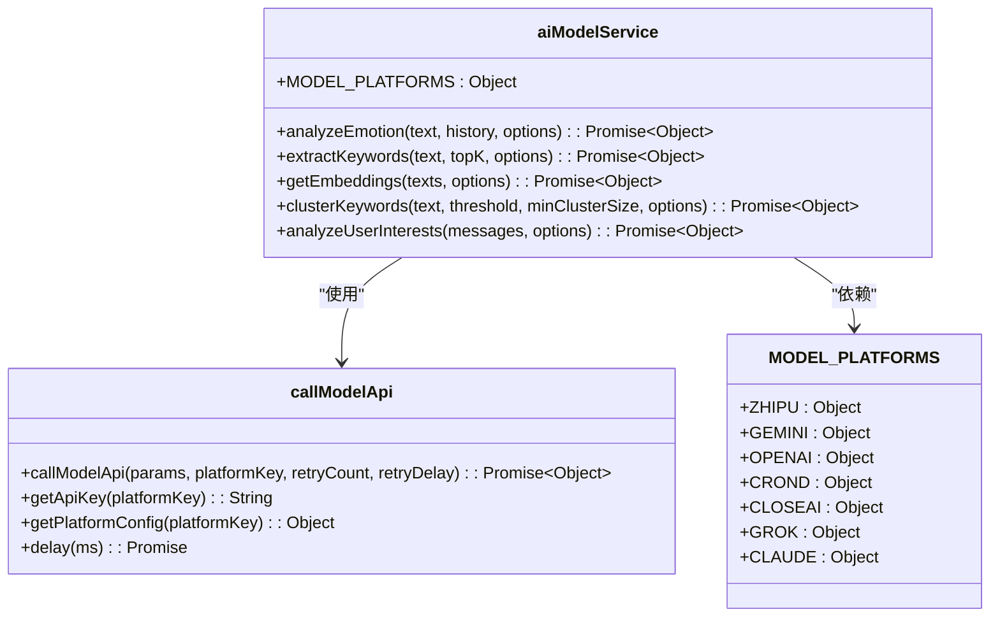
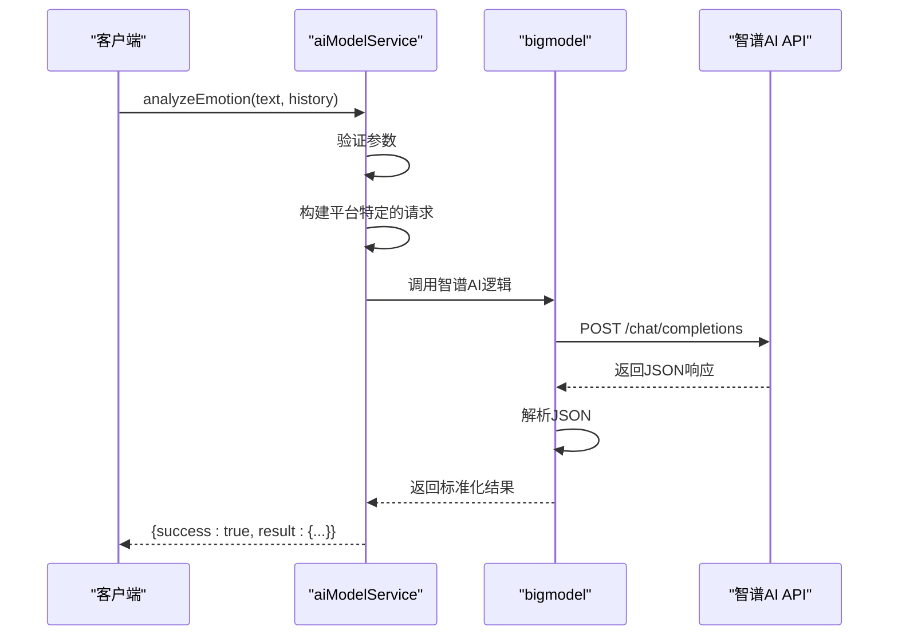
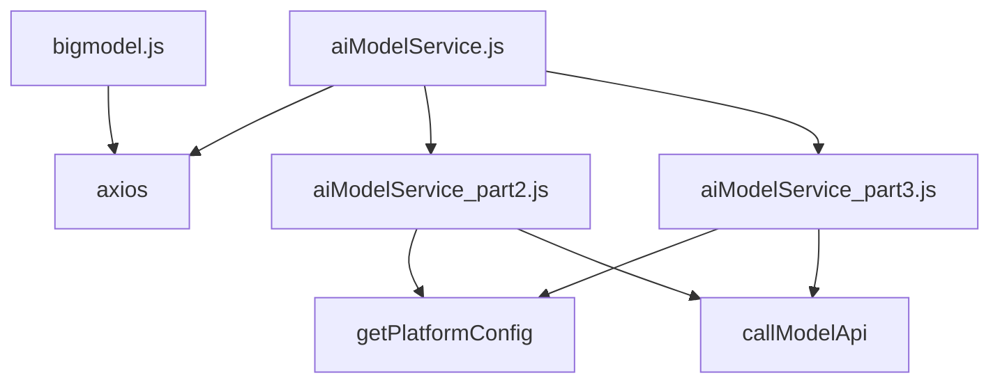

# AI模型集成

<cite>
**本文档引用文件**  
- [aiModelService.js](file://cloudfunctions/analysis/aiModelService.js)
- [aiModelService_part2.js](file://cloudfunctions/analysis/aiModelService_part2.js)
- [aiModelService_part3.js](file://cloudfunctions/analysis/aiModelService_part3.js)
- [bigmodel.js](file://cloudfunctions/analysis/bigmodel.js)
</cite>

## 目录
1. [引言](#引言)
2. [项目结构](#项目结构)
3. [核心组件](#核心组件)
4. [架构概述](#架构概述)
5. [详细组件分析](#详细组件分析)
6. [依赖分析](#依赖分析)
7. [性能考虑](#性能考虑)
8. [故障排除指南](#故障排除指南)
9. [结论](#结论)

## 引言
本文档深入探讨了HeartChat项目中AI模型服务的统一架构与多模型集成策略。重点分析`aiModelService.js`如何抽象不同AI提供商（如Gemini、智谱AI、OpenAI等）的调用接口，实现灵活的模型路由与降级机制。同时，解析`bigmodel.js`中对大模型响应的处理逻辑，包括流式输出、内容过滤与上下文管理。尽管Dify平台的YAML配置文件未能成功读取，但本文档将基于现有代码和文档，为AI工程师提供模型切换、性能调优与成本控制的实践建议。

## 项目结构
HeartChat项目采用模块化设计，主要分为云函数（cloudfunctions）、Dify配置、文档（doc）和小程序（miniprogram）四大模块。AI模型的核心逻辑集中在`cloudfunctions/analysis`目录下，通过`aiModelService.js`及其分片文件（part2、part3）提供统一的AI服务接口。`bigmodel.js`则专注于智谱AI的具体实现。Dify目录用于存放对话流的YAML配置，但当前环境无法访问。

**本文档引用文件**  
- [aiModelService.js](file://cloudfunctions/analysis/aiModelService.js)
- [bigmodel.js](file://cloudfunctions/analysis/bigmodel.js)

## 核心组件
本项目的核心组件是`aiModelService.js`和`bigmodel.js`。`aiModelService.js`作为统一的AI模型服务入口，定义了`MODEL_PLATFORMS`常量来管理不同AI提供商的配置，并通过`callModelApi`函数实现对各平台API的调用。它支持智谱AI、Gemini、OpenAI、Crond、CloseAI、Grok、Claude等多个平台，实现了真正的多模型集成。`analyzeEmotion`函数是其核心功能之一，能够根据用户选择的平台执行情感分析。`bigmodel.js`则是`aiModelService.js`在智谱AI平台上的具体实现，提供了`analyzeEmotion`、`extractKeywords`、`getEmbeddings`等一系列功能，其代码结构与`aiModelService.js`中的逻辑高度一致，体现了代码的可复用性。

**本文档引用文件**  
- [aiModelService.js](file://cloudfunctions/analysis/aiModelService.js#L1-L662)
- [bigmodel.js](file://cloudfunctions/analysis/bigmodel.js#L1-L704)

## 架构概述
HeartChat的AI模型服务采用分层架构，上层是统一的`aiModelService`，下层是针对特定平台的实现（如`bigmodel.js`）。这种设计实现了关注点分离，`aiModelService`负责抽象和路由，而具体的平台实现则负责细节。模型调用流程为：用户请求 -> `aiModelService`根据配置选择平台 -> 调用`callModelApi` -> 构建平台特定的请求 -> 发送HTTP请求 -> 解析响应 -> 返回标准化结果。该架构支持模型降级，当一个平台调用失败时，可以配置重试或切换到备用平台。

**图表来源**  
- [aiModelService.js](file://cloudfunctions/analysis/aiModelService.js#L1-L662)
- [bigmodel.js](file://cloudfunctions/analysis/bigmodel.js#L1-L704)

## 详细组件分析

### aiModelService.js 分析
`aiModelService.js`是整个AI服务的中枢。它通过`MODEL_PLATFORMS`对象定义了所有支持的AI平台，每个平台包含名称、基础URL、API密钥环境变量、默认模型等信息。`callModelApi`函数是关键，它根据平台类型（如Gemini、OpenAI）构建不同的请求体和头信息。例如，Gemini使用`contents`字段，而OpenAI使用`messages`字段。该函数还内置了重试机制，当遇到429（请求过多）错误时，会自动延迟并重试，增强了服务的鲁棒性。

#### 统一接口抽象类图

**图表来源**  
- [aiModelService.js](file://cloudfunctions/analysis/aiModelService.js#L1-L662)

**本文档引用文件**  
- [aiModelService.js](file://cloudfunctions/analysis/aiModelService.js#L1-L662)

### bigmodel.js 分析
`bigmodel.js`是`aiModelService`在智谱AI平台上的具体实现。它直接使用`axios`库调用智谱AI的API，其功能与`aiModelService`中的对应函数逻辑相同，但不经过统一的`callModelApi`。这表明`bigmodel.js`可能是一个独立的、更底层的实现，或者是为了特定场景的优化。其`analyzeEmotion`函数构建了详细的系统提示词（system prompt），要求模型以JSON格式返回包含主要情感、强度、关键词、建议等丰富信息的分析结果，体现了对输出格式的严格控制。

#### 情感分析调用序列图

**图表来源**  
- [aiModelService.js](file://cloudfunctions/analysis/aiModelService.js#L1-L662)
- [bigmodel.js](file://cloudfunctions/analysis/bigmodel.js#L1-L704)

**本文档引用文件**  
- [bigmodel.js](file://cloudfunctions/analysis/bigmodel.js#L1-L704)

## 依赖分析
`aiModelService.js`依赖于`axios`库进行HTTP通信，并通过`require`引入了`aiModelService_part2.js`和`aiModelService_part3.js`，实现了功能的模块化拆分。`aiModelService_part2.js`和`aiModelService_part3.js`通过`init`函数接收`getPlatformConfig`和`callModelApi`两个函数，实现了依赖注入，降低了模块间的耦合度。`bigmodel.js`同样依赖`axios`，但其与`aiModelService`的关系是功能上的对应，而非直接的代码依赖。整个系统依赖于环境变量（如`ZHIPU_API_KEY`）来存储敏感的API密钥。

**图表来源**  
- [aiModelService.js](file://cloudfunctions/analysis/aiModelService.js#L1-L662)
- [aiModelService_part2.js](file://cloudfunctions/analysis/aiModelService_part2.js#L1-L316)
- [aiModelService_part3.js](file://cloudfunctions/analysis/aiModelService_part3.js#L1-L478)
- [bigmodel.js](file://cloudfunctions/analysis/bigmodel.js#L1-L704)

**本文档引用文件**  
- [aiModelService.js](file://cloudfunctions/analysis/aiModelService.js#L1-L662)
- [aiModelService_part2.js](file://cloudfunctions/analysis/aiModelService_part2.js#L1-L316)
- [aiModelService_part3.js](file://cloudfunctions/analysis/aiModelService_part3.js#L1-L478)
- [bigmodel.js](file://cloudfunctions/analysis/bigmodel.js#L1-L704)

## 性能考虑
`aiModelService.js`中的重试机制（`callModelApi`）是性能和稳定性的重要保障，但指数级的延迟增长（`retryDelay * 2`）可能导致用户体验延迟。建议根据实际QPS限制调整重试策略。`bigmodel.js`在API密钥缺失或调用失败时，会生成本地模拟的词向量（`getEmbeddings`函数），这是一种优雅的降级策略，保证了服务的可用性，但模拟数据的准确性有限。对于高并发场景，应考虑引入缓存机制，避免对相同内容的重复分析。

## 故障排除指南
- **API调用失败**: 检查环境变量（如`ZHIPU_API_KEY`）是否正确配置。查看日志中的错误码，429表示请求过多，需等待或检查配额；其他错误需检查网络或API端点。
- **JSON解析失败**: 检查AI模型返回的内容是否为有效的JSON。可能是模型未遵循提示词要求，需优化提示词。
- **功能未定义**: 确保`aiModelService_part2.js`和`aiModelService_part3.js`已正确导入，并调用了`init`函数进行初始化。
- **响应延迟高**: 检查是否触发了重试机制。考虑优化提示词以减少模型生成时间，或评估是否需要切换到响应更快的模型。

**本文档引用文件**  
- [aiModelService.js](file://cloudfunctions/analysis/aiModelService.js#L1-L662)
- [bigmodel.js](file://cloudfunctions/analysis/bigmodel.js#L1-L704)

## 结论
HeartChat项目通过`aiModelService.js`成功实现了多AI模型的统一集成，其模块化和抽象化的设计使得系统具有良好的扩展性和维护性。`bigmodel.js`作为具体实现，展示了如何与特定AI平台深度集成。尽管Dify配置文件缺失，但核心服务的代码结构清晰，逻辑完备。建议未来进一步完善Dify的对话流配置，并对`aiModelService`和`bigmodel.js`的功能进行整合，避免代码重复，同时加强缓存和监控，以优化整体性能和用户体验。