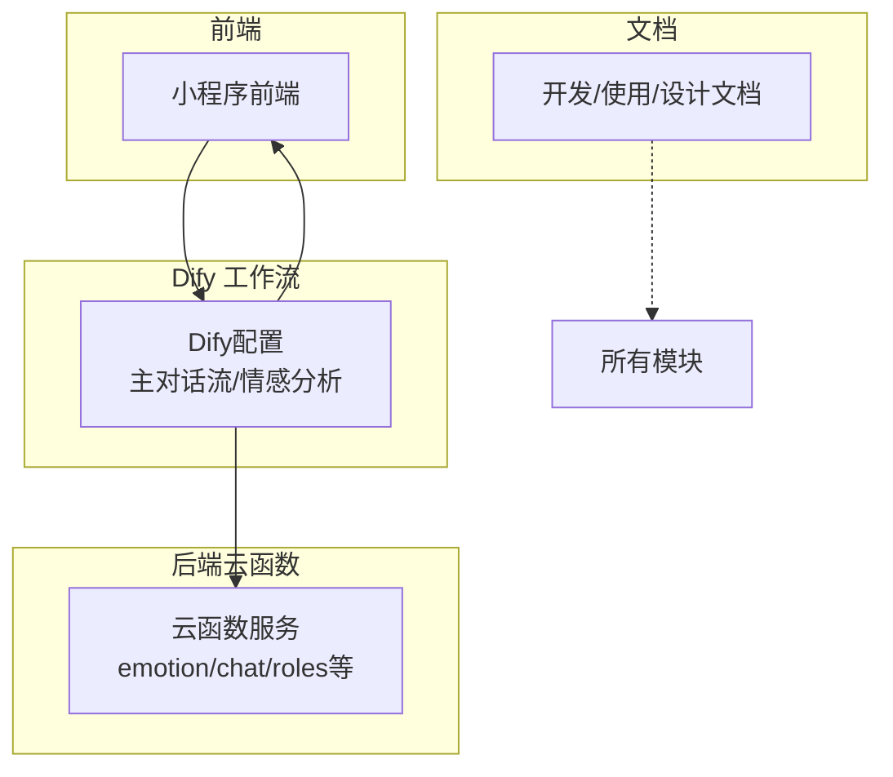
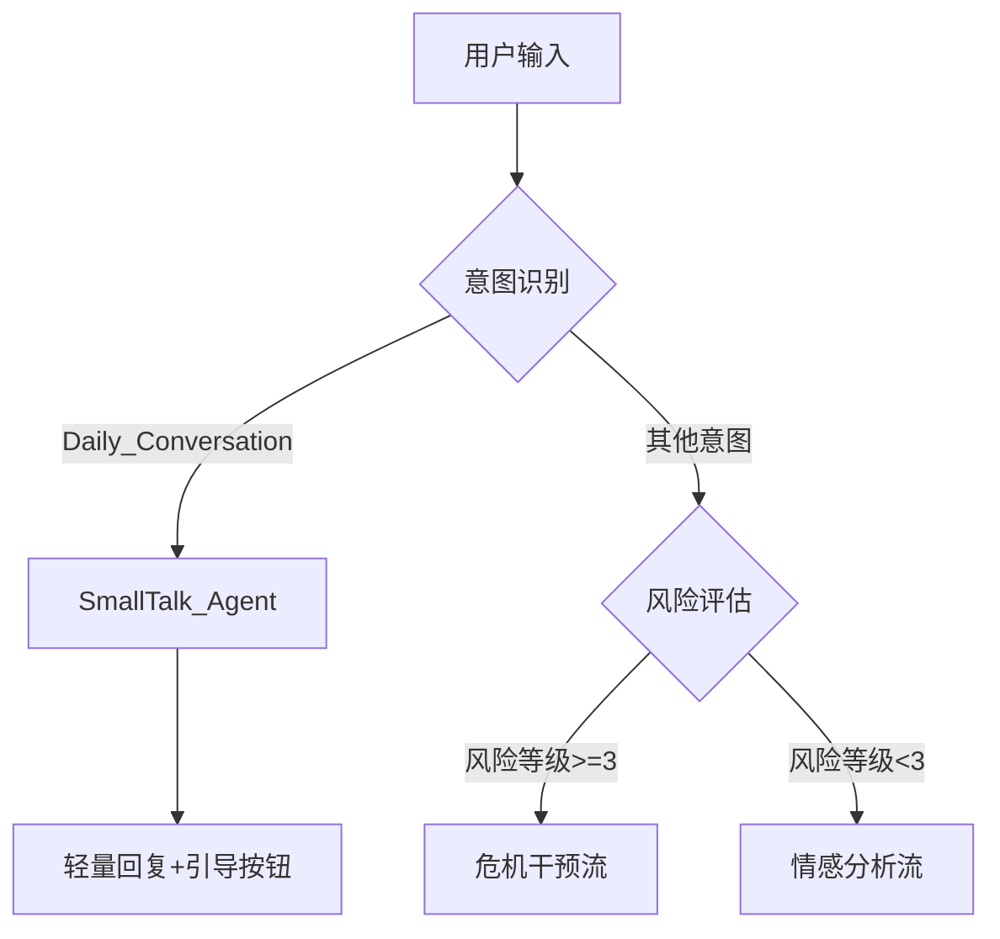
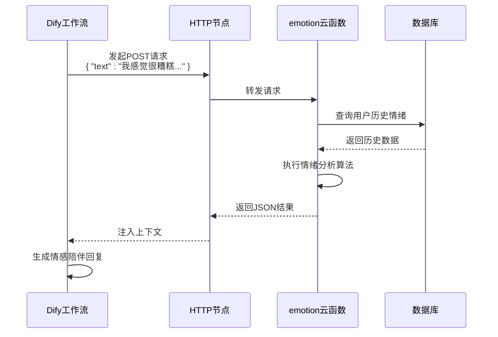

# Dify流程编排集成

<cite>
**本文档引用文件**  
- [SmallTalk_Agent.md](file://dify/主对话流/SmallTalk_Agent.md)
- [FAQ_AnswerLLM.md](file://dify/主对话流/FAQ_AnswerLLM.md)
- [风险评估LLM.md](file://dify/主对话流/风险评估LLM.md)
- [emotion.md](file://doc/开发文档/cloudfunctions/emotion.md)
- [httpRequest.md](file://doc/开发文档/cloudfunctions/httpRequest.md)
- [roles.md](file://doc/开发文档/cloudfunctions/roles.md)
- [userPerception模块使用文档.md](file://doc/使用文档/userPerception模块使用文档.md)
- [情绪分析云函数调用指南.md](file://doc/使用文档/情绪分析云函数调用指南.md)
- [geminiModel功能说明.md](file://doc/使用文档/geminiModel功能说明.md)
</cite>

## 目录
1. [引言](#引言)
2. [项目结构概览](#项目结构概览)
3. [核心组件分析](#核心组件分析)
4. [主对话流架构解析](#主对话流架构解析)
5. [情感分析流程设计](#情感分析流程设计)
6. [Dify与云函数集成机制](#dify与云函数集成机制)
7. [调试与版本管理建议](#调试与版本管理建议)
8. [结论](#结论)

## 引言
本文档深入解析基于Dify平台的“心语精灵”智能对话系统的工作流编排机制。重点分析主对话流中LLM节点、条件分支、工具调用等元素如何协同实现情感陪伴功能，阐明情感识别流程的触发逻辑与输出规范，并详细说明Dify工作流与本地云函数的集成方式。通过系统化梳理，为后续维护、优化与扩展提供全面的技术参考。

## 项目结构概览
项目采用模块化分层架构，主要分为Dify工作流配置、云函数服务、小程序前端和文档四大模块。Dify配置文件定义了对话逻辑；云函数提供后端业务能力；小程序实现用户交互；文档则涵盖开发、使用与设计说明。



**Diagram sources**
- [project_structure](file://project_structure)

## 核心组件分析
系统核心由Dify工作流引擎驱动，通过LLM节点处理自然语言，条件分支实现流程控制，HTTP节点调用外部服务。云函数作为可扩展的后端能力，处理情绪分析、角色管理、用户画像等复杂业务逻辑。

**Section sources**
- [SmallTalk_Agent.md](file://dify/主对话流/SmallTalk_Agent.md)
- [风险评估LLM.md](file://dify/主对话流/风险评估LLM.md)
- [FAQ_AnswerLLM.md](file://dify/主对话流/FAQ_AnswerLLM.md)

## 主对话流架构解析
主对话流采用分层过滤与路由策略，确保对话高效且安全。流程始于用户输入，依次经过意图识别、风险评估、寒暄分流，最终进入深度分析或FAQ应答。

### 意图识别与条件分支
工作流首先通过意图识别节点判断用户输入类型。若识别为`Daily_Conversation`且置信度≥0.70，则触发`SmallTalk_Agent`轻量回复流程，避免资源浪费。



**Diagram sources**
- [SmallTalk_Agent.md](file://dify/主对话流/SmallTalk_Agent.md)
- [风险评估LLM.md](file://dify/主对话流/风险评估LLM.md)

### LLM节点与提示词设计
系统采用多个专用LLM节点，各司其职：
- **SmallTalk_Agent**：负责亲和问候与轻引导，提示词强调克制与不诊断。
- **风险评估LLM**：执行结构化风险分级，输出JSON格式的`risk_level`、`intent_type`等字段。
- **FAQ_AnswerLLM**：依据知识库片段生成简明回答，输出`answer_markdown`、`confidence`等结构化数据。

**Section sources**
- [SmallTalk_Agent.md](file://dify/主对话流/SmallTalk_Agent.md)
- [风险评估LLM.md](file://dify/主对话流/风险评估LLM.md)
- [FAQ_AnswerLLM.md](file://dify/主对话流/FAQ_AnswerLLM.md)

## 情感分析流程设计
情感分析流程由Dify工作流触发，通过HTTP节点调用部署在云端的`emotion`云函数，实现对用户文本的情绪识别。

### 触发条件
情感分析流程的触发遵循“安全优先”原则：
1. 用户输入未被识别为寒暄。
2. 风险评估节点判定风险等级小于3（即非紧急/高度风险）。
3. 系统需要进行深度情绪理解以提供陪伴建议。

### 输出格式规范
`emotion`云函数返回标准化的JSON响应，包含以下关键字段：
```json
{
  "primary_emotion": "sadness",
  "secondary_emotion": "loneliness",
  "intensity": 0.85,
  "keywords": ["孤独", "无助", "压力"],
  "suggestions": ["尝试与朋友联系", "记录此刻心情"]
}
```
该输出被Dify工作流捕获，用于后续的对话生成与建议提供。

**Section sources**
- [情绪分析云函数调用指南.md](file://doc/使用文档/情绪分析云函数调用指南.md)
- [emotion.md](file://doc/开发文档/cloudfunctions/emotion.md)

## Dify与云函数集成机制
Dify通过HTTP节点与本地云函数实现无缝集成，构建了灵活的前后端交互模式。

### HTTP节点调用模式
Dify工作流中的HTTP节点作为“胶水”连接器，负责：
1. **发起请求**：向云函数的公网URL（如`https://service-xxxx-xxxx.gz.apigw.tencentcs.com/release/emotion`）发送POST请求。
2. **传递参数**：将用户输入文本、会话ID等数据作为请求体（JSON）发送。
3. **处理响应**：接收云函数返回的JSON数据，并将其注入后续LLM节点的上下文。

### 云函数功能示例
- **emotion云函数**：执行情绪识别算法，返回情绪标签与强度。
- **roles云函数**：管理角色信息与记忆，支持个性化对话。
- **httpRequest云函数**：作为通用代理，转发请求至第三方API（如Gemini、智谱AI）。



**Diagram sources**
- [httpRequest.md](file://doc/开发文档/cloudfunctions/httpRequest.md)
- [roles.md](file://doc/开发文档/cloudfunctions/roles.md)
- [userPerception模块使用文档.md](file://doc/使用文档/userPerception模块使用文档.md)

## 调试与版本管理建议
为确保工作流稳定运行，建议采取以下实践：

### 调试技巧
1. **日志追踪**：在Dify工作流中启用详细日志，观察每个节点的输入输出。
2. **变量检查**：利用会话变量（如`smalltalk_count`）监控流程状态。
3. **模拟测试**：使用包含寒暄、求助、风险词的测试样例验证分流逻辑。
4. **云函数日志**：通过云开发平台查看云函数执行日志，排查后端错误。

### 版本管理
1. **Dify版本控制**：利用Dify平台的版本快照功能，对工作流进行定期备份。
2. **代码仓库同步**：将Dify导出的YAML配置文件纳入Git管理，实现变更追溯。
3. **灰度发布**：新版本先在小范围用户中测试，验证无误后再全量上线。

**Section sources**
- [geminiModel功能说明.md](file://doc/使用文档/geminiModel功能说明.md)
- [每日心情报告系统使用文档.md](file://doc/使用文档/每日心情报告系统使用文档.md)

## 结论
“心语精灵”系统通过Dify平台实现了复杂而有序的对话流程编排。其核心在于分层的路由机制（意图识别、风险评估、寒暄分流）和模块化的服务集成（云函数）。该设计既保证了对话的亲和力与效率，又坚守了安全底线。未来可通过丰富云函数能力、优化提示词工程和增强数据分析，持续提升用户体验。