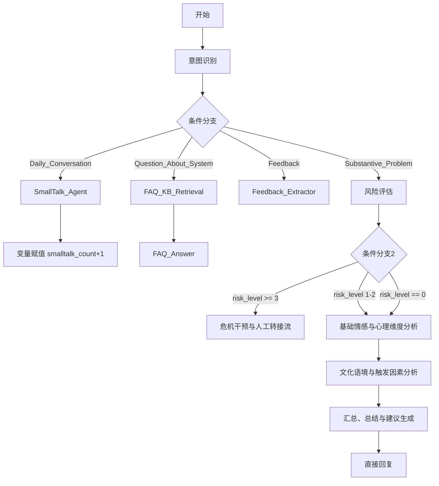

# 主对话流编排

<cite>
**本文档引用文件**   
- [心语精灵.yml](file://dify/心语精灵.yml)
- [FAQ_AnswerLLM.md](file://dify/主对话流/节点/FAQ_AnswerLLM.md)
- [SmallTalk_Agent.md](file://dify/主对话流/节点/SmallTalk_Agent.md)
- [风险评估LLM.md](file://dify/主对话流/节点/风险评估LLM.md)
</cite>

## 目录
1. [引言](#引言)
2. [主对话流架构概览](#主对话流架构概览)
3. [核心节点配置与执行逻辑](#核心节点配置与执行逻辑)
4. [多轮对话管理与上下文记忆](#多轮对话管理与上下文记忆)
5. [异常处理与超时重试策略](#异常处理与超时重试策略)
6. [性能优化建议](#性能优化建议)
7. [常见问题排查方法](#常见问题排查方法)
8. [结论](#结论)

## 引言
本文档深入解析“心语精灵”应用的主对话流编排逻辑。该对话流基于Dify平台构建，旨在为用户提供一个智能、安全且富有同理心的心理健康对话体验。文档将详细阐述LLM节点、条件判断、循环控制等元素的配置方式与执行顺序，结合`SmallTalk_Agent.md`和`FAQ_AnswerLLM.md`中的提示词设计，阐明多轮对话管理、意图识别与回答生成的协同机制。同时，文档将说明如何通过变量传递实现上下文记忆，并描述其异常处理与超时重试策略，最后提供性能优化建议和常见问题排查方法。

## 主对话流架构概览
“心语精灵”的主对话流是一个复杂的、基于条件分支的高级聊天工作流。它从用户输入开始，通过一系列精心设计的节点进行处理，最终生成一个安全、恰当且富有洞察力的回复。整个流程的核心在于对用户意图的精准识别和对潜在风险的优先评估。

**图示来源**
- [心语精灵.yml](file://dify/心语精灵.yml#L1-L1272)

**本节来源**
- [心语精灵.yml](file://dify/心语精灵.yml#L1-L1272)

## 核心节点配置与执行逻辑
主对话流的核心逻辑由多个LLM节点和条件判断节点协同完成，其执行顺序和配置方式决定了系统的智能水平和响应质量。

### 意图识别与条件分支
对话流的起点是“意图识别”节点。该节点使用一个GLM-4.5模型，其系统提示词明确要求模型将用户输入分类为`Substantive_Problem`（实质性问题）、`Daily_Conversation`（日常寒暄）、`Question_About_System`（系统问题）或`Feedback`（反馈）等标签，并输出一个置信度分数。此节点的输出是后续所有分支的决策依据。

紧随其后的是一个“条件分支”节点，它根据意图识别的结果将对话流导向不同的处理路径：
- **日常寒暄 (Daily_Conversation)**：当识别出用户意图是寒暄且置信度≥0.70时，对话流进入`SmallTalk_Agent`。
- **系统问题 (Question_About_System)**：当用户询问系统功能时，对话流进入知识检索和`FAQ_Answer`流程。
- **用户反馈 (Feedback)**：当用户表达反馈时，对话流进入`Feedback_Extractor`节点进行结构化信息抽取。
- **实质性问题 (Substantive_Problem)**：这是最核心的路径，对话流将进入风险评估和深度分析流程。

**本节来源**
- [心语精灵.yml](file://dify/心语精灵.yml#L1-L1272)
- [SmallTalk_Agent.md](file://dify/主对话流/节点/SmallTalk_Agent.md#L1-L194)
- [FAQ_AnswerLLM.md](file://dify/主对话流/节点/FAQ_AnswerLLM.md#L1-L73)

### LLM节点与提示词设计
LLM节点是对话流的“大脑”，其行为完全由提示词（Prompt）定义。

#### SmallTalk_Agent
`SmallTalk_Agent`是一个代理（Agent）节点，其核心提示词设计旨在实现轻量、亲和的互动。它被配置为不启用上下文和知识库，以避免资源浪费。其行为策略包括：
1.  **首次寒暄**：输出一段问候语，并提供3个可点击的引导按钮（如“记录心情”、“做个3分钟自测”）。
2.  **多次寒暄**：当会话变量`smalltalk_count`≥2时，会追加一个开放式问题（nudging），如“最近最困扰你的一件小事是什么？”，以引导用户进入更深层次的交流。
3.  **求助信号监听**：如果用户文本中包含“怎么办”、“焦虑”、“不想活”等关键词，`SmallTalk_Agent`会立即停止寒暄，输出“我来认真听你说”，并提供“[切换到深度倾听]”按钮，将控制权交还给主流程。

#### FAQ_Answer
`FAQ_Answer`节点的提示词设计强调**准确性**和**可引用性**。其核心原则是：
- **仅依据证据**：回答必须严格基于上游“知识检索”节点提供的命中文档片段。
- **禁止臆测**：严禁编造信息或扩写未在证据中出现的内容。
- **结构化输出**：必须输出包含`answer_markdown`、`confidence`和`kb_sources`字段的JSON对象，以便下游节点进行精确分流。
- **无命中处理**：若无可靠证据，`answer_markdown`输出为空字符串，`confidence`≤0.3，将决定权交给下游兜底逻辑。

#### 风险评估
`风险评估`节点是保障用户安全的“守门人”。其提示词定义了一套严格的分级标准（0-4级），并要求模型仅输出结构化数据，不生成任何安慰性话术。其输出的`risk_level`字段是决定对话流走向的关键：
- **4级（紧急）** 和 **3级（高度）**：立即跳转至“危机干预与人工转接流”，中断所有其他流程。
- **1-2级（轻/中度）**：在主线回复中追加安全提示，然后继续情感分析。
- **0级（无风险）**：正常进入主线分析流程。

**本节来源**
- [SmallTalk_Agent.md](file://dify/主对话流/节点/SmallTalk_Agent.md#L1-L194)
- [FAQ_AnswerLLM.md](file://dify/主对话流/节点/FAQ_AnswerLLM.md#L1-L73)
- [风险评估LLM.md](file://dify/主对话流/节点/风险评估LLM.md#L1-L268)
- [心语精灵.yml](file://dify/心语精灵.yml#L1-L1272)

## 多轮对话管理与上下文记忆
主对话流通过会话变量（Conversation Variables）和节点间的变量传递来实现多轮对话管理和上下文记忆。

### 会话变量
工作流中定义了一个名为`smalltalk_count`的整型会话变量，其初始值为0。该变量用于追踪用户在本次会话中连续触发“日常寒暄”分支的次数。

### 变量赋值与循环控制
在`SmallTalk_Agent`节点执行后，会立即执行一个“变量赋值”节点，将`smalltalk_count`的值加1。这个机制实现了简单的循环控制：
- 当`smalltalk_count`达到2时，`SmallTalk_Agent`会输出nudging问题，试图打破寒暄循环。
- 虽然当前配置中未直接使用`smalltalk_count >= 3`作为强制跳转条件，但该变量为实现更复杂的循环控制（如强制进入主线）提供了数据基础。

### 上下文传递
在深度分析流程中，上下文通过节点间的直接引用进行传递。例如，“汇总、总结与建议生成”节点会直接引用“基础情感与心理维度分析”和“文化语境与触发因素分析”两个节点的输出文本（`{{#1757929808936.text#}}`和`{{#1757929860081.text#}}`），将它们作为输入来生成最终的整合报告。这种设计确保了信息在流程中的完整传递。

**本节来源**
- [心语精灵.yml](file://dify/心语精灵.yml#L1-L1272)
- [SmallTalk_Agent.md](file://dify/主对话流/节点/SmallTalk_Agent.md#L1-L194)

## 异常处理与超时重试策略
尽管当前的YAML配置中未显式定义“失败分支”或“重试”策略，但从提示词设计和工作流结构中可以推断出其异常处理机制。

### 结构化输出的容错
`FAQ_Answer`和`风险评估`等节点都启用了结构化输出（Structured Output）。这是一种强大的异常处理机制。如果LLM未能生成符合预定义JSON Schema的输出，Dify平台会触发“失败分支”。根据`风险评估LLM.md`中的建议，失败时应保守处理，例如将`risk_level`设为2并追加安全提示，确保系统在异常情况下仍能做出安全的决策。

### 提示词内的降级策略
`FAQ_Answer`的提示词中明确包含了“无命中/低命中处理”策略。当检索结果为空或无关时，它会主动输出低置信度的空回答，将决策权交给下游的兜底逻辑（如外部搜索或人工）。这是一种在应用层实现的优雅降级。

### 潜在的超时重试
虽然配置文件中未体现，但Dify平台本身对LLM调用通常具备超时和重试机制。对于关键节点（如风险评估），可以配置重试次数，以应对模型API的临时不稳定。

**本节来源**
- [FAQ_AnswerLLM.md](file://dify/主对话流/节点/FAQ_AnswerLLM.md#L1-L73)
- [风险评估LLM.md](file://dify/主对话流/节点/风险评估LLM.md#L1-L268)
- [心语精灵.yml](file://dify/心语精灵.yml#L1-L1272)

## 性能优化建议
为了确保“心语精灵”对话流的高效和稳定，提出以下性能优化建议：

1.  **知识检索优化**：当前`FAQ_KB_Retrieval`节点的`reranking_enable`被设置为`false`。建议将其开启，并使用指定的重排序模型（reranker），同时将`top_k`从4调整为6-8。这能显著提高检索结果的相关性，从而提升`FAQ_Answer`节点的准确率。
2.  **模型选择**：对于`SmallTalk_Agent`这类轻量级任务，应选用成本更低、响应更快的模型，以节省计算资源。对于核心的“汇总、总结与建议生成”节点，则应确保使用性能最强的模型以保证输出质量。
3.  **并行化处理**：当前的“基础情感分析”和“文化语境分析”是串行执行的。如果这两个分析任务相互独立，可以考虑将它们并行化处理，然后在“汇总”节点进行结果合并，从而减少整体响应时间。
4.  **缓存机制**：对于高频的FAQ问题，可以引入缓存机制。当`FAQ_Answer`节点生成一个高置信度的回答后，可以将其缓存。当下次遇到相同或高度相似的问题时，直接返回缓存结果，避免重复的LLM调用。

## 常见问题排查方法
当主对话流出现异常时，可按以下步骤进行排查：

1.  **检查意图识别**：如果对话流未能进入预期的分支，首先检查“意图识别”节点的输出。确认其`intent`和`confidence`字段是否符合预期。如果识别错误，可能需要优化其提示词或训练数据。
2.  **验证条件分支表达式**：检查“条件分支”节点的配置，确保变量选择器（`variable_selector`）的路径正确无误，且比较操作符（如`contains`, `≥`）使用恰当。
3.  **审查LLM节点输出**：对于`FAQ_Answer`或`风险评估`等结构化输出节点，检查其实际输出是否符合预定义的JSON Schema。格式错误是导致流程中断的常见原因。
4.  **监控会话变量**：利用Dify的调试工具，观察`smalltalk_count`等会话变量在对话过程中的变化，确认“变量赋值”节点是否正常工作。
5.  **测试边缘案例**：使用包含高危词、模糊表达或系统问题的测试用例，验证风险评估、FAQ回答和分支逻辑是否能正确处理这些边缘情况。

## 结论
“心语精灵”的主对话流是一个设计精巧、层次分明的智能对话系统。它通过意图识别进行分流，利用`SmallTalk_Agent`和`FAQ_Answer`处理轻量级交互，同时通过`风险评估`节点确保用户安全，最后通过多维度的深度分析为用户提供有价值的反馈。该系统通过会话变量实现了基本的上下文记忆和循环控制，并通过结构化输出和提示词设计构建了稳健的异常处理机制。通过实施知识检索优化、模型分层和并行化等策略，可以进一步提升其性能和用户体验。