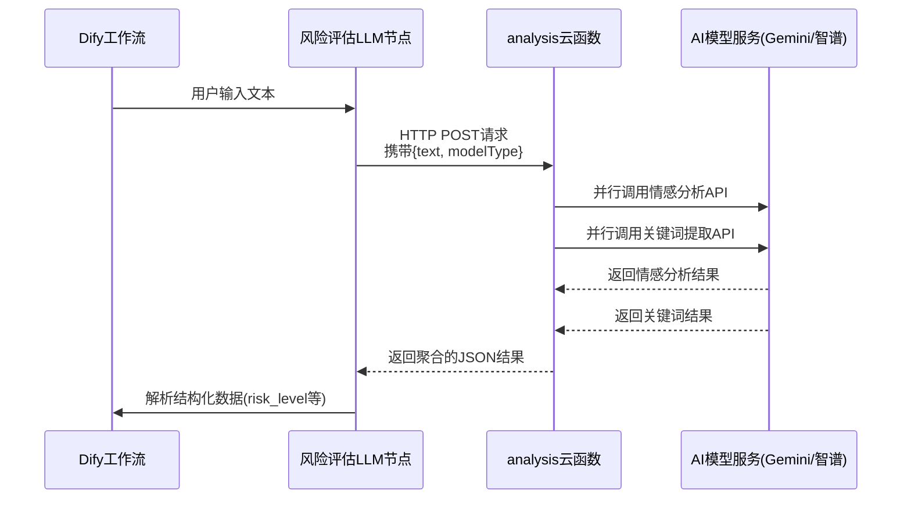

# 情感分析流程集成

<cite>
**本文档引用的文件**
- [情感分析.yml](file://dify/情感分析.yml)
- [风险评估LLM.md](file://dify/主对话流/节点/风险评估LLM.md)
- [风险评估_llm_1757936891962.md](file://dify/主对话流/节点/风险评估_llm_1757936891962.md)
- [index.js](file://cloudfunctions/analysis/index.js)
- [analysis.md](file://doc/开发文档/cloudfunctions/analysis.md)
</cite>

## 目录
1. [引言](#引言)
2. [情绪识别流程结构设计](#情绪识别流程结构设计)
3. [情绪分类模型调用与数据流转](#情绪分类模型调用与数据流转)
4. [情感强度计算与风险等级评估](#情感强度计算与风险等级评估)
5. [高风险情绪识别标准与应急响应机制](#高风险情绪识别标准与应急响应机制)
6. [HTTP节点调用云函数进行深度情感分析](#http节点调用云函数进行深度情感分析)
7. [结果数据格式规范与错误处理策略](#结果数据格式规范与错误处理策略)
8. [结论](#结论)

## 引言
本项目“心语精灵”旨在通过AI技术为用户提供心理健康支持，其核心功能之一是情感分析。该功能不仅识别用户的情绪状态，还评估潜在的心理风险，并在必要时触发应急响应机制。本文档详细分析`dify/情感分析.yml`中情绪识别流程的结构设计，解释情绪分类模型调用、情感强度计算、风险等级评估等关键节点的配置参数与数据流转。结合`风险评估LLM.md`中的提示词逻辑，说明高风险情绪的识别标准与应急响应机制。阐述该流程如何通过HTTP节点调用`cloudfunctions/analysis/index.js`云函数进行深度情感分析，并描述结果数据的格式规范与错误处理策略。

## 情绪识别流程结构设计
情绪识别流程是“心语精灵”工作流中的关键安全与分析模块，它被设计为一个独立且优先级最高的处理支线。该流程的结构设计遵循“安全优先”原则，确保在任何情况下，潜在的高风险情绪都能被及时识别和处理。

流程始于用户输入文本后，首先经过意图识别节点。一旦识别为实质性问题（Substantive_Problem），文本将立即被路由至“风险评估LLM”节点（ID: 1757936891962）。此节点不依赖于上下文，仅基于单轮用户文本进行快速、独立的风险评估，以避免因上下文延迟而错过紧急情况。

评估完成后，流程进入一个关键的“条件分支2”节点。该节点根据风险评估LLM输出的`risk_level`值，将处理流分为三条路径：
1.  **危机干预路径**：当`risk_level >= 3`时，流程立即中断常规对话，跳转至“危机干预与人工转接流”，确保用户得到最紧急的援助。
2.  **主线增强路径**：当`risk_level`为1或2时，流程在进入主线情感分析前，会先插入一个安全提示，以表达关怀并提供求助建议。
3.  **正常主线路径**：当`risk_level == 0`时，流程按常规路径进入基础情感分析、文化语境分析和汇总建议生成等节点。

这种设计将风险评估作为一个独立的“安全网”前置在主情感分析流程之前，实现了风险识别与情感分析的解耦，保证了系统的安全性和响应效率。

**Section sources**
- [风险评估LLM.md](file://dify/主对话流/节点/风险评估LLM.md#L1-L268)
- [风险评估_llm_1757936891962.md](file://dify/主对话流/节点/风险评估_llm_1757936891962.md#L1-L96)

## 情绪分类模型调用与数据流转
情绪分类模型的调用由Dify工作流中的“风险评估LLM”节点驱动，并通过HTTP请求调用部署在云开发环境中的`cloudfunctions/analysis/index.js`云函数来实现深度分析。

数据流转始于Dify平台。当“风险评估LLM”节点被触发时，Dify会将用户输入的文本（`{{#sys.query#}}`）作为请求体，通过HTTP POST请求发送至`cloudfunctions/analysis/index.js`云函数的指定入口。云函数的`analyzeEmotion`函数是处理此请求的主入口。

在云函数内部，数据流转如下：
1.  **参数接收与验证**：`analyzeEmotion`函数接收来自Dify的事件（event）对象，提取`text`（用户文本）、`modelType`（模型类型，默认为gemini）等参数，并进行有效性验证。
2.  **并行AI模型调用**：函数利用`aiModelService`统一服务，**并行**调用情感分析和关键词提取两个任务。情感分析任务会根据`modelType`参数选择调用`geminiModel.js`或`bigmodel.js`模块，向Google Gemini或智谱AI的API发送请求。
3.  **结果聚合**：等待两个异步任务完成，将情感分析结果和关键词提取结果聚合在一起。
4.  **结果返回**：将聚合后的结果以JSON格式返回给Dify平台。Dify平台接收此JSON响应，并根据预设的结构化输出（Structured Output）Schema进行解析，从而得到`risk_level`、`intent_type`等结构化数据，供后续的条件分支节点使用。



**Diagram sources**
- [index.js](file://cloudfunctions/analysis/index.js#L150-L250)
- [风险评估_llm_1757936891962.md](file://dify/主对话流/节点/风险评估_llm_1757936891962.md#L1-L96)

**Section sources**
- [index.js](file://cloudfunctions/analysis/index.js#L150-L250)
- [analysis.md](file://doc/开发文档/cloudfunctions/analysis.md#L1-L230)

## 情感强度计算与风险等级评估
情感强度计算和风险等级评估是两个紧密关联但又层次分明的过程。情感强度是模型对情绪激烈程度的量化输出，而风险等级评估则是基于一系列显性和隐性线索进行的、更侧重于安全判断的定性分级。

在`cloudfunctions/analysis/index.js`中，情感强度计算由底层AI模型（Gemini或智谱AI）完成。模型会分析文本的词汇、句式和语义，输出一个介于0到1之间的浮点数，表示情绪的强度（`intensity`）。这个数值随后被包含在情感分析结果的`radar_dimensions`等维度中。

风险等级评估则完全由“风险评估LLM”节点的提示词（System Prompt）逻辑驱动。该提示词定义了一套严格的分级标准，将`risk_level`划分为0到4级。评估过程并非简单地映射情感强度，而是综合分析多种线索：
- **显式线索**：如“自杀”、“割腕”、“跳楼”等自伤/他伤关键词。
- **计划性要素**：是否提及时间、地点、方法或工具，这决定了`plan_specificity`（无、模糊、具体）。
- **紧迫度**：通过`timeframe`（现在、24小时内、24小时后）来判断。
- **保护因素**：是否存在家人朋友陪伴、愿意求助等积极信号。

云函数返回的原始情感数据为风险评估LLM提供了基础，但最终的`risk_level`是由LLM根据其内部的提示词逻辑，对这些数据进行综合判断后输出的。例如，一个情感强度为0.9的文本，如果仅表达“好累”，其`risk_level`可能为0；而一个情感强度为0.7的文本，如果包含“今晚就想结束一切”，其`risk_level`将被判定为4（紧急）。

**Section sources**
- [风险评估LLM.md](file://dify/主对话流/节点/风险评估LLM.md#L1-L268)
- [index.js](file://cloudfunctions/analysis/index.js#L150-L250)

## 高风险情绪识别标准与应急响应机制
高风险情绪的识别标准明确且严格，旨在最大限度地保障用户安全。根据`风险评估LLM.md`中的定义，`risk_level`为3或4即被定义为高风险。

- **`risk_level = 4` (紧急)**：识别标准为存在“明确计划与准备/实施中”。例如，用户明确表示“现在就去跳楼”或“已经买了刀片并站在楼顶”。此级别的识别不依赖于情感强度，只要存在明确的计划和紧迫的时间，即触发最高级别响应。
- **`risk_level = 3` (高度)**：识别标准为“存在强烈意图 + 模糊或部分计划”。例如，用户说“我真的撑不住了，今晚就想结束一切”或“我买了刀片，一直在犹豫”。即使没有明确的实施地点，强烈的意图和工具的可得性也足以构成高度风险。

一旦识别出高风险情绪，应急响应机制立即启动：
1.  **流程中断**：Dify工作流的“条件分支2”节点检测到`risk_level >= 3`，立即中断所有常规对话流程。
2.  **危机干预流启动**：流程被路由至“危机干预与人工转接流”（Crisis_Entry）。该子工作流的首要任务是向用户发送预设的、充满关怀的安抚话术，如“谢谢你告诉我这些。你的安全最重要。现在请先保证自己待在安全的地方。我可以帮你联系校内辅导与紧急支持。”
3.  **人工转接**：在后台，系统会记录此次高风险事件，并通过Webhook等方式通知校内辅导员或紧急支持团队，准备进行人工介入。整个机制设计为“识别-安抚-转接”三步走，确保用户在最脆弱的时刻能获得及时、专业的帮助。

**Section sources**
- [风险评估LLM.md](file://dify/主对话流/节点/风险评估LLM.md#L1-L268)
- [风险评估_llm_1757936891962.md](file://dify/主对话流/节点/风险评估_llm_1757936891962.md#L1-L96)

## HTTP节点调用云函数进行深度情感分析
深度情感分析的核心是通过HTTP节点调用部署在云开发环境中的`cloudfunctions/analysis/index.js`云函数。这一过程是连接Dify低代码平台与后端复杂AI处理能力的桥梁。

在Dify的“风险评估LLM”节点配置中，模型选择为“OpenAI API Compatible”，其实际后端指向了`cloudfunctions/analysis/index.js`的HTTP接口。当节点被触发时，Dify会构造一个HTTP请求，其核心配置如下：
- **URL**: 指向云函数的公网访问地址。
- **Method**: `POST`
- **Headers**: 包含认证信息（如AppID、Secret）。
- **Body (JSON)**:
    ```json
    {
      "text": "{{#sys.query#}}",
      "modelType": "gemini"
    }
    ```
    其中`{{#sys.query#}}`是Dify的变量语法，用于动态注入用户输入的文本。

云函数接收到此HTTP请求后，`index.js`中的`analyzeEmotion`函数被调用。该函数不仅执行情感分析，还利用`aiModelService`模块整合了多个AI能力，包括关键词提取、词向量获取和用户兴趣分析，从而实现了一次调用、多维度分析的“深度”处理。分析完成后，云函数将结果以JSON格式返回给Dify，完成整个调用闭环。

**Section sources**
- [index.js](file://cloudfunctions/analysis/index.js#L150-L250)
- [风险评估_llm_1757936891962.md](file://dify/主对话流/节点/风险评估_llm_1757936891962.md#L1-L96)

## 结果数据格式规范与错误处理策略
结果数据的格式规范和错误处理策略是确保系统稳定可靠的关键。

### 结果数据格式规范
云函数返回的结果遵循严格的JSON Schema。对于风险评估，其结构化输出（Structured Output）Schema定义了所有必需和可选字段，确保Dify能正确解析。核心字段包括：
- `risk_level` (number): 0-4的整数，表示风险等级。
- `intent_type` (string): 自伤、他伤、两者皆有或无。
- `summary` (string): 由LLM生成的简要分析摘要。
- `signals` (array): 触发风险判断的关键词或短语列表。

对于常规情感分析，结果包含`type`（主要情绪类型）、`intensity`（强度）、`valence`（效价）、`arousal`（唤醒度）以及`radar_dimensions`（信任、开放、压力等多维指标）。

### 错误处理策略
系统在多个层面实施了错误处理：
1.  **云函数内部**：`index.js`使用`try...catch`捕获所有异常。若AI模型调用失败，函数会返回一个包含`success: false`和错误信息的JSON对象，而不是抛出未处理的异常导致进程崩溃。
2.  **Dify平台层面**：Dify的“结构化输出”功能自带“解析失败”分支。如果云函数返回的JSON不符合预设Schema，Dify会自动进入失败分支，此时可配置为保守处理（如将`risk_level`设为2），并进入安全提示流程，确保系统不会因解析错误而完全失效。
3.  **降级策略**：在文档`analysis.md`中提到，当API不可用时，系统可降级为返回本地模拟数据，保证服务的可用性。

**Section sources**
- [风险评估_llm_1757936891962.md](file://dify/主对话流/节点/风险评估_llm_1757936891962.md#L1-L96)
- [index.js](file://cloudfunctions/analysis/index.js#L150-L250)
- [analysis.md](file://doc/开发文档/cloudfunctions/analysis.md#L1-L230)

## 结论
“心语精灵”的情感分析流程通过精心设计的结构，成功地将AI技术与心理健康服务相结合。其核心在于将风险评估作为独立且优先的处理支线，通过Dify工作流与云函数的HTTP调用，实现了从用户输入到深度分析的闭环。系统利用结构化输出和严格的提示词逻辑，能够精准地识别高风险情绪，并通过预设的应急响应机制，确保用户在危急时刻能得到及时援助。同时，完善的结果数据格式规范和多层次的错误处理策略，保障了整个系统的稳定性和可靠性。该设计不仅满足了功能需求，更体现了对用户安全和隐私的高度重视。