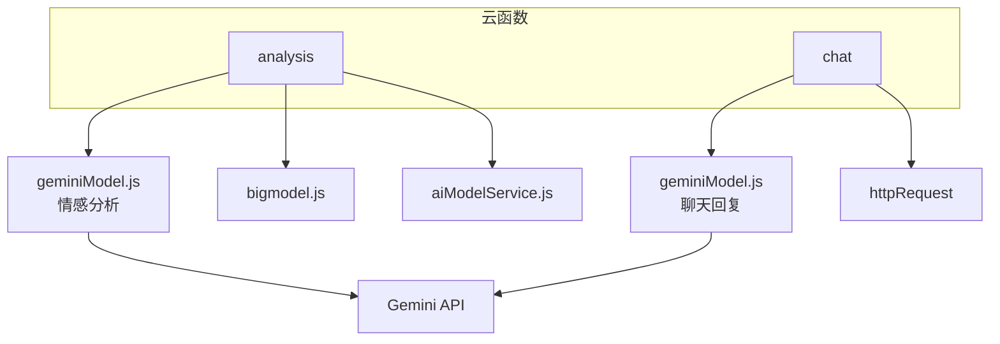
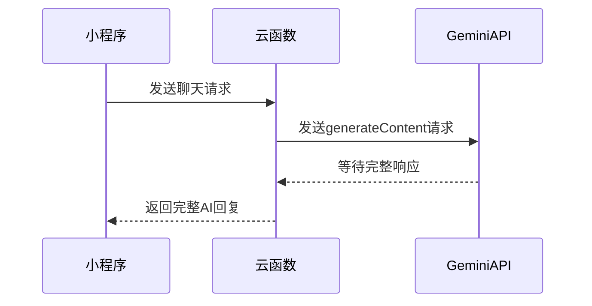
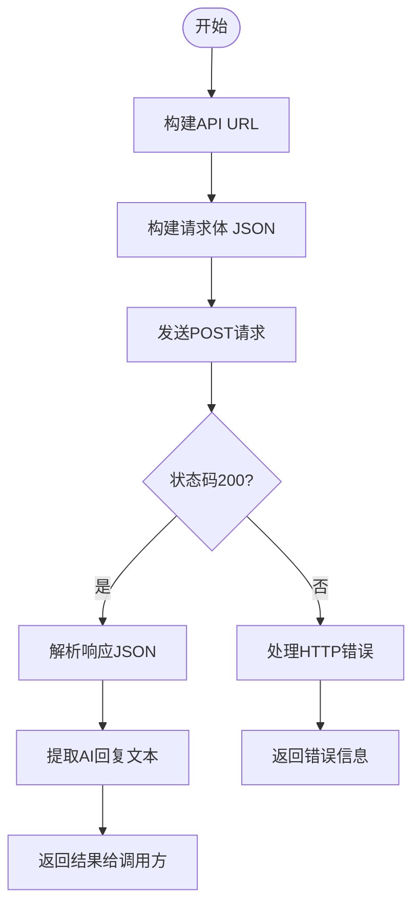
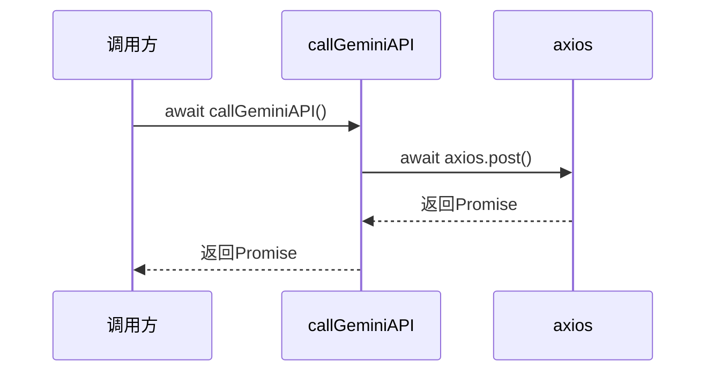

# Gemini模型实现

<cite>
**本文档引用文件**   
- [geminiModel.js](file://cloudfunctions/analysis/geminiModel.js)
- [geminiModel.js](file://cloudfunctions/chat/geminiModel.js)
- [Gemini_API集成开发文档.md](file://doc/开发文档/Gemini_API集成开发文档.md)
- [Gemini_API配置指南.md](file://doc/使用文档/Gemini_API配置指南.md)
- [Gemini API集成文档.md](file://doc/使用文档/Gemini API集成文档.md)
</cite>

## 目录
1. [项目结构](#项目结构)
2. [核心组件](#核心组件)
3. [流式响应与低延迟输出](#流式响应与低延迟输出)
4. [请求构造与响应解析](#请求构造与响应解析)
5. [内容安全过滤机制](#内容安全过滤机制)
6. [多轮对话上下文管理](#多轮对话上下文管理)
7. [异步处理与Promise链式调用](#异步处理与promise链式调用)
8. [性能优化建议](#性能优化建议)
9. [Gemini模型优势场景](#gemini模型优势场景)

## 项目结构

项目中Gemini API的集成主要分布在`cloudfunctions`目录下的`analysis`和`chat`两个子模块中，分别负责情感分析与聊天对话功能。



**Diagram sources**
- [cloudfunctions/analysis/geminiModel.js](file://cloudfunctions/analysis/geminiModel.js)
- [cloudfunctions/chat/geminiModel.js](file://cloudfunctions/chat/geminiModel.js)

**Section sources**
- [cloudfunctions/analysis/geminiModel.js](file://cloudfunctions/analysis/geminiModel.js)
- [cloudfunctions/chat/geminiModel.js](file://cloudfunctions/chat/geminiModel.js)

## 核心组件

Gemini模型的集成通过`geminiModel.js`文件实现，该文件在`analysis`和`chat`两个云函数目录下均有独立版本，分别服务于情感分析和聊天对话两大核心功能。两个版本的实现逻辑高度相似，均包含API调用、错误重试、消息格式转换等核心功能。

**Section sources**
- [cloudfunctions/analysis/geminiModel.js](file://cloudfunctions/analysis/geminiModel.js)
- [cloudfunctions/chat/geminiModel.js](file://cloudfunctions/chat/geminiModel.js)

## 流式响应与低延迟输出

目前项目中的Gemini集成**尚未实现真正的流式响应**。根据开发文档，流式输出被视为一个未来需要投入资源研究和实现的功能，以获得最佳的用户体验。

当前的实现方式为**非流式请求**，即云函数一次性等待Gemini API返回完整响应后，再将结果整体返回给小程序前端。这种方式虽然简单，但会导致用户在等待AI回复时出现明显的延迟。



**Diagram sources**
- [doc/开发文档/Gemini_API集成开发文档.md](file://doc/开发文档/Gemini_API集成开发文档.md#324-流式响应-streaming-response)

**Section sources**
- [cloudfunctions/analysis/geminiModel.js](file://cloudfunctions/analysis/geminiModel.js)
- [cloudfunctions/chat/geminiModel.js](file://cloudfunctions/chat/geminiModel.js)

## 请求构造与响应解析

### 请求构造

Gemini API的请求构造遵循其官方规范，主要包含以下部分：
1.  **URL构建**: `https://apiv2.aliyahzombie.top/v1beta/models/{model}:generateContent?key={API_KEY}`
2.  **请求体 (Body)**: 包含`contents`和`generationConfig`。
    *   `contents`: 一个消息数组，每条消息包含`role`（`user`或`model`）和`parts`（文本内容）。
    *   `generationConfig`: 生成配置，如`temperature`、`topP`、`maxOutputTokens`等。

### 响应解析

API响应为JSON格式，核心数据位于`candidates[0].content.parts[0].text`。代码中通过正则表达式`/\{[\s\S]*\}/`尝试从响应文本中提取JSON部分，并进行解析，以获取结构化的分析结果。



**Diagram sources**
- [cloudfunctions/analysis/geminiModel.js](file://cloudfunctions/analysis/geminiModel.js#L36-L113)
- [cloudfunctions/chat/geminiModel.js](file://cloudfunctions/chat/geminiModel.js#L37-L111)

**Section sources**
- [cloudfunctions/analysis/geminiModel.js](file://cloudfunctions/analysis/geminiModel.js)
- [cloudfunctions/chat/geminiModel.js](file://cloudfunctions/chat/geminiModel.js)

## 内容安全过滤机制

项目中Gemini API的集成**目前未显式配置`safetySettings`**。根据开发文档，`safetySettings`是一个可选参数，允许开发者配置安全等级以过滤潜在有害内容。

虽然代码中没有直接实现，但Gemini API本身具备内容安全过滤能力。当生成的内容被模型判定为不安全时，API会返回`finishReason: 'SAFETY'`，并在响应中包含`safetyRatings`信息。云函数在处理响应时会检查`finishReason`，如果为`SAFETY`，则会返回一个特定的错误提示。

```mermaid
flowchart TD
A[调用Gemini API] --> B{响应中<br>finishReason == 'SAFETY'?}
B --> |是| C[返回安全错误<br>"内容生成因安全问题被阻止"]
B --> |否| D[正常解析并返回AI回复]
```

**Diagram sources**
- [doc/开发文档/Gemini_API集成开发文档.md](file://doc/开发文档/Gemini_API集成开发文档.md#324-流式响应-streaming-response)

**Section sources**
- [cloudfunctions/analysis/geminiModel.js](file://cloudfunctions/analysis/geminiModel.js)
- [cloudfunctions/chat/geminiModel.js](file://cloudfunctions/chat/geminiModel.js)

## 多轮对话上下文管理

多轮对话的上下文管理通过在请求的`contents`数组中包含历史消息来实现。

1.  **历史消息压缩**: 为了控制Token数量和请求大小，代码中明确限制了最多只添加5条历史消息作为上下文 (`history.slice(-5)`)。
2.  **上下文长度控制**: 通过限制历史消息的数量，间接实现了上下文长度的控制，防止因上下文过长而导致API调用失败或成本过高。
3.  **会话状态维护**: 会话状态（即对话历史）由小程序前端维护，并在每次发送新消息时，将最新的历史记录作为参数传递给云函数。云函数本身不存储会话状态，是无状态的。

```javascript
// 在 geminiModel.js 中，处理历史消息的代码
if (Array.isArray(history) && history.length > 0) {
  const contextMessages = history.slice(-5); // 只取最后5条
  // ... 添加到prompt或contents中
}
```

**Section sources**
- [cloudfunctions/analysis/geminiModel.js](file://cloudfunctions/analysis/geminiModel.js#L148-L158)
- [cloudfunctions/chat/geminiModel.js](file://cloudfunctions/chat/geminiModel.js#L130-L140)

## 异步处理与Promise链式调用

整个Gemini API的调用过程基于`async/await`语法，这是Promise链式调用的高级语法糖，使得异步代码的逻辑更加清晰。

核心的`callGeminiAPI`函数是一个`async`函数，它内部使用`await`等待`axios`的HTTP请求完成。在调用`callGeminiAPI`的上层函数（如`analyzeEmotion`或`generateChatReply`）中，同样使用`await`来等待API调用的结果，从而形成了一条清晰的异步调用链。



**Section sources**
- [cloudfunctions/analysis/geminiModel.js](file://cloudfunctions/analysis/geminiModel.js)
- [cloudfunctions/chat/geminiModel.js](file://cloudfunctions/chat/geminiModel.js)

## 性能优化建议

### 连接复用
云函数运行在服务器端，其HTTP请求库（如`axios`或`got`）通常会自动管理底层的TCP连接池，实现连接复用，无需开发者手动干预。

### 错误重试机制
代码中实现了**指数退避重试机制**，这是关键的性能和稳定性优化。当遇到429错误（请求过多）时，函数会等待一段时间后重试，并且每次重试的等待时间会翻倍（`retryDelay * 2`），有效避免了因短时流量高峰导致的失败。

```javascript
// 在 callGeminiAPI 函数中
if (error.response && error.response.status === 429 && retryCount > 0) {
  await delay(retryDelay);
  return callGeminiAPI(params, retryCount - 1, retryDelay * 2); // 指数退避
}
```

### 超时控制
虽然代码中没有显式设置HTTP请求的超时时间，但微信云函数本身有执行时间限制（默认20秒）。这可以防止请求无限期挂起。建议在`axios`配置中增加`timeout`选项以进行更精细的控制。

**Section sources**
- [cloudfunctions/analysis/geminiModel.js](file://cloudfunctions/analysis/geminiModel.js#L80-L100)
- [cloudfunctions/chat/geminiModel.js](file://cloudfunctions/chat/geminiModel.js#L81-L101)

## Gemini模型优势场景

根据项目文档，Gemini模型在以下场景中具有优势：

1.  **开放性对话**: Gemini模型在复杂推理和对话连贯性方面表现出色，适用于需要深度、自然对话的场景，如心理咨询、角色扮演等。
2.  **多模态理解**: 项目文档明确指出，Gemini具备多模态能力（如图像理解、视频分析），这是其相对于纯文本模型（如智谱AI GLM）的显著优势。未来可探索集成图像上传功能，让AI分析用户分享的图片。

**Section sources**
- [doc/开发文档/Gemini_API集成开发文档.md](file://doc/开发文档/Gemini_API集成开发文档.md#21-可用模型)
- [doc/开发文档/Gemini_API集成开发文档.md](file://doc/开发文档/Gemini_API集成开发文档.md#53-其他潜在应用)