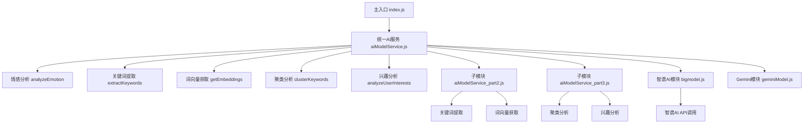
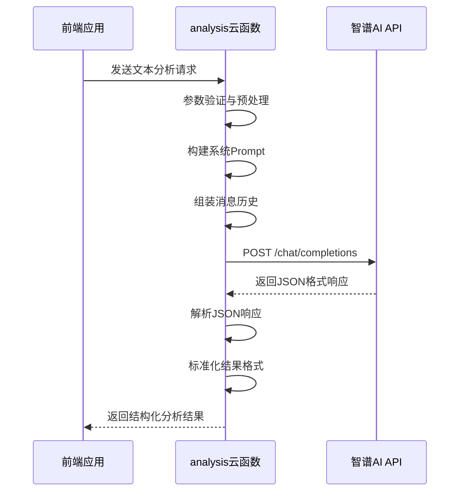
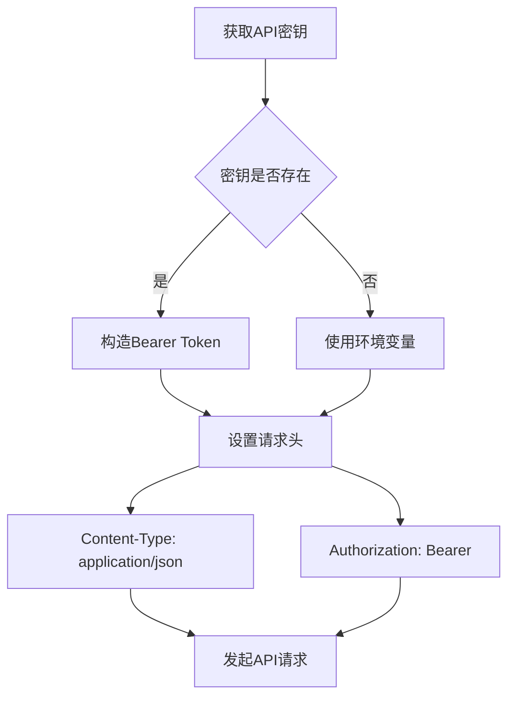
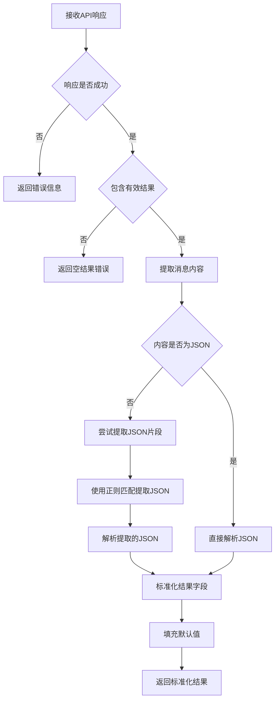
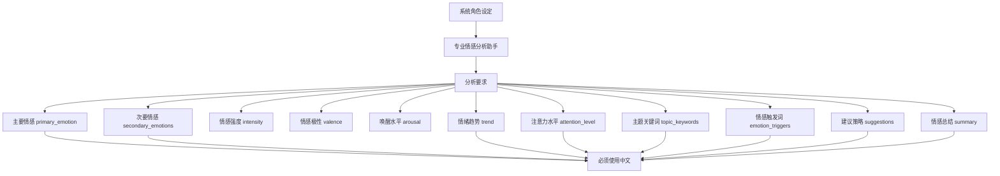
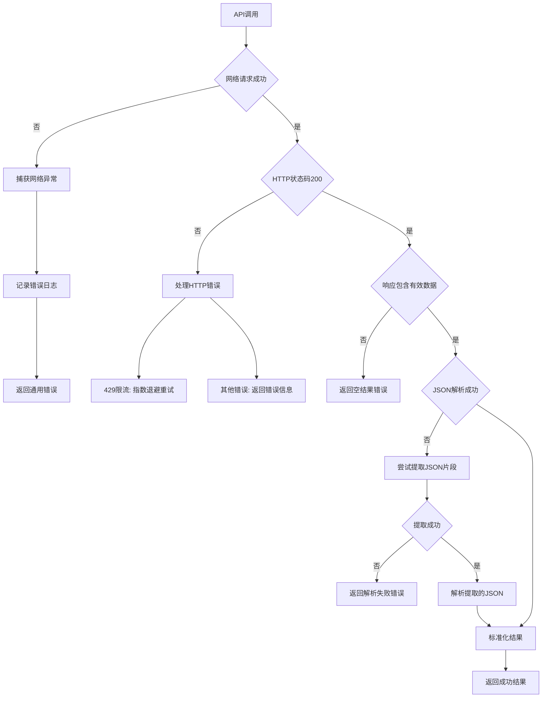

# 智谱AI模型实现

<cite>
**本文档引用文件**   
- [bigmodel.js](file://cloudfunctions/analysis/bigmodel.js)
- [aiModelService.js](file://cloudfunctions/analysis/aiModelService.js)
- [aiModelService_part2.js](file://cloudfunctions/analysis/aiModelService_part2.js)
- [aiModelService_part3.js](file://cloudfunctions/analysis/aiModelService_part3.js)
- [analysis.md](file://doc/开发文档/cloudfunctions/analysis.md)
</cite>

## 目录
1. [项目结构](#项目结构)
2. [核心功能分析](#核心功能分析)
3. [智谱AI API集成逻辑](#智谱ai-api集成逻辑)
4. [HTTP请求封装与认证机制](#http请求封装与认证机制)
5. [请求参数配置策略](#请求参数配置策略)
6. [响应数据解析流程](#响应数据解析流程)
7. [情绪标签与意图提取实现](#情绪标签与意图提取实现)
8. [中文语义理解优势分析](#中文语义理解优势分析)
9. [错误处理机制](#错误处理机制)
10. [生产环境优化建议](#生产环境优化建议)

## 项目结构

本项目采用模块化设计，将AI模型服务拆分为多个独立文件，实现功能解耦与代码复用。



**图示来源**
- [aiModelService.js](file://cloudfunctions/analysis/aiModelService.js#L1-L50)
- [analysis.md](file://doc/开发文档/cloudfunctions/analysis.md#L1-L20)

**本节来源**
- [analysis.md](file://doc/开发文档/cloudfunctions/analysis.md#L1-L50)

## 核心功能分析

智谱AI模块（bigmodel.js）作为核心AI服务组件，提供以下关键功能：
- 情感分析：识别用户情绪状态，提取主要与次要情感
- 关键词提取：从文本中抽取主题关键词
- 词向量生成：获取文本的向量化表示
- 聚类分析：对关键词进行语义聚类
- 用户兴趣分析：基于历史消息推断用户兴趣领域
- 报告生成：创建结构化的情感分析报告

该模块通过统一接口封装，支持多种AI模型平台，实现灵活的模型切换与负载均衡。

**本节来源**
- [bigmodel.js](file://cloudfunctions/analysis/bigmodel.js#L1-L100)
- [analysis.md](file://doc/开发文档/cloudfunctions/analysis.md#L1-L30)

## 智谱AI API集成逻辑

智谱AI模块通过`bigmodel.js`文件实现对智谱AI API的完整集成，采用分层架构设计，确保功能模块化与可维护性。



**图示来源**
- [bigmodel.js](file://cloudfunctions/analysis/bigmodel.js#L150-L250)
- [aiModelService.js](file://cloudfunctions/analysis/aiModelService.js#L300-L400)

**本节来源**
- [bigmodel.js](file://cloudfunctions/analysis/bigmodel.js#L1-L200)

## HTTP请求封装与认证机制

智谱AI模块通过`axios`库封装HTTP请求，实现安全可靠的API通信。认证机制采用Bearer Token模式，确保请求的安全性。

### 认证头构造



认证头通过`getAuthHeaders()`函数生成，包含以下关键字段：
- **Content-Type**: application/json
- **Authorization**: Bearer ${API_KEY}

API密钥通过环境变量`ZHIPU_API_KEY`获取，避免硬编码，提高安全性。

**本节来源**
- [bigmodel.js](file://cloudfunctions/analysis/bigmodel.js#L25-L45)

## 请求参数配置策略

智谱AI模块采用精细化的请求参数配置策略，针对不同分析任务调整模型参数，以获得最佳分析效果。

### 主要参数配置

| 分析任务 | 模型 | 温度(temperature) | 响应格式 | top_p |
|---------|------|------------------|----------|-------|
| 情感分析 | glm-4-flash | 0.3 | JSON对象 | 0.8 |
| 关键词提取 | glm-4-flash | 0.2 | JSON对象 | 0.8 |
| 聚类分析 | glm-4-flash | 0.3 | JSON对象 | 0.8 |
| 兴趣分析 | glm-4-flash | 0.3 | JSON对象 | 0.8 |
| 报告生成 | glm-4-flash | 0.7 | JSON对象 | 0.8 |

- **温度参数**: 情感分析和关键词提取使用较低温度(0.2-0.3)，确保结果的确定性和一致性；报告生成使用较高温度(0.7)，增加创造性。
- **响应格式**: 所有分析任务均要求`response_format: { type: 'json_object' }`，确保返回结构化JSON数据，便于解析。
- **top_p**: 保持默认值0.8，平衡生成文本的多样性和质量。

**本节来源**
- [bigmodel.js](file://cloudfunctions/analysis/bigmodel.js#L150-L200)
- [bigmodel.js](file://cloudfunctions/analysis/bigmodel.js#L250-L300)

## 响应数据解析流程

智谱AI模块采用严格的响应数据解析流程，确保从API返回的JSON数据能够被正确解析和标准化处理。



解析流程包含以下关键步骤：
1. 验证响应状态和数据完整性
2. 提取模型生成的消息内容
3. 尝试直接解析JSON
4. 若解析失败，使用正则表达式`/\{[\s\S]*\}/`提取JSON片段
5. 将解析结果映射到标准数据结构
6. 为缺失字段填充合理默认值

**本节来源**
- [bigmodel.js](file://cloudfunctions/analysis/bigmodel.js#L180-L200)
- [bigmodel.js](file://cloudfunctions/analysis/bigmodel.js#L350-L370)

## 情绪标签与意图提取实现

智谱AI模块通过精心设计的系统Prompt，引导模型返回结构化的JSON数据，实现情绪标签、用户意图和关键词的精确提取。

### 情感分析Prompt设计



### 数据归一化处理

模块通过`analyzeEmotion()`函数实现数据归一化，将智谱AI返回的原始结果映射到统一的数据结构：

```javascript
{
  success: true,
  result: {
    type: result.primary_emotion || '平静', // 兼容旧版字段
    primary_emotion: result.primary_emotion || '平静',
    secondary_emotions: result.secondary_emotions || [],
    intensity: result.intensity || 0.5,
    valence: result.valence || 0.0,
    arousal: result.arousal || 0.5,
    trend: result.trend || '未知',
    attention_level: result.attention_level || '中',
    topic_keywords: result.topic_keywords || [],
    emotion_triggers: result.emotion_triggers || [],
    suggestions: result.suggestions || [],
    summary: result.summary || '无法生成情感报告'
  }
}
```

对于缺失字段，系统提供合理的默认值，确保前端应用能够稳定处理。

**本节来源**
- [bigmodel.js](file://cloudfunctions/analysis/bigmodel.js#L50-L150)
- [bigmodel.js](file://cloudfunctions/analysis/bigmodel.js#L180-L220)

## 中文语义理解优势分析

智谱AI在中文语义理解方面展现出显著优势，特别是在情绪细粒度识别和上下文理解方面。

### 实际响应示例

假设用户输入："最近工作压力好大，项目 deadline 紧，老板还一直催，感觉快要崩溃了。"

智谱AI可能返回：
```json
{
  "primary_emotion": "焦虑",
  "secondary_emotions": ["压力", "疲惫"],
  "intensity": 0.85,
  "valence": -0.7,
  "arousal": 0.9,
  "trend": "上升",
  "attention_level": "高",
  "topic_keywords": ["工作压力", "项目deadline", "老板催促", "崩溃"],
  "emotion_triggers": ["压力好大", "一直催", "快要崩溃"],
  "suggestions": [
    "建议先深呼吸，让自己冷静下来",
    "可以尝试将大任务分解为小目标，逐步完成",
    "与上级沟通当前的工作负荷，寻求支持"
  ],
  "summary": "用户当前处于高度焦虑状态，主要源于工作压力和紧迫的项目截止日期，情绪呈上升趋势，需要及时疏导。"
}
```

### 优势特点

1. **细粒度情绪识别**: 能够区分"焦虑"、"压力"、"疲惫"等相近情绪
2. **中文语境理解**: 准确理解"deadline"、"催"等中英混合表达
3. **上下文感知**: 结合历史消息判断情绪趋势
4. **文化适配**: 理解中国职场文化中的压力来源
5. **建议实用性**: 提供符合中文用户习惯的共情回应

**本节来源**
- [bigmodel.js](file://cloudfunctions/analysis/bigmodel.js#L60-L100)
- [bigmodel.js](file://cloudfunctions/analysis/bigmodel.js#L150-L180)

## 错误处理机制

智谱AI模块实现了完善的错误处理机制，确保在各种异常情况下系统仍能稳定运行。



### 具体错误处理策略

1. **网络异常**: 捕获所有网络请求异常，记录详细错误日志
2. **API限流(429)**: 采用指数退避策略，自动重试最多3次
3. **响应格式错误**: 使用正则表达式尝试从非标准响应中提取JSON
4. **JSON解析失败**: 提供默认值或空数组，避免前端崩溃
5. **参数验证**: 在调用前验证输入参数的有效性

**本节来源**
- [bigmodel.js](file://cloudfunctions/analysis/bigmodel.js#L200-L220)
- [bigmodel.js](file://cloudfunctions/analysis/bigmodel.js#L380-L400)

## 生产环境优化建议

为确保智谱AI模块在生产环境中的稳定性和性能，提出以下优化建议：

### 稳定性优化

1. **密钥安全管理**: 使用环境变量或密钥管理服务存储API密钥，避免硬编码
2. **请求缓存**: 对重复的文本分析请求实现结果缓存，减少API调用次数
3. **降级策略**: 当智谱AI服务不可用时，可降级到其他AI模型或返回默认分析结果
4. **监控告警**: 实现API调用成功率、响应时间等关键指标的监控和告警
5. **日志记录**: 记录详细的调用日志，便于问题排查和性能分析

### 性能优化

1. **并发处理**: 对情感分析和关键词提取等独立任务实现并行处理
2. **连接池**: 复用HTTP连接，减少连接建立开销
3. **批量处理**: 支持批量文本分析，提高处理效率
4. **本地模拟**: 在开发环境或API密钥未配置时，提供本地模拟词向量生成功能
5. **超时设置**: 设置合理的请求超时时间，避免长时间阻塞

### 安全性优化

1. **输入验证**: 严格验证所有输入参数，防止注入攻击
2. **速率限制**: 在应用层实现调用速率限制，防止滥用
3. **数据脱敏**: 对敏感信息进行脱敏处理后再进行分析
4. **权限控制**: 确保只有授权用户才能访问AI分析功能

**本节来源**
- [bigmodel.js](file://cloudfunctions/analysis/bigmodel.js#L1-L50)
- [aiModelService.js](file://cloudfunctions/analysis/aiModelService.js#L50-L100)
- [analysis.md](file://doc/开发文档/cloudfunctions/analysis.md#L200-L230)