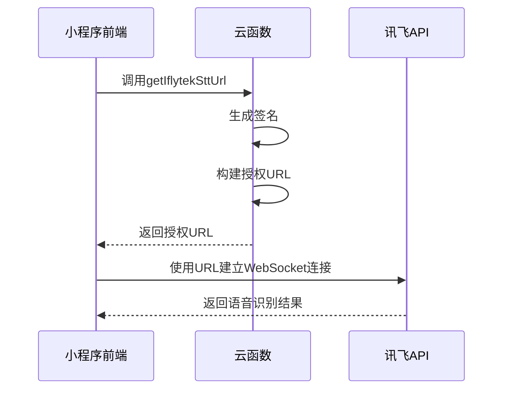
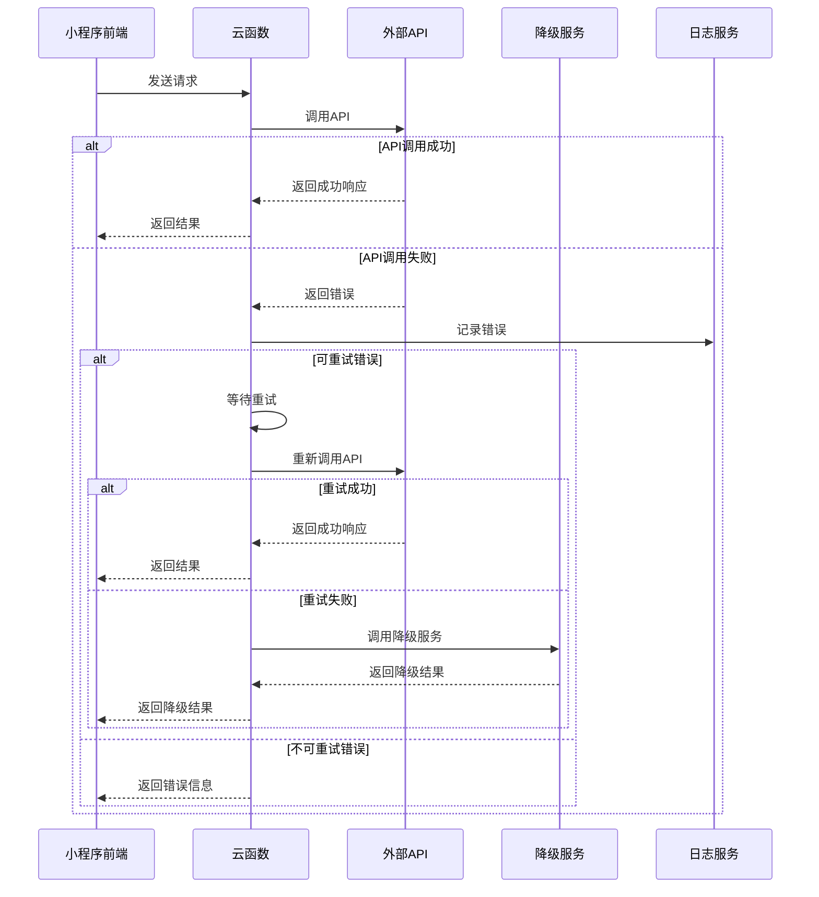

# API参考

<cite>
**本文档中引用的文件**  
- [login/index.js](file://cloudfunctions/login/index.js)
- [getRoleInfo/index.js](file://cloudfunctions/getRoleInfo/index.js)
- [generateDailyReports/index.js](file://cloudfunctions/generateDailyReports/index.js)
- [httpRequest/index.js](file://cloudfunctions/httpRequest/index.js)
- [httpRequest/test.js](file://cloudfunctions/httpRequest/test.js)
- [chat/aiModelService.js](file://cloudfunctions/chat/aiModelService.js)
- [analysis/aiModelService.js](file://cloudfunctions/analysis/aiModelService.js)
- [doc/开发文档/cloudfunctions/httpRequest.md](file://doc/开发文档/cloudfunctions/httpRequest.md)
- [doc/设计文档/流程图/html/HeartChat外部API调用流程图.html](file://doc/设计文档/流程图/html/HeartChat外部API调用流程图.html)
- [CLAUDE.md](file://CLAUDE.md)
- [doc/开发文档/gemini_api_integration.md](file://doc/开发文档/gemini_api_integration.md)
</cite>

## 目录
1. [简介](#简介)
2. [云函数API接口](#云函数api接口)
   - [login](#login)
   - [getRoleInfo](#getroleinfo)
   - [generateDailyReports](#generatedailyreports)
   - [httpRequest](#httprequest)
3. [第三方服务集成](#第三方服务集成)
   - [Gemini](#gemini)
   - [OpenAI](#openai)
   - [讯飞语音](#讯飞语音)
4. [前端调用方式](#前端调用方式)
5. [错误码说明](#错误码说明)
6. [安全与认证机制](#安全与认证机制)
7. [调用示例](#调用示例)

## 简介
本文档为HeartChat项目提供完整的API参考，涵盖所有可用的云函数接口及与外部AI服务的集成方式。文档详细说明了每个云函数的调用参数、返回结构、错误处理机制，并记录了与Gemini、OpenAI、讯飞语音等第三方API的集成方案。开发者可通过本接口契约实现前端与后端服务的可靠交互。

## 云函数API接口

### login
用户登录云函数，用于处理微信用户授权登录流程，创建或更新用户信息并返回认证令牌。

**输入参数**
- `userInfo`: 微信用户信息对象，包含`nickName`、`avatarUrl`等字段

**返回结构（成功）**
```json
{
  "success": true,
  "data": {
    "token": "JWT认证令牌",
    "isNewUser": true,
    "userInfo": {
      "userId": "用户唯一ID",
      "username": "用户名",
      "avatarUrl": "头像URL",
      "userType": "用户类型",
      "status": "状态",
      "stats": "用户统计信息"
    }
  }
}
```

**返回结构（失败）**
```json
{
  "success": false,
  "error": "错误信息"
}
```

**Section sources**
- [login/index.js](file://cloudfunctions/login/index.js#L1-L267)

### getRoleInfo
获取角色信息云函数，根据角色ID查询数据库中的角色配置。

**输入参数**
- `roleId`: 角色文档ID（字符串）

**返回结构（成功）**
```json
{
  "success": true,
  "data": {
    "_id": "角色ID",
    "name": "角色名称",
    "prompt": "角色提示词",
    "avatar": "头像路径",
    "category": "分类",
    "description": "描述"
  },
  "openid": "用户OpenID"
}
```

**返回结构（失败）**
```json
{
  "success": false,
  "error": "错误信息",
  "openid": "用户OpenID"
}
```

**Section sources**
- [getRoleInfo/index.js](file://cloudfunctions/getRoleInfo/index.js#L1-L50)

### generateDailyReports
批量生成每日心情报告云函数，遍历活跃用户并调用分析服务生成报告。

**输入参数**
无（定时触发）

**返回结构（成功）**
```json
{
  "success": true,
  "results": [
    {
      "userId": "用户ID",
      "success": true,
      "reportId": "报告ID"
    }
  ],
  "totalUsers": 10,
  "successCount": 8
}
```

**返回结构（失败）**
```json
{
  "success": false,
  "error": "错误信息"
}
```

**Section sources**
- [generateDailyReports/index.js](file://cloudfunctions/generateDailyReports/index.js#L1-L200)

### httpRequest
通用HTTP请求代理云函数，支持调用外部API接口。

**输入参数（普通请求）**
```json
{
  "url": "目标URL",
  "method": "请求方法",
  "headers": "请求头",
  "body": "请求体",
  "timeout": "超时时间"
}
```

**输入参数（测试请求）**
```json
{
  "action": "test"
}
```

**返回结构（成功）**
```json
{
  "statusCode": 200,
  "headers": "响应头",
  "body": "响应体内容"
}
```

**返回结构（失败）**
```json
{
  "error": true,
  "statusCode": 404,
  "message": "错误信息",
  "body": "错误响应体"
}
```

**返回结构（测试）**
```json
{
  "success": true,
  "message": "httpRequest云函数调用成功",
  "result": "HTTP请求响应结果"
}
```

**支持的HTTP方法**
- GET：获取资源
- POST：创建资源
- PUT：更新资源
- DELETE：删除资源
- PATCH：部分更新
- HEAD：获取头信息
- OPTIONS：获取支持的方法

**Section sources**
- [httpRequest/index.js](file://cloudfunctions/httpRequest/index.js#L1-L63)
- [httpRequest/test.js](file://cloudfunctions/httpRequest/test.js#L1-L50)
- [doc/开发文档/cloudfunctions/httpRequest.md](file://doc/开发文档/cloudfunctions/httpRequest.md#L55-L155)

## 第三方服务集成

### Gemini
通过`httpRequest`云函数代理调用Gemini API，使用流式接口生成内容。

**集成方式**
- 使用`aiModelService.js`中的`callModelApi`方法
- 平台键名：`GEMINI`
- 基础URL：`https://apiv2.aliyahzombie.top`
- API密钥通过环境变量`GEMINI_API_KEY`注入

**请求格式**
```json
{
  "provider": "gemini",
  "action": "chat",
  "config": {
    "model": "gemini-2.5-flash-preview-04-17"
  },
  "data": {
    "contents": [
      {
        "role": "user",
        "parts": [
          {
            "text": "用户输入"
          }
        ]
      }
    ],
    "generationConfig": {
      "temperature": 0.7,
      "maxOutputTokens": 2048
    }
  }
}
```

**Section sources**
- [chat/aiModelService.js](file://cloudfunctions/chat/aiModelService.js#L1-L586)
- [doc/开发文档/gemini_api_integration.md](file://doc/开发文档/gemini_api_integration.md#L132-L164)

### OpenAI
集成OpenAI的ChatGPT模型，支持gpt-3.5-turbo和gpt-4系列模型。

**集成方式**
- 使用`aiModelService.js`中的统一AI模型服务
- 平台键名：`OPENAI`
- 基础URL：`https://api.openai.com/v1`
- API密钥通过环境变量`OPENAI_API_KEY`注入

**模型支持**
- `gpt-3.5-turbo`
- `gpt-4`
- `gpt-4-turbo`

**Section sources**
- [chat/aiModelService.js](file://cloudfunctions/chat/aiModelService.js#L1-L586)

### 讯飞语音
通过云函数获取讯飞语音听写服务的授权URL。

**getIflytekSttUrl云函数**
- 作用：生成带签名的语音识别请求URL
- 输入：无
- 输出：包含`url`字段的JSON对象
- 认证：使用环境变量中的APP_ID、API_KEY、API_SECRET生成签名

**调用流程**


**Diagram sources**
- [cloudfunctions/getIflytekSttUrl/index.js](file://cloudfunctions/getIflytekSttUrl/index.js)

**Section sources**
- [cloudfunctions/getIflytekSttUrl/index.js](file://cloudfunctions/getIflytekSttUrl/index.js)

## 前端调用方式
前端通过`wx.cloud.callFunction`调用云函数，所有请求均需处理异步响应。

**基本调用格式**
```javascript
wx.cloud.callFunction({
  name: '云函数名称',
  data: {
    // 输入参数
  }
}).then(res => {
  // 处理成功响应
}).catch(err => {
  // 处理错误
});
```

**调用示例**
```javascript
// 登录调用
wx.cloud.callFunction({
  name: 'login',
  data: {
    userInfo: wx.getUserInfo()
  }
});

// 获取角色信息
wx.cloud.callFunction({
  name: 'getRoleInfo',
  data: {
    roleId: 'role_001'
  }
});
```

**错误处理建议**
```javascript
try {
  const result = await wx.cloud.callFunction({/*...*/});
  if (result.result.success) {
    // 处理成功
  } else {
    // 处理业务错误
    console.error('业务错误:', result.result.error);
  }
} catch (err) {
  // 处理网络或系统错误
  console.error('调用失败:', err);
}
```

**Section sources**
- [services/cloudFuncCaller.js](file://miniprogram/services/cloudFuncCaller.js)

## 错误码说明
| 错误码 | 含义 | 解决方案 |
|-------|------|---------|
| 400 | 请求参数错误 | 检查输入参数是否符合要求 |
| 401 | 认证失败 | 检查token是否有效 |
| 403 | 权限不足 | 检查用户权限设置 |
| 404 | 资源未找到 | 检查ID是否存在 |
| 429 | 请求过于频繁 | 降低请求频率，添加延迟 |
| 500 | 服务器内部错误 | 检查云函数日志 |
| 502 | 网关错误 | 检查外部API可用性 |
| 504 | 网关超时 | 增加超时时间或重试 |

**网络错误处理**
- 连接超时：重试机制，指数退避
- DNS解析失败：检查网络连接
- 网络不可达：提示用户检查网络

**API调用错误处理流程**


**Diagram sources**
- [doc/设计文档/流程图/html/HeartChat外部API调用流程图.html](file://doc/设计文档/流程图/html/HeartChat外部API调用流程图.html#L473-L509)

## 安全与认证机制
### API密钥管理
- 所有第三方API密钥存储在云函数环境变量中
- 禁止在前端代码中暴露密钥
- 定期轮换密钥

**环境变量列表**
- `GEMINI_API_KEY`: Gemini API密钥
- `OPENAI_API_KEY`: OpenAI API密钥
- `ZHIPU_API_KEY`: 智谱AI API密钥
- `WHIMSY_API_KEY`: Whimsy AI API密钥
- `CROND_API_KEY`: Crond API密钥
- `CLOSEAI_API_KEY`: CloseAI API密钥
- `GROK_API_KEY`: Grok API密钥
- `CLAUDE_API_KEY`: Claude API密钥

### 用户认证
- 使用JWT令牌进行用户认证
- Token有效期：7天
- 敏感操作需验证token

### 安全特性
- HTTPS请求加密
- 请求参数验证
- 超时保护机制（默认30秒）
- 错误信息脱敏处理
- 日志记录与监控

**Section sources**
- [CLAUDE.md](file://CLAUDE.md#L195-L201)

## 调用示例

### 调用login云函数
```javascript
wx.cloud.callFunction({
  name: 'login',
  data: {
    userInfo: {
      nickName: '用户昵称',
      avatarUrl: '头像URL',
      clientIP: '客户端IP',
      userAgent: '用户代理'
    }
  }
}).then(res => {
  if (res.result.success) {
    const { token, userInfo } = res.result.data;
    // 存储token，跳转首页
  } else {
    wx.showToast({
      title: res.result.error,
      icon: 'none'
    });
  }
}).catch(err => {
  wx.showToast({
    title: '网络错误',
    icon: 'none'
  });
});
```

### 调用getRoleInfo云函数
```javascript
wx.cloud.callFunction({
  name: 'getRoleInfo',
  data: {
    roleId: 'role_001'
  }
}).then(res => {
  if (res.result.success) {
    const roleInfo = res.result.data;
    // 显示角色信息
  } else {
    console.error('获取角色信息失败:', res.result.error);
  }
});
```

### 调用httpRequest云函数
```javascript
wx.cloud.callFunction({
  name: 'httpRequest',
  data: {
    url: 'https://api.example.com/data',
    method: 'GET',
    headers: {
      'Authorization': 'Bearer token'
    }
  }
}).then(res => {
  if (res.result.statusCode === 200) {
    const data = res.result.body;
    // 处理响应数据
  } else {
    console.error('HTTP请求失败:', res.result);
  }
});
```

### 调用AI模型服务
```javascript
// 在云函数中调用
const aiModelService = require('aiModelService.js');

const result = await aiModelService.generateChatReply(
  '你好',
  [],
  roleInfo,
  false,
  null,
  {
    platform: 'GEMINI',
    model: 'gemini-2.5-flash-preview-04-17',
    temperature: 0.7,
    max_tokens: 2048
  }
);

if (result.success) {
  const reply = result.reply;
  // 返回给前端
}
```

**Section sources**
- [chat/aiModelService.js](file://cloudfunctions/chat/aiModelService.js#L1-L586)
- [analysis/aiModelService.js](file://cloudfunctions/analysis/aiModelService.js)