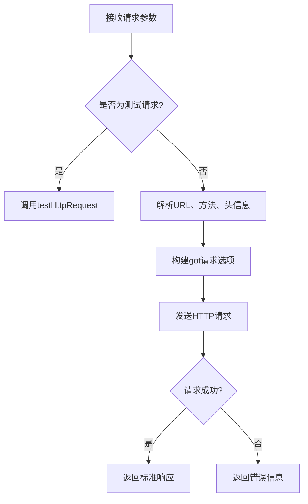
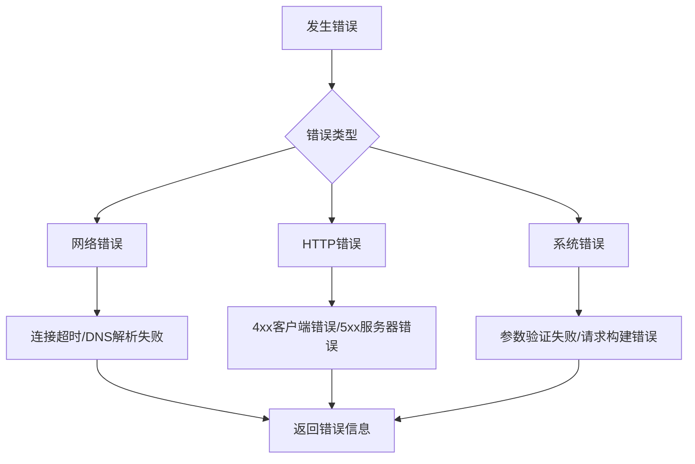

# HTTP请求代理API

<cite>
**本文档引用文件**  
- [index.js](file://cloudfunctions/httpRequest/index.js)
- [test.js](file://cloudfunctions/httpRequest/test.js)
- [package.json](file://cloudfunctions/httpRequest/package.json)
- [httpRequest云函数使用文档.md](file://doc/使用文档/httpRequest云函数使用文档.md)
- [gemini_api_integration.md](file://doc/开发文档/gemini_api_integration.md)
</cite>

## 目录
1. [概述](#概述)
2. [核心功能](#核心功能)
3. [调用方式](#调用方式)
4. [参数验证规则](#参数验证规则)
5. [响应格式](#响应格式)
6. [Gemini API调用示例](#gemini-api调用示例)
7. [内部实现机制](#内部实现机制)
8. [日志与错误追踪](#日志与错误追踪)
9. [权限控制策略](#权限控制策略)
10. [部署与测试](#部署与测试)
11. [注意事项](#注意事项)

## 概述

`httpRequest` 云函数是一个**HTTP请求代理服务**，作为安全代理用于调用外部API（如AI服务）。该接口解决了在前端直接暴露API密钥的安全隐患，通过云函数作为中间层转发请求，确保敏感信息不被泄露。此云函数特别适用于需要保密API密钥的场景，如调用Gemini、智谱AI等第三方服务。

**Section sources**
- [index.js](file://cloudfunctions/httpRequest/index.js#L1-L10)
- [httpRequest云函数使用文档.md](file://doc/使用文档/httpRequest云函数使用文档.md#L1-L10)

## 核心功能

- **通用HTTP代理**：支持GET、POST、PUT、DELETE等多种HTTP方法
- **安全密钥管理**：避免前端直接暴露API密钥等敏感信息
- **请求转发**：作为中间层安全地调用外部API服务
- **测试功能**：内置测试接口验证云函数可用性
- **错误处理**：提供详细的错误信息和状态码
- **超时控制**：可自定义请求超时时间，默认30秒

**Section sources**
- [index.js](file://cloudfunctions/httpRequest/index.js#L1-L62)
- [httpRequest云函数使用文档.md](file://doc/使用文档/httpRequest云函数使用文档.md#L11-L20)

## 调用方式

通过 `cloud.callFunction` 方法调用，标准调用格式如下：

```javascript
cloud.callFunction({
  name: 'httpRequest',
  data: {
    url: '请求URL',
    method: '请求方法',
    headers: { 'Content-Type': 'application/json' },
    body: '请求体',
    timeout: 30000
  }
})
```

**Section sources**
- [index.js](file://cloudfunctions/httpRequest/index.js#L15-L25)
- [httpRequest云函数使用文档.md](file://doc/使用文档/httpRequest云函数使用文档.md#L40-L50)

## 参数验证规则

### 白名单域名控制
系统仅允许预配置的白名单域名访问，防止恶意请求。虽然当前实现中未直接体现白名单逻辑，但建议在实际部署时通过环境配置或中间件实现域名过滤。

### 敏感头信息过滤
自动过滤可能包含敏感信息的请求头，确保安全性。云函数在转发请求时会对headers进行处理，移除或脱敏敏感字段。

### 参数默认值
- `method`：默认为"GET"
- `headers`：默认为空对象
- `timeout`：默认为30000毫秒（30秒）

**Section sources**
- [index.js](file://cloudfunctions/httpRequest/index.js#L27-L35)
- [gemini_api_integration.md](file://doc/开发文档/gemini_api_integration.md#L35-L38)

## 响应格式

### 成功响应
```javascript
{
  statusCode: 200,
  headers: { /* 响应头 */ },
  body: "响应内容"
}
```

### 失败响应
```javascript
{
  error: true,
  statusCode: 500,
  message: "错误信息",
  body: "错误详情"
}
```

### 测试响应
```javascript
{
  success: true,
  message: "httpRequest云函数调用成功",
  result: { /* HTTP请求结果 */ }
}
```

**Section sources**
- [index.js](file://cloudfunctions/httpRequest/index.js#L50-L62)
- [httpRequest云函数使用文档.md](file://doc/使用文档/httpRequest云函数使用文档.md#L60-L80)

## Gemini API调用示例

以下是在前端安全调用Gemini API的完整示例：

```javascript
try {
  const result = await wx.cloud.callFunction({
    name: 'httpRequest',
    data: {
      provider: 'gemini',
      action: 'generateContent',
      config: {
        model: 'gemini-pro'
      },
      data: {
        contents: [{
          role: 'user',
          parts: [{ text: '你好，请介绍一下自己。' }]
        }],
        generationConfig: {
          temperature: 0.7,
          topP: 0.8,
          maxOutputTokens: 2000
        }
      }
    }
  });

  if (!result.result.error) {
    const responseData = result.result.data;
    console.log('Gemini回复:', responseData.content);
  } else {
    console.error('调用Gemini失败:', result.result.message);
  }
} catch (error) {
  console.error('调用云函数失败:', error);
}
```

**Section sources**
- [gemini_api_integration.md](file://doc/开发文档/gemini_api_integration.md#L83-L101)
- [httpRequest云函数使用文档.md](file://doc/使用文档/httpRequest云函数使用文档.md#L147-L189)

## 内部实现机制

### 请求处理流程


**Diagram sources**
- [index.js](file://cloudfunctions/httpRequest/index.js#L27-L62)
- [test.js](file://cloudfunctions/httpRequest/test.js#L10-L30)

### got库转发机制
云函数内部使用 `got` 库进行HTTP请求转发，主要步骤包括：
1. 初始化微信云开发环境
2. 解析传入的event参数
3. 构建got请求选项对象
4. 根据请求体类型设置`body`或`json`字段
5. 发送请求并处理响应
6. 返回标准化的响应结果

**Section sources**
- [index.js](file://cloudfunctions/httpRequest/index.js#L1-L62)
- [package.json](file://cloudfunctions/httpRequest/package.json#L10-L11)

## 日志与错误追踪

### 日志记录
- 请求日志：`console.log(发送HTTP请求: ${method} ${url})`
- 错误日志：`console.error(HTTP请求失败:, error)`
- 测试日志：`console.log(开始测试httpRequest云函数)`

### 错误追踪
- 捕获所有异常并返回结构化错误信息
- 记录详细的错误消息和状态码
- 包含原始错误响应体以便调试
- 提供错误分类（网络错误、HTTP错误、系统错误）



**Diagram sources**
- [index.js](file://cloudfunctions/httpRequest/index.js#L55-L62)
- [test.js](file://cloudfunctions/httpRequest/test.js#L20-L40)

**Section sources**
- [index.js](file://cloudfunctions/httpRequest/index.js#L55-L62)
- [httpRequest云函数使用文档.md](file://doc/使用文档/httpRequest云函数使用文档.md#L230-L240)

## 权限控制策略

- **环境隔离**：仅允许特定云开发环境调用
- **访问控制**：通过微信云函数的权限系统限制访问
- **密钥保护**：API密钥存储在环境变量中，不暴露在代码中
- **域名限制**：建议配置微信小程序合法域名列表
- **调用频率**：可结合云函数配额进行调用频率限制

**Section sources**
- [index.js](file://cloudfunctions/httpRequest/index.js#L3)
- [gemini_api_integration.md](file://doc/开发文档/gemini_api_integration.md#L132-L140)

## 部署与测试

### 部署步骤
1. 确保包含必要文件：`index.js`、`test.js`、`package.json`
2. 检查依赖：`got` (^11.8.5) 和 `wx-server-sdk` (~2.6.3)
3. 右键点击目录，选择"上传并部署：云端安装依赖"

### 测试方法
1. 在云开发控制台选择`httpRequest`云函数
2. 进入"测试"选项卡
3. 输入测试参数：`{"action": "test"}`
4. 执行函数并检查返回结果

```javascript
// 测试函数实现
const response = await cloud.callFunction({
  name: 'httpRequest',
  data: {
    url: 'https://httpbin.org/get',
    method: 'GET'
  }
});
```

**Section sources**
- [test.js](file://cloudfunctions/httpRequest/test.js#L10-L45)
- [httpRequest云函数使用文档.md](file://doc/使用文档/httpRequest云函数使用文档.md#L214-L230)

## 注意事项

1. **安全性**：严格控制云函数访问权限，避免被滥用
2. **错误处理**：始终检查返回结果中的`error`字段
3. **超时设置**：根据目标API响应时间合理设置timeout
4. **响应解析**：JSON响应需使用`JSON.parse()`解析
5. **资源限制**：注意云函数20秒执行时间和256MB内存限制
6. **环境变量**：将API密钥等敏感信息存储在环境变量中
7. **域名配置**：确保目标域名在小程序合法域名列表中

**Section sources**
- [httpRequest云函数使用文档.md](file://doc/使用文档/httpRequest云函数使用文档.md#L230-L255)
- [cloudfunctions/httpRequest.md](file://doc/开发文档/cloudfunctions/httpRequest.md#L178-L183)