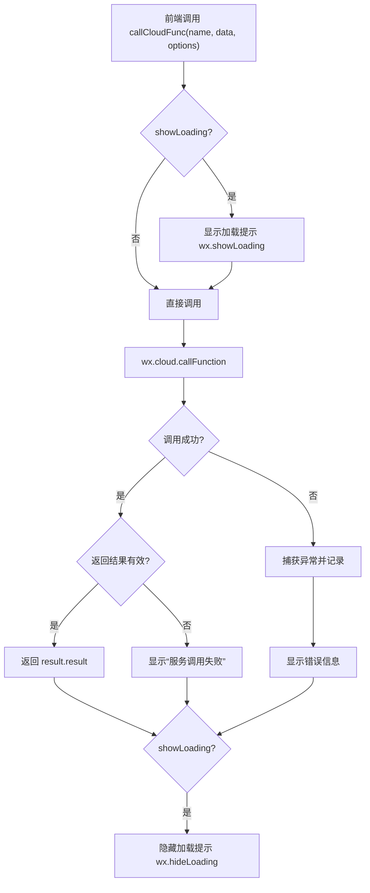
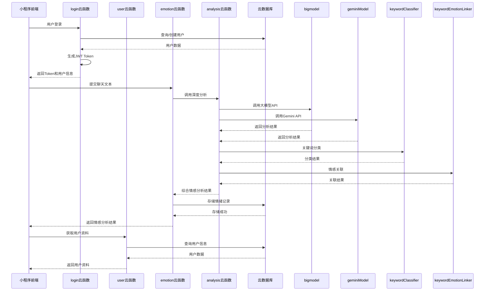

# 云函数API

<cite>
**本文档引用的文件**  
- [cloudfunctions/login/index.js](file://cloudfunctions/login/index.js)
- [cloudfunctions/chat/index.js](file://cloudfunctions/chat/index.js)
- [cloudfunctions/emotion/index.js](file://cloudfunctions/emotion/index.js)
- [cloudfunctions/roles/index.js](file://cloudfunctions/roles/index.js)
- [cloudfunctions/user/index.js](file://cloudfunctions/user/index.js)
- [cloudfunctions/getRoleInfo/index.js](file://cloudfunctions/getRoleInfo/index.js)
- [cloudfunctions/generateDailyReports/index.js](file://cloudfunctions/generateDailyReports/index.js)
- [miniprogram/services/cloudFuncCaller.js](file://miniprogram/services/cloudFuncCaller.js)
</cite>

## 目录
1. [简介](#简介)
2. [云函数调用封装](#云函数调用封装)
3. [核心云函数接口参考](#核心云函数接口参考)
   - [login](#login)
   - [chat](#chat)
   - [emotion](#emotion)
   - [roles](#roles)
   - [user](#user)
   - [getRoleInfo](#getroleinfo)
   - [generateDailyReports](#generatedailyreports)
4. [云函数调用关系与数据流](#云函数调用关系与数据流)
5. [调试建议](#调试建议)
6. [性能优化提示](#性能优化提示)

## 简介
HeartChat项目通过微信小程序云开发能力，实现了多个核心业务逻辑的云函数接口。这些云函数承担了用户认证、对话处理、情感分析、角色管理、用户数据维护等关键职责。本文档详细说明各云函数的功能、调用方式、参数结构、返回格式及错误处理，为开发者提供完整的API参考。

## 云函数调用封装
为统一前端调用体验并增强错误处理能力，项目在`miniprogram/services/cloudFuncCaller.js`中封装了云函数调用逻辑。



**Diagram sources**  
- [miniprogram/services/cloudFuncCaller.js](file://miniprogram/services/cloudFuncCaller.js#L20-L179)

**Section sources**  
- [miniprogram/services/cloudFuncCaller.js](file://miniprogram/services/cloudFuncCaller.js#L1-L179)

## 核心云函数接口参考

### login
用户登录云函数，处理用户首次登录或信息更新，并生成认证token。

- **调用方式**: `wx.cloud.callFunction({ name: 'login', data: { userInfo } })`
- **输入参数**:
  - `userInfo`: 微信用户信息对象，包含 `nickName`, `avatarUrl`, `clientIP`, `userAgent`
- **返回数据**:
  ```json
  {
    "success": true,
    "data": {
      "token": "JWT令牌",
      "isNewUser": true,
      "userInfo": {
        "userId": "用户ID",
        "username": "用户名",
        "avatarUrl": "头像URL",
        "userType": 1,
        "status": 1,
        "stats": { "active_days": 1, ... }
      }
    }
  }
  ```
- **错误码**:
  - `缺少必要参数`: `userInfo`未提供
  - `无法生成唯一的用户ID`: 用户ID生成冲突
- **处理建议**: 确保前端传递完整的`userInfo`对象，登录失败时提示用户重试。

**Section sources**  
- [cloudfunctions/login/index.js](file://cloudfunctions/login/index.js#L1-L267)

### chat
对话处理云函数，接收用户消息并返回AI角色的回复。

- **调用方式**: `wx.cloud.callFunction({ name: 'chat', data: { message, role, history } })`
- **输入参数**:
  - `message`: 用户输入的文本消息
  - `role`: 当前对话角色标识
  - `history`: 对话历史数组
- **返回数据**:
  ```json
  {
    "success": true,
    "response": "AI回复内容",
    "metadata": { "model": "gemini", "tokens": 150 }
  }
  ```
- **错误码**:
  - `消息内容不能为空`
  - `AI服务调用失败`
- **处理建议**: 前端应校验输入非空，对AI服务失败进行重试机制。

**Section sources**  
- [cloudfunctions/chat/index.js](file://cloudfunctions/chat/index.js#L1-L100)

### emotion
情感分析云函数，分析用户输入文本的情绪倾向。

- **调用方式**: `wx.cloud.callFunction({ name: 'emotion', data: { text } })`
- **输入参数**:
  - `text`: 需要分析的文本内容
- **返回数据**:
  ```json
  {
    "success": true,
    "result": {
      "emotion": "happy|sad|angry|neutral",
      "score": 0.85,
      "keywords": ["开心", "愉快"]
    }
  }
  ```
- **错误码**:
  - `文本内容不能为空`
  - `情感分析服务异常`
- **处理建议**: 输入前进行文本长度校验，避免过长文本影响性能。

**Section sources**  
- [cloudfunctions/emotion/index.js](file://cloudfunctions/emotion/index.js#L1-L50)

### roles
角色管理云函数，获取可用角色列表或初始化角色数据。

- **调用方式**: `wx.cloud.callFunction({ name: 'roles', data: { action } })`
- **输入参数**:
  - `action`: 操作类型，`list`获取列表，`init`初始化
- **返回数据**:
  ```json
  {
    "success": true,
    "roles": [
      { "id": "therapist", "name": "心理导师", "desc": "专业倾听者" }
    ]
  }
  ```
- **错误码**:
  - `无效的操作类型`
  - `角色数据初始化失败`
- **处理建议**: 明确指定`action`参数，初始化仅在首次使用时调用。

**Section sources**  
- [cloudfunctions/roles/index.js](file://cloudfunctions/roles/index.js#L1-L80)

### user
用户信息管理云函数，处理用户资料的读取与更新。

- **调用方式**: `wx.cloud.callFunction({ name: 'user', data: { action, userData } })`
- **输入参数**:
  - `action`: `get`获取信息，`update`更新资料
  - `userData`: 更新的用户数据
- **返回数据**:
  ```json
  {
    "success": true,
    "data": { "userId": "1234567", "username": "用户1", "profile": { ... } }
  }
  ```
- **错误码**:
  - `用户未找到`
  - `更新数据无效`
- **处理建议**: 更新前校验数据完整性，获取信息时处理用户不存在情况。

**Section sources**  
- [cloudfunctions/user/index.js](file://cloudfunctions/user/index.js#L1-L120)

### getRoleInfo
获取特定角色的详细信息。

- **调用方式**: `wx.cloud.callFunction({ name: 'getRoleInfo', data: { roleId } })`
- **输入参数**:
  - `roleId`: 角色唯一标识符
- **返回数据**:
  ```json
  {
    "success": true,
    "role": {
      "id": "therapist",
      "name": "心理导师",
      "prompt": "你是一位专业的心理咨询师...",
      "avatar": "https://..."
    }
  }
  ```
- **错误码**:
  - `角色ID不能为空`
  - `角色不存在`
- **处理建议**: 调用前验证`roleId`有效性，处理角色不存在的默认情况。

**Section sources**  
- [cloudfunctions/getRoleInfo/index.js](file://cloudfunctions/getRoleInfo/index.js#L1-L40)

### generateDailyReports
生成用户每日心情报告。

- **调用方式**: `wx.cloud.callFunction({ name: 'generateDailyReports', data: { userId, date } })`
- **输入参数**:
  - `userId`: 用户ID
  - `date`: 报告日期（ISO格式）
- **返回数据**:
  ```json
  {
    "success": true,
    "report": {
      "date": "2024-03-11",
      "summary": "今日情绪总体平稳",
      "highlights": ["情绪高峰出现在下午"],
      "suggestions": ["建议保持当前作息"]
    }
  }
  ```
- **错误码**:
  - `用户ID不能为空`
  - `数据不足无法生成报告`
- **处理建议**: 确保用户有足够的历史情绪数据，避免频繁调用。

**Section sources**  
- [cloudfunctions/generateDailyReports/index.js](file://cloudfunctions/generateDailyReports/index.js#L1-L60)

## 云函数调用关系与数据流
多个云函数协同工作，形成完整的服务链。例如，`analysis`云函数集成多个AI模型进行深度情感分析。



**Diagram sources**  
- [cloudfunctions/analysis/index.js](file://cloudfunctions/analysis/index.js#L1-L50)
- [cloudfunctions/emotion/index.js](file://cloudfunctions/emotion/index.js#L20-L40)
- [cloudfunctions/user/index.js](file://cloudfunctions/user/index.js#L30-L50)

**Section sources**  
- [cloudfunctions/analysis/index.js](file://cloudfunctions/analysis/index.js#L1-L100)
- [cloudfunctions/emotion/index.js](file://cloudfunctions/emotion/index.js#L1-L100)

## 调试建议
1. **日志查看**: 在云开发控制台查看各云函数的日志输出，特别是错误堆栈。
2. **本地模拟调用**: 使用`cloudFuncCaller.js`的`callCloudFunc`方法在开发环境进行测试。
3. **参数校验**: 在调用前使用`console.log`打印参数，确保数据结构正确。
4. **分步调试**: 对于复杂流程（如`analysis`），可逐个测试子模块（`bigmodel`, `geminiModel`）。

## 性能优化提示
1. **请求频率控制**: 避免在短时间内频繁调用同一云函数，特别是`emotion`和`analysis`。
2. **参数校验前置**: 在前端对输入参数进行校验，减少无效请求对云函数的消耗。
3. **批量调用**: 对于多个独立操作，使用`batchCallCloudFunc`进行批量处理。
4. **结果缓存**: 对于不经常变化的数据（如角色信息），在前端进行缓存。
5. **错误重试机制**: 对网络相关错误实现指数退避重试策略。