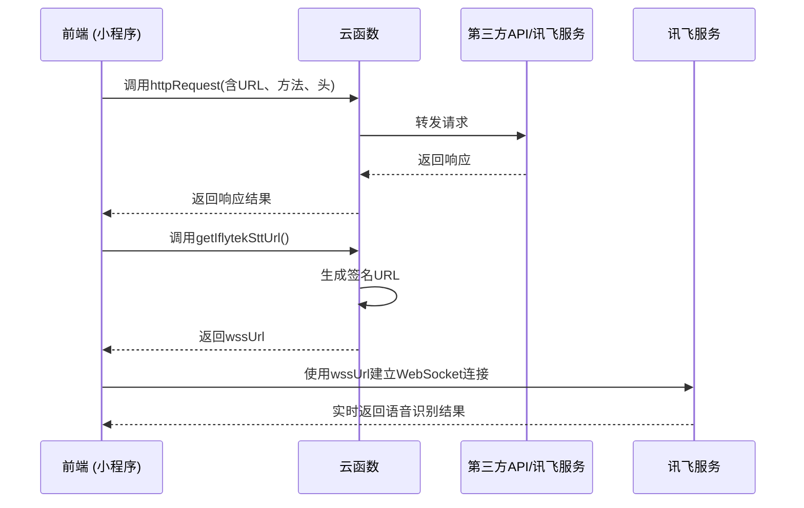
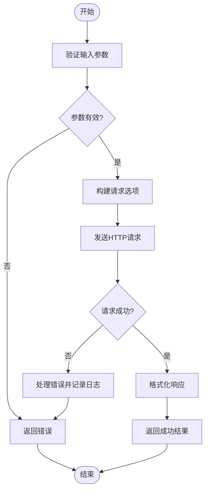
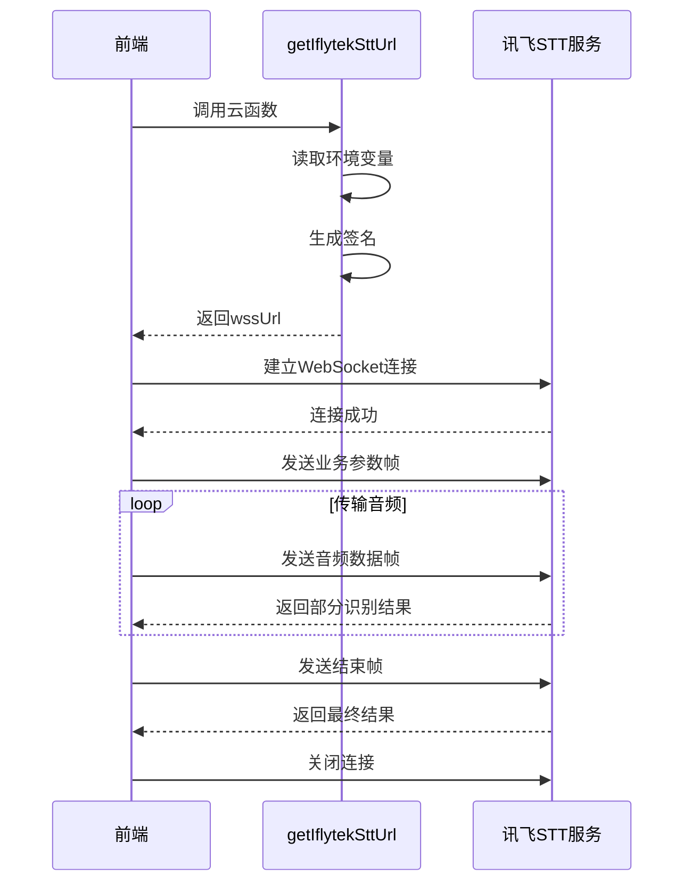
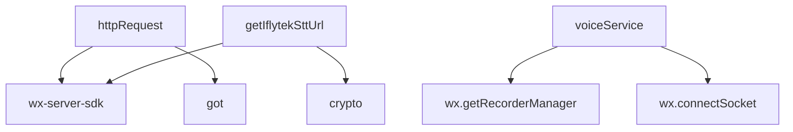

# 工具类API

<cite>
**本文档引用文件**  
- [httpRequest/index.js](file://cloudfunctions/httpRequest/index.js)
- [getIflytekSttUrl/index.js](file://cloudfunctions/getIflytekSttUrl/index.js)
- [voiceService.js](file://miniprogram/services/voiceService.js)
- [HeartChat 语音输入功能 (讯飞语音听写) 开发文档.md](file://doc/开发文档/HeartChat 语音输入功能 (讯飞语音听写) 开发文档.md)
</cite>

## 目录
1. [简介](#简介)
2. [项目结构](#项目结构)
3. [核心组件](#核心组件)
4. [架构概览](#架构概览)
5. [详细组件分析](#详细组件分析)
6. [依赖分析](#依赖分析)
7. [性能考虑](#性能考虑)
8. [故障排查指南](#故障排查指南)
9. [结论](#结论)

## 简介
本文档旨在为 HeartChat 项目中的工具类 API 提供全面的集成说明，重点涵盖 `httpRequest` 云函数作为安全代理的功能，以及 `getIflytekSttUrl` 云函数如何生成讯飞语音听写服务的临时 WebSocket URL。通过本指南，开发者将了解如何在前端安全地调用第三方 API，避免密钥暴露，并实现语音输入功能。文档还包含实际调用示例、安全性设计原则和调试技巧。

## 项目结构
HeartChat 项目的工具类 API 主要集中在 `cloudfunctions` 目录下，其中 `httpRequest` 和 `getIflytekSttUrl` 是两个关键的云函数。前端语音服务逻辑封装在 `miniprogram/services/voiceService.js` 中，与云函数协同工作。

```mermaid
graph TB
subgraph "前端"
VoiceService["voiceService.js"]
end
subgraph "云函数"
HttpRequest["httpRequest/index.js"]
GetIflytekSttUrl["getIflytekSttUrl/index.js"]
end
VoiceService --> HttpRequest : "调用代理"
VoiceService --> GetIflytekSttUrl : "获取鉴权URL"
```

**图示来源**  
- [httpRequest/index.js](file://cloudfunctions/httpRequest/index.js)
- [getIflytekSttUrl/index.js](file://cloudfunctions/getIflytekSttUrl/index.js)
- [voiceService.js](file://miniprogram/services/voiceService.js)

**本节来源**  
- [httpRequest/index.js](file://cloudfunctions/httpRequest/index.js)
- [getIflytekSttUrl/index.js](file://cloudfunctions/getIflytekSttUrl/index.js)
- [voiceService.js](file://miniprogram/services/voiceService.js)

## 核心组件
本文档的核心组件包括 `httpRequest` 云函数，用于代理前端对第三方 API 的请求，以及 `getIflytekSttUrl` 云函数，用于生成讯飞语音听写服务的安全连接 URL。`voiceService.js` 作为前端服务模块，负责管理录音和 WebSocket 通信。

**本节来源**  
- [httpRequest/index.js](file://cloudfunctions/httpRequest/index.js#L1-L63)
- [getIflytekSttUrl/index.js](file://cloudfunctions/getIflytekSttUrl/index.js#L1-L69)
- [voiceService.js](file://miniprogram/services/voiceService.js#L1-L485)

## 架构概览
HeartChat 的工具类 API 架构采用前后端分离模式，前端通过云函数作为中间层与外部服务通信。`httpRequest` 云函数充当安全代理，防止前端直接暴露 API 密钥；`getIflytekSttUrl` 云函数则负责生成带有签名的 WebSocket URL，确保语音识别请求的安全性。



**图示来源**  
- [httpRequest/index.js](file://cloudfunctions/httpRequest/index.js#L1-L63)
- [getIflytekSttUrl/index.js](file://cloudfunctions/getIflytekSttUrl/index.js#L1-L69)
- [voiceService.js](file://miniprogram/services/voiceService.js#L1-L485)

## 详细组件分析

### httpRequest 云函数分析
`httpRequest` 云函数是前端与第三方 API 之间的安全代理。它接收前端传入的请求参数（URL、方法、头、体等），在服务端发起实际请求，并将结果返回给前端，从而避免了在前端代码中硬编码敏感信息。

#### 功能说明
- **请求代理**：支持 GET、POST 等多种 HTTP 方法。
- **头部配置**：允许前端自定义请求头。
- **超时控制**：可设置请求超时时间，默认 30 秒。
- **错误处理**：捕获网络异常并返回结构化错误信息。



**图示来源**  
- [httpRequest/index.js](file://cloudfunctions/httpRequest/index.js#L1-L63)

**本节来源**  
- [httpRequest/index.js](file://cloudfunctions/httpRequest/index.js#L1-L63)

### getIflytekSttUrl 与 voiceService 集成分析
`getIflytekSttUrl` 云函数与 `voiceService.js` 模块协同工作，实现完整的语音识别功能。云函数负责生成安全的 WebSocket URL，前端服务则利用该 URL 建立连接并传输音频数据。

#### 工作流程
1. 前端调用 `getIflytekSttUrl` 获取鉴权 URL。
2. 云函数使用环境变量中的 `APPID`、`API_SECRET` 和 `API_KEY` 生成签名。
3. 前端使用返回的 URL 建立 WebSocket 连接。
4. 录音数据通过 WebSocket 流式传输至讯飞服务器。
5. 识别结果实时返回并在前端展示。



**图示来源**  
- [getIflytekSttUrl/index.js](file://cloudfunctions/getIflytekSttUrl/index.js#L1-L69)
- [voiceService.js](file://miniprogram/services/voiceService.js#L1-L485)

**本节来源**  
- [getIflytekSttUrl/index.js](file://cloudfunctions/getIflytekSttUrl/index.js#L1-L69)
- [voiceService.js](file://miniprogram/services/voiceService.js#L1-L485)

## 依赖分析
工具类 API 的实现依赖于微信小程序云开发 SDK、Node.js 内置的 `crypto` 模块以及第三方 HTTP 客户端库 `got`。前端语音服务依赖微信原生的录音和 WebSocket API。



**图示来源**  
- [httpRequest/index.js](file://cloudfunctions/httpRequest/index.js#L1-L63)
- [getIflytekSttUrl/index.js](file://cloudfunctions/getIflytekSttUrl/index.js#L1-L69)
- [voiceService.js](file://miniprogram/services/voiceService.js#L1-L485)

**本节来源**  
- [httpRequest/index.js](file://cloudfunctions/httpRequest/index.js#L1-L63)
- [getIflytekSttUrl/index.js](file://cloudfunctions/getIflytekSttUrl/index.js#L1-L69)
- [voiceService.js](file://miniprogram/services/voiceService.js#L1-L485)

## 性能考虑
- **httpRequest**：合理设置超时时间，避免长时间阻塞。
- **语音识别**：优化音频帧大小和发送频率，平衡实时性与网络开销。
- **连接复用**：考虑在短时间内复用 WebSocket 连接以减少握手开销。

## 故障排查指南
- **代理请求失败**：检查云函数日志，确认请求参数和第三方 API 状态。
- **语音URL生成失败**：验证环境变量中的 `APPID`、`API_SECRET`、`API_KEY` 是否正确配置。
- **WebSocket连接失败**：确保小程序后台已配置正确的 `socket` 域名。
- **识别结果不准确**：检查录音参数（采样率、声道、格式）是否符合讯飞要求。

**本节来源**  
- [httpRequest/index.js](file://cloudfunctions/httpRequest/index.js#L1-L63)
- [getIflytekSttUrl/index.js](file://cloudfunctions/getIflytekSttUrl/index.js#L1-L69)
- [voiceService.js](file://miniprogram/services/voiceService.js#L1-L485)

## 结论
通过 `httpRequest` 和 `getIflytekSttUrl` 两个云函数，HeartChat 实现了安全、高效的第三方 API 集成和语音识别功能。这种架构设计不仅保护了敏感信息，还提升了系统的可维护性和扩展性。开发者应遵循本文档的指导进行集成和调试，确保功能稳定可靠。