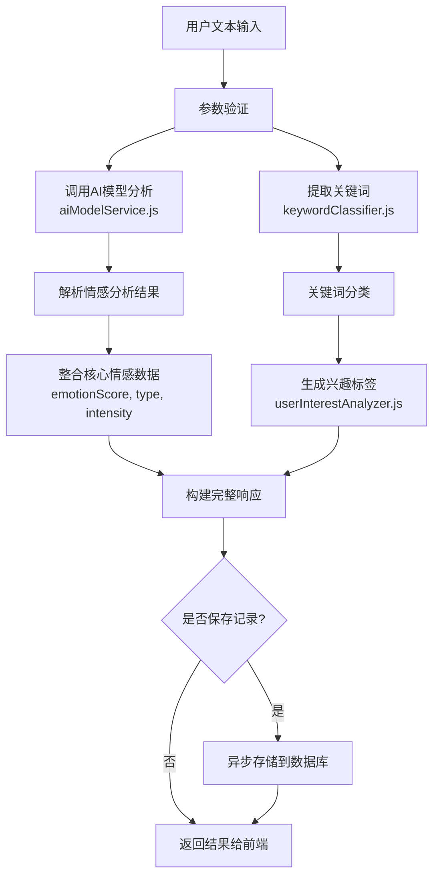
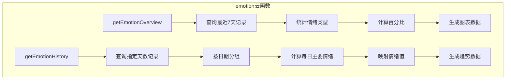

# 情感分析API

<cite>
**本文档引用文件**   
- [analysis.md](file://doc/开发文档/cloudfunctions/analysis.md)
- [emotion.md](file://doc/开发文档/cloudfunctions/emotion.md)
- [getEmotionRecords.md](file://doc/开发文档/cloudfunctions/getEmotionRecords.md)
- [01-情感分析提示词.md](file://doc/开发文档/prompt/01-情感分析提示词.md)
- [index.js](file://cloudfunctions/analysis/index.js)
- [aiModelService.js](file://cloudfunctions/analysis/aiModelService.js)
- [keywordClassifier.js](file://cloudfunctions/analysis/keywordClassifier.js)
- [userInterestAnalyzer.js](file://cloudfunctions/analysis/userInterestAnalyzer.js)
- [emotion/index.js](file://cloudfunctions/emotion/index.js)
- [getEmotionRecords/index.js](file://cloudfunctions/getEmotionRecords/index.js)
- [emotionService.js](file://miniprogram/services/emotionService.js)
</cite>

## 目录
1. [简介](#简介)
2. [核心功能与流程](#核心功能与流程)
3. [核心组件分析](#核心组件分析)
4. [数据模型与返回格式](#数据模型与返回格式)
5. [前端调用示例](#前端调用示例)
6. [常见问题与解决方案](#常见问题与解决方案)
7. [结论](#结论)

## 简介

本技术文档旨在深入解析HeartChat小程序的情感分析系统。该系统通过一系列云函数，为用户提供实时情绪识别、关键词情感关联、用户兴趣分析及历史记录查询等核心功能。文档将重点剖析`analysis`云函数的多阶段处理流程，阐明`emotion`云函数在情绪数据管理中的作用，并提供前端调用的具体实现方式，为开发者和维护者提供全面的技术参考。

**Section sources**
- [analysis.md](file://doc/开发文档/cloudfunctions/analysis.md)
- [emotion.md](file://doc/开发文档/cloudfunctions/emotion.md)

## 核心功能与流程

情感分析系统由多个协同工作的云函数构成，共同完成从文本输入到数据可视化的完整链路。

### analysis云函数：多阶段处理引擎

`analysis`云函数是整个情感分析系统的核心，它接收用户输入的文本，并驱动一个复杂的多阶段处理流程。该流程严格遵循以下步骤：

1.  **文本输入与参数验证**：接收用户提交的文本内容、历史对话记录及其他配置参数（如是否保存记录、使用的AI模型类型等），并进行严格的格式和完整性校验。
2.  **AI模型分析**：调用`aiModelService.js`模块，该模块作为统一的AI模型服务接口，支持Gemini、智谱AI（GLM）、OpenAI等多种大模型。系统根据配置选择模型，将文本和上下文发送给AI，请求进行深度情感分析。
3.  **关键词提取与分类**：在AI分析的同时或之后，系统调用`keywordClassifier.js`对文本进行关键词提取。提取出的关键词会经过分类器处理，被归入“学习”、“工作”、“社交”等预定义的类别中。
4.  **用户兴趣分析**：`userInterestAnalyzer.js`模块接收分类后的关键词和用户的历史情绪记录，进行综合分析。它计算不同兴趣类别的权重，识别用户的关注点，并分析特定关键词与积极或消极情绪的关联性，最终生成用户兴趣画像。
5.  **结果整合与存储**：将AI返回的情感分析结果、提取的关键词、用户兴趣分析结果等数据进行整合，形成最终的响应。如果请求中包含`saveRecord=true`，则会将完整的分析结果异步存储到`emotionRecords`数据库集合中，以便后续查询和分析。



**Diagram sources**
- [index.js](file://cloudfunctions/analysis/index.js#L150-L250)
- [aiModelService.js](file://cloudfunctions/analysis/aiModelService.js#L200-L400)
- [keywordClassifier.js](file://cloudfunctions/analysis/keywordClassifier.js#L100-L150)
- [userInterestAnalyzer.js](file://cloudfunctions/analysis/userInterestAnalyzer.js#L50-L100)

### emotion云函数：情绪数据管理

`emotion`云函数不直接进行情感分析，而是负责管理和呈现已存储的情绪数据。它提供两个主要操作：

1.  **获取情绪概览** (`getEmotionOverview`)：此功能查询用户最近7天内的情绪记录，统计每种情绪类型（如“快乐”、“焦虑”）的出现次数，计算其百分比，并确定主要和次要情绪。它返回的数据可用于生成环形图或柱状图，直观展示用户近期的情绪分布。
2.  **获取情绪历史** (`getEmotionHistory`)：此功能根据用户指定的时间范围（默认30天）查询历史记录。它将记录按日期分组，计算出每天的“主要情绪”，并根据预设的映射表（如“快乐”=100，“悲伤”=-80）将其转换为一个“情绪值”。返回的日期、情绪值和情绪类型数组可用于绘制情绪波动趋势线。



**Diagram sources**
- [emotion/index.js](file://cloudfunctions/emotion/index.js#L10-L100)

### getEmotionRecords云函数：历史记录查询

`getEmotionRecords`云函数提供了一个更底层、更灵活的接口，用于直接查询原始的情绪分析记录。它支持根据`userId`和可选的`roleId`进行筛选，并可以限制返回的记录数量。该函数采用了降级查询机制：首先尝试使用字符串形式的查询条件，如果失败，则自动降级到使用对象形式的查询条件，以提高查询的兼容性和成功率。其返回结果是`emotionRecords`集合中原始的、未经加工的记录数组。

**Section sources**
- [getEmotionRecords.md](file://doc/开发文档/cloudfunctions/getEmotionRecords.md)
- [getEmotionRecords/index.js](file://cloudfunctions/getEmotionRecords/index.js#L20-L80)

## 核心组件分析

### 情感分类算法逻辑

情感分类的核心在于`01-情感分析提示词.md`中定义的精细化提示词体系。该提示词体系为AI模型提供了明确的分析框架，确保了分析结果的一致性和深度。

-   **情感体系**：系统定义了包含8大类（积极、消极、认知等）共32种子类的完整情感枚举，如“喜悦”、“焦虑”、“孤独”、“自信”等，确保了情感识别的全面性。
-   **多维度分析**：提示词要求AI不仅识别主要和次要情感，还需评估**强度**（0.0-1.0）、**效价**（-1.0到1.0，表示正负性）、**唤醒度**（0.0-1.0，表示激动程度）和**趋势**（上升/下降/稳定）。
-   **深层洞察**：系统要求AI分析“信任度”、“开放度”、“压力水平”等雷达维度，并识别“情绪触发词”和“主题关键词”，从而提供更立体的用户状态画像。
-   **模型适配**：文档中为Gemini、GPT、GLM等不同模型提供了定制化的提示词，充分利用各模型的优势，例如GLM的提示词特别强调了对中国文化含蓄表达的理解。

**Section sources**
- [01-情感分析提示词.md](file://doc/开发文档/prompt/01-情感分析提示词.md)
- [aiModelService.js](file://cloudfunctions/analysis/aiModelService.js#L300-L500)

## 数据模型与返回格式

### 情感分析结果数据结构

`analysis`云函数返回的核心情感分析结果是一个包含丰富信息的JSON对象，其关键字段如下：

| 字段名 | 类型 | 描述 |
| :--- | :--- | :--- |
| `primary_emotion` | 字符串 | 主要情感类型，如“焦虑”、“喜悦”。 |
| `secondary_emotions` | 字符串数组 | 次要情感数组，最多2个。 |
| `intensity` | 数值 | 主要情感的强度，范围0.0-1.0。 |
| `valence` | 数值 | 情感的正负性，范围-1.0到1.0。 |
| `arousal` | 数值 | 情感的激动水平，范围0.0-1.0。 |
| `trend` | 字符串 | 情绪变化趋势，如“上升”、“下降”。 |
| `radar_dimensions` | 对象 | 包含`trust`、`openness`、`stress`等维度的评分。 |
| `topic_keywords` | 字符串数组 | 与对话主题相关的关键词。 |
| `emotion_triggers` | 字符串数组 | 触发当前情感的关键词或短语。 |
| `summary` | 字符串 | 对当前情感状态的总结性描述。 |
| `suggestions` | 字符串数组 | 基于情感状态给出的1-3条建议。 |

### 用户兴趣分析结果

`userInterestAnalyzer.js`模块生成的用户兴趣分析结果包含以下核心数据：

| 字段名 | 类型 | 描述 |
| :--- | :--- | :--- |
| `categoryWeights` | 对象数组 | 包含`category`（类别）、`weight`（权重）、`percentage`（百分比）的对象数组，表示各兴趣类别的占比。 |
| `focusPoints` | 对象数组 | 包含`category`（关注点类别）、`keywords`（代表性关键词）等信息的对象数组，代表用户的核心关注领域。 |
| `emotionalInsights` | 对象 | 包含`positiveAssociations`和`negativeAssociations`数组，揭示哪些关键词常与积极或消极情绪关联。 |

**Section sources**
- [analysis.md](file://doc/开发文档/cloudfunctions/analysis.md#涉及的数据库集合)
- [userInterestAnalyzer.js](file://cloudfunctions/analysis/userInterestAnalyzer.js#L150-L250)

## 前端调用示例

前端通过`miniprogram/services/emotionService.js`提供的服务层来调用后端云函数，实现了功能与界面的解耦。

### 调用情绪分析

```javascript
// emotionService.js 中的 analyzeEmotion 函数
async function analyzeEmotion(text, options = {}) {
  // ... 参数验证
  const result = await wx.cloud.callFunction({
    name: 'analysis', // 调用 analysis 云函数
    data: {
      type: 'emotion', // 指定操作类型
      text: text,
      saveRecord: true, // 保存记录
      history: options.history // 传递历史对话
    }
  });
  // ... 处理结果
  return finalResult;
}

// 在页面中调用
const analysisResult = await emotionService.analyzeEmotion("今天工作好累，感觉压力很大。", {
  history: chatHistory
});
```

### 获取历史情绪记录

```javascript
// emotionService.js 中的 getEmotionHistory 函数
async function getEmotionHistory(userId, roleId, limit) {
  // ... 尝试调用 getEmotionRecords 云函数
  const result = await wx.cloud.callFunction({
    name: 'getEmotionRecords',
    data: { userId, roleId, limit }
  });
  // ... 如果云函数调用失败，则降级为直接数据库查询
  if (!result.result.success) {
    // 使用字符串查询或对象查询作为备用方案
    const dbResult = await db.collection('emotionRecords').where(whereStr).get();
    return dbResult.data;
  }
  return result.result.data;
}
```

此实现展示了优雅的错误处理和降级策略，确保了在云函数不可用时，前端仍能通过直接数据库查询获取数据，保障了用户体验的稳定性。

**Section sources**
- [emotionService.js](file://miniprogram/services/emotionService.js#L50-L200)
- [emotionService.js](file://miniprogram/services/emotionService.js#L250-L400)

## 常见问题与解决方案

### 分析结果不准确

这是最常见的问题，可能由多种原因导致。

-   **调试路径**：
    1.  **检查提示词**：首先确认`01-情感分析提示词.md`中的提示词是否清晰、无歧义。可以在`aiModelService.js`中打印出发送给AI的完整提示词，检查其格式和内容。
    2.  **验证模型响应**：在`aiModelService.js`的`analyzeEmotion`函数中，打印出AI返回的原始响应（`response`）。检查返回的JSON是否完整，是否存在解析错误。
    3.  **测试不同模型**：通过在调用`analysis`云函数时指定`modelType`参数（如`gemini`或`zhipu`），对比不同AI模型的分析结果，以判断是模型本身的问题还是系统处理的问题。
    4.  **简化输入**：使用非常明确和简单的文本（如“我很开心”）进行测试，排除因用户表达模糊导致的分析困难。

### 前端无法获取历史记录

-   **调试路径**：
    1.  **检查云函数调用**：在`emotionService.js`中，检查`wx.cloud.callFunction`调用`getEmotionRecords`是否成功。查看控制台是否有网络错误或权限错误。
    2.  **验证降级机制**：故意让云函数调用失败（如修改云函数名），观察前端是否能成功执行降级的数据库查询逻辑。
    3.  **检查数据库权限**：确保`emotionRecords`集合在云开发控制台中设置了正确的读权限，允许用户读取自己的记录。

**Section sources**
- [aiModelService.js](file://cloudfunctions/analysis/aiModelService.js#L400-L500)
- [emotionService.js](file://miniprogram/services/emotionService.js#L250-L350)

## 结论

HeartChat的情感分析API通过精心设计的云函数架构，实现了从实时分析到长期追踪的完整闭环。`analysis`云函数作为核心引擎，利用先进的AI模型和复杂的提示词体系，提供了深度且多维度的情感洞察。`emotion`和`getEmotionRecords`云函数则构建了强大的数据管理层，支持灵活的查询和可视化。前端通过`emotionService.js`实现了健壮的调用逻辑。整个系统展现了模块化、高可用和易于维护的设计理念，为用户提供了一个可靠且富有洞察力的情感陪伴工具。