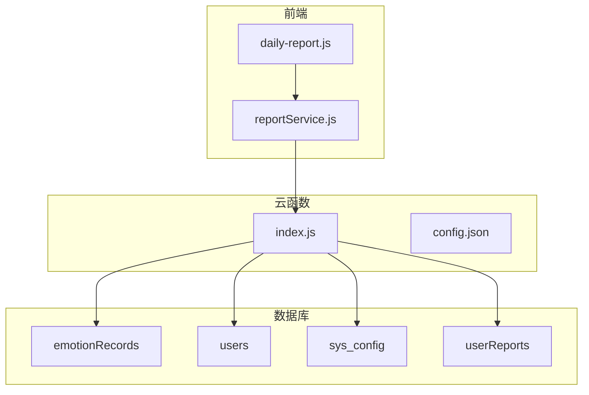
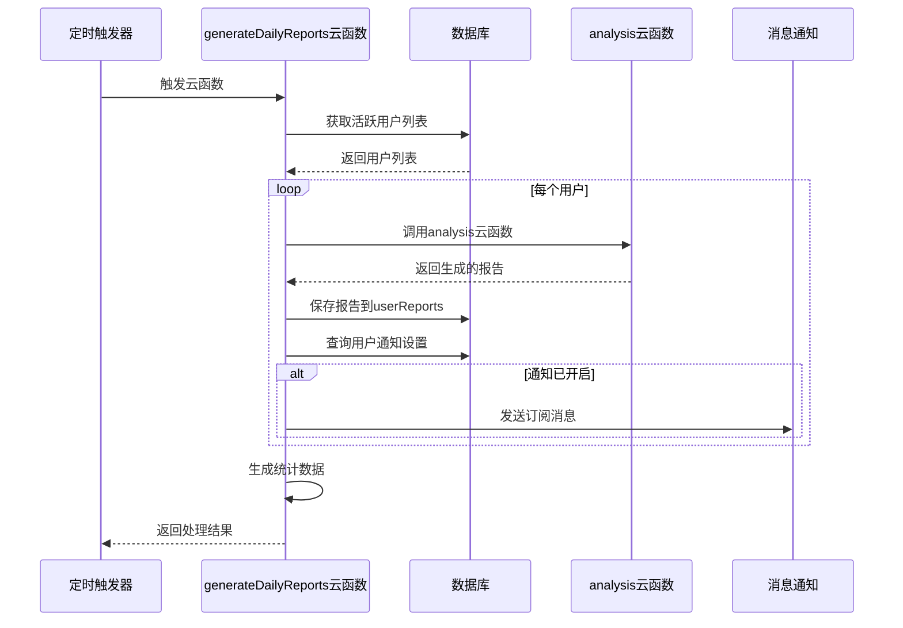
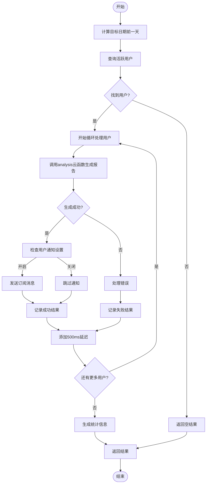
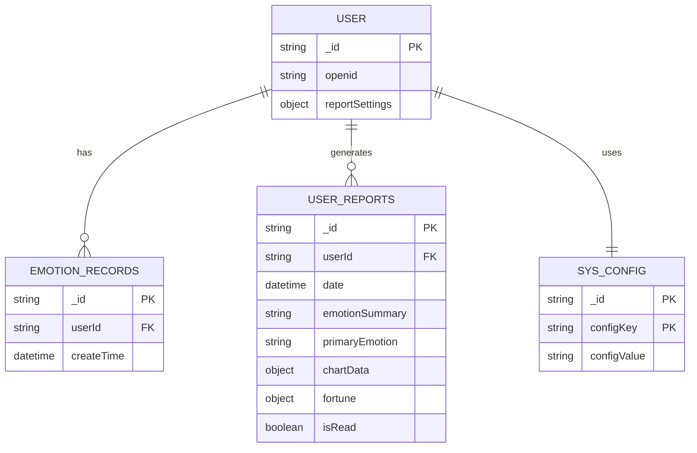
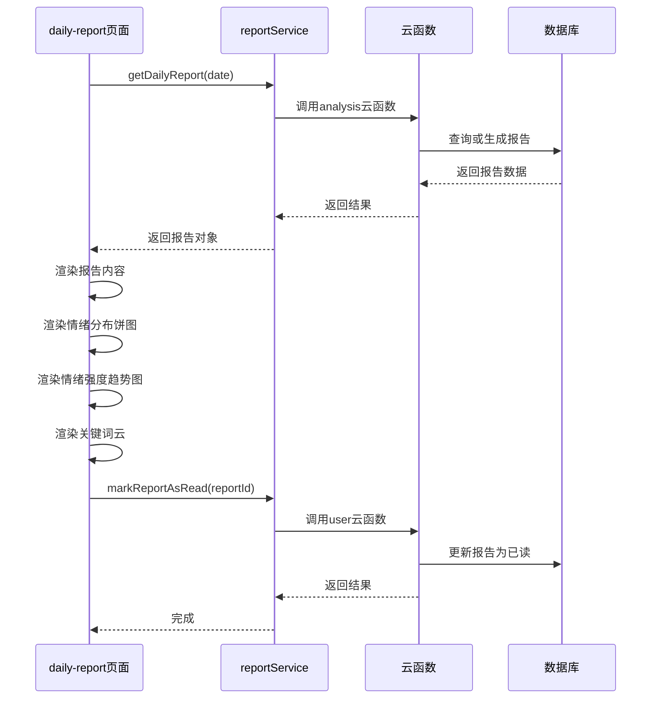
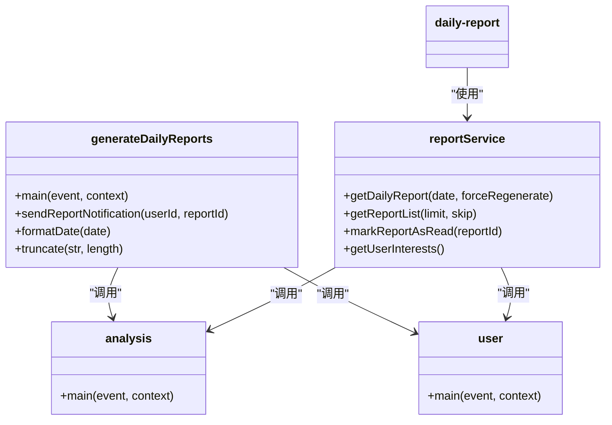

# 报告生成API

<cite>
**本文档引用文件**   
- [index.js](file://cloudfunctions/generateDailyReports/index.js)
- [config.json](file://cloudfunctions/generateDailyReports/config.json)
- [reportService.js](file://miniprogram/services/reportService.js)
- [daily-report.js](file://miniprogram/packageEmotion/pages/daily-report/daily-report.js)
- [generateDailyReports.md](file://doc/开发文档/cloudfunctions/generateDailyReports.md)
- [HeartChat每日心情报告设计方案.md](file://doc/设计文档/功能设计/HeartChat每日心情报告设计方案.md)
</cite>

## 目录
1. [简介](#简介)
2. [项目结构](#项目结构)
3. [核心组件](#核心组件)
4. [架构概述](#架构概述)
5. [详细组件分析](#详细组件分析)
6. [依赖分析](#依赖分析)
7. [性能考虑](#性能考虑)
8. [故障排除指南](#故障排除指南)
9. [结论](#结论)

## 简介
每日心情报告API是HeartChat应用的核心功能，通过分析用户的情绪记录、聊天内容和兴趣标签等多源数据，自动生成结构化的个性化报告。该系统由`generateDailyReports`云函数驱动，基于`config.json`中的规则定时执行，为用户提供情绪总结、趋势分析和个性化建议。前端通过`reportService.js`调用接口，在`daily-report`页面中展示可视化内容。本技术文档详细说明了报告生成机制、数据处理逻辑、异常处理策略及性能优化方案。

## 项目结构
`generateDailyReports`云函数位于`cloudfunctions`目录下，包含主逻辑文件`index.js`和配置文件`config.json`。该函数依赖`analysis`云函数进行数据分析，并与数据库中的`emotionRecords`、`users`、`sys_config`和`userReports`集合交互。前端服务通过`miniprogram/services/reportService.js`调用API，页面逻辑在`miniprogram/packageEmotion/pages/daily-report/daily-report.js`中实现。系统通过定时触发器每天凌晨2点自动执行，确保用户能及时收到前一天的心情报告。

**Diagram sources**
- [index.js](file://cloudfunctions/generateDailyReports/index.js#L1-L200)
- [config.json](file://cloudfunctions/generateDailyReports/config.json#L1-L9)
- [reportService.js](file://miniprogram/services/reportService.js#L1-L148)

**Section sources**
- [index.js](file://cloudfunctions/generateDailyReports/index.js#L1-L200)
- [config.json](file://cloudfunctions/generateDailyReports/config.json#L1-L9)

## 核心组件
`generateDailyReports`云函数是报告生成系统的核心，负责批量处理活跃用户的数据并生成每日心情报告。它通过聚合`emotionRecords`集合中的记录来识别活跃用户，然后为每个用户调用`analysis`云函数生成详细报告。系统支持订阅消息通知，当用户开启通知设置时，会通过微信API发送提醒。`config.json`文件定义了定时触发器，确保每天凌晨2点自动执行。前端`reportService.js`提供了获取报告、报告列表和标记已读等服务接口，支持手动刷新和历史报告查询。

**Section sources**
- [index.js](file://cloudfunctions/generateDailyReports/index.js#L1-L200)
- [reportService.js](file://miniprogram/services/reportService.js#L1-L148)

## 架构概述
系统采用分层架构设计，前端通过服务层调用云函数接口，云函数处理业务逻辑并与数据库交互。`generateDailyReports`云函数作为批处理引擎，定时触发报告生成流程。它首先查询前一天有情感记录的活跃用户，然后逐个调用`analysis`云函数生成报告。生成的报告存储在`userReports`集合中，并根据用户设置发送订阅消息。前端通过`reportService`封装的API获取报告数据，在`daily-report`页面中渲染图表和内容。系统支持手动生成报告和历史报告查询，提供了完整的用户体验。

**Diagram sources**
- [index.js](file://cloudfunctions/generateDailyReports/index.js#L1-L200)
- [generateDailyReports.md](file://doc/开发文档/cloudfunctions/generateDailyReports.md#L1-L197)

## 详细组件分析

### generateDailyReports云函数分析
`generateDailyReports`云函数实现了批量报告生成的核心逻辑。它首先计算目标日期（前一天），然后通过聚合查询从`emotionRecords`集合中找出有情感记录的活跃用户。对于每个用户，函数调用`analysis`云函数生成报告，并根据结果决定是否发送订阅消息。系统包含详细的错误处理机制，单个用户的失败不会影响其他用户的处理。为了防止API调用过于频繁，函数在处理每个用户后添加500毫秒的延迟。

#### 云函数主流程

**Diagram sources**
- [index.js](file://cloudfunctions/generateDailyReports/index.js#L15-L150)

#### 报告生成输入输出

**Diagram sources**
- [index.js](file://cloudfunctions/generateDailyReports/index.js#L1-L200)
- [generateDailyReports.md](file://doc/开发文档/cloudfunctions/generateDailyReports.md#L62-L133)

**Section sources**
- [index.js](file://cloudfunctions/generateDailyReports/index.js#L1-L200)
- [generateDailyReports.md](file://doc/开发文档/cloudfunctions/generateDailyReports.md#L1-L197)

### 前端服务与页面分析
前端通过`reportService.js`提供报告相关的服务接口，包括获取报告、获取报告列表、标记报告为已读和获取用户兴趣数据。`daily-report.js`页面控制器负责加载和渲染报告内容，支持日期选择、手动刷新和分享功能。系统实现了图表懒加载和暗黑模式适配，确保良好的用户体验。当报告数据加载完成后，页面会自动渲染情绪分布饼图、情绪强度趋势图和关键词云等可视化组件。

#### 前端调用流程

**Diagram sources**
- [reportService.js](file://miniprogram/services/reportService.js#L1-L148)
- [daily-report.js](file://miniprogram/packageEmotion/pages/daily-report/daily-report.js#L1-L799)

**Section sources**
- [reportService.js](file://miniprogram/services/reportService.js#L1-L148)
- [daily-report.js](file://miniprogram/packageEmotion/pages/daily-report/daily-report.js#L1-L799)

## 依赖分析
系统依赖多个云函数和数据库集合协同工作。`generateDailyReports`云函数依赖`analysis`云函数进行数据分析和报告生成，依赖`user`云函数获取用户信息和报告列表。数据库方面，系统需要访问`emotionRecords`获取用户活跃度，`users`获取用户设置，`sys_config`获取通知模板，以及`userReports`存储和查询报告数据。前端依赖`ec-canvas`组件进行数据可视化，依赖微信云开发SDK进行API调用。

**Diagram sources**
- [index.js](file://cloudfunctions/generateDailyReports/index.js#L1-L200)
- [reportService.js](file://miniprogram/services/reportService.js#L1-L148)

**Section sources**
- [index.js](file://cloudfunctions/generateDailyReports/index.js#L1-L200)
- [reportService.js](file://miniprogram/services/reportService.js#L1-L148)

## 性能考虑
系统实现了多项性能优化策略。在批处理方面，限制每次最多处理100个用户，避免资源耗尽。通过在每个用户处理后添加500毫秒延迟，防止API调用过于频繁。采用懒加载策略，图表组件在页面显示后再初始化。结果缓存机制减少了重复计算，当用户查看历史报告时直接从数据库读取。系统还实现了错误隔离，单个用户的失败不会影响整体流程。建议进一步优化包括引入Redis缓存热门报告、对大用户量分片处理、以及实现报告生成队列。

**Section sources**
- [index.js](file://cloudfunctions/generateDailyReports/index.js#L1-L200)
- [daily-report.js](file://miniprogram/packageEmotion/pages/daily-report/daily-report.js#L1-L799)

## 故障排除指南
系统包含完善的异常处理机制。当用户没有足够的情感数据时，系统不会生成报告，前端会显示相应提示。通知发送失败被单独捕获，不会影响报告生成主流程。云函数包含详细的日志记录，在开发模式下会输出处理进度。常见问题包括：用户未授权订阅消息导致通知失败、`sys_config`中缺少模板ID配置、`analysis`云函数异常等。建议监控云函数执行日志，定期检查配置项完整性，并为用户提供清晰的错误提示。

**Section sources**
- [index.js](file://cloudfunctions/generateDailyReports/index.js#L1-L200)
- [daily-report.js](file://miniprogram/packageEmotion/pages/daily-report/daily-report.js#L1-L799)

## 结论
每日心情报告API通过`generateDailyReports`云函数实现了自动化、个性化的报告生成功能。系统整合了多源数据，基于`config.json`中的规则定时执行，为用户提供有价值的情绪洞察。前端通过`reportService.js`提供了完整的API封装，在`daily-report`页面中实现了丰富的可视化展示。系统具备良好的错误处理和性能优化机制，支持手动生成、历史查询和通知提醒等完整功能。未来可进一步优化缓存策略和处理效率，提升大规模用户场景下的系统性能。