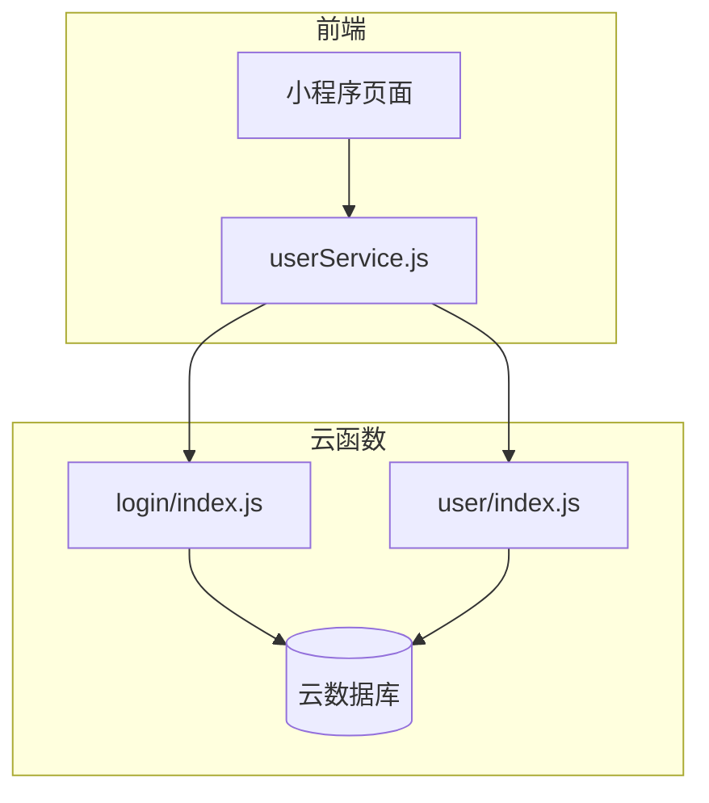
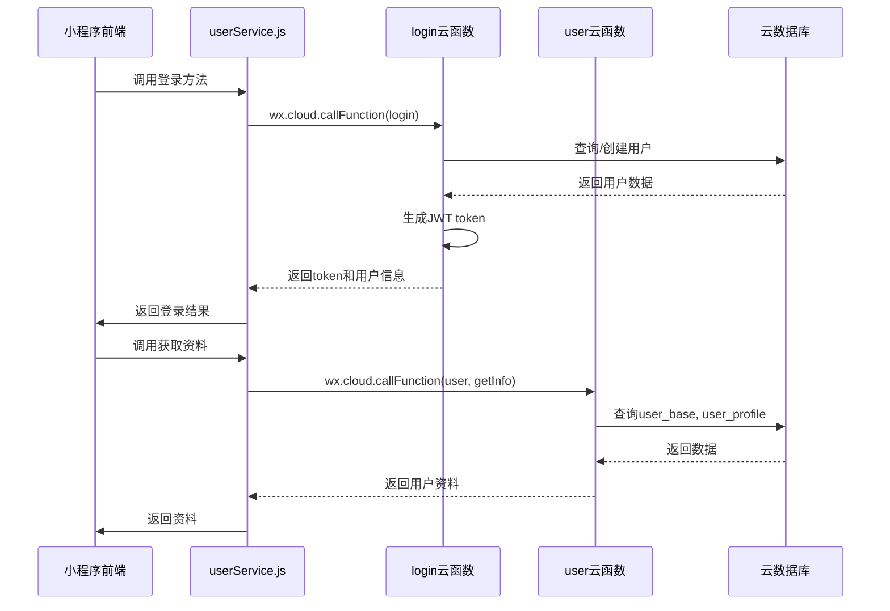
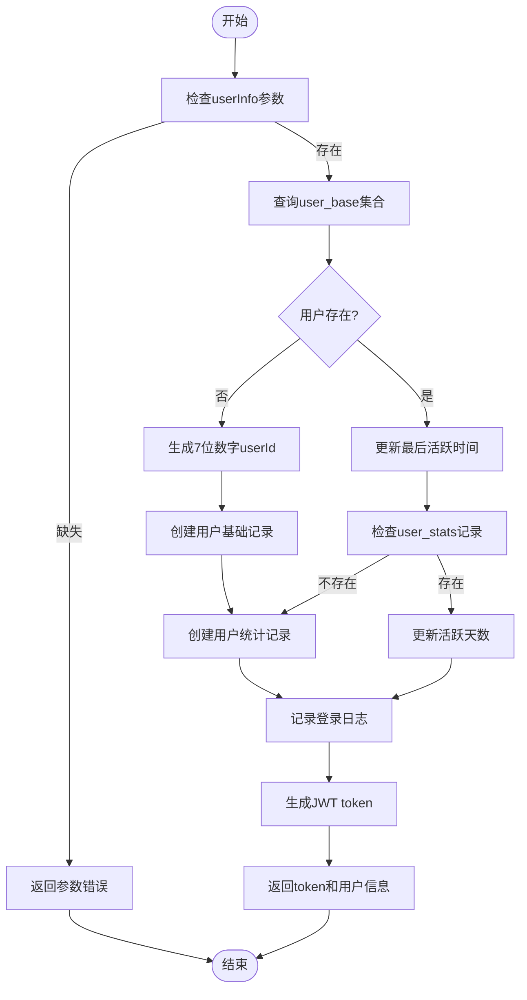
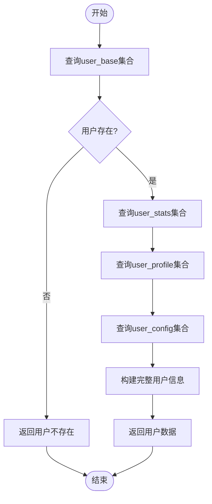
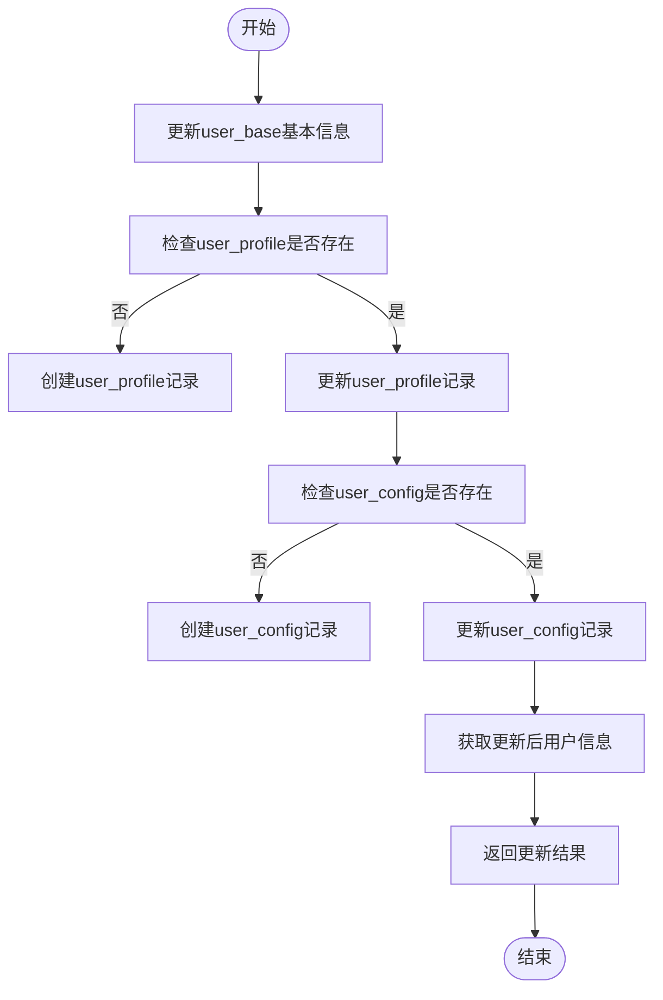
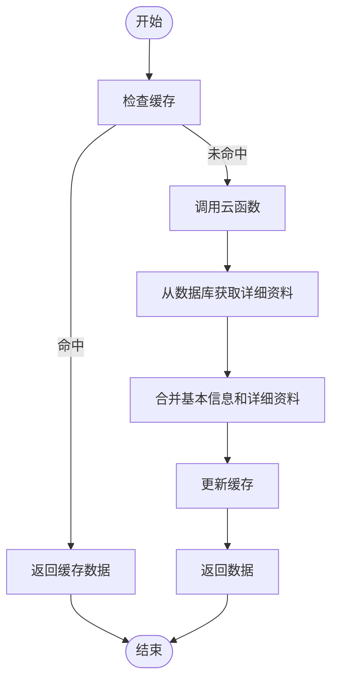
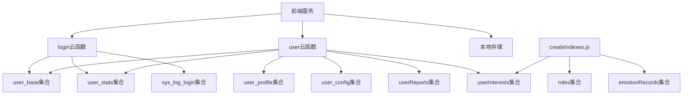

# 用户管理API

<cite>
**本文档引用文件**   
- [login/index.js](file://cloudfunctions/login/index.js)
- [user/index.js](file://cloudfunctions/user/index.js)
- [createIndexes.js](file://cloudfunctions/user/createIndexes.js)
- [userService.js](file://miniprogram/services/userService.js)
- [user_base.md](file://doc/开发文档/database/user_base.md)
- [user_config.md](file://doc/开发文档/database/user_config.md)
</cite>

## 目录
1. [简介](#简介)
2. [项目结构](#项目结构)
3. [核心组件](#核心组件)
4. [架构概览](#架构概览)
5. [详细组件分析](#详细组件分析)
6. [依赖分析](#依赖分析)
7. [性能考虑](#性能考虑)
8. [故障排除指南](#故障排除指南)
9. [结论](#结论)

## 简介
本文档详细说明了用户管理API的设计与实现，涵盖登录认证、用户资料管理、配置管理等功能。重点介绍`login`和`user`两个云函数的调用方式、参数定义、返回结构及错误处理机制。结合前端服务层封装逻辑，提供完整的调用示例，并解释用户数据在云数据库中的存储结构与索引策略。

## 项目结构
用户管理功能主要分布在云函数和小程序前端服务层中，采用前后端分离架构，通过云函数接口进行通信。

**Diagram sources**
- [login/index.js](file://cloudfunctions/login/index.js#L1-L267)
- [user/index.js](file://cloudfunctions/user/index.js#L1-L799)
- [userService.js](file://miniprogram/services/userService.js#L1-L368)

**Section sources**
- [login/index.js](file://cloudfunctions/login/index.js#L1-L267)
- [user/index.js](file://cloudfunctions/user/index.js#L1-L799)
- [userService.js](file://miniprogram/services/userService.js#L1-L368)

## 核心组件
核心组件包括`login`云函数用于用户登录与注册，`user`云函数用于用户资料与配置管理，以及前端`userService.js`封装服务。系统通过JWT实现身份认证，结合微信OpenID完成用户识别，并在数据库中维护用户基础信息、统计信息和个性化配置。

**Section sources**
- [login/index.js](file://cloudfunctions/login/index.js#L1-L267)
- [user/index.js](file://cloudfunctions/user/index.js#L1-L799)
- [userService.js](file://miniprogram/services/userService.js#L1-L368)

## 架构概览
系统采用分层架构设计，前端通过封装服务调用云函数，云函数处理业务逻辑并与数据库交互。登录流程生成JWT令牌用于后续认证，用户数据分散在多个集合中以实现关注点分离。

**Diagram sources**
- [login/index.js](file://cloudfunctions/login/index.js#L1-L267)
- [user/index.js](file://cloudfunctions/user/index.js#L1-L799)
- [userService.js](file://miniprogram/services/userService.js#L1-L368)

## 详细组件分析

### 登录认证分析
`login`云函数处理用户登录与注册逻辑，基于微信OpenID进行用户识别，实现新用户自动注册和老用户信息更新。

#### 登录流程

**Diagram sources**
- [login/index.js](file://cloudfunctions/login/index.js#L1-L267)

**Section sources**
- [login/index.js](file://cloudfunctions/login/index.js#L1-L267)

### 用户资料管理分析
`user`云函数提供用户资料获取与更新功能，支持基本信息、详细资料和配置的分离存储与管理。

#### 获取用户信息流程

**Diagram sources**
- [user/index.js](file://cloudfunctions/user/index.js#L1-L799)

#### 更新用户资料流程

**Diagram sources**
- [user/index.js](file://cloudfunctions/user/index.js#L1-L799)

**Section sources**
- [user/index.js](file://cloudfunctions/user/index.js#L1-L799)

### 前端服务层分析
`userService.js`封装了前端对用户管理API的调用，提供缓存机制和本地存储同步功能。

#### 用户资料获取流程

**Diagram sources**
- [userService.js](file://miniprogram/services/userService.js#L1-L368)

**Section sources**
- [userService.js](file://miniprogram/services/userService.js#L1-L368)

## 依赖分析
用户管理模块依赖多个云函数和数据库集合，形成清晰的依赖关系网络。

**Diagram sources**
- [login/index.js](file://cloudfunctions/login/index.js#L1-L267)
- [user/index.js](file://cloudfunctions/user/index.js#L1-L799)
- [createIndexes.js](file://cloudfunctions/user/createIndexes.js#L1-L224)

**Section sources**
- [login/index.js](file://cloudfunctions/login/index.js#L1-L267)
- [user/index.js](file://cloudfunctions/user/index.js#L1-L799)
- [createIndexes.js](file://cloudfunctions/user/createIndexes.js#L1-L224)

## 性能考虑
系统在性能方面采取了多项优化措施：
1. 通过数据库索引提升查询效率
2. 前端缓存减少云函数调用频率
3. JWT令牌避免重复数据库查询
4. 批量操作减少网络往返次数
5. 合理的字段选择减少数据传输量

## 故障排除指南
常见问题及解决方案：

**Section sources**
- [login/index.js](file://cloudfunctions/login/index.js#L1-L267)
- [user/index.js](file://cloudfunctions/user/index.js#L1-L799)
- [userService.js](file://miniprogram/services/userService.js#L1-L368)

## 结论
用户管理API设计合理，功能完整，通过云函数封装业务逻辑，实现了安全可靠的用户认证与资料管理。系统采用分层存储策略，结合缓存机制，在保证数据一致性的同时提升了性能表现。建议持续监控索引使用情况，定期优化查询性能。