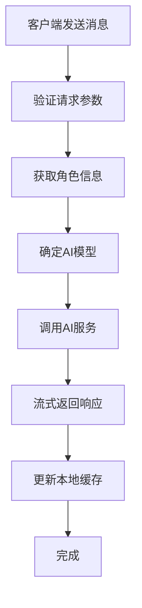
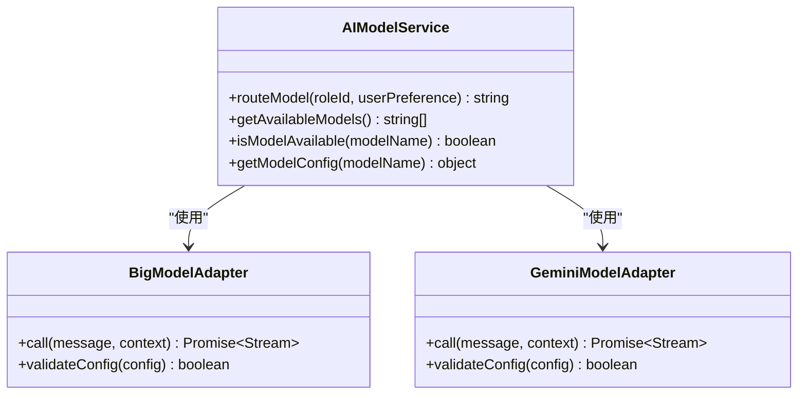
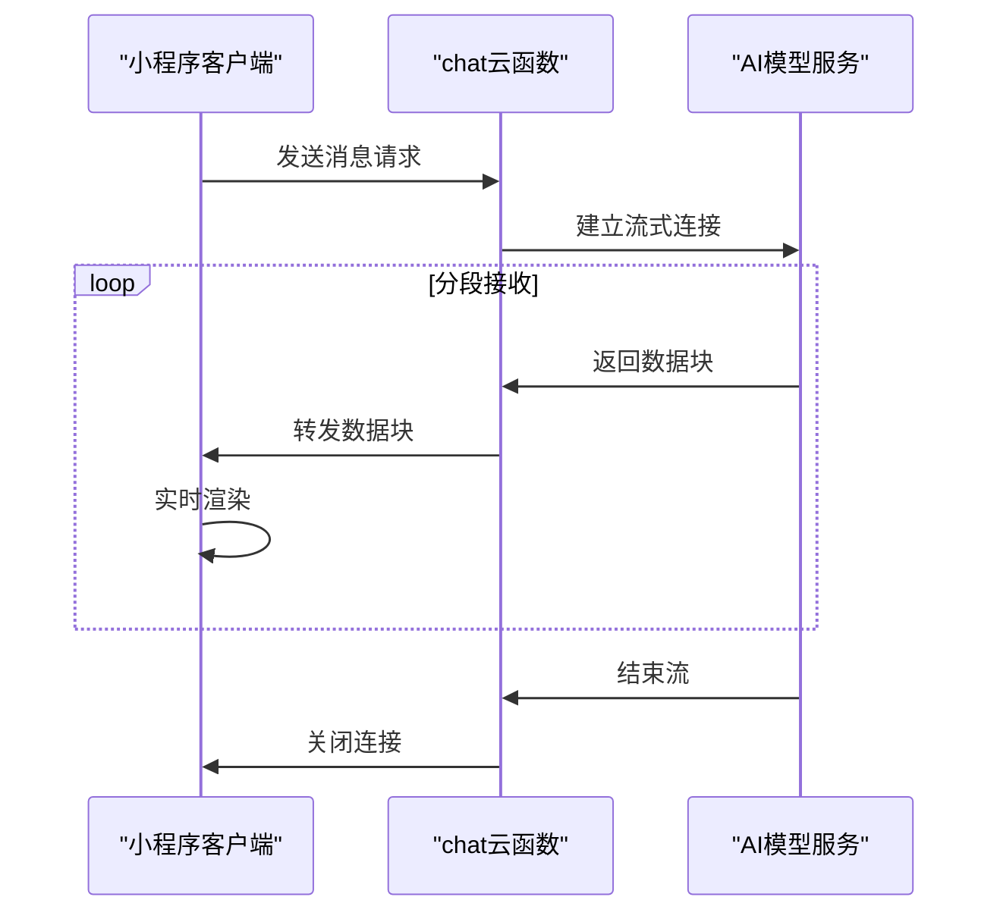
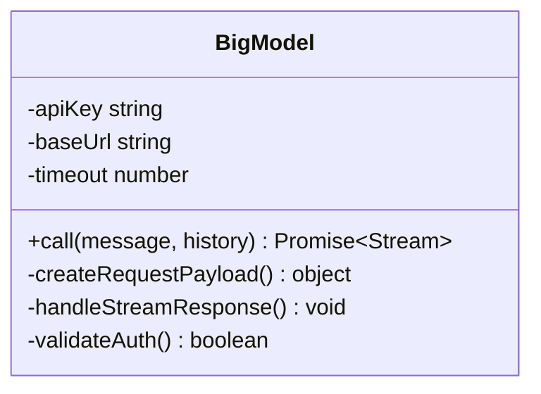
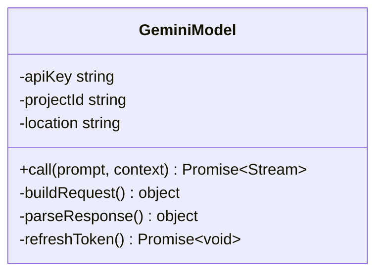
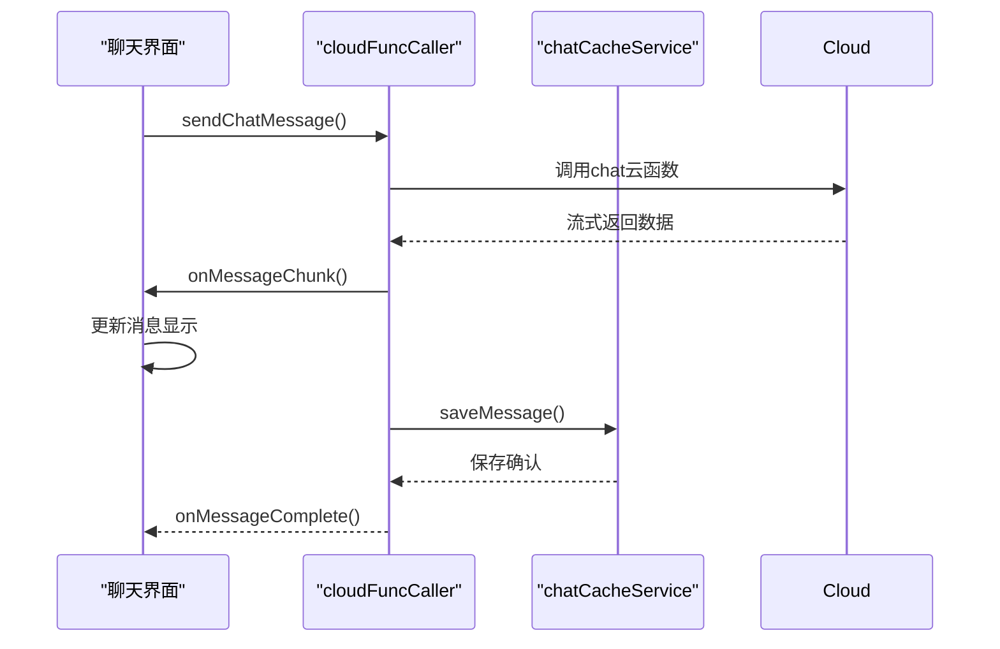
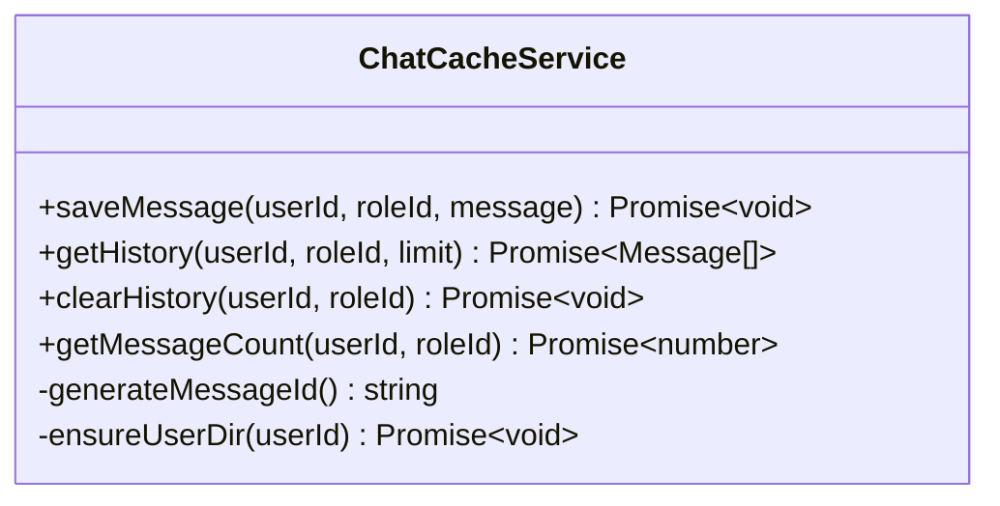

# 聊天功能API

<cite>
**本文档引用文件**  
- [index.js](file://cloudfunctions/chat/index.js)
- [aiModelService.js](file://cloudfunctions/chat/aiModelService.js)
- [bigmodel.js](file://cloudfunctions/chat/bigmodel.js)
- [geminiModel.js](file://cloudfunctions/chat/geminiModel.js)
- [chat.js](file://miniprogram/packageChat/pages/chat/chat.js)
- [chatCacheService.js](file://miniprogram/services/chatCacheService.js)
</cite>

## 目录
1. [简介](#简介)
2. [请求处理流程](#请求处理流程)
3. [输入参数结构](#输入参数结构)
4. [多模型路由机制](#多模型路由机制)
5. [流式响应与分段输出](#流式响应与分段输出)
6. [AI服务封装与认证](#ai服务封装与认证)
7. [客户端调用逻辑](#客户端调用逻辑)
8. [本地缓存与历史消息](#本地缓存与历史消息)
9. [性能优化建议](#性能优化建议)
10. [调试方法](#调试方法)

## 简介
本文档详细说明`chat`云函数的完整API设计与实现机制，涵盖从客户端请求到AI模型响应的全流程。重点解析多模型路由、流式输出、本地缓存等核心功能，为开发者提供完整的集成与调试指导。

## 请求处理流程
`chat`云函数接收来自小程序的消息请求，经过参数验证、角色信息获取、模型路由决策后，调用相应AI服务并以流式方式返回响应。整个流程支持断点续传和错误恢复。



**图示来源**  
- [index.js](file://cloudfunctions/chat/index.js#L1-L50)

**本节来源**  
- [index.js](file://cloudfunctions/chat/index.js#L1-L100)

## 输入参数结构
`chat`接口接收JSON格式请求体，主要包含以下字段：

| 参数名 | 类型 | 必填 | 说明 |
|--------|------|------|------|
| message | string | 是 | 用户输入的文本消息 |
| roleId | string | 是 | 当前对话角色ID |
| userId | string | 是 | 用户唯一标识 |
| sessionId | string | 否 | 会话标识，用于上下文关联 |
| modelPreference | string | 否 | 模型偏好（bigmodel/gemini） |

**本节来源**  
- [index.js](file://cloudfunctions/chat/index.js#L25-L60)

## 多模型路由机制
通过`aiModelService.js`实现智能模型路由，根据角色配置、用户偏好和模型可用性动态选择AI服务。



**图示来源**  
- [aiModelService.js](file://cloudfunctions/chat/aiModelService.js#L10-L40)

**本节来源**  
- [aiModelService.js](file://cloudfunctions/chat/aiModelService.js#L1-L80)

## 流式响应与分段输出
`chat`函数支持SSE（Server-Sent Events）流式传输，将大模型响应分段返回，提升用户体验。



**图示来源**  
- [index.js](file://cloudfunctions/chat/index.js#L60-L90)
- [bigmodel.js](file://cloudfunctions/chat/bigmodel.js#L30-L50)

**本节来源**  
- [index.js](file://cloudfunctions/chat/index.js#L50-L100)

## AI服务封装与认证
`bigmodel.js`和`geminiModel.js`分别封装不同AI服务的调用细节，包括认证、请求构造和错误处理。

### 智谱AI服务封装


**图示来源**  
- [bigmodel.js](file://cloudfunctions/chat/bigmodel.js#L1-L30)

### Gemini服务封装


**图示来源**  
- [geminiModel.js](file://cloudfunctions/chat/geminiModel.js#L1-L30)

**本节来源**  
- [bigmodel.js](file://cloudfunctions/chat/bigmodel.js#L1-L100)
- [geminiModel.js](file://cloudfunctions/chat/geminiModel.js#L1-L100)

## 客户端调用逻辑
`miniprogram/packageChat/pages/chat.js`实现完整的消息发送与接收流程。



**图示来源**  
- [chat.js](file://miniprogram/packageChat/pages/chat/chat.js#L100-L200)

**本节来源**  
- [chat.js](file://miniprogram/packageChat/pages/chat/chat.js#L50-L300)

## 本地缓存与历史消息
`chatCacheService.js`管理聊天记录的本地存储与检索，支持离线访问和快速加载。



**图示来源**  
- [chatCacheService.js](file://miniprogram/services/chatCacheService.js#L5-L25)

**本节来源**  
- [chatCacheService.js](file://miniprogram/services/chatCacheService.js#L1-L100)

## 性能优化建议

### 请求节流
在客户端实现消息发送节流，防止频繁请求：
- 设置最小发送间隔（如500ms）
- 启用防抖机制
- 限制并发请求数量

### 超时处理
配置合理的超时策略：
- 连接超时：10秒
- 响应超时：30秒
- 流式传输空闲超时：60秒

**本节来源**  
- [index.js](file://cloudfunctions/chat/index.js#L80-L100)
- [chat.js](file://miniprogram/packageChat/pages/chat/chat.js#L150-L180)

## 调试方法

### 模拟消息流
使用测试工具模拟流式响应，验证客户端处理逻辑：
```javascript
// 测试代码示例
const mockStream = createMockStream(["分段1", "分段2", "分段3"]);
handleStreamResponse(mockStream);
```

### 查看原始数据
启用调试模式查看AI模型返回的原始数据：
- 在`aiModelService.js`中添加日志输出
- 使用`console.log`打印请求/响应体
- 通过云函数日志查看完整交互过程

**本节来源**  
- [index.js](file://cloudfunctions/chat/index.js#L90-L100)
- [aiModelService.js](file://cloudfunctions/chat/aiModelService.js#L70-L80)