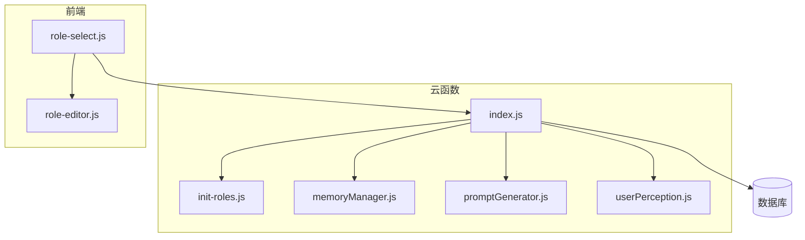
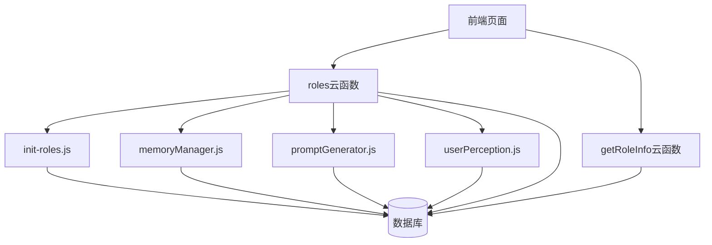
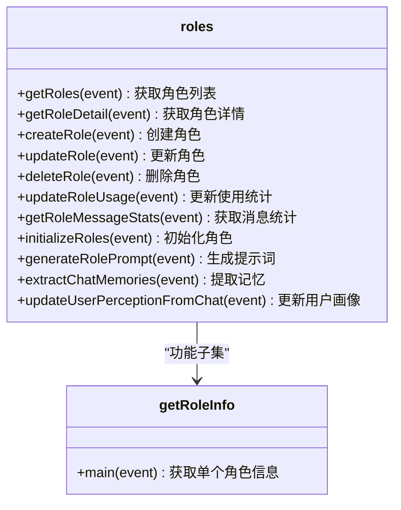
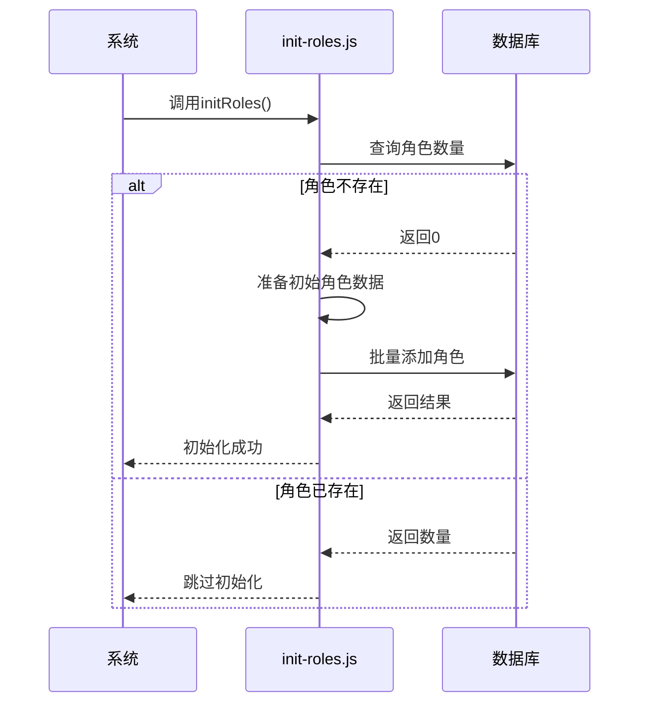
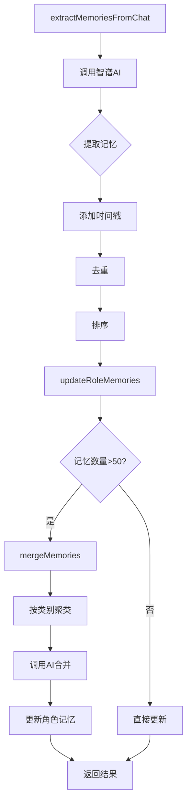
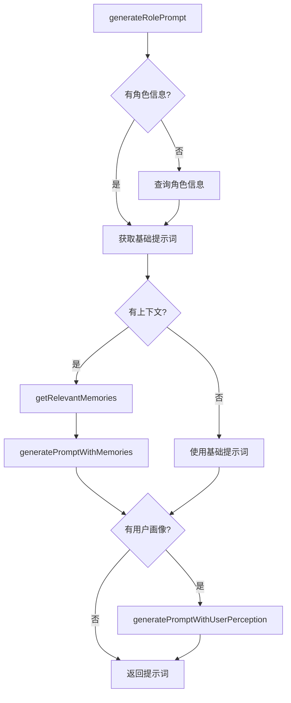
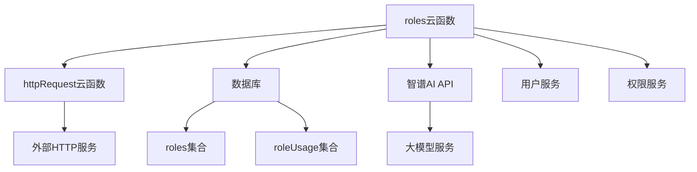
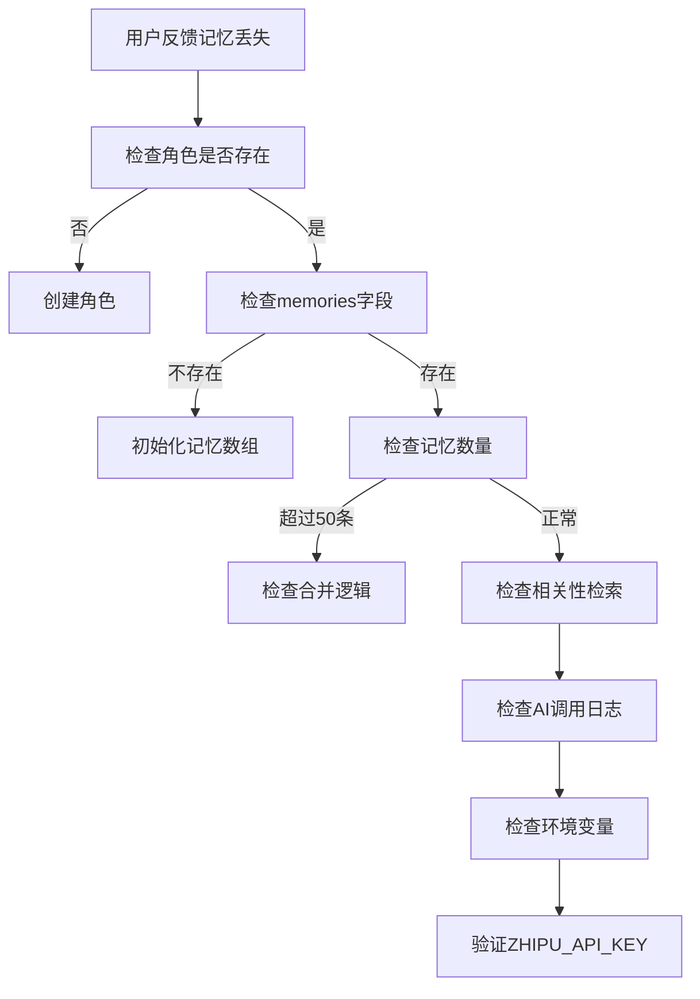

# 角色系统API

<cite>
**本文档引用文件**  
- [index.js](file://cloudfunctions/roles/index.js)
- [getRoleInfo/index.js](file://cloudfunctions/getRoleInfo/index.js)
- [init-roles.js](file://cloudfunctions/roles/init-roles.js)
- [memoryManager.js](file://cloudfunctions/roles/memoryManager.js)
- [promptGenerator.js](file://cloudfunctions/roles/promptGenerator.js)
- [roles.md](file://doc/开发文档/cloudfunctions/roles.md)
- [roleUsage.md](file://doc/开发文档/database/roleUsage.md)
- [role-select.js](file://miniprogram/pages/role-select/role-select.js)
</cite>

## 目录
1. [简介](#简介)
2. [项目结构](#项目结构)
3. [核心组件](#核心组件)
4. [架构概述](#架构概述)
5. [详细组件分析](#详细组件分析)
6. [依赖分析](#依赖分析)
7. [性能考虑](#性能考虑)
8. [故障排除指南](#故障排除指南)
9. [结论](#结论)

## 简介
本文档详细说明了角色系统API的设计与实现，涵盖角色获取、初始化、记忆管理、提示词生成等核心功能。重点解析`roles`和`getRoleInfo`两个云函数的功能差异，以及`init-roles.js`、`memoryManager.js`和`promptGenerator.js`等关键模块的工作机制。文档还提供了前端调用示例和常见问题的排查路径。

## 项目结构
角色系统主要由云函数和前端页面组成，云函数位于`cloudfunctions/roles`目录下，前端页面位于`miniprogram/pages/role-select`目录下。

**Diagram sources**
- [index.js](file://cloudfunctions/roles/index.js)
- [role-select.js](file://miniprogram/pages/role-select/role-select.js)

**Section sources**
- [index.js](file://cloudfunctions/roles/index.js)
- [role-select.js](file://miniprogram/pages/role-select/role-select.js)

## 核心组件
角色系统API的核心组件包括角色管理、记忆管理、提示词生成和用户画像分析。这些组件协同工作，为用户提供个性化的角色交互体验。

**Section sources**
- [index.js](file://cloudfunctions/roles/index.js)
- [memoryManager.js](file://cloudfunctions/roles/memoryManager.js)
- [promptGenerator.js](file://cloudfunctions/roles/promptGenerator.js)

## 架构概述
角色系统采用模块化设计，各组件职责分明，通过云函数提供统一的API接口。

**Diagram sources**
- [index.js](file://cloudfunctions/roles/index.js)
- [getRoleInfo/index.js](file://cloudfunctions/getRoleInfo/index.js)

## 详细组件分析

### roles与getRoleInfo云函数分析
`roles`和`getRoleInfo`是两个核心云函数，分别提供批量查询和单个查询功能。

#### 功能差异

**Diagram sources**
- [index.js](file://cloudfunctions/roles/index.js)
- [getRoleInfo/index.js](file://cloudfunctions/getRoleInfo/index.js)

**Section sources**
- [index.js](file://cloudfunctions/roles/index.js)
- [getRoleInfo/index.js](file://cloudfunctions/getRoleInfo/index.js)

### init-roles.js分析
`init-roles.js`负责系统初始化时的角色数据创建。

**Diagram sources**
- [init-roles.js](file://cloudfunctions/roles/init-roles.js)

**Section sources**
- [init-roles.js](file://cloudfunctions/roles/init-roles.js)

### memoryManager.js分析
`memoryManager.js`实现对话记忆的持久化管理。

**Diagram sources**
- [memoryManager.js](file://cloudfunctions/roles/memoryManager.js)

**Section sources**
- [memoryManager.js](file://cloudfunctions/roles/memoryManager.js)

### promptGenerator.js分析
`promptGenerator.js`负责角色个性提示词的动态生成。

**Diagram sources**
- [promptGenerator.js](file://cloudfunctions/roles/promptGenerator.js)

**Section sources**
- [promptGenerator.js](file://cloudfunctions/roles/promptGenerator.js)

## 依赖分析
角色系统依赖多个外部服务和内部模块。

**Diagram sources**
- [index.js](file://cloudfunctions/roles/index.js)
- [memoryManager.js](file://cloudfunctions/roles/memoryManager.js)
- [promptGenerator.js](file://cloudfunctions/roles/promptGenerator.js)

**Section sources**
- [index.js](file://cloudfunctions/roles/index.js)
- [memoryManager.js](file://cloudfunctions/roles/memoryManager.js)
- [promptGenerator.js](file://cloudfunctions/roles/promptGenerator.js)

## 性能考虑
角色系统在设计时考虑了多项性能优化措施。

- **批量操作**：`init-roles.js`使用Promise.all进行批量角色创建
- **缓存机制**：`memoryManager.js`中的`cacheRetrievalResult`函数提供检索结果缓存
- **索引优化**：数据库为常用查询字段创建了复合索引
- **模型选择**：优先使用`glm-4-flash`等快速模型处理实时请求

## 故障排除指南
本节提供常见问题的排查路径。

### 记忆丢失问题
当用户反馈角色记忆丢失时，可按以下步骤排查：

**Section sources**
- [memoryManager.js](file://cloudfunctions/roles/memoryManager.js)
- [index.js](file://cloudfunctions/roles/index.js)

## 结论
角色系统API通过模块化设计实现了角色管理、记忆持久化和个性化提示词生成等核心功能。`roles`云函数提供全面的角色管理能力，而`getRoleInfo`云函数则专注于单个角色的快速查询。系统通过`init-roles.js`实现初始化，`memoryManager.js`管理对话记忆，`promptGenerator.js`生成个性化提示词，共同为用户提供丰富的角色交互体验。