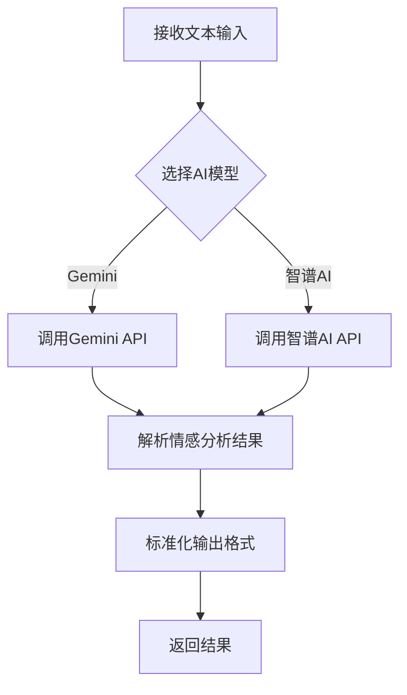
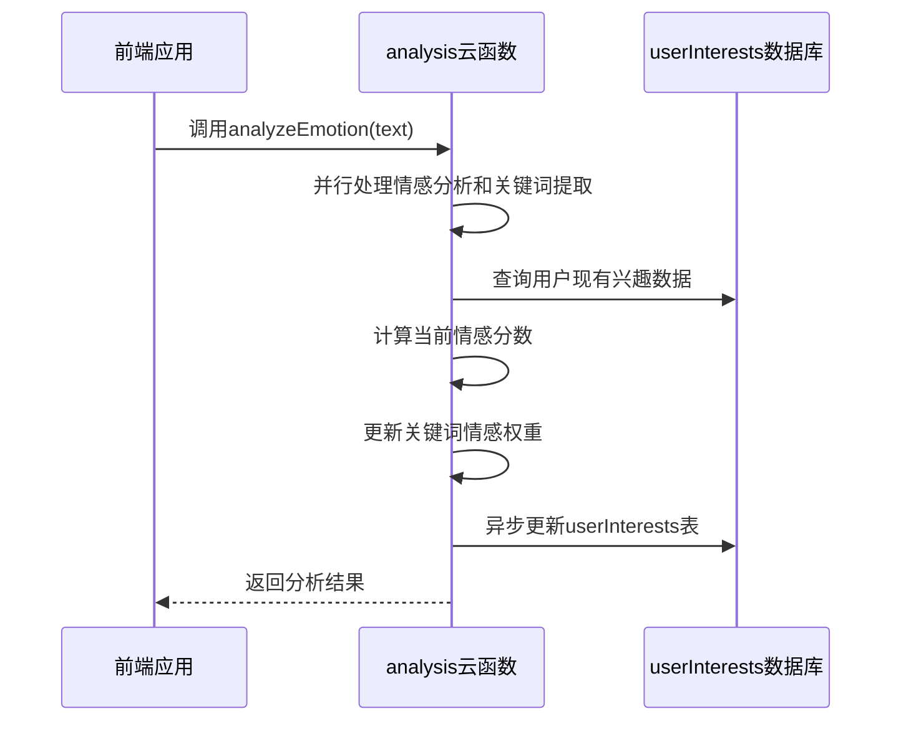

# 情感分析API

<cite>
**本文档引用文件**  
- [index.js](file://cloudfunctions/analysis/index.js)
- [aiModelService.js](file://cloudfunctions/analysis/aiModelService.js)
- [aiModelService_part2.js](file://cloudfunctions/analysis/aiModelService_part2.js)
- [keywordEmotionLinker.js](file://cloudfunctions/analysis/keywordEmotionLinker.js)
- [emotionService.js](file://miniprogram/services/emotionService.js)
</cite>

## 目录
1. [简介](#简介)
2. [请求参数说明](#请求参数说明)
3. [响应格式](#响应格式)
4. [调用限制与安全](#调用限制与安全)
5. [内部处理机制](#内部处理机制)
6. [前端调用示例](#前端调用示例)
7. [错误处理](#错误处理)

## 简介

情感分析云函数是HeartChat小程序的核心AI功能之一，通过调用`cloud.callFunction('analysis', { text: '用户输入文本' })`接口，接收用户输入的文本内容并返回详细的情绪分析结果。该接口能够识别用户表达的主要情绪、情绪强度、关键词及分类结果，为个性化心理支持提供数据基础。

该云函数支持多模型融合分析，可灵活切换智谱AI、Google Gemini等不同AI平台，确保分析结果的准确性和稳定性。分析结果可用于情绪卡片渲染、用户兴趣分析、角色推荐等多个场景。

**Section sources**
- [index.js](file://cloudfunctions/analysis/index.js#L1-L1117)

## 请求参数说明

情感分析接口通过`cloud.callFunction`调用，接收一个包含分析参数的对象。以下是详细的参数说明：

| 参数名 | 类型 | 必填 | 说明 |
|-------|------|------|------|
| text | string | 是 | 待分析的用户输入文本 |
| userId | string | 否 | 用户ID，用于个性化分析和数据关联 |
| history | Array | 否 | 对话历史记录，用于上下文感知分析 |
| saveRecord | boolean | 否 | 是否将分析结果保存到数据库 |
| roleId | string | 否 | 当前对话角色ID，用于角色关联分析 |
| chatId | string | 否 | 当前对话会话ID |
| extractKeywords | boolean | 否 | 是否提取关键词，默认为true |
| linkKeywords | boolean | 否 | 是否关联关键词与情感，默认为true |
| modelType | string | 否 | 使用的AI模型类型，可选值：gemini（默认）、zhipu |

**示例请求：**
```javascript
cloud.callFunction({
  name: 'analysis',
  data: {
    text: '今天工作很累，但完成了重要项目，感觉很有成就感',
    userId: 'user_123',
    history: [
      { role: 'user', content: '最近压力很大' },
      { role: 'assistant', content: '能具体说说是什么让你感到压力吗？' }
    ],
    saveRecord: true,
    roleId: 'counselor_001'
  }
})
```

**Section sources**
- [index.js](file://cloudfunctions/analysis/index.js#L150-L158)

## 响应格式

情感分析接口返回标准化的JSON对象，包含分析结果、关键词、记录ID等信息。

```json
{
  "success": true,
  "result": {
    "type": "喜悦",
    "intensity": 0.8,
    "keywords": ["项目", "完成", "成就感"],
    "suggestions": ["继续保持这种积极的状态", "可以庆祝一下这个成就"],
    "report": "您当前处于喜悦的情绪状态，主要源于完成了重要项目带来的成就感。",
    "originalText": "今天工作很累，但完成了重要项目，感觉很有成就感",
    "primary_emotion": "喜悦",
    "secondary_emotions": ["满足", "期待"],
    "valence": 0.7,
    "arousal": 0.6,
    "trend": "上升",
    "attention_level": "高",
    "radar_dimensions": {
      "trust": 0.8,
      "openness": 0.7,
      "resistance": 0.3,
      "stress": 0.4,
      "control": 0.6
    },
    "topic_keywords": ["项目", "完成", "重要"],
    "emotion_triggers": ["完成项目"]
  },
  "recordId": "record_456",
  "keywords": [
    { "word": "项目", "weight": 0.9 },
    { "word": "完成", "weight": 0.85 },
    { "word": "成就感", "weight": 0.8 }
  ]
}
```

**字段说明：**

| 字段 | 类型 | 说明 |
|------|------|------|
| success | boolean | 调用是否成功 |
| result | object | 情感分析结果对象 |
| result.type | string | 主要情绪类型（中文） |
| result.intensity | number | 情绪强度（0-1） |
| result.keywords | array | 关键词列表 |
| result.suggestions | array | 情感建议列表 |
| result.report | string | 情感分析报告摘要 |
| result.primary_emotion | string | 主要情绪（与type字段一致） |
| result.secondary_emotions | array | 次要情绪列表 |
| result.valence | number | 情绪效价（-1到1，正值表示积极） |
| result.arousal | number | 情绪唤醒度（0-1） |
| result.trend | string | 情绪变化趋势 |
| result.attention_level | string | 注意力水平 |
| result.radar_dimensions | object | 情绪多维度评分 |
| result.topic_keywords | array | 话题关键词 |
| result.emotion_triggers | array | 情绪触发词 |
| recordId | string | 数据库记录ID（如果saveRecord为true） |
| keywords | array | 提取的关键词及权重 |

**Section sources**
- [index.js](file://cloudfunctions/analysis/index.js#L240-L248)

## 调用限制与安全

情感分析接口有以下安全和调用限制：

1. **用户登录态要求**：调用此接口必须携带有效的用户登录态（openid），系统通过`cloud.getWXContext()`获取用户身份信息。未登录用户无法调用此接口。

2. **调用频率限制**：为防止滥用，接口限制为每分钟最多调用10次。超过限制将返回频率超限错误。

3. **参数验证**：接口会对输入参数进行严格验证，包括：
   - `text`参数不能为空或非字符串类型
   - `userId`必须为有效字符串
   - `history`必须为数组类型

4. **数据隐私保护**：用户对话内容仅用于本次情感分析，分析完成后不会长期存储原始文本，仅保存分析结果和关键词。

5. **错误处理**：当出现错误时，接口返回包含错误信息的标准化错误对象：
```json
{
  "success": false,
  "error": "错误描述信息"
}
```

**Section sources**
- [index.js](file://cloudfunctions/analysis/index.js#L160-L165)

## 内部处理机制

情感分析云函数采用模块化设计，通过多个服务组件协同工作完成分析任务。

### 多模型融合分析机制

云函数通过`aiModelService`模块实现多模型融合分析，支持Gemini、智谱AI等多个AI平台。系统根据`modelType`参数选择相应的AI模型进行分析。



**Diagram sources**
- [aiModelService.js](file://cloudfunctions/analysis/aiModelService.js#L1-L663)
- [index.js](file://cloudfunctions/analysis/index.js#L260-L265)

### 关键词情感关联逻辑

系统通过`keywordEmotionLinker`模块实现关键词与情感的动态关联，建立用户个性化的情感记忆。



**Diagram sources**
- [keywordEmotionLinker.js](file://cloudfunctions/analysis/keywordEmotionLinker.js#L1-L207)
- [index.js](file://cloudfunctions/analysis/index.js#L280-L295)

**Section sources**
- [aiModelService.js](file://cloudfunctions/analysis/aiModelService.js#L1-L663)
- [keywordEmotionLinker.js](file://cloudfunctions/analysis/keywordEmotionLinker.js#L1-L207)

## 前端调用示例

以下是在小程序前端调用情感分析接口的完整示例：

```javascript
// 引入情感分析服务
import { analyzeEmotion } from '../../services/emotionService';

// 情感分析处理函数
async function handleEmotionAnalysis() {
  try {
    // 显示加载状态
    wx.showLoading({
      title: '情绪分析中...',
      mask: true
    });

    // 调用情感分析云函数
    const result = await analyzeEmotion(
      '今天工作很累，但完成了重要项目，感觉很有成就感',
      {
        saveRecord: true,
        roleId: 'counselor_001',
        extractKeywords: true
      }
    );

    // 隐藏加载状态
    wx.hideLoading();

    if (result.success) {
      // 处理成功的结果
      console.log('情感分析结果:', result.data);
      
      // 在页面上渲染情绪卡片
      this.setData({
        emotionData: {
          primary: {
            type: result.data.primary_emotion,
            score: result.data.intensity
          },
          details: result.data.secondary_emotions.map(type => ({
            type,
            score: result.data.intensity * 0.8
          })),
          suggestions: result.data.suggestions
        },
        showEmotionCard: true
      });
    } else {
      // 处理失败情况
      wx.showToast({
        title: `分析失败: ${result.error}`,
        icon: 'none',
        duration: 3000
      });
    }
  } catch (error) {
    wx.hideLoading();
    wx.showToast({
      title: '网络错误，请稍后重试',
      icon: 'none'
    });
    console.error('情感分析调用异常:', error);
  }
}
```

**情绪卡片组件使用：**

```html
<!-- emotion-analysis.wxml -->
<emotion-card 
  emotion="{{emotionData}}" 
  show-details="{{true}}" 
  bind:viewDetails="onViewDetails"
  bind:startPractice="onStartPractice"
/>
```

```javascript
// emotion-analysis.js
Component({
  methods: {
    onViewDetails() {
      wx.navigateTo({
        url: '/pages/emotion-detail/emotion-detail'
      });
    },
    
    onStartPractice() {
      wx.navigateTo({
        url: '/pages/emotion-practice/emotion-practice'
      });
    }
  }
});
```

**Section sources**
- [emotionService.js](file://miniprogram/services/emotionService.js#L1-L1214)
- [index.ts](file://miniprogram/components/emotion-card/index.ts#L1-L80)

## 错误处理

情感分析接口可能返回以下错误类型，前端应进行相应的处理：

### 常见错误类型

| 错误代码 | 错误信息 | 原因 | 处理建议 |
|---------|--------|------|--------|
| 1 | 无效的文本参数 | text参数为空或非字符串 | 提示用户输入有效内容 |
| 2 | 情感分析服务返回错误 | AI模型服务调用失败 | 提示"分析服务暂时不可用，请稍后重试" |
| 3 | 情感分析服务调用失败 | 网络或系统错误 | 记录错误日志，提示用户重试 |
| 4 | 保存情感记录失败 | 数据库操作失败 | 继续流程，不影响主功能 |
| 5 | 关联关键词和情感失败 | 关键词关联操作失败 | 继续流程，不影响主功能 |

### 错误处理最佳实践

```javascript
// 错误处理封装
function handleEmotionError(error, showTips = true) {
  const errorMessages = {
    '无效的文本参数': '请输入要分析的内容',
    '情感分析服务返回错误': '分析服务暂时不可用',
    '情感分析服务调用失败': '网络连接异常',
    default: '情绪分析失败，请稍后重试'
  };
  
  const message = errorMessages[error] || errorMessages.default;
  
  if (showTips) {
    wx.showToast({
      title: message,
      icon: 'none',
      duration: 2000
    });
  }
  
  // 记录错误日志
  console.error('情感分析错误:', error);
}

// 使用示例
try {
  const result = await analyzeEmotion(text);
  if (!result.success) {
    handleEmotionError(result.error);
  }
} catch (error) {
  handleEmotionError('网络错误');
}
```

**Section sources**
- [index.js](file://cloudfunctions/analysis/index.js#L240-L248)
- [emotionService.js](file://miniprogram/services/emotionService.js#L1-L1214)