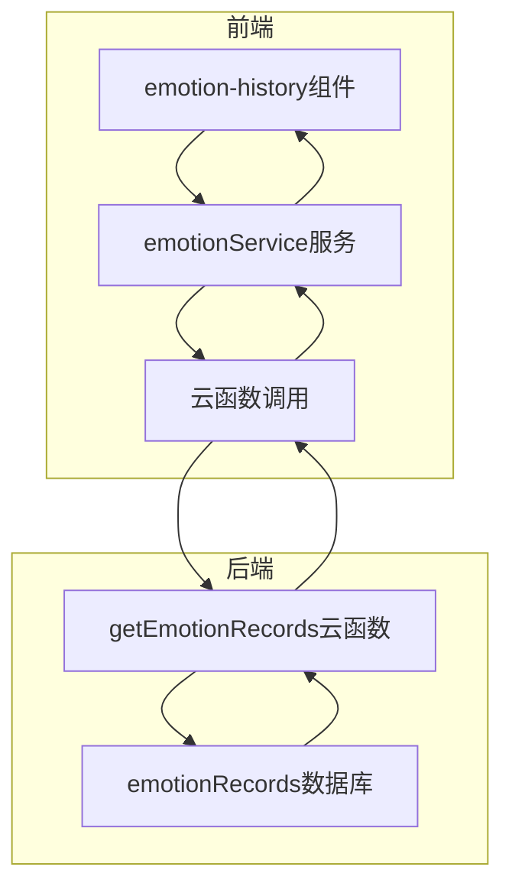
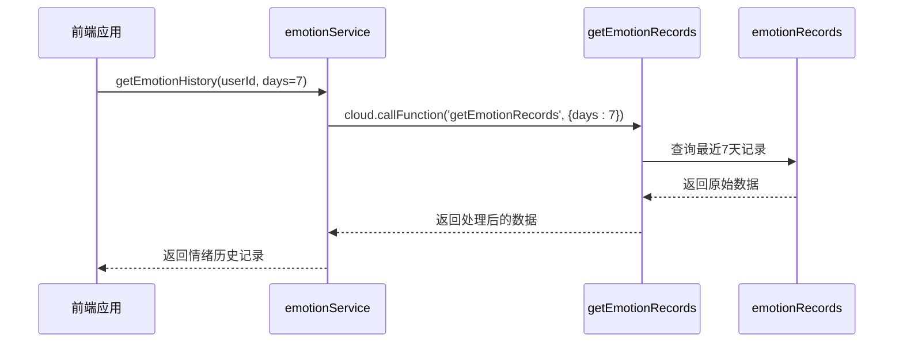
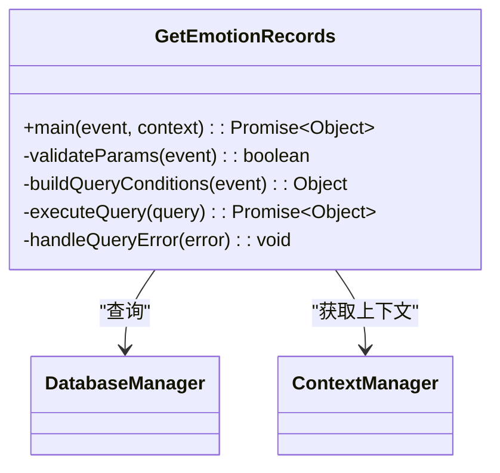
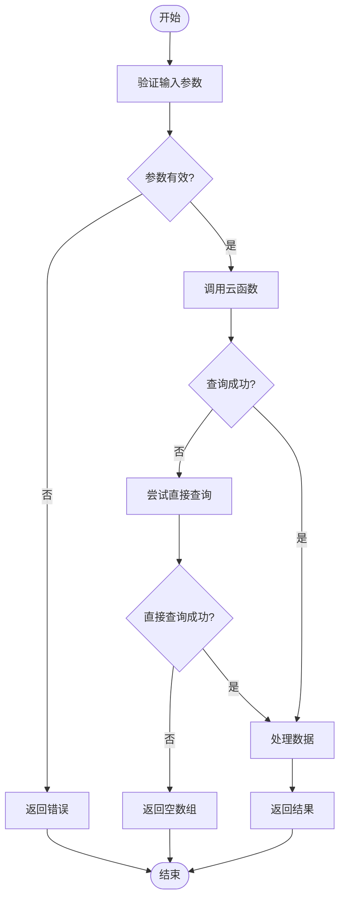
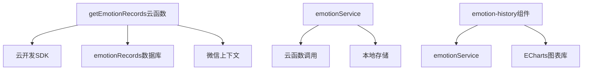

# 情绪记录查询API

<cite>
**本文档引用文件**  
- [getEmotionRecords/index.js](file://cloudfunctions/getEmotionRecords/index.js)
- [emotionRecords.md](file://doc/开发文档/database/emotionRecords.md)
- [getEmotionRecords.md](file://doc/开发文档/cloudfunctions/getEmotionRecords.md)
- [emotionService.js](file://miniprogram/services/emotionService.js)
- [emotion-history.js](file://miniprogram/components/emotion-history/emotion-history.js)
</cite>

## 目录
1. [简介](#简介)
2. [项目结构](#项目结构)
3. [核心组件](#核心组件)
4. [架构概述](#架构概述)
5. [详细组件分析](#详细组件分析)
6. [依赖分析](#依赖分析)
7. [性能考虑](#性能考虑)
8. [故障排除指南](#故障排除指南)
9. [结论](#结论)

## 简介
情绪记录查询API是HeartChat小程序中的核心功能之一，用于获取用户的情绪历史数据。该接口通过调用`cloud.callFunction('getEmotionRecords', { days: 7 })`可获取最近7天的情绪数据，支持灵活的参数配置和丰富的数据返回格式。本API自动关联当前用户的openid，无需显式传入userId，简化了调用流程。返回的数据包含日期时间戳、主情绪标签、情绪综合指数、关键词摘要等关键信息，为情绪分析和可视化提供了坚实的数据基础。

## 项目结构
情绪记录查询功能主要分布在云函数和小程序前端两个部分。云函数`getEmotionRecords`负责数据查询和处理，位于`cloudfunctions/getEmotionRecords`目录下。前端服务层`emotionService.js`封装了API调用逻辑，位于`miniprogram/services`目录下。情绪历史组件`emotion-history`实现了数据展示功能，位于`miniprogram/components/emotion-history`目录下。数据库集合`emotionRecords`存储了所有情绪记录，其结构在`doc/开发文档/database`中有详细定义。

**图表来源**  
- [getEmotionRecords/index.js](file://cloudfunctions/getEmotionRecords/index.js)
- [emotionService.js](file://miniprogram/services/emotionService.js)
- [emotion-history.js](file://miniprogram/components/emotion-history/emotion-history.js)

**本节来源**  
- [getEmotionRecords/index.js](file://cloudfunctions/getEmotionRecords/index.js)
- [emotionService.js](file://miniprogram/services/emotionService.js)
- [emotion-history.js](file://miniprogram/components/emotion-history/emotion-history.js)

## 核心组件
情绪记录查询API的核心组件包括云函数`getEmotionRecords`、前端服务`emotionService`和展示组件`emotion-history`。云函数`getEmotionRecords`实现了从`emotionRecords`集合查询并聚合数据的逻辑，支持字符串查询和对象查询两种方式，优先尝试字符串查询，失败时自动降级到对象查询以提高兼容性。前端服务`emotionService`封装了API调用逻辑，提供了`getEmotionHistory`方法，简化了调用流程。展示组件`emotion-history`实现了情绪历史数据的可视化展示，支持暗黑模式。

**本节来源**  
- [getEmotionRecords/index.js](file://cloudfunctions/getEmotionRecords/index.js)
- [emotionService.js](file://miniprogram/services/emotionService.js)
- [emotion-history.js](file://miniprogram/components/emotion-history/emotion-history.js)

## 架构概述
情绪记录查询API采用前后端分离的架构设计。前端通过`emotionService`服务调用云函数`getEmotionRecords`，云函数从`emotionRecords`数据库集合查询数据并返回。API支持`days`（查询天数，默认7天）和`format`（返回格式，支持'daily'或'hourly'）参数，可根据需求灵活配置。返回的数据包含日期时间戳、主情绪标签、情绪综合指数、关键词摘要等字段，为后续的数据分析和可视化提供了丰富的信息。

**图表来源**  
- [getEmotionRecords/index.js](file://cloudfunctions/getEmotionRecords/index.js)
- [emotionService.js](file://miniprogram/services/emotionService.js)

## 详细组件分析

### 云函数分析
云函数`getEmotionRecords`是情绪记录查询的核心，负责从数据库查询和返回情绪记录。该函数实现了优先使用字符串查询，失败时降级到对象查询的机制，提高了查询的兼容性和成功率。函数自动关联当前用户的openid，无需显式传入userId，简化了调用流程。查询结果按创建时间降序排序，并限制返回记录数量，避免返回过多数据影响性能。

**图表来源**  
- [getEmotionRecords/index.js](file://cloudfunctions/getEmotionRecords/index.js)

### 前端服务分析
前端服务`emotionService`封装了情绪记录查询的调用逻辑，提供了`getEmotionHistory`方法。该方法简化了云函数调用流程，处理了参数验证和错误处理。服务还实现了数据预处理功能，确保返回的数据格式一致，便于前端展示。服务支持暗黑模式，可根据系统设置自动切换主题。

**图表来源**  
- [emotionService.js](file://miniprogram/services/emotionService.js)

**本节来源**  
- [getEmotionRecords/index.js](file://cloudfunctions/getEmotionRecords/index.js)
- [emotionService.js](file://miniprogram/services/emotionService.js)

## 依赖分析
情绪记录查询API依赖于多个核心组件和外部服务。主要依赖包括云开发环境、数据库`emotionRecords`集合、微信上下文服务和前端展示组件。云函数依赖于云开发SDK进行数据库操作和上下文获取。前端服务依赖于云函数调用接口和本地存储服务。展示组件依赖于前端服务和ECharts图表库。这些依赖关系确保了API的稳定性和可扩展性。

**图表来源**  
- [getEmotionRecords/index.js](file://cloudfunctions/getEmotionRecords/index.js)
- [emotionService.js](file://miniprogram/services/emotionService.js)
- [emotion-history.js](file://miniprogram/components/emotion-history/emotion-history.js)

**本节来源**  
- [getEmotionRecords/index.js](file://cloudfunctions/getEmotionRecords/index.js)
- [emotionService.js](file://miniprogram/services/emotionService.js)
- [emotion-history.js](file://miniprogram/components/emotion-history/emotion-history.js)

## 性能考虑
情绪记录查询API在设计时充分考虑了性能优化。云函数实现了查询结果数量限制（默认20条），避免返回过多数据影响性能。查询按时间降序排序，优先返回最新记录，提高了数据的相关性。前端服务实现了本地缓存机制，减少了重复查询的开销。建议避免请求过长时间范围的数据，以减少数据库查询压力和网络传输开销。对于大数据量返回，建议实现分页策略，分批获取数据。

**本节来源**  
- [getEmotionRecords/index.js](file://cloudfunctions/getEmotionRecords/index.js)
- [emotionService.js](file://miniprogram/services/emotionService.js)

## 故障排除指南
在使用情绪记录查询API时，可能会遇到一些常见问题。如果返回"缺少必要参数: userId"错误，请检查是否正确传递了userId参数。如果查询结果为空，请确认数据库中是否存在相关记录。如果云函数调用失败，请检查云环境是否正确初始化，以及数据库读权限是否设置正确。对于大数据量查询性能问题，建议缩小查询时间范围或实现分页策略。返回的`createTime`是数据库服务器时间格式，前端展示时可能需要转换为本地时间格式。

**本节来源**  
- [getEmotionRecords/index.js](file://cloudfunctions/getEmotionRecords/index.js)
- [getEmotionRecords.md](file://doc/开发文档/cloudfunctions/getEmotionRecords.md)

## 结论
情绪记录查询API为HeartChat小程序提供了强大的情绪数据获取能力。通过`cloud.callFunction('getEmotionRecords', { days: 7 })`调用，可轻松获取最近7天的情绪数据。API支持灵活的参数配置和丰富的数据返回格式，为情绪分析和可视化提供了坚实的数据基础。结合ECharts图表库，可将返回数据转换为折线图或热力图，直观展示用户情绪变化趋势。该API的设计充分考虑了性能优化和错误处理，确保了稳定可靠的服务。