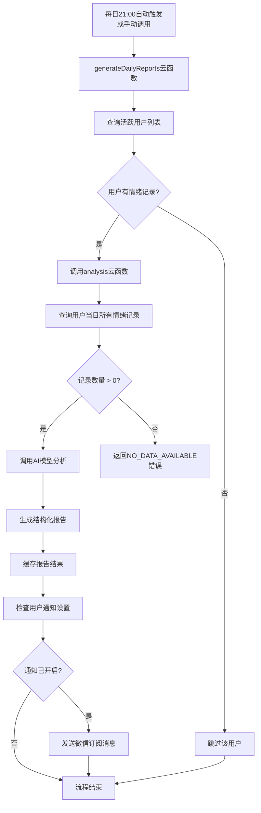
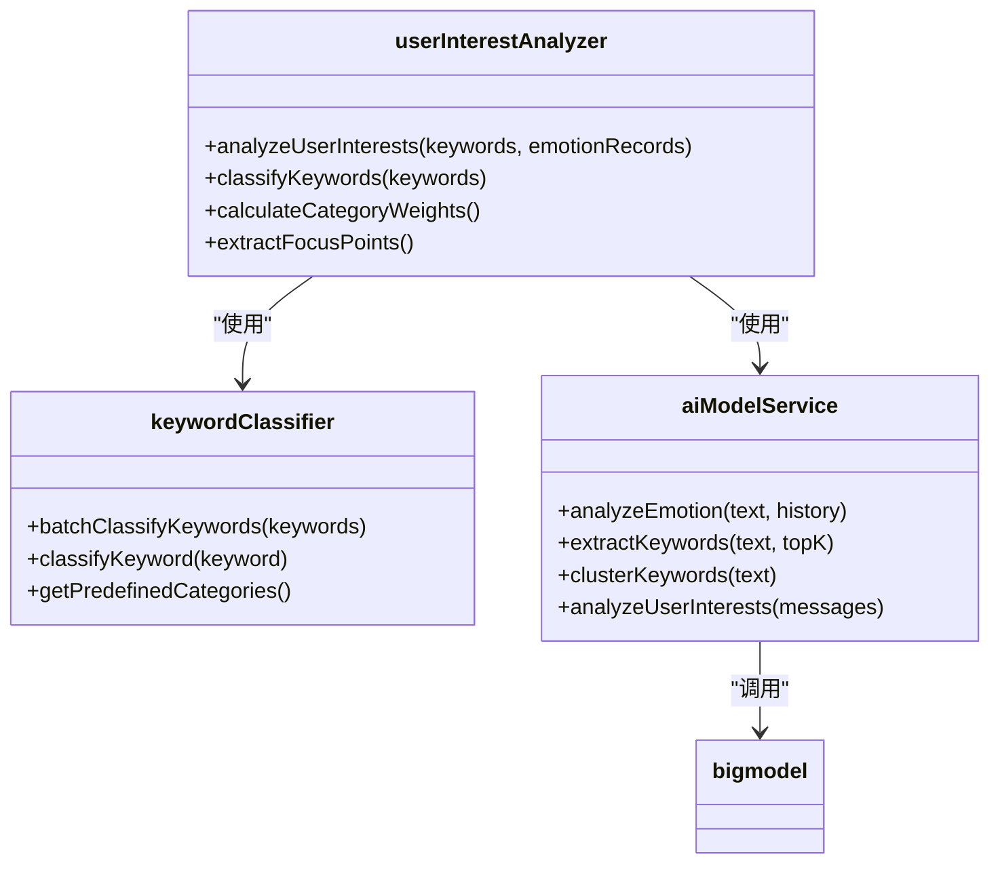
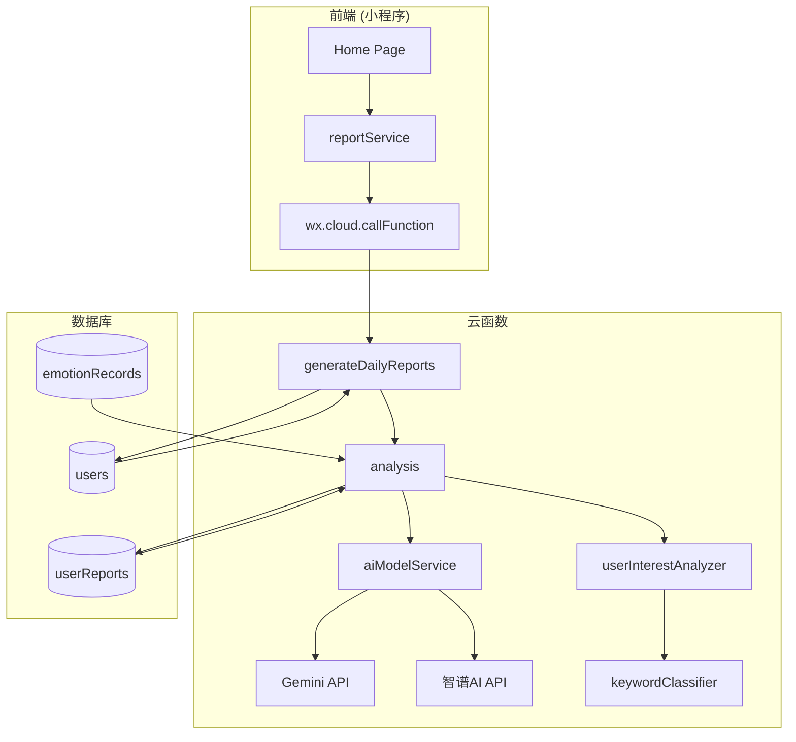

# 每日心情报告生成API

<cite>
**本文档引用文件**  
- [generateDailyReports/index.js](file://cloudfunctions/generateDailyReports/index.js)
- [analysis/index.js](file://cloudfunctions/analysis/index.js)
- [analysis/aiModelService.js](file://cloudfunctions/analysis/aiModelService.js)
- [analysis/userInterestAnalyzer.js](file://cloudfunctions/analysis/userInterestAnalyzer.js)
- [analysis/keywordClassifier.js](file://cloudfunctions/analysis/keywordClassifier.js)
- [analysis/bigmodel.js](file://cloudfunctions/analysis/bigmodel.js)
- [miniprogram/services/reportService.js](file://miniprogram/services/reportService.js)
- [miniprogram/pages/home/home.js](file://miniprogram/pages/home/home.js)
</cite>

## 目录
1. [接口概述](#接口概述)
2. [触发机制与执行时机](#触发机制与执行时机)
3. [报告生成流程详解](#报告生成流程详解)
4. [AI模型分析机制](#ai模型分析机制)
5. [个性化建议生成逻辑](#个性化建议生成逻辑)
6. [响应结构与字段说明](#响应结构与字段说明)
7. [结果缓存与幂等性处理](#结果缓存与幂等性处理)
8. [前端集成示例](#前端集成示例)
9. [错误状态码与应对策略](#错误状态码与应对策略)
10. [系统架构与依赖关系](#系统架构与依赖关系)

## 接口概述

`cloud.callFunction('generateDailyReports')` 是用于生成用户每日心情报告的核心云函数。该接口无需参数，系统会自动基于用户当日的情绪记录生成一份结构化的心理分析报告。

报告内容由AI模型深度分析生成，包含文字摘要、情绪趋势、心理建议和可视化数据等多维度信息，旨在帮助用户回顾和理解自身情绪变化，获得个性化的心理健康建议。

**Section sources**
- [generateDailyReports/index.js](file://cloudfunctions/generateDailyReports/index.js#L1-L201)
- [analysis/index.js](file://cloudfunctions/analysis/index.js#L1-L1117)

## 触发机制与执行时机

每日心情报告的生成支持两种触发方式：

1.  **定时自动触发**：系统在每日21:00自动执行`generateDailyReports`云函数，为所有当天有情绪记录的活跃用户批量生成报告。
2.  **手动调用触发**：用户或管理员可以通过前端调用 `cloud.callFunction('generateDailyReports')` 手动触发报告生成流程。

自动触发机制确保了报告的准时性，而手动触发则为用户提供了灵活性，例如在用户希望重新生成或查看报告时使用。

**Section sources**
- [generateDailyReports/index.js](file://cloudfunctions/generateDailyReports/index.js#L15-L201)

## 报告生成流程详解

报告生成是一个多步骤的自动化流程，其核心逻辑位于`analysis`云函数中。以下是详细的执行步骤：

1.  **识别活跃用户**：`generateDailyReports`函数首先查询数据库，找出前一天有情绪记录的活跃用户列表。
2.  **批量调用分析服务**：对于每个活跃用户，该函数会调用`analysis`云函数，并传入`type: 'daily_report'`的指令。
3.  **数据聚合与分析**：`analysis`云函数接收到请求后，会从`emotionRecords`集合中查询该用户指定日期内的所有情绪记录。
4.  **生成结构化报告**：如果存在有效数据，系统将执行AI分析并生成报告；若无数据，则返回错误。
5.  **结果缓存与通知**：成功生成报告后，结果会被缓存，避免重复计算。如果用户开启了通知，系统会通过微信订阅消息推送报告生成通知。



**Diagram sources**
- [generateDailyReports/index.js](file://cloudfunctions/generateDailyReports/index.js#L15-L201)
- [analysis/index.js](file://cloudfunctions/analysis/index.js#L500-L800)

## AI模型分析机制

后台通过`aiModelService`模块调用AI模型来分析全天的情绪波动。系统支持多种AI平台，如Gemini和智谱AI（ZHIPU），以确保服务的稳定性和多样性。

分析过程如下：
- **情感识别**：AI模型会分析每条情绪记录的文本内容，识别出主要情绪（如“焦虑”、“喜悦”）、情绪强度（0.0-1.0）以及次要情绪。
- **关键词提取**：从用户的对话文本中提取关键词，这些关键词是理解用户关注点的核心。
- **趋势计算**：系统会计算情绪强度的平均值和方差，从而得出“情绪波动指数”，量化用户当天的情绪稳定性。

**Section sources**
- [analysis/aiModelService.js](file://cloudfunctions/analysis/aiModelService.js#L1-L663)
- [analysis/bigmodel.js](file://cloudfunctions/analysis/bigmodel.js#L1-L705)

## 个性化建议生成逻辑

报告中的个性化建议是通过结合**用户兴趣标签**和**情绪数据**生成的，其核心逻辑如下：

1.  **兴趣标签获取**：系统通过`userInterestAnalyzer`模块分析用户的历史关键词和情绪记录，利用`keywordClassifier`将关键词分类到预定义的兴趣领域（如“学习”、“工作”、“健康”等）。
2.  **关注点识别**：根据关键词的出现频率和权重，系统识别出用户当天的主要关注点（如“工作压力”、“人际关系”）。
3.  **AI生成建议**：将用户当天的情感总结、主要情绪、情绪波动指数以及识别出的关注点作为上下文，输入给AI模型。AI模型会据此生成3条具体、可行的心理建议，例如“尝试进行深呼吸放松练习”或“与朋友交流可能会改善心情”。



**Diagram sources**
- [analysis/userInterestAnalyzer.js](file://cloudfunctions/analysis/userInterestAnalyzer.js#L1-L289)
- [analysis/keywordClassifier.js](file://cloudfunctions/analysis/keywordClassifier.js#L1-L299)
- [analysis/aiModelService.js](file://cloudfunctions/analysis/aiModelService.js#L1-L663)

## 响应结构与字段说明

当`generateDailyReports`或`analysis`云函数成功执行后，会返回一个包含丰富信息的JSON对象。主要字段如下：

| 字段名 | 类型 | 说明 |
| :--- | :--- | :--- |
| `reportId` | string | 生成的报告在数据库中的唯一ID |
| `summary` | string | 对用户当天情绪状态的200字以内文字摘要 |
| `moodTrend` | string | 情绪趋势的描述性文字，如“情绪波动较大，午后趋于平稳” |
| `suggestions` | array[string] | 包含3条具体心理建议的数组 |
| `visualizationData` | object | 用于前端图表展示的数据，包含情绪分布、强度趋势等 |
| `isNew` | boolean | 指示报告是新生成的还是从缓存中获取的 |

**Section sources**
- [analysis/index.js](file://cloudfunctions/analysis/index.js#L500-L800)

## 结果缓存与幂等性处理

为避免重复计算和节省资源，系统实现了结果缓存机制：

- **幂等性保证**：`generateDailyReport`函数在执行前会先检查数据库中是否已存在指定日期的报告。如果存在且未设置`forceRegenerate`参数，则直接返回已有的报告，不会再次调用AI模型。
- **缓存位置**：生成的报告会持久化存储在名为`userReports`的数据库集合中。这既是缓存，也是数据的最终存储。
- **优势**：此机制确保了即使函数被多次调用，也只会为同一天生成一份报告，保证了结果的一致性，并显著降低了AI模型的调用成本。

**Section sources**
- [analysis/index.js](file://cloudfunctions/analysis/index.js#L550-L570)

## 前端集成示例

在小程序首页自动加载最新报告的前端代码示例如下。该代码通常位于`home.js`中，通过调用`reportService`服务来获取数据。

```javascript
// 引入报告服务
const reportService = require('../../services/reportService.js');

Page({
  data: {
    dailyReport: null,
    loading: true
  },

  onLoad: function() {
    // 页面加载时获取最新报告
    this.loadLatestReport();
  },

  async loadLatestReport() {
    this.setData({ loading: true });
    
    try {
      const result = await reportService.getDailyReport();
      
      if (result.success) {
        this.setData({
          dailyReport: result.report,
          isNew: result.isNew
        });
        
        // 如果是新报告，可以显示一个提示
        if (result.isNew) {
          wx.showToast({ title: '新的心情报告已生成' });
        }
      } else {
        console.error('获取报告失败:', result.error);
      }
    } catch (error) {
      console.error('获取报告异常:', error);
    } finally {
      this.setData({ loading: false });
    }
  }
});
```

**Section sources**
- [miniprogram/services/reportService.js](file://miniprogram/services/reportService.js#L1-L149)
- [miniprogram/pages/home/home.js](file://miniprogram/pages/home/home.js#L1-L682)

## 错误状态码与应对策略

系统定义了明确的错误状态码，以便前端进行相应的处理。

| 错误码/描述 | 触发条件 | 前端应对策略 |
| :--- | :--- | :--- |
| `NO_DATA_AVAILABLE` | 用户在指定日期内没有任何情绪记录 | 向用户友好提示：“今天还没有记录心情哦，快去和心语精灵聊聊天吧！”，并引导用户进行情绪记录。 |
| `INVALID_USER_ID` | 提供的用户ID无效或为空 | 检查用户登录状态，提示用户重新登录。 |
| `ANALYSIS_SERVICE_ERROR` | AI模型服务调用失败 | 显示“报告生成中遇到问题，请稍后重试”，并记录日志供后台排查。 |
| `DATABASE_ERROR` | 数据库读写操作失败 | 显示通用错误提示，并尝试重新执行操作。 |

**Section sources**
- [analysis/index.js](file://cloudfunctions/analysis/index.js#L575-L600)

## 系统架构与依赖关系

整个报告生成系统由多个云函数和前端服务协同工作，形成了一个清晰的架构。



**Diagram sources**
- [generateDailyReports/index.js](file://cloudfunctions/generateDailyReports/index.js#L1-L201)
- [analysis/index.js](file://cloudfunctions/analysis/index.js#L1-L1117)
- [miniprogram/services/reportService.js](file://miniprogram/services/reportService.js#L1-L149)