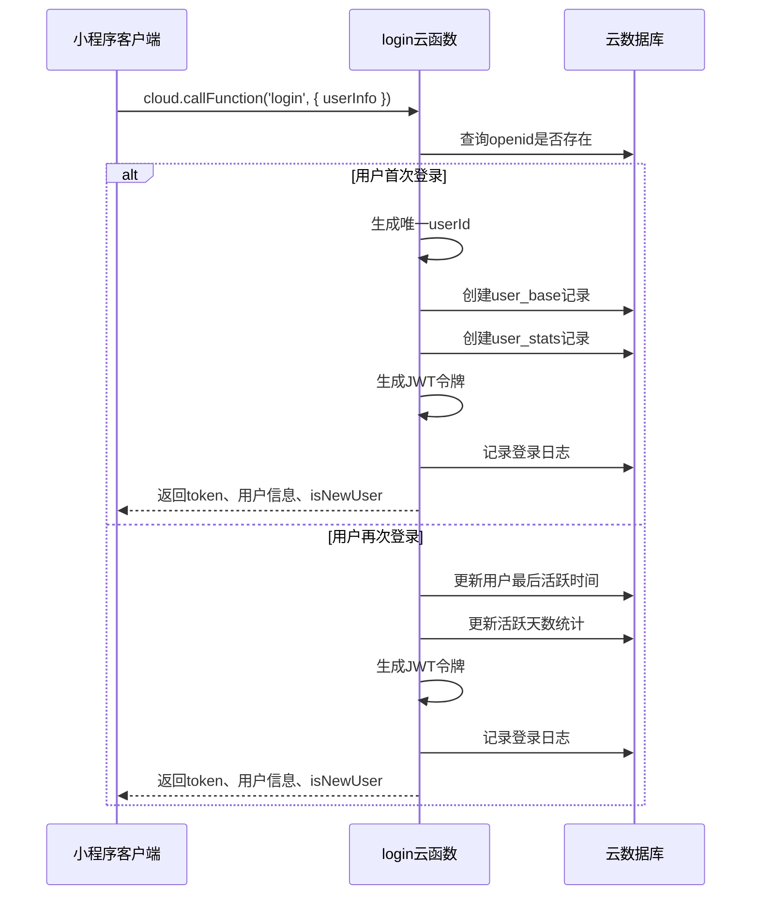
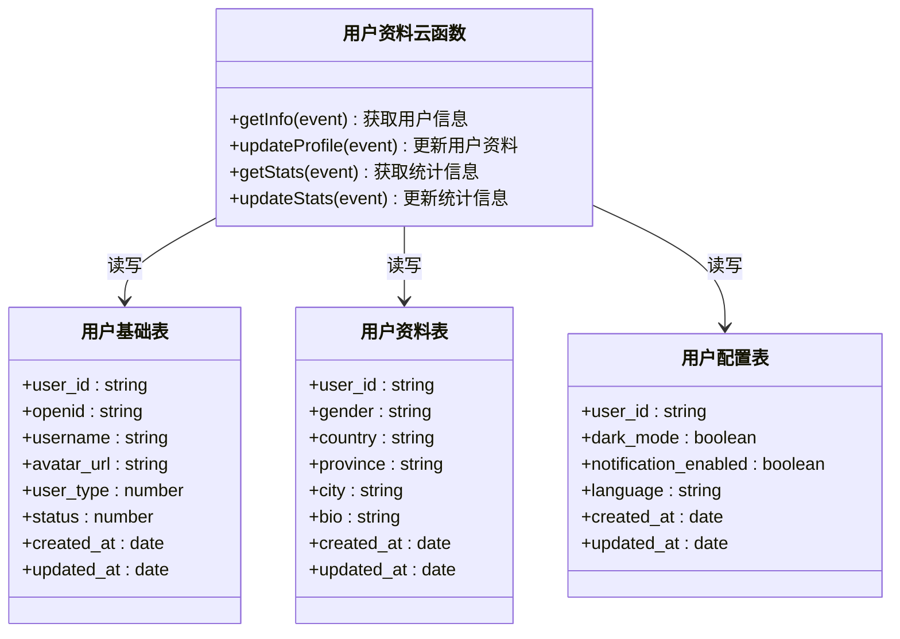
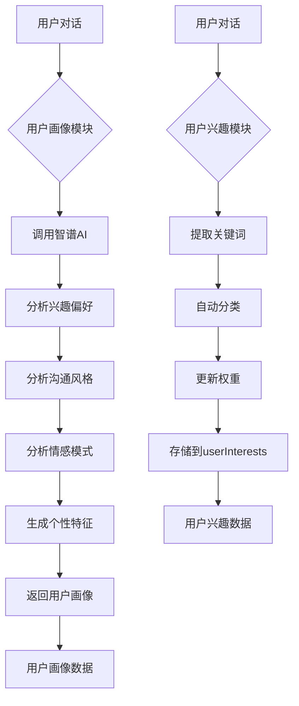
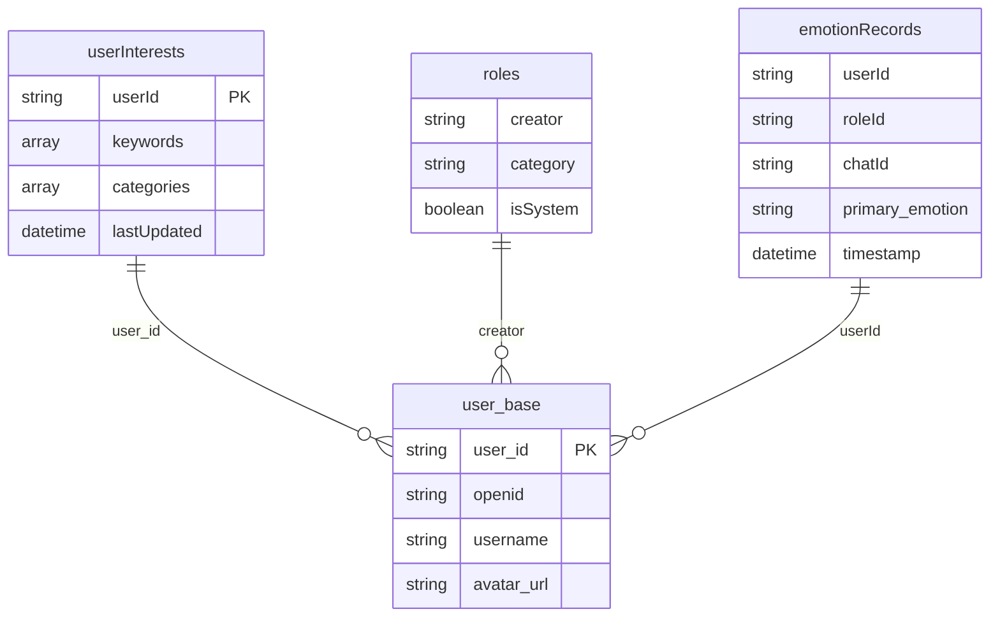
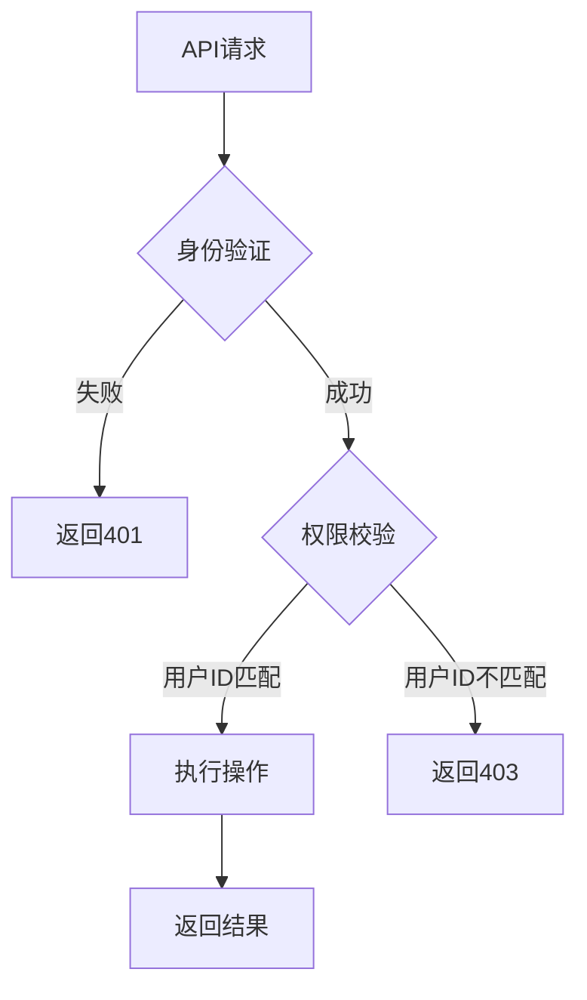

# 用户管理API

<cite>
**本文档引用文件**  
- [login/index.js](file://cloudfunctions/login/index.js)
- [user/index.js](file://cloudfunctions/user/index.js)
- [user/createIndexes.js](file://cloudfunctions/user/createIndexes.js)
- [user/userInterests.js](file://cloudfunctions/user/userInterests.js)
- [user/userPerception_new.js](file://cloudfunctions/user/userPerception_new.js)
- [database/user_profile.md](file://doc/开发文档/database/user_profile.md)
</cite>

## 目录
1. [简介](#简介)
2. [用户登录与会话管理](#用户登录与会话管理)
3. [用户资料管理](#用户资料管理)
4. [用户兴趣与画像](#用户兴趣与画像)
5. [数据库索引优化](#数据库索引优化)
6. [安全最佳实践](#安全最佳实践)
7. [用户生命周期示例](#用户生命周期示例)
8. [附录](#附录)

## 简介
本文档详细说明了HeartChat应用中用户管理相关API的设计与实现。涵盖微信授权登录、用户资料获取与保存、用户兴趣分析、数据库索引优化及安全实践等核心功能。系统通过云函数实现用户身份认证、资料管理与个性化服务，为用户提供安全、高效的用户体验。

## 用户登录与会话管理

用户通过微信授权登录，系统自动完成用户创建或信息更新，并返回包含用户基本信息与访问令牌的响应。



**Diagram sources**
- [login/index.js](file://cloudfunctions/login/index.js#L1-L267)

**Section sources**
- [login/index.js](file://cloudfunctions/login/index.js#L1-L267)

### 登录API (cloud.callFunction('login'))

**请求参数**
- `userInfo` (Object): 微信用户信息对象，包含：
  - `nickName` (string): 用户昵称
  - `avatarUrl` (string): 用户头像URL
  - `clientIP` (string): 客户端IP地址
  - `userAgent` (string): 用户代理信息

**响应字段**
- `success` (boolean): 操作是否成功
- `data` (Object): 成功时返回的数据对象
  - `token` (string): JWT访问令牌，有效期7天
  - `isNewUser` (boolean): 是否为新用户
  - `userInfo` (Object): 用户信息
    - `userId` (string): 系统生成的唯一用户ID
    - `username` (string): 用户名
    - `avatarUrl` (string): 头像URL
    - `userType` (number): 用户类型（1:普通用户）
    - `status` (number): 账号状态（1:启用）
    - `stats` (Object): 用户统计信息
      - `chat_count` (number): 对话次数
      - `solved_count` (number): 问题解决数
      - `rating_avg` (number): 平均评分
      - `active_days` (number): 活跃天数
- `error` (string): 失败时的错误信息

### 会话状态维护
系统使用JWT（JSON Web Token）维护用户会话状态。令牌包含用户ID、类型、状态等信息，并设置7天有效期。每次API调用需在请求头中携带此令牌进行身份验证。

### openid绑定机制
系统以微信openid作为用户唯一标识，实现自动绑定：
1. 用户首次登录时，系统根据openid在`user_base`集合中查找用户
2. 若未找到，则创建新用户记录，并生成唯一`user_id`
3. 若已存在，则更新用户最后活跃时间等信息
4. 后续登录均通过openid关联同一用户账户，确保身份一致性

## 用户资料管理

用户资料管理通过`user`云函数实现，支持获取和保存用户资料。



**Diagram sources**
- [user/index.js](file://cloudfunctions/user/index.js#L1-L799)
- [database/user_profile.md](file://doc/开发文档/database/user_profile.md#L1-L41)

**Section sources**
- [user/index.js](file://cloudfunctions/user/index.js#L1-L799)
- [database/user_profile.md](file://doc/开发文档/database/user_profile.md#L1-L41)

### 获取用户资料 (cloud.callFunction('user', { action: 'getProfile' }))

**请求参数**
- `action` (string): 操作类型，值为'getProfile'
- `userId` (string): 用户ID（可选，若不提供则使用当前用户）

**响应字段**
- `success` (boolean): 操作是否成功
- `data` (Object): 用户完整信息
  - `user` (Object): 用户信息对象
    - `userId` (string): 用户ID
    - `username` (string): 用户名
    - `avatarUrl` (string): 头像URL
    - `userType` (number): 用户类型
    - `status` (number): 账号状态
    - `gender` (string): 性别（男/女/保密）
    - `country` (string): 国家
    - `province` (string): 省份
    - `city` (string): 城市
    - `bio` (string): 个人简介
    - `stats` (Object): 统计信息（同登录API）

### 保存用户资料 (cloud.callFunction('user', { action: 'saveProfile' }))

**请求参数**
- `action` (string): 操作类型，值为'saveProfile'
- `userId` (string): 用户ID
- `username` (string): 用户名
- `avatarUrl` (string): 头像URL
- `gender` (string): 性别
- `country` (string): 国家
- `province` (string): 省份
- `city` (string): 城市
- `bio` (string): 个人简介
- `settings` (Object): 用户设置
  - `darkMode` (boolean): 是否开启暗黑模式
  - `notificationEnabled` (boolean): 是否启用通知
  - `language` (string): 语言设置

**响应字段**
- `success` (boolean): 操作是否成功
- `data` (Object): 更新结果
  - `updatedUser` (Object): 更新后的用户信息（同获取资料响应）
- `error` (string): 失败时的错误信息

## 用户兴趣与画像

系统通过`userInterests`模块和`userPerception_new`模块实现用户兴趣分析与画像构建。



**Diagram sources**
- [user/userInterests.js](file://cloudfunctions/user/userInterests.js#L1-L799)
- [user/userPerception_new.js](file://cloudfunctions/user/userPerception_new.js#L1-L635)

**Section sources**
- [user/userInterests.js](file://cloudfunctions/user/userInterests.js#L1-L799)
- [user/userPerception_new.js](file://cloudfunctions/user/userPerception_new.js#L1-L635)

### 用户兴趣标签
系统自动从用户对话中提取关键词作为兴趣标签，每个标签包含以下属性：
- `word` (string): 关键词文本
- `weight` (number): 兴趣权重（0.1-2.0）
- `category` (string): 分类（如：科技、艺术、运动等）
- `occurrences` (number): 出现次数
- `firstSeen` (date): 首次出现时间
- `lastUpdated` (date): 最后更新时间

### 兴趣分类
系统支持多种兴趣分类，包括但不限于：
- **科技**: 编程、人工智能、互联网、数码产品
- **艺术**: 音乐、绘画、电影、文学
- **运动**: 跑步、健身、篮球、游泳
- **生活**: 美食、旅行、摄影、宠物
- **学习**: 阅读、课程、考试、技能

### 性格标签
系统通过分析用户对话和情绪模式，识别用户性格特征，包括：
- **责任感**: 履行承诺、认真负责
- **同理心**: 理解他人、富有同情心
- **创造力**: 富有想象力、创新思维
- **社交性**: 喜欢社交、善于沟通
- **冒险精神**: 勇于尝试、喜欢挑战
- **耐心**: 冷静沉着、不急躁
- **乐观性**: 积极向上、充满希望

## 数据库索引优化

`createIndexes.js`文件定义了多个数据库索引，显著提升查询性能。



**Diagram sources**
- [user/createIndexes.js](file://cloudfunctions/user/createIndexes.js#L1-L224)

**Section sources**
- [user/createIndexes.js](file://cloudfunctions/user/createIndexes.js#L1-L224)

### userInterests集合索引
- **userId_idx**: 在`userId`字段上创建唯一索引，确保每个用户只有一条兴趣记录，加速用户兴趣查询
- **category_userId_idx**: 在`keywords.category`和`userId`字段上创建复合索引，优化按分类查询用户兴趣的性能
- **word_userId_idx**: 在`keywords.word`和`userId`字段上创建复合索引，提升关键词搜索效率
- **lastUpdated_userId_idx**: 在`lastUpdated`（降序）和`userId`字段上创建复合索引，便于按更新时间排序查询

### roles集合索引
- **creator_idx**: 在`creator`字段上创建索引，加速查询用户创建的角色
- **category_idx**: 在`category`字段上创建索引，优化按分类筛选角色
- **isSystem_idx**: 在`isSystem`字段上创建索引，快速区分系统角色和自定义角色
- **isSystem_category_idx**: 在`isSystem`和`category`字段上创建复合索引，优化系统角色按分类查询
- **creator_category_idx**: 在`creator`和`category`字段上创建复合索引，提升用户角色管理效率

### emotionRecords集合索引
- **userId_timestamp_idx**: 在`userId`和`timestamp`（降序）字段上创建复合索引，优化用户情绪历史查询
- **roleId_userId_timestamp_idx**: 在`roleId`、`userId`和`timestamp`（降序）字段上创建复合索引，加速特定角色的情绪分析
- **chatId_timestamp_idx**: 在`chatId`和`timestamp`（降序）字段上创建复合索引，提升聊天记录相关情绪查询
- **emotion_userId_timestamp_idx**: 在`primary_emotion`、`userId`和`timestamp`（降序）字段上创建复合索引，便于情绪趋势分析

## 安全最佳实践

系统实施了多层次的安全措施，确保用户数据安全。

### 敏感字段脱敏
- 用户手机号、邮箱等敏感信息不存储或进行加密存储
- 日志记录中对用户标识信息进行部分隐藏处理
- API响应中不返回数据库文档ID（_id）等内部标识

### 越权访问校验
所有数据操作均进行严格的权限校验：


- **身份验证**: 通过JWT令牌验证用户身份，确保请求来自合法用户
- **所有权校验**: 在更新或查询数据时，校验请求中的`userId`与令牌中的`user_id`是否一致
- **操作限制**: 禁止用户删除账户或修改关键系统字段

**Section sources**
- [user/index.js](file://cloudfunctions/user/index.js#L143-L192)
- [login/index.js](file://cloudfunctions/login/index.js#L1-L267)

## 用户生命周期示例

以下是完整的用户从登录到资料管理的代码示例：

```javascript
// 1. 微信授权登录
async function login() {
  try {
    // 获取微信用户信息
    const userInfo = await wx.getUserInfo();
    
    // 调用登录云函数
    const result = await wx.cloud.callFunction({
      name: 'login',
      data: {
        userInfo: userInfo.userInfo
      }
    });
    
    if (result.result.success) {
      // 保存token到本地存储
      wx.setStorageSync('token', result.result.data.token);
      
      // 显示用户信息
      console.log('欢迎', result.result.data.userInfo.username);
      
      if (result.result.data.isNewUser) {
        console.log('新用户注册成功！');
      }
      
      return result.result.data;
    } else {
      throw new Error(result.result.error);
    }
  } catch (error) {
    console.error('登录失败:', error);
    return null;
  }
}

// 2. 获取用户资料
async function getProfile(userId) {
  try {
    const result = await wx.cloud.callFunction({
      name: 'user',
      data: {
        action: 'getProfile',
        userId: userId
      }
    });
    
    if (result.result.success) {
      return result.result.data.user;
    } else {
      throw new Error(result.result.error);
    }
  } catch (error) {
    console.error('获取资料失败:', error);
    return null;
  }
}

// 3. 保存用户资料
async function saveProfile(profileData) {
  try {
    const result = await wx.cloud.callFunction({
      name: 'user',
      data: {
        action: 'saveProfile',
        ...profileData
      }
    });
    
    if (result.result.success) {
      console.log('资料保存成功');
      return result.result.data.updatedUser;
    } else {
      throw new Error(result.result.error);
    }
  } catch (error) {
    console.error('保存资料失败:', error);
    return null;
  }
}

// 使用示例
async function userFlow() {
  // 登录
  const userData = await login();
  if (!userData) return;
  
  const userId = userData.userInfo.userId;
  
  // 获取当前资料
  const currentProfile = await getProfile(userId);
  console.log('当前资料:', currentProfile);
  
  // 更新资料
  const updatedProfile = await saveProfile({
    userId: userId,
    username: '新用户名',
    avatarUrl: 'https://new-avatar-url.com',
    gender: '男',
    country: '中国',
    province: '广东',
    city: '深圳',
    bio: '热爱生活，喜欢探索新事物',
    settings: {
      darkMode: true,
      notificationEnabled: true,
      language: 'zh-CN'
    }
  });
  
  console.log('更新后资料:', updatedProfile);
}
```

## 附录

### 云函数调用说明
所有用户管理相关功能均通过云函数调用实现，调用格式如下：
```javascript
wx.cloud.callFunction({
  name: 'functionName',
  data: {
    // 参数
  }
})
```

### 错误码说明
- `401`: 未授权，需要重新登录
- `403`: 禁止访问，越权操作
- `500`: 服务器内部错误
- `10001`: 缺少必要参数
- `10002`: 用户不存在
- `10003`: 未知的操作类型