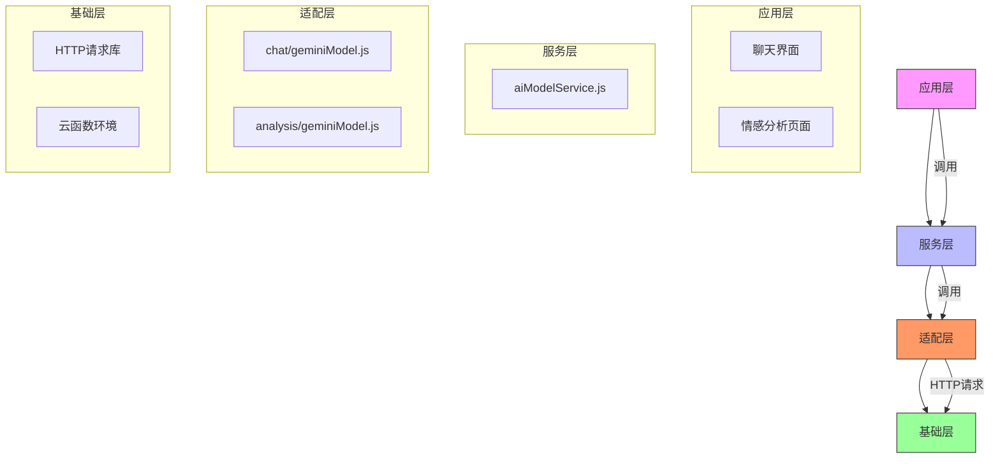
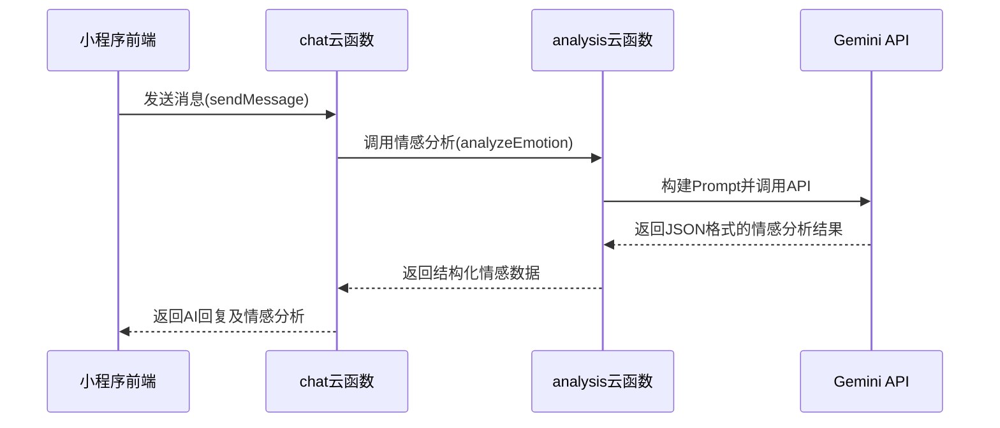

# Google Gemini API集成

<cite>
**本文档引用文件**  
- [geminiModel.js](file://cloudfunctions/analysis/geminiModel.js)
- [geminiModel.js](file://cloudfunctions/chat/geminiModel.js)
- [index.js](file://cloudfunctions/analysis/index.js)
- [index.js](file://cloudfunctions/chat/index.js)
- [Gemini_API集成开发文档.md](file://doc/开发文档/Gemini_API集成开发文档.md)
- [Gemini_API配置指南.md](file://doc/使用文档/Gemini_API配置指南.md)
- [aiModelService.js](file://cloudfunctions/analysis/aiModelService.js)
</cite>

## 目录
1. [引言](#引言)
2. [架构与模块设计](#架构与模块设计)
3. [API调用与封装](#api调用与封装)
4. [情感分析与多轮对话实现](#情感分析与多轮对话实现)
5. [请求参数与响应处理](#请求参数与响应处理)
6. [错误处理与重试机制](#错误处理与重试机制)
7. [调用示例与测试方案](#调用示例与测试方案)
8. [模型对比与使用建议](#模型对比与使用建议)
9. [附录](#附录)

## 引言

本文档旨在为HeartChat项目提供Google Gemini API的集成指南。Gemini作为Google推出的先进大语言模型，具备强大的自然语言理解与生成能力，被集成用于增强应用的聊天对话、情感分析、关键词提取及用户画像构建等核心AI功能。本集成遵循项目分层架构，通过`geminiModel.js`模块封装API调用，实现了与智谱AI等其他模型的统一服务接口，确保了功能的兼容性与可维护性。

**Section sources**
- [Gemini_API集成开发文档.md](file://doc/开发文档/Gemini_API集成开发文档.md#L1-L20)
- [Gemini_API配置指南.md](file://doc/使用文档/Gemini_API配置指南.md#L1-L10)

## 架构与模块设计

HeartChat对Gemini API的集成采用了清晰的分层架构，确保了功能的解耦与复用。



**Diagram sources**
- [Gemini_API集成开发文档.md](file://doc/开发文档/Gemini_API集成开发文档.md#L21-L45)
- [aiModelService.js](file://cloudfunctions/analysis/aiModelService.js#L1-L20)

### 核心模块

- **`cloudfunctions/chat/geminiModel.js`**: 位于适配层，专门负责处理聊天场景下的Gemini API调用。它封装了消息格式转换、API请求构建、响应解析等逻辑，为上层服务提供`generateChatReply`接口。
- **`cloudfunctions/analysis/geminiModel.js`**: 同样位于适配层，但专注于情感分析、关键词提取、聚类分析等分析类任务。它通过`analyzeEmotion`、`extractKeywords`等函数暴露服务。
- **`cloudfunctions/analysis/aiModelService.js`**: 位于服务层，是统一的AI模型服务入口。它根据调用参数选择`GEMINI`或`ZHIPU`等平台，调用相应适配层模块，实现了多模型的统一管理。
- **`cloudfunctions/chat/index.js` 和 `cloudfunctions/analysis/index.js`**: 作为云函数的入口，接收来自小程序前端的请求，并分发到具体的业务逻辑处理函数。

**Section sources**
- [Gemini_API集成开发文档.md](file://doc/开发文档/Gemini_API集成开发文档.md#L46-L64)
- [index.js](file://cloudfunctions/chat/index.js#L1-L50)
- [index.js](file://cloudfunctions/analysis/index.js#L1-L50)

## API调用与封装

Gemini API的调用在`geminiModel.js`文件中被高度封装，核心是`callGeminiAPI`函数。

### API密钥与安全存储

API密钥通过环境变量`GEMINI_API_KEY`进行安全存储，确保密钥不会暴露在代码中。该环境变量需在微信云开发控制台中为`chat`和`analysis`云函数分别配置。

```javascript
const API_KEY = process.env.GEMINI_API_KEY || ''; // 从环境变量获取
```

### 请求构建

封装函数负责构建符合Gemini API规范的请求。主要步骤包括：
1.  **URL构建**: 使用`API_BASE_URL`和模型标识符（如`gemini-2.5-flash-preview-04-17`）构建请求端点。
2.  **消息格式转换**: 将HeartChat内部的消息格式（`role: 'user'/'assistant'`）转换为Gemini要求的格式（`role: 'user'/'model'`），并封装在`parts`数组中。
3.  **请求体构建**: 将转换后的消息和生成配置（`generationConfig`）组合成JSON请求体。

### 流式响应处理

当前实现主要处理非流式响应（`:generateContent`）。虽然API支持流式输出（`:streamGenerateContent`），但项目中尚未完全实现从客户端到云函数再到Gemini的真流式数据传输。目前的“分段输出”是在云函数获取完整回复后，通过`splitMessage`函数在服务端进行模拟，以提升用户体验。

### 上下文长度管理

为应对模型的Token限制，系统通过`chatMemoryLength`参数控制传递给模型的历史消息数量。`chat/index.js`中的`sendMessage`函数会查询数据库，仅获取最近的N条历史消息作为上下文，避免输入过长。

**Section sources**
- [geminiModel.js](file://cloudfunctions/chat/geminiModel.js#L36-L82)
- [geminiModel.js](file://cloudfunctions/analysis/geminiModel.js#L36-L80)
- [Gemini_API配置指南.md](file://doc/使用文档/Gemini_API配置指南.md#L46-L65)

## 情感分析与多轮对话实现

Gemini模型在情感分析和多轮对话中扮演着核心角色。

### 情感分析实现

情感分析功能通过精心设计的提示词（Prompt）引导Gemini模型输出结构化的JSON结果。`analysis/geminiModel.js`中的`analyzeEmotion`函数构建了详细的提示词，要求模型分析文本的主次情感、强度、愉悦度、唤醒水平、趋势、注意力水平、雷达维度、关键词、情绪触发点等，并以严格的JSON格式返回。



**Diagram sources**
- [geminiModel.js](file://cloudfunctions/analysis/geminiModel.js#L207-L240)
- [index.js](file://cloudfunctions/analysis/index.js#L150-L200)

### 多轮对话实现

多轮对话的连贯性依赖于上下文管理。`chat/geminiModel.js`中的`formatMessagesForGemini`函数将历史消息和当前消息按角色（`user`/`model`）正确格式化，并与系统提示词一起发送给Gemini。这使得模型能够理解对话的上下文，生成连贯的回复。

**Section sources**
- [geminiModel.js](file://cloudfunctions/analysis/geminiModel.js#L121-L206)
- [geminiModel.js](file://cloudfunctions/chat/geminiModel.js#L100-L150)

## 请求参数与响应处理

### 请求参数调优

Gemini API的生成行为可通过`generationConfig`中的参数进行调优：
- **`temperature`**: 控制输出的随机性。在聊天中设为`0.7`以获得自然多样的回复；在情感分析中设为`0.3`以获得更确定、稳定的结果。
- **`topP`**: 核采样参数，设为`0.8`以平衡创造性和相关性。
- **`maxOutputTokens`**: 限制最大输出长度，防止响应过长。

### 响应解析

Gemini API的响应包含在`candidates`数组中。系统首先检查响应状态，然后解析`candidates[0].content.parts[0].text`中的文本内容。对于情感分析，该文本是一个JSON字符串，系统使用`JSON.parse`进行解析，并通过正则表达式`/\{[\s\S]*\}/`提取出完整的JSON对象，以应对模型可能添加的前缀或后缀。

```json
{
  "candidates": [
    {
      "content": {
        "parts": [
          {
            "text": "{\"primary_emotion\": \"喜悦\", \"intensity\": 0.85, ...}"
          }
        ],
        "role": "model"
      },
      "usageMetadata": {
        "totalTokenCount": 50
      }
    }
  ]
}
```

**Section sources**
- [geminiModel.js](file://cloudfunctions/chat/geminiModel.js#L213-L264)
- [geminiModel.js](file://cloudfunctions/analysis/geminiModel.js#L207-L240)

## 错误处理与重试机制

系统实现了健壮的错误处理和重试机制，以应对网络波动和API限流。

### 错误码处理

- **429 (请求过多)**: 这是最常见的错误。`callGeminiAPI`函数检测到429状态码后，会触发指数退避重试机制。
- **500 (服务器错误)**: 记录错误日志，并向用户返回友好的错误提示。
- **其他错误**: 捕获并记录所有异常，确保云函数不会崩溃。

### 重试机制

`callGeminiAPI`函数内置了递归重试逻辑。当遇到429错误时，函数会等待一个延迟时间（初始为1000ms），然后递归调用自身，同时将延迟时间翻倍（`retryDelay * 2`），并减少重试次数。这有效避免了因短时间高频请求导致的持续失败。

```javascript
if (error.response && error.response.status === 429 && retryCount > 0) {
  await delay(retryDelay);
  return callGeminiAPI(params, retryCount - 1, retryDelay * 2); // 指数退避
}
```

**Section sources**
- [geminiModel.js](file://cloudfunctions/chat/geminiModel.js#L77-L120)
- [geminiModel.js](file://cloudfunctions/analysis/geminiModel.js#L77-L120)

## 调用示例与测试方案

### 同步调用示例

以下是在小程序前端调用Gemini进行聊天和情感分析的示例：

#### 聊天功能
```javascript
wx.cloud.callFunction({
  name: 'chat',
  data: {
    action: 'sendMessage',
    roleId: 'role456',
    content: '今天感觉有点累。',
    modelType: 'gemini', // 明确指定
    modelParams: { temperature: 0.7 }
  }
})
```

#### 情感分析
```javascript
wx.cloud.callFunction({
  name: 'analysis',
  data: {
    type: 'emotion',
    text: '今天感觉有点累。',
    modelType: 'gemini',
    saveRecord: true
  }
})
```

### 本地模拟测试

项目提供了`test-gemini`页面用于测试Gemini API连接。开发者可在首页点击“Gemini测试”卡片，选择“Google Gemini”模型并点击“测试连接”按钮，系统会调用API并显示返回结果，方便快速验证配置是否正确。

**Section sources**
- [Gemini_API配置指南.md](file://doc/使用文档/Gemini_API配置指南.md#L122-L246)
- [Gemini_API集成开发文档.md](file://doc/开发文档/Gemini_API集成开发文档.md#L275-L331)

## 模型对比与使用建议

HeartChat项目支持多模型，Gemini与智谱AI（Zhipu AI）是其中两个主要选项。

### 对比分析

| 特性 | Google Gemini | 智谱AI (GLM) |
| :--- | :--- | :--- |
| **中文情感理解准确率** | 高 | **极高** |
| **响应速度** | **快** (Gemini Flash) | 快 |
| **多模态能力** | **强** (支持图像等) | 弱 |
| **创造力与通用性** | **强** | 中等 |
| **中文语境优化** | 好 | **极好** |

### 使用建议

- **优先选择智谱AI**: 对于核心的**情感分析**和**中文对话**场景，建议优先使用智谱AI。其在中文语义理解、情感细微差别把握上表现更佳，能提供更符合中文用户习惯的分析结果和回复。
- **选择Gemini**: 当需要**多模态输入**（如未来支持图片分析）或追求**更高的通用性和创造力**时，Gemini是更好的选择。其在处理复杂推理和生成多样化内容方面有优势。
- **综合策略**: 可以采用混合策略，例如在聊天中使用Gemini以获得更生动的回复，而在情感分析中使用智谱AI以获得更精准的洞察。

**Section sources**
- [README.md](file://README.md#L432-L446)
- [README.md](file://README.md#L773-L798)

## 附录

### 环境变量配置步骤
1.  在微信开发者工具中打开云开发控制台。
2.  选择`chat`云函数，点击“配置”。
3.  在“环境变量”中添加 `GEMINI_API_KEY` 及其值。
4.  重复步骤2-3，为`analysis`云函数配置相同的环境变量。

### 故障排除
- **连接失败**: 检查API密钥、`API_BASE_URL`和网络。
- **429错误**: 等待或检查重试机制是否生效。
- **返回空结果**: 检查提示词设计和JSON解析逻辑。