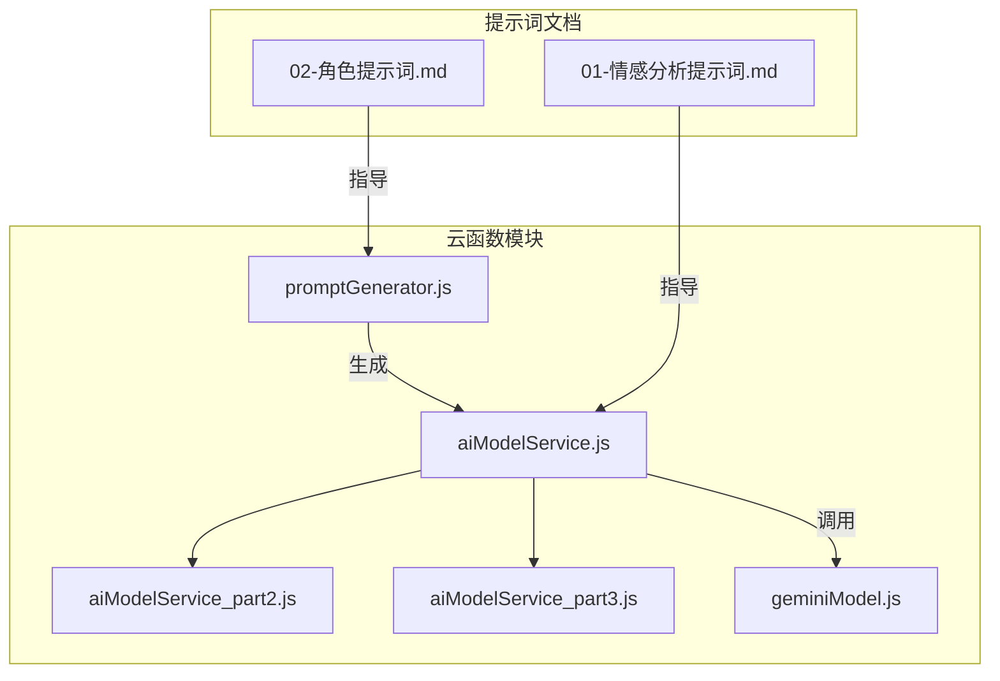
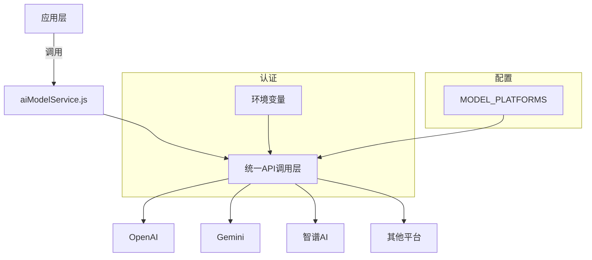
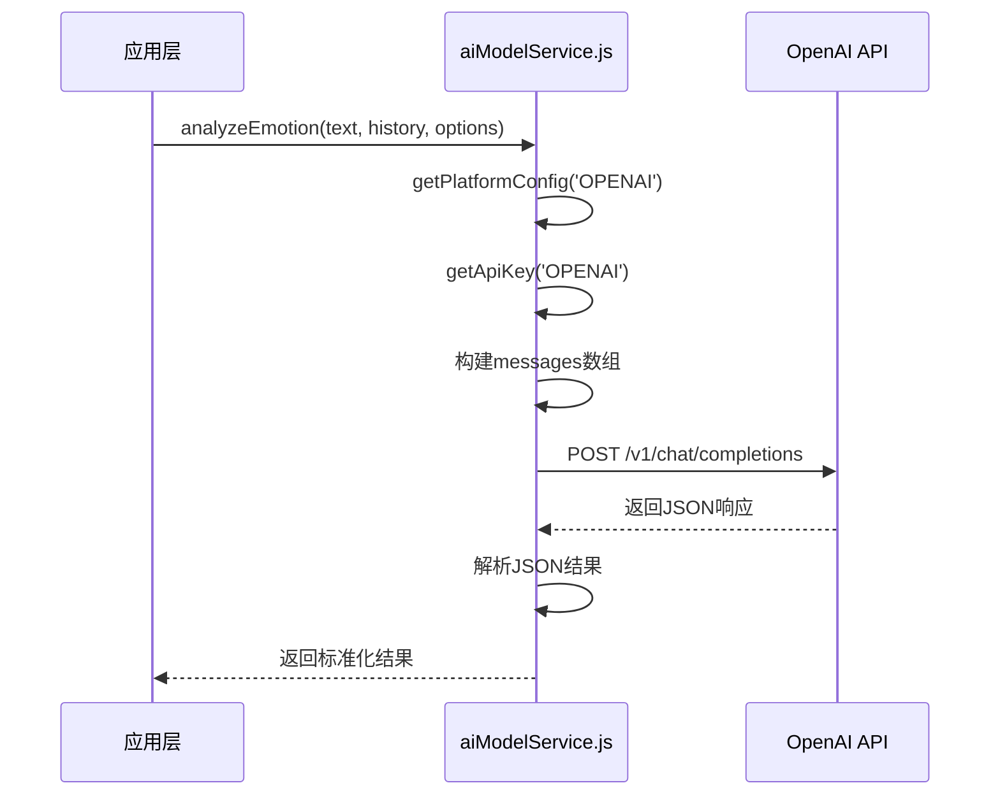
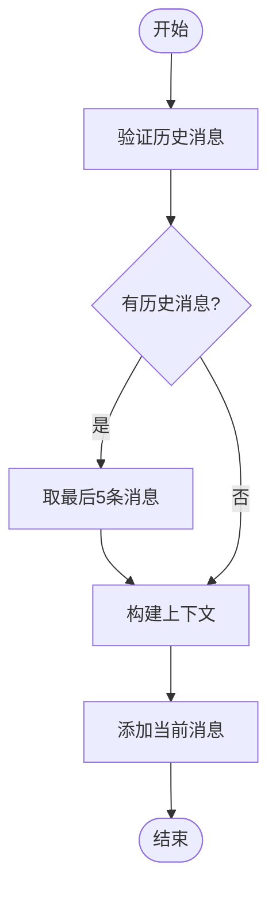
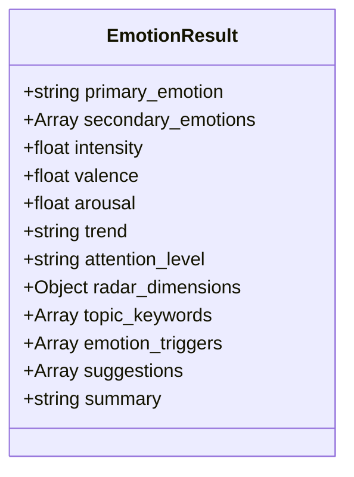
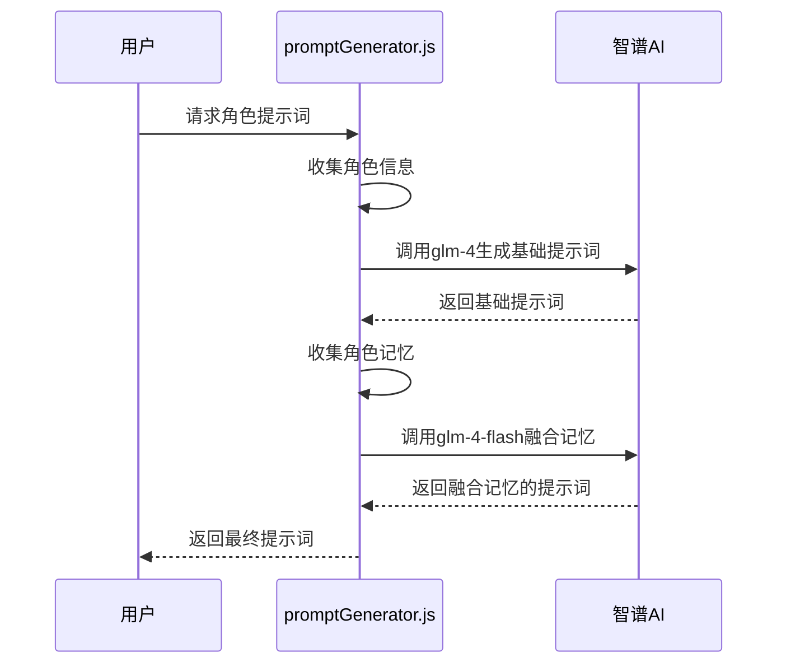
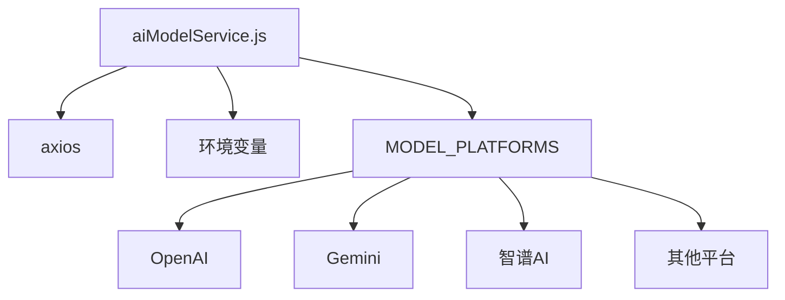
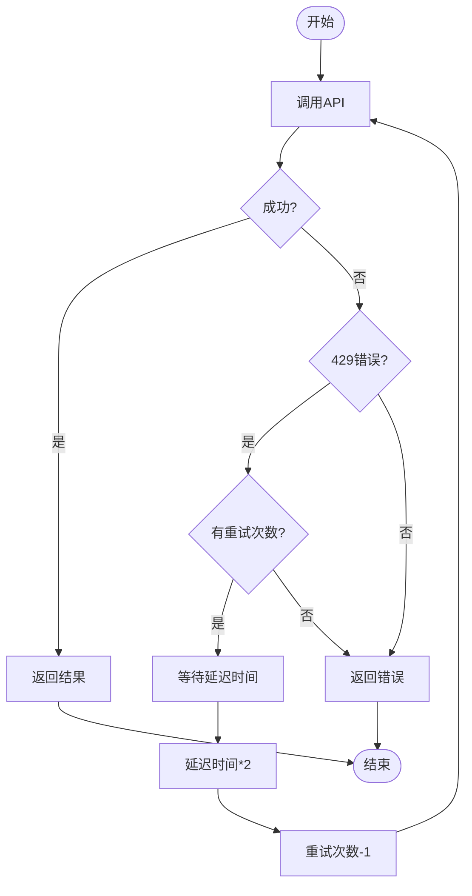

# OpenAI API集成

<cite>
**本文档引用文件**  
- [aiModelService.js](file://cloudfunctions/analysis/aiModelService.js)
- [aiModelService_part2.js](file://cloudfunctions/analysis/aiModelService_part2.js)
- [aiModelService_part3.js](file://cloudfunctions/analysis/aiModelService_part3.js)
- [geminiModel.js](file://cloudfunctions/analysis/geminiModel.js)
- [promptGenerator.js](file://cloudfunctions/roles/promptGenerator.js)
- [01-情感分析提示词.md](file://doc/开发文档/prompt/01-情感分析提示词.md)
- [02-角色提示词.md](file://doc/开发文档/prompt/02-角色提示词.md)
</cite>

## 目录
1. [项目结构](#项目结构)
2. [核心组件](#核心组件)
3. [架构概述](#架构概述)
4. [详细组件分析](#详细组件分析)
5. [依赖分析](#依赖分析)
6. [性能考量](#性能考量)
7. [故障排查指南](#故障排查指南)

## 项目结构

HeartChat项目采用云函数架构，AI模型服务主要集中在`cloudfunctions/analysis`目录下，通过模块化设计实现多平台AI模型的统一调用。`aiModelService.js`作为主入口，将功能拆分为`aiModelService_part2.js`和`aiModelService_part3.js`，分别处理关键词提取与聚类分析等高级功能。

**图示来源**  
- [aiModelService.js](file://cloudfunctions/analysis/aiModelService.js#L1-L663)
- [geminiModel.js](file://cloudfunctions/analysis/geminiModel.js#L1-L656)
- [promptGenerator.js](file://cloudfunctions/roles/promptGenerator.js#L1-L325)

**本节来源**  
- [aiModelService.js](file://cloudfunctions/analysis/aiModelService.js#L1-L663)
- [geminiModel.js](file://cloudfunctions/analysis/geminiModel.js#L1-L656)

## 核心组件

`aiModelService.js`实现了统一的AI模型调用接口，支持OpenAI、Gemini、智谱AI等多平台。通过`MODEL_PLATFORMS`配置对象定义各平台的API端点、认证方式和默认模型。核心功能包括情感分析、关键词提取、词向量生成和用户兴趣分析，所有功能均通过`callModelApi`函数进行RESTful API调用，并统一处理认证、重试和错误。

**本节来源**  
- [aiModelService.js](file://cloudfunctions/analysis/aiModelService.js#L1-L663)
- [aiModelService_part2.js](file://cloudfunctions/analysis/aiModelService_part2.js#L1-L317)

## 架构概述

系统采用分层架构，上层为功能调用接口，中层为统一API调用层，底层为具体模型平台。`aiModelService.js`作为核心服务层，封装了对不同AI平台的调用细节，对外提供标准化的JavaScript函数。通过环境变量动态加载API密钥，实现安全的认证管理。

**图示来源**  
- [aiModelService.js](file://cloudfunctions/analysis/aiModelService.js#L1-L663)

## 详细组件分析

### OpenAI模型调用分析

`aiModelService.js`通过在`MODEL_PLATFORMS`中定义`OPENAI`配置对象，实现了对OpenAI GPT系列模型的集成。该配置包含API基础URL、环境变量名、默认模型和端点信息。

#### OpenAI调用流程

**图示来源**  
- [aiModelService.js](file://cloudfunctions/analysis/aiModelService.js#L1-L663)

#### 消息历史压缩策略
系统通过`history.slice(-5)`限制历史消息数量，仅保留最近5条消息作为上下文，有效控制token消耗。该策略在情感分析、关键词提取等多个功能中统一应用。

**图示来源**  
- [aiModelService.js](file://cloudfunctions/analysis/aiModelService.js#L1-L663)

### 提示词工程设计

系统在`doc/开发文档/prompt`目录下维护了详细的提示词文档，指导AI模型的行为。

#### 情感分析提示词设计
情感分析使用结构化JSON输出格式，要求模型返回包含主要情感、次要情感、强度、愉悦度、唤醒水平等多维度信息的JSON对象。提示词强制要求所有文本字段使用中文，确保前端显示一致性。

**图示来源**  
- [01-情感分析提示词.md](file://doc/开发文档/prompt/01-情感分析提示词.md)
- [aiModelService.js](file://cloudfunctions/analysis/aiModelService.js#L1-L663)

#### 角色对话提示词设计
角色对话提示词通过`promptGenerator.js`动态生成，结合角色基本信息、记忆和用户画像。提示词设计强调简洁的对话风格，要求每条消息不超过1-2句话，模仿真实手机聊天。

**图示来源**  
- [promptGenerator.js](file://cloudfunctions/roles/promptGenerator.js#L1-L325)
- [02-角色提示词.md](file://doc/开发文档/prompt/02-角色提示词.md)

**本节来源**  
- [aiModelService.js](file://cloudfunctions/analysis/aiModelService.js#L1-L663)
- [promptGenerator.js](file://cloudfunctions/roles/promptGenerator.js#L1-L325)
- [01-情感分析提示词.md](file://doc/开发文档/prompt/01-情感分析提示词.md)
- [02-角色提示词.md](file://doc/开发文档/prompt/02-角色提示词.md)

## 依赖分析

系统通过`MODEL_PLATFORMS`配置对象管理多平台依赖，支持OpenAI、Gemini、智谱AI等多个AI平台。各平台通过环境变量获取API密钥，实现配置与代码的分离。

**图示来源**  
- [aiModelService.js](file://cloudfunctions/analysis/aiModelService.js#L1-L663)

**本节来源**  
- [aiModelService.js](file://cloudfunctions/analysis/aiModelService.js#L1-L663)

## 性能考量

系统实现了完善的错误处理和降级机制。`callModelApi`函数内置重试机制，遇到429错误（请求过多）时自动延迟重试，重试次数递减，延迟时间倍增。当主平台不可用时，系统可自动切换至Gemini等备用平台。

**图示来源**  
- [aiModelService.js](file://cloudfunctions/analysis/aiModelService.js#L1-L663)

## 故障排查指南

常见问题包括API密钥未配置、模型不支持特定功能、响应格式解析失败等。日志系统在开发模式下输出详细请求信息，便于调试。对于词向量功能，非智谱AI平台使用本地模拟实现，避免功能缺失。

**本节来源**  
- [aiModelService.js](file://cloudfunctions/analysis/aiModelService.js#L1-L663)
- [aiModelService_part2.js](file://cloudfunctions/analysis/aiModelService_part2.js#L1-L317)
- [geminiModel.js](file://cloudfunctions/analysis/geminiModel.js#L1-L656)