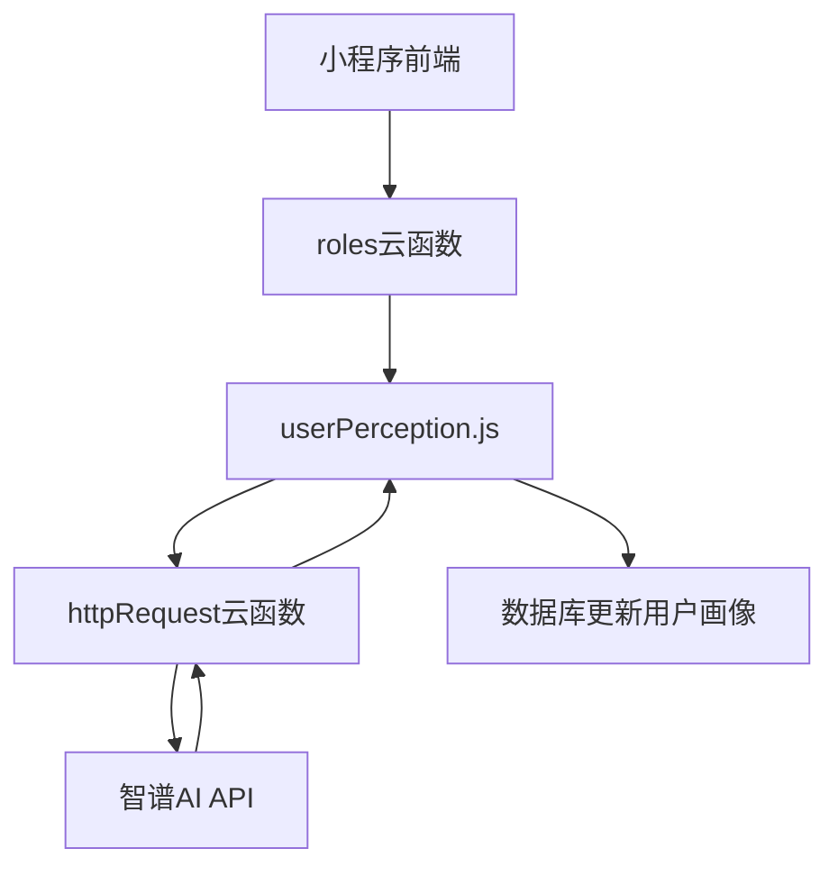
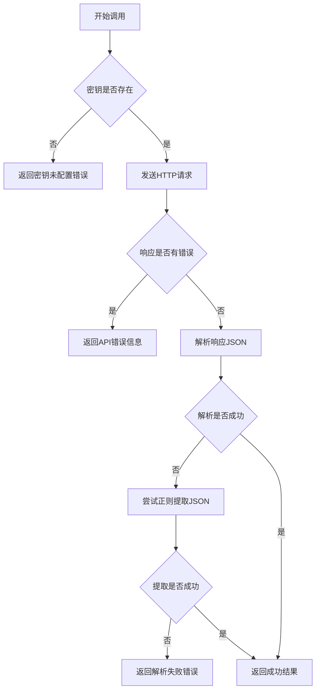
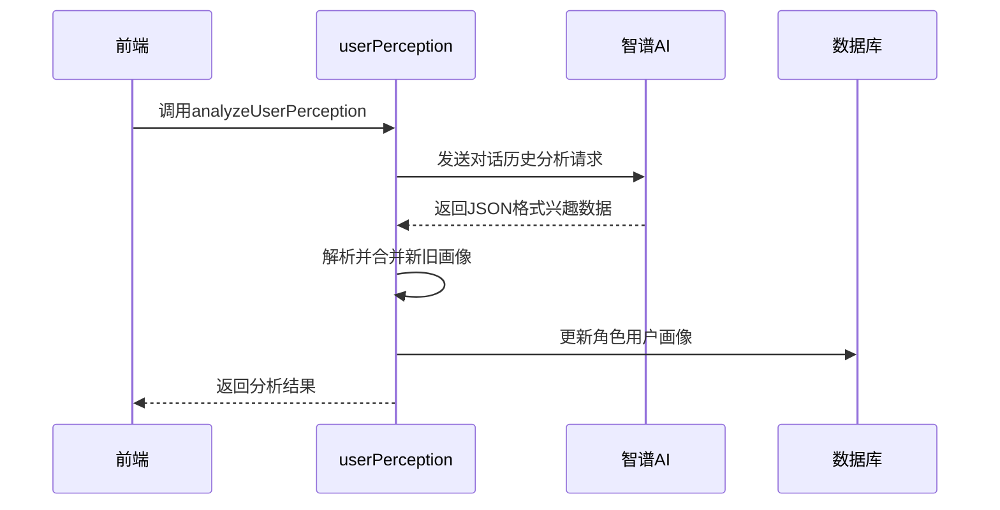

# 智谱AI API集成

<cite>
**本文档引用文件**  
- [test-zhipu.js](file://cloudfunctions/roles/test-zhipu.js)
- [userPerception.js](file://cloudfunctions/roles/userPerception.js)
- [aiModelService.js](file://cloudfunctions/analysis/aiModelService.js)
- [智谱AI接口使用文档.md](file://doc/使用文档/智谱AI接口使用文档.md)
- [智谱AI用户画像功能使用指南.md](file://doc/使用文档/智谱AI用户画像功能使用指南.md)
</cite>

## 目录
1. [引言](#引言)
2. [核心角色与架构](#核心角色与架构)
3. [API认证与请求流程](#api认证与请求流程)
4. [请求体结构详解](#请求体结构详解)
5. [响应解析机制](#响应解析机制)
6. [同步调用与错误处理](#同步调用与错误处理)
7. [密钥安全管理](#密钥安全管理)
8. [调用频率控制](#调用频率控制)
9. [与Dify平台协同模式](#与dify平台协同模式)
10. [用户兴趣分析与性格推断示例](#用户兴趣分析与性格推断示例)
11. [中文语境下性能对比](#中文语境下性能对比)

## 引言
智谱AI（Zhipu AI）作为HeartChat项目的核心语义理解引擎，承担着用户画像构建、角色感知与情感分析等关键任务。其通过GLM系列大模型提供强大的中文自然语言处理能力，尤其在用户行为理解、兴趣识别与性格推断方面表现卓越。本文档旨在全面阐述智谱AI在HeartChat中的集成方式、调用机制与最佳实践，为开发者提供详尽的技术指导。

**Section sources**
- [智谱AI接口使用文档.md](file://doc/使用文档/智谱AI接口使用文档.md#L1-L319)
- [智谱AI用户画像功能使用指南.md](file://doc/使用文档/智谱AI用户画像功能使用指南.md#L1-L222)

## 核心角色与架构
智谱AI在HeartChat中主要通过`userPerception.js`模块实现用户画像构建与角色感知功能。该模块利用智谱AI的GLM-4-Flash模型，从用户历史对话中提取兴趣、偏好、沟通风格和情感模式，并持续更新角色对用户的认知，从而实现更个性化的交互体验。

系统架构采用分层设计，前端通过云函数调用后端服务，后端通过`httpRequest`云函数转发请求至智谱AI API。整个流程确保了密钥安全与调用隔离。



**Diagram sources**
- [userPerception.js](file://cloudfunctions/roles/userPerception.js#L1-L315)
- [test-zhipu.js](file://cloudfunctions/roles/test-zhipu.js#L1-L99)

**Section sources**
- [userPerception.js](file://cloudfunctions/roles/userPerception.js#L1-L315)
- [智谱AI用户画像功能使用指南.md](file://doc/使用文档/智谱AI用户画像功能使用指南.md#L1-L222)

## API认证与请求流程
智谱AI API采用Bearer Token方式进行认证。API密钥通过环境变量`ZHIPU_API_KEY`注入云函数，确保密钥不会暴露在客户端代码中。

请求流程如下：
1. 云函数从环境变量读取`ZHIPU_API_KEY`
2. 构建包含Authorization头的请求
3. 通过`httpRequest`云函数发送POST请求至`https://open.bigmodel.cn/api/paas/v4/chat/completions`
4. 接收并解析响应

```javascript
const headers = {
  'Content-Type': 'application/json',
  'Authorization': `Bearer ${apiKey}`
};
```

**Section sources**
- [test-zhipu.js](file://cloudfunctions/roles/test-zhipu.js#L20-L25)
- [userPerception.js](file://cloudfunctions/roles/userPerception.js#L15-L20)

## 请求体结构详解
调用智谱AI API时，请求体包含以下关键参数：

| 参数 | 类型 | 必填 | 说明 |
|------|------|------|------|
| model | string | 是 | 模型名称，如`glm-4-flash` |
| messages | array | 是 | 对话消息数组，包含role和content |
| temperature | number | 否 | 温度参数，控制输出随机性，默认0.7 |
| max_tokens | number | 否 | 最大生成token数，默认2000 |
| response_format | object | 否 | 响应格式，支持JSON输出 |

其中`messages`数组的每个对象包含：
- `role`: 角色，可选`system`、`user`、`assistant`
- `content`: 消息内容

```javascript
const body = JSON.stringify({
  model: 'glm-4-flash',
  messages: [
    { role: 'system', content: '你是用户画像分析专家' },
    { role: 'user', content: '请分析以下对话内容...' }
  ],
  temperature: 0.3,
  max_tokens: 2000,
  response_format: { type: "json_object" }
});
```

**Section sources**
- [test-zhipu.js](file://cloudfunctions/roles/test-zhipu.js#L35-L45)
- [userPerception.js](file://cloudfunctions/roles/userPerception.js#L35-L45)

## 响应解析机制
智谱AI返回的响应为JSON格式，主要包含`choices`和`error`字段。成功响应中，`choices[0].message.content`包含AI生成的内容。

在`userPerception.js`中，系统实现了健壮的响应解析机制：
1. 首先检查`response.result.error`判断HTTP层错误
2. 解析`result.body`获取原始响应
3. 再次检查`result.error`判断API层错误
4. 提取`result.choices[0].message.content`并尝试JSON解析
5. 若解析失败，使用正则匹配提取JSON部分

该机制确保了即使在格式异常情况下也能尽可能提取有效信息。

**Section sources**
- [test-zhipu.js](file://cloudfunctions/roles/test-zhipu.js#L65-L90)
- [userPerception.js](file://cloudfunctions/roles/userPerception.js#L65-L90)

## 同步调用与错误处理
`test-zhipu.js`提供了完整的同步调用与错误处理示例。系统采用try-catch结构捕获所有异常，并区分不同类型的错误进行处理：



**Diagram sources**
- [test-zhipu.js](file://cloudfunctions/roles/test-zhipu.js#L1-L99)

**Section sources**
- [test-zhipu.js](file://cloudfunctions/roles/test-zhipu.js#L1-L99)

## 密钥安全管理
为确保API密钥安全，系统采用以下措施：
1. **环境变量存储**：密钥通过`process.env.ZHIPU_API_KEY`获取，不硬编码在代码中
2. **服务端调用**：所有API调用均在云函数内完成，客户端无法直接访问密钥
3. **最小权限原则**：云函数仅具备必要权限，避免权限过度分配
4. **定期轮换**：建议定期更换API密钥以降低泄露风险

**Section sources**
- [test-zhipu.js](file://cloudfunctions/roles/test-zhipu.js#L15-L18)
- [userPerception.js](file://cloudfunctions/roles/userPerception.js#L15-L18)

## 调用频率控制
为避免超出API配额并控制成本，系统实施了调用频率控制策略：
1. **业务逻辑控制**：仅在必要时调用用户画像分析，如用户进入个人中心页面
2. **缓存机制**：对分析结果进行缓存，避免重复调用
3. **错误重试机制**：在`aiModelService.js`中实现指数退避重试，处理429（请求过多）错误
4. **数据量预判**：建议用户积累5-10次对话后再进行分析，提高单次调用价值

**Section sources**
- [aiModelService.js](file://cloudfunctions/analysis/aiModelService.js#L150-L170)
- [智谱AI接口使用文档.md](file://doc/使用文档/智谱AI接口使用文档.md#L280-L290)

## 与Dify平台协同模式
智谱AI与Dify平台形成互补关系：
- **Dify平台**：负责主对话流、FAQ回答、风险评估等标准化任务
- **智谱AI**：专注于深度语义理解、用户画像构建、角色感知等个性化任务

两者通过云函数接口协同工作，Dify处理常规对话，当需要深度用户理解时，调用智谱AI进行专项分析，分析结果反哺Dify的角色系统提示，实现更智能的对话体验。

**Section sources**
- [智谱AI接口使用文档.md](file://doc/使用文档/智谱AI接口使用文档.md)
- [dify/主对话流](file://dify/主对话流)

## 用户兴趣分析与性格推断示例
在用户兴趣分析任务中，系统通过以下流程调用智谱AI：



具体实现中，系统会构造包含系统提示和用户对话内容的消息数组，要求以JSON格式返回兴趣、偏好、沟通风格和情感模式。

**Diagram sources**
- [userPerception.js](file://cloudfunctions/roles/userPerception.js#L100-L150)

**Section sources**
- [userPerception.js](file://cloudfunctions/roles/userPerception.js#L100-L200)

## 中文语境下性能对比
相较于OpenAI，智谱AI在中文语境下具有显著优势：

| 维度 | 智谱AI | OpenAI |
|------|--------|--------|
| 中文语义理解 | 专为中文优化，理解更准确 | 基于多语言模型，中文表现次优 |
| 本地文化适配 | 深度理解中文语境、成语和网络用语 | 对中文网络文化理解有限 |
| 响应速度 | 国内节点，延迟低 | 国际节点，延迟较高 |
| 成本 | 国内定价，成本较低 | 国际定价，成本较高 |
| 数据合规 | 数据存储于国内，符合中国法规 | 数据可能出境，合规风险 |

在用户画像构建任务中，智谱AI能更准确识别中文表达中的情感细微差别和兴趣倾向，生成的描述也更符合中文表达习惯。

**Section sources**
- [智谱AI接口使用文档.md](file://doc/使用文档/智谱AI接口使用文档.md)
- [aiModelService.js](file://cloudfunctions/analysis/aiModelService.js#L300-L600)