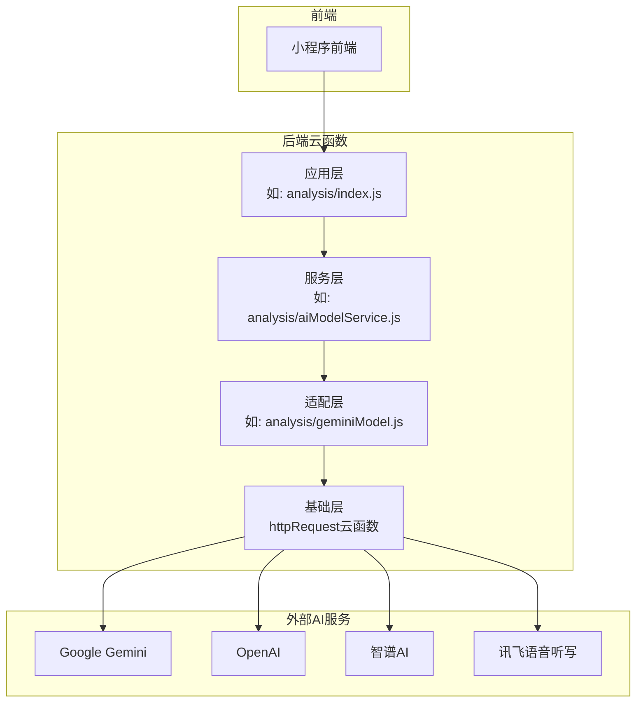
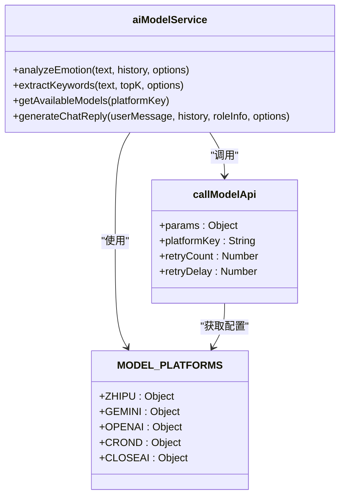

# 第三方服务API

<cite>
**本文档引用的文件**   
- [geminiModel.js](file://cloudfunctions/analysis/geminiModel.js)
- [aiModelService.js](file://cloudfunctions/analysis/aiModelService.js)
- [getIflytekSttUrl/index.js](file://cloudfunctions/getIflytekSttUrl/index.js)
- [chat/aiModelService.js](file://cloudfunctions/chat/aiModelService.js)
- [analysis云函数统一AI模型服务设计文档.md](file://doc/开发文档/analysis云函数统一AI模型服务设计文档.md)
- [Gemini API集成文档.md](file://doc/使用文档/Gemini API集成文档.md)
- [作品报告v1.0/作品报告.md](file://doc/设计文档/作品报告v1.0/作品报告.md)
</cite>

## 目录
1. [引言](#引言)
2. [服务集成概览](#服务集成概览)
3. [Google Gemini API](#google-gemini-api)
4. [OpenAI API](#openai-api)
5. [智谱AI API](#智谱ai-api)
6. [讯飞语音听写 (IFlytek STT)](#讯飞语音听写-iflytek-stt)
7. [统一AI模型服务](#统一ai模型服务)
8. [开发者指南](#开发者指南)
9. [模型对比与选型建议](#模型对比与选型建议)
10. [结论](#结论)

## 引言

本指南旨在为开发者提供HeartChat项目中集成的第三方AI服务的全面技术文档。HeartChat是一个基于微信小程序云开发的情感陪伴与情商提升应用，其核心功能依赖于多个外部AI服务的协同工作。这些服务包括用于多模态情感理解的Google Gemini、用于通用对话生成的OpenAI、用于中文语境深度理解的智谱AI，以及用于语音转文字的讯飞语音听写（IFlytek STT）。

本文档将详细阐述每个服务的集成细节，包括其在项目中的具体用途、API认证机制、请求端点、调用频率限制、数据格式以及错误处理策略。我们将结合`cloudfunctions/analysis/geminiModel.js`和`getIflytekSttUrl/index.js`等核心代码文件，展示服务调用的封装模式与异常重试逻辑。此外，文档还将提供服务注册、密钥配置和本地测试模拟的完整指南，并对各模型在情感分析任务中的表现进行对比，为开发者提供选型建议。

**Section sources**
- [geminiModel.js](file://cloudfunctions/analysis/geminiModel.js#L1-L655)
- [getIflytekSttUrl/index.js](file://cloudfunctions/getIflytekSttUrl/index.js#L1-L69)

## 服务集成概览

HeartChat项目采用了一种分层且模块化的架构来集成第三方AI服务，其核心设计原则是**解耦**与**统一**。这种设计确保了系统的灵活性和可扩展性，使得引入新的AI服务或替换现有服务变得相对简单，而不会对上层应用逻辑造成重大影响。

根据《作品报告v1.0/作品报告.md》中的描述，该集成架构主要分为四个层次：

*   **应用层**：面向最终业务功能，如聊天对话、情感分析和用户画像构建。它通过调用下一层（服务层）的标准化接口来获取AI能力。
*   **服务层**：封装了智谱AI、Gemini等提供的原子能力，将其包装成标准化的服务接口，如`analyzeEmotion`（情感分析）、`extractKeywords`（关键词提取）。
*   **适配层**：作为服务层与底层AI API之间的桥梁，负责处理API认证、请求构建、响应解析和通用错误处理（如重试机制）。
*   **基础层**：提供最底层的支撑功能，如通用的HTTP网络请求能力。

这种分层架构的优势在于职责清晰、耦合度低、易于维护和扩展。例如，`cloudfunctions/analysis`目录下的云函数主要负责情感分析等服务，而`cloudfunctions/chat`目录下的云函数则专注于聊天对话，两者都通过统一的`aiModelService`模块来调用底层AI服务。



**Diagram sources **
- [geminiModel.js](file://cloudfunctions/analysis/geminiModel.js#L1-L655)
- [aiModelService.js](file://cloudfunctions/analysis/aiModelService.js#L1-L662)

**Section sources**
- [作品报告v1.0/作品报告.md](file://doc/设计文档/作品报告v1.0/作品报告.md#L393-L413)

## Google Gemini API

Google Gemini是HeartChat项目中用于高级情感分析和多模态理解的核心AI服务之一。它被设计为智谱AI的替代选项，以提供更强大的分析能力和不同的模型特性。

### 具体用途
Gemini模型主要用于执行深度情感分析任务。其核心功能包括：
*   **情感分析**：分析用户输入的文本，识别主要和次要情感类型（如“焦虑”、“喜悦”），并量化情感强度、愉悦度（valence）和激动水平（arousal）。
*   **关键词提取**：从用户文本中提取与当前讨论主题相关的关键词。
*   **聚类分析**：将语义相近的关键词进行聚类，以发现用户关注的核心主题。
*   **用户兴趣分析**：基于用户的历史消息，分析并生成用户可能的兴趣领域报告。

### API认证机制
Gemini API的认证通过API密钥（API Key）实现，该密钥从环境变量中安全获取，避免了硬编码的风险。
*   **环境变量**：`GEMINI_API_KEY`
*   **代码实现**：在`geminiModel.js`中，通过`process.env.GEMINI_API_KEY`读取密钥。如果密钥未设置，系统会抛出错误。

### 请求端点与数据格式
*   **基础URL**：`https://apiv2.aliyahzombie.top`
*   **端点**：`/v1beta/models/{model}:generateContent?key={API_KEY}`
*   **请求方法**：`POST`
*   **请求头**：
    ```json
    {
      "Content-Type": "application/json"
    }
    ```
*   **请求体**：
    ```json
    {
      "contents": [
        {
          "role": "user",
          "parts": [
            {
              "text": "你是一个专业且富有同理心的情感分析助手..."
            }
          ]
        }
      ],
      "generationConfig": {
        "temperature": 0.3,
        "topP": 0.8,
        "topK": 40,
        "maxOutputTokens": 2048
      }
    }
    ```
*   **响应格式**：API返回一个包含`candidates`和`usageMetadata`的JSON对象。`candidates`字段包含AI生成的文本内容，`usageMetadata`包含token使用统计。

### 调用频率限制与错误处理
*   **调用频率限制**：Gemini API对请求频率有限制，超过限制会返回HTTP 429状态码。
*   **错误处理策略**：`geminiModel.js`实现了健壮的错误处理和重试机制。
    *   当捕获到429错误时，系统会自动等待一段时间后进行重试。
    *   重试次数默认为3次，每次重试的延迟时间会翻倍（指数退避），以避免对API造成持续压力。
    *   代码通过`callGeminiAPI`函数中的`try-catch`块和递归调用实现此逻辑。

**Section sources**
- [geminiModel.js](file://cloudfunctions/analysis/geminiModel.js#L1-L655)

## OpenAI API

OpenAI API是HeartChat项目中集成的另一个重要AI服务，主要用于提供高质量的通用对话生成能力。

### 具体用途
OpenAI模型（如GPT-3.5-turbo, GPT-4）在项目中主要用于：
*   **聊天对话**：生成自然流畅、符合角色设定的回复，为用户提供情感陪伴。
*   **情感分析**：作为Gemini和智谱AI的替代方案，执行情感分析任务。
*   **关键词提取**：从文本中提取关键信息。

### API认证机制
与Gemini类似，OpenAI也使用API密钥进行认证。
*   **环境变量**：`OPENAI_API_KEY`
*   **代码实现**：在`aiModelService.js`中，通过`process.env.OPENAI_API_KEY`读取密钥。

### 请求端点与数据格式
*   **基础URL**：`https://api.openai.com/v1`
*   **端点**：`/chat/completions`
*   **请求方法**：`POST`
*   **请求头**：
    ```json
    {
      "Content-Type": "application/json",
      "Authorization": "Bearer {API_KEY}"
    }
    ```
*   **请求体**：
    ```json
    {
      "model": "gpt-3.5-turbo",
      "messages": [
        {
          "role": "system",
          "content": "你是一个专业且富有同理心的情感分析助手..."
        },
        {
          "role": "user",
          "content": "今天感觉很糟糕。"
        }
      ],
      "temperature": 0.3,
      "max_tokens": 2048,
      "response_format": {
        "type": "json_object"
      }
    }
    ```
*   **响应格式**：返回一个包含`choices`和`usage`的JSON对象。`choices`字段包含AI生成的回复内容。

### 调用频率限制与错误处理
*   **调用频率限制**：OpenAI API有严格的速率限制，具体取决于所使用的模型和账户类型。
*   **错误处理策略**：`aiModelService.js`中的`callModelApi`函数统一处理OpenAI的错误。它同样实现了针对429错误的指数退避重试机制，并能处理认证失败（401/403）和网络超时等其他错误。

**Section sources**
- [aiModelService.js](file://cloudfunctions/analysis/aiModelService.js#L1-L662)
- [chat/aiModelService.js](file://cloudfunctions/chat/aiModelService.js#L1-L586)

## 智谱AI API

智谱AI是HeartChat项目的核心AI服务提供商，尤其在中文语境的理解和处理方面表现出色。

### 具体用途
智谱AI的GLM系列模型被广泛应用于项目的多个核心功能：
*   **聊天对话**：作为主要的对话引擎，生成符合角色设定的回复。
*   **情感分析**：提供精准的中文情感分析服务。
*   **文本向量化**：使用`embedding-3`模型将文本转换为向量，用于后续的聚类分析和相似度计算。

### API认证机制
*   **环境变量**：`ZHIPU_API_KEY`
*   **代码实现**：在`bigmodel.js`和`aiModelService.js`中，通过`process.env.ZHIPU_API_KEY`读取密钥。

### 请求端点与数据格式
*   **基础URL**：`https://open.bigmodel.cn/api/paas/v4`
*   **端点**：`/chat/completions` (对话), `/embeddings` (向量化)
*   **请求方法**：`POST`
*   **请求头**：
    ```json
    {
      "Content-Type": "application/json",
      "Authorization": "Bearer {API_KEY}"
    }
    ```
*   **请求体**（对话）：
    ```json
    {
      "model": "glm-4-flash",
      "messages": [
        {
          "role": "system",
          "content": "你是一个AI助手..."
        },
        {
          "role": "user",
          "content": "你好"
        }
      ],
      "temperature": 0.7,
      "max_tokens": 100
    }
    ```
*   **响应格式**：返回一个包含`choices`和`usage`的JSON对象。

### 调用频率限制与错误处理
*   **调用频率限制**：智谱AI API同样存在速率限制。
*   **错误处理策略**：项目通过`httpRequest`云函数和`aiModelService.js`中的`callModelApi`函数来处理智谱AI的错误，包括网络错误、API错误和业务逻辑错误。

**Section sources**
- [aiModelService.js](file://cloudfunctions/analysis/aiModelService.js#L1-L662)
- [chat/aiModelService.js](file://cloudfunctions/chat/aiModelService.js#L1-L586)

## 讯飞语音听写 (IFlytek STT)

讯飞语音听写（Speech-to-Text）服务为HeartChat提供了将用户语音输入转换为文本的能力，极大地提升了交互的便捷性。

### 具体用途
*   **语音转文字**：将用户通过麦克风录制的语音消息实时转换为文本，作为聊天对话的输入。

### API认证机制
讯飞API采用HMAC-SHA256签名认证，比简单的API Key更安全。
*   **环境变量**：`IFLYTEK_APPID`, `IFLYTEK_API_SECRET`, `IFLYTEK_API_KEY`
*   **代码实现**：在`getIflytekSttUrl/index.js`中，系统会从环境变量获取这些凭据，并按照讯飞的协议生成签名。

### 请求端点与数据格式
*   **协议**：WebSocket (wss)
*   **端点**：`wss://iat-api.xfyun.cn/v2/iat`
*   **认证流程**：
    1.  构造待签名的字符串（signatureOrigin）。
    2.  使用HMAC-SHA256算法和`API_SECRET`生成签名。
    3.  将签名、`API_KEY`等信息编码后，拼接成最终的WebSocket URL。
*   **数据格式**：建立WebSocket连接后，语音数据以二进制流的形式发送，识别结果以JSON格式返回。

### 调用频率限制与错误处理
*   **调用频率限制**：讯飞API对并发连接数和调用频率有限制。
*   **错误处理策略**：`getIflytekSttUrl/index.js`中的`try-catch`块捕获所有错误，并返回结构化的错误信息，如`{ success: false, error: '生成语音服务连接失败' }`。

**Section sources**
- [getIflytekSttUrl/index.js](file://cloudfunctions/getIflytekSttUrl/index.js#L1-L69)

## 统一AI模型服务

为了简化对多个AI服务的调用，HeartChat项目设计并实现了`aiModelService`模块，提供了一个统一的API接口。

### 设计与实现
`aiModelService`模块位于`cloudfunctions/analysis/aiModelService.js`和`cloudfunctions/chat/aiModelService.js`中。它通过一个中心化的`MODEL_PLATFORMS`配置对象来管理所有支持的AI平台。



**Diagram sources **
- [aiModelService.js](file://cloudfunctions/analysis/aiModelService.js#L1-L662)

### 核心功能
*   **平台配置**：`MODEL_PLATFORMS`对象定义了每个AI平台的名称、基础URL、API密钥环境变量、默认模型和端点。
*   **统一调用接口**：`analyzeEmotion`、`extractKeywords`等函数接受一个`options`参数，其中可以指定`platform`（如`'GEMINI'`, `'OPENAI'`），从而决定使用哪个AI服务。
*   **动态消息格式化**：`formatMessages`函数负责将标准的消息数组转换为特定平台（如Gemini）所需的格式。
*   **统一错误处理**：`callModelApi`函数封装了通用的错误处理和重试逻辑，适用于所有平台。

### 使用示例
```javascript
// 使用Gemini进行情感分析
const emotionResponse = await aiModelService.analyzeEmotion(text, history, { platform: 'GEMINI' });

// 使用OpenAI进行情感分析
const emotionResponse = await aiModelService.analyzeEmotion(text, history, { platform: 'OPENAI' });

// 使用智谱AI生成聊天回复
const chatResponse = await aiModelService.generateChatReply(userMessage, history, roleInfo, false, null, { platform: 'ZHIPU' });
```

**Section sources**
- [aiModelService.js](file://cloudfunctions/analysis/aiModelService.js#L1-L662)
- [chat/aiModelService.js](file://cloudfunctions/chat/aiModelService.js#L1-L586)
- [analysis云函数统一AI模型服务设计文档.md](file://doc/开发文档/analysis云函数统一AI模型服务设计文档.md#L107-L132)

## 开发者指南

本指南为开发者提供配置和使用第三方AI服务的完整步骤。

### 服务注册与密钥配置
1.  **注册服务**：前往各AI服务提供商的官方网站（如Google AI Studio, OpenAI Platform, 智谱AI开放平台, 讯飞开放平台）注册账号并创建项目。
2.  **获取API密钥**：在控制台中生成API密钥。
3.  **配置环境变量**：在微信云开发控制台的“云函数”管理页面，为`analysis`和`chat`等云函数添加环境变量。
    *   `GEMINI_API_KEY`: Google Gemini API密钥
    *   `OPENAI_API_KEY`: OpenAI API密钥
    *   `ZHIPU_API_KEY`: 智谱AI API密钥
    *   `IFLYTEK_APPID`, `IFLYTEK_API_SECRET`, `IFLYTEK_API_KEY`: 讯飞API凭据

### 本地测试模拟
为了在不调用真实API的情况下进行开发和测试，可以创建模拟模块。
1.  **创建模拟文件**：在`cloudfunctions/analysis`目录下创建`geminiModelMock.js`。
2.  **实现模拟函数**：导出与`geminiModel.js`相同的函数，但返回预设的模拟数据。
    ```javascript
    async function analyzeEmotion(text) {
      return {
        success: true,
        result: {
          primary_emotion: "平静",
          intensity: 0.5,
          summary: "这是一条模拟的情感分析结果。"
        }
      };
    }
    module.exports = { analyzeEmotion };
    ```
3.  **切换导入**：在开发时，修改`aiModelService.js`中的导入语句，使其指向模拟模块。

**Section sources**
- [geminiModel.js](file://cloudfunctions/analysis/geminiModel.js#L1-L655)
- [getIflytekSttUrl/index.js](file://cloudfunctions/getIflytekSttUrl/index.js#L1-L69)

## 模型对比与选型建议

下表对比了各AI模型在情感分析任务中的关键特性，为开发者提供选型参考。

| 特性 | Google Gemini | OpenAI (GPT) | 智谱AI (GLM) |
| :--- | :--- | :--- | :--- |
| **中文理解能力** | 优秀 | 优秀 | **卓越** |
| **多模态支持** | **是** | **是** | 否 |
| **响应速度** | 快 | 快 | **非常快** |
| **成本** | 中等 | 较高 | **较低** |
| **情感分析深度** | 深入 | 深入 | 深入 |
| **主要优势** | 多模态、创新性 | 通用性强、生态完善 | 中文优化、性价比高 |

**选型建议**：
*   **首选（中文场景）**：**智谱AI**。对于以中文用户为主的应用，智谱AI在中文语义理解、情感分析的准确性和响应速度上具有明显优势，且成本效益高。
*   **备选（通用/创新）**：**Google Gemini**。当需要探索多模态输入（如未来支持图片）或希望利用其创新的分析能力时，Gemini是很好的选择。
*   **备选（国际/高级推理）**：**OpenAI**。当应用面向国际用户或需要执行极其复杂的推理任务时，OpenAI的GPT系列模型是行业标杆。

**Section sources**
- [geminiModel.js](file://cloudfunctions/analysis/geminiModel.js#L1-L655)
- [aiModelService.js](file://cloudfunctions/analysis/aiModelService.js#L1-L662)
- [miniprogram/services/modelService.js](file://miniprogram/services/modelService.js#L137-L173)

## 结论

HeartChat项目通过集成Google Gemini、OpenAI、智谱AI和讯飞语音听写等多个第三方服务，构建了一个功能强大且灵活的情感陪伴系统。项目采用的分层架构和统一AI模型服务设计，有效地管理了外部依赖的复杂性，实现了高内聚、低耦合的系统设计。

开发者在使用这些服务时，应重点关注API密钥的安全管理、错误处理和重试机制的实现。通过合理配置环境变量和利用`aiModelService`的统一接口，可以轻松地在不同AI模型之间切换，以适应不同的业务需求和性能要求。最终，根据应用场景（尤其是语言偏好）选择最合适的AI模型，是确保应用性能和用户体验的关键。

**Section sources**
- [geminiModel.js](file://cloudfunctions/analysis/geminiModel.js#L1-L655)
- [aiModelService.js](file://cloudfunctions/analysis/aiModelService.js#L1-L662)
- [getIflytekSttUrl/index.js](file://cloudfunctions/getIflytekSttUrl/index.js#L1-L69)