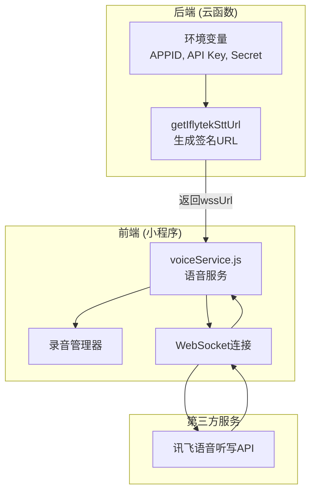
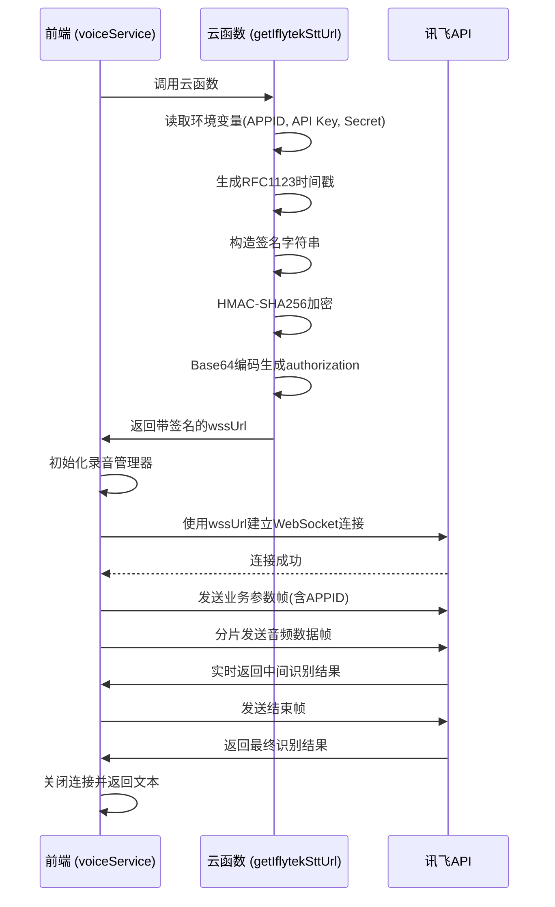
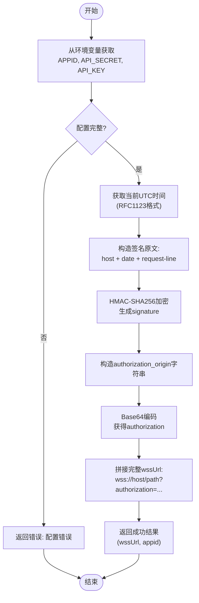
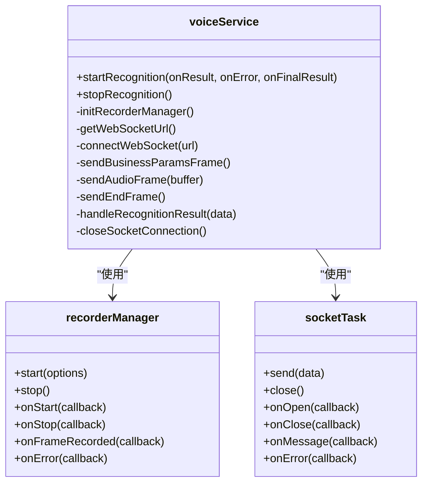
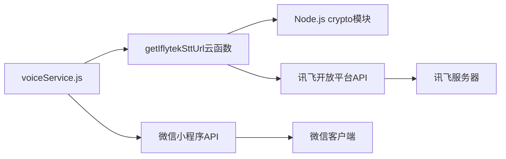

# 讯飞语音听写（IFlytek STT）API集成

<cite>
**本文档引用文件**  
- [getIflytekSttUrl/index.js](file://cloudfunctions/getIflytekSttUrl/index.js)
- [voiceService.js](file://miniprogram/services/voiceService.js)
- [讯飞语音api文档.md](file://doc/参考文档/讯飞语音api文档.md)
- [iat-ws-node.js](file://doc/参考文档/iat_ws_nodejs_demo/iat-ws-node.js)
- [getIflytekSttUrl.md](file://doc/开发文档/cloudfunctions/getIflytekSttUrl.md)
- [HeartChat 语音输入功能 (讯飞语音听写) 开发文档.md](file://doc/开发文档/HeartChat 语音输入功能 (讯飞语音听写) 开发文档.md)
</cite>

## 目录
1. [简介](#简介)
2. [项目结构](#项目结构)
3. [核心组件](#核心组件)
4. [架构概览](#架构概览)
5. [详细组件分析](#详细组件分析)
6. [依赖分析](#依赖分析)
7. [性能考量](#性能考量)
8. [故障排查指南](#故障排查指南)
9. [结论](#结论)

## 简介
本文档详细说明了在 HeartChat 项目中集成讯飞语音听写（Speech-to-Text）API 的完整流程。重点阐述了后端 `getIflytekSttUrl` 云函数如何生成带签名的临时 WebSocket URL，以及前端 `voiceService.js` 如何调用该 URL 并处理实时转写结果。文档涵盖音频格式支持、采样率要求、分片上传机制、错误处理策略、调试建议、性能优化技巧及弱网容错方案，并结合情感倾诉场景说明实际使用流程。

## 项目结构
HeartChat 项目的语音识别功能主要由后端云函数和前端服务模块协同实现。后端负责安全生成带签名的连接 URL，前端负责音频采集、WebSocket 通信和结果处理。

**Diagram sources**
- [getIflytekSttUrl/index.js](file://cloudfunctions/getIflytekSttUrl/index.js#L1-L70)
- [voiceService.js](file://miniprogram/services/voiceService.js#L1-L486)

**Section sources**
- [getIflytekSttUrl/index.js](file://cloudfunctions/getIflytekSttUrl/index.js#L1-L70)
- [voiceService.js](file://miniprogram/services/voiceService.js#L1-L486)

## 核心组件
本系统的核心组件包括后端的 `getIflytekSttUrl` 云函数和前端的 `voiceService.js` 模块。云函数负责实现讯飞 API 的签名算法，生成安全的 WebSocket 连接地址，避免敏感信息在前端暴露。前端服务则封装了录音、连接、数据分片上传和实时结果处理的完整逻辑。

**Section sources**
- [getIflytekSttUrl/index.js](file://cloudfunctions/getIflytekSttUrl/index.js#L1-L70)
- [voiceService.js](file://miniprogram/services/voiceService.js#L1-L486)

## 架构概览
系统采用前后端分离的架构。前端通过调用云函数获取临时连接凭证，然后直接与讯飞的 WebSocket 服务建立连接进行实时语音转写。这种设计确保了 API 密钥的安全性，同时利用 WebSocket 实现了低延迟的流式识别。

**Diagram sources**
- [getIflytekSttUrl/index.js](file://cloudfunctions/getIflytekSttUrl/index.js#L1-L70)
- [voiceService.js](file://miniprogram/services/voiceService.js#L1-L486)

## 详细组件分析

### getIflytekSttUrl 云函数分析
该云函数是整个语音识别流程的安全核心，负责生成符合讯飞 WebAPI 2.0 协议的鉴权 URL。

**Diagram sources**
- [getIflytekSttUrl/index.js](file://cloudfunctions/getIflytekSttUrl/index.js#L1-L70)

**Section sources**
- [getIflytekSttUrl/index.js](file://cloudfunctions/getIflytekSttUrl/index.js#L1-L70)

### voiceService.js 前端服务分析
该模块封装了前端语音识别的完整生命周期，从启动识别到结果处理。

**Diagram sources**
- [voiceService.js](file://miniprogram/services/voiceService.js#L1-L486)

**Section sources**
- [voiceService.js](file://miniprogram/services/voiceService.js#L1-L486)

## 依赖分析
系统依赖于腾讯云函数环境、微信小程序基础库和讯飞开放平台API。云函数依赖 Node.js 的 `crypto` 模块进行签名计算，前端依赖微信的 `wx.getRecorderManager` 和 `wx.connectSocket` API。

**Diagram sources**
- [getIflytekSttUrl/index.js](file://cloudfunctions/getIflytekSttUrl/index.js#L1-L70)
- [voiceService.js](file://miniprogram/services/voiceService.js#L1-L486)

**Section sources**
- [getIflytekSttUrl/index.js](file://cloudfunctions/getIflytekSttUrl/index.js#L1-L70)
- [voiceService.js](file://miniprogram/services/voiceService.js#L1-L486)

## 性能考量
- **预连接优化**：`voiceService.js` 在模块加载时即初始化 `recorderManager`，减少首次录音的延迟。
- **TCP优化**：WebSocket 连接启用 `tcpNoDelay`，减少网络延迟。
- **静音预热**：在连接建立后立即发送静音帧，帮助讯飞服务器预热，避免开头语音丢失。
- **分片策略**：使用较小的 `frameSize` 提高响应速度，确保音频数据的实时性。

## 故障排查指南
- **错误：获取语音服务连接失败**：检查云函数环境变量 `IFLYTEK_APPID`, `IFLYTEK_API_SECRET`, `IFLYTEK_API_KEY` 是否正确配置。
- **错误：WebSocket连接错误**：确认小程序后台已添加 `wss://iat-api.xfyun.cn` 到 socket 合法域名。
- **识别结果为空或错误**：确保在真机上调试，模拟器可能无法正确获取麦克风权限或返回空结果。
- **音频质量差**：检查录音参数，确保采样率为 16000 Hz，单声道，PCM 格式。

**Section sources**
- [getIflytekSttUrl/index.js](file://cloudfunctions/getIflytekSttUrl/index.js#L1-L70)
- [voiceService.js](file://miniprogram/services/voiceService.js#L1-L486)
- [讯飞语音api文档.md](file://doc/参考文档/讯飞语音api文档.md#L1-L119)

## 结论
通过 `getIflytekSttUrl` 云函数和 `voiceService.js` 的协同工作，HeartChat 成功集成了讯飞高精度的语音听写服务。该方案安全、高效，支持实时流式识别，为用户提供了流畅的语音输入体验。在情感倾诉等场景中，用户可以通过语音自然地表达情绪，系统能快速将其转化为文本，为进一步的情感分析和智能对话提供基础。