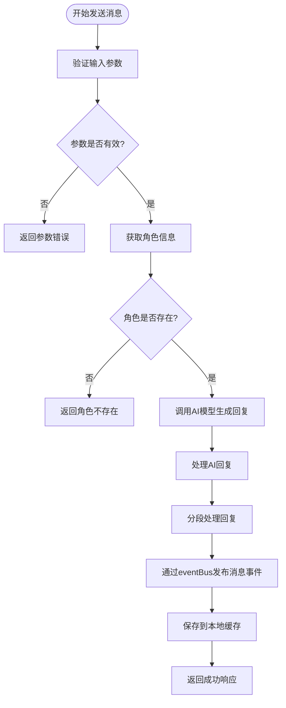
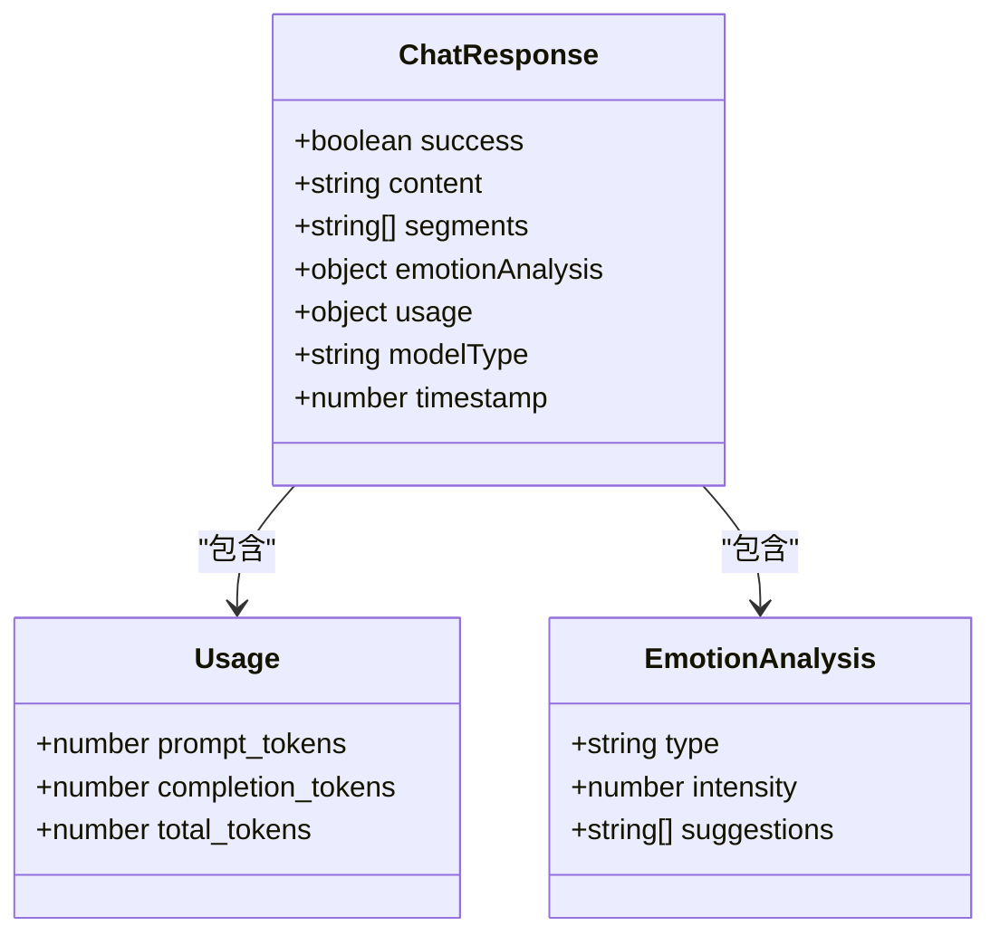
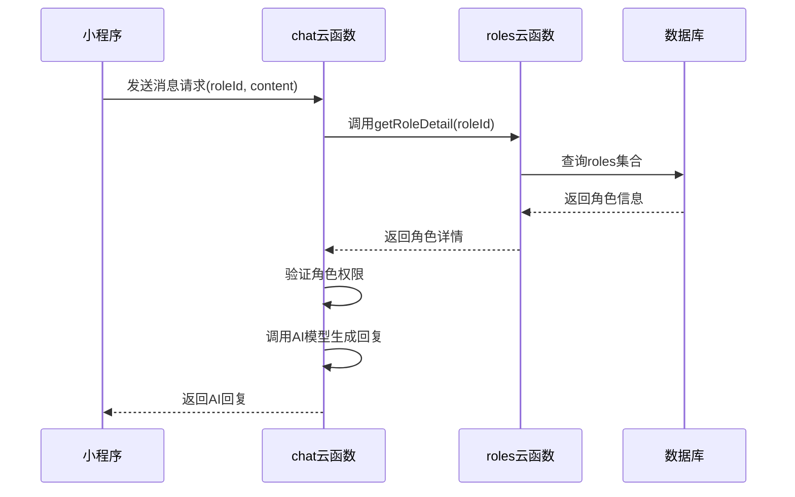
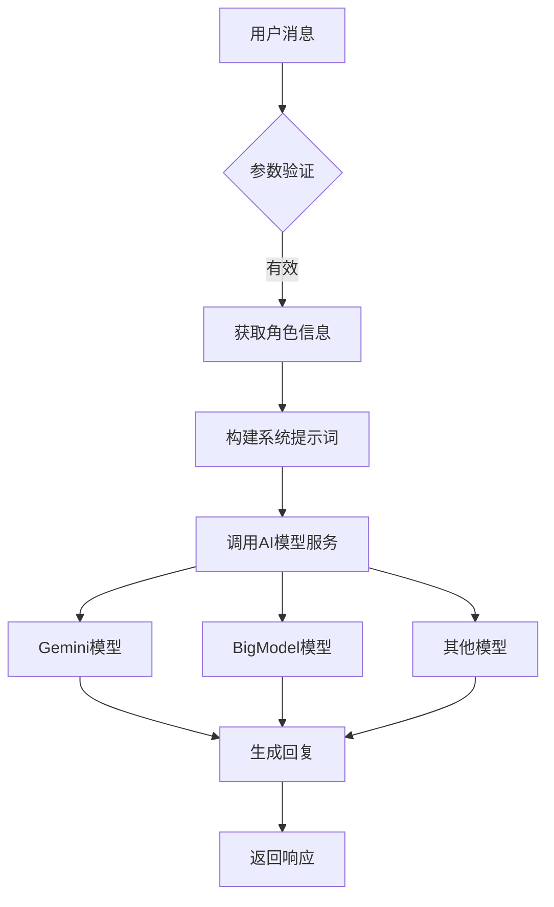
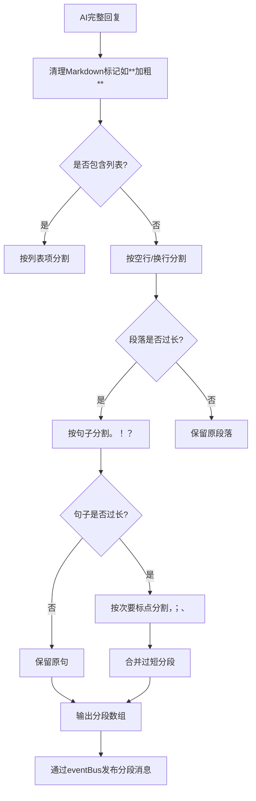
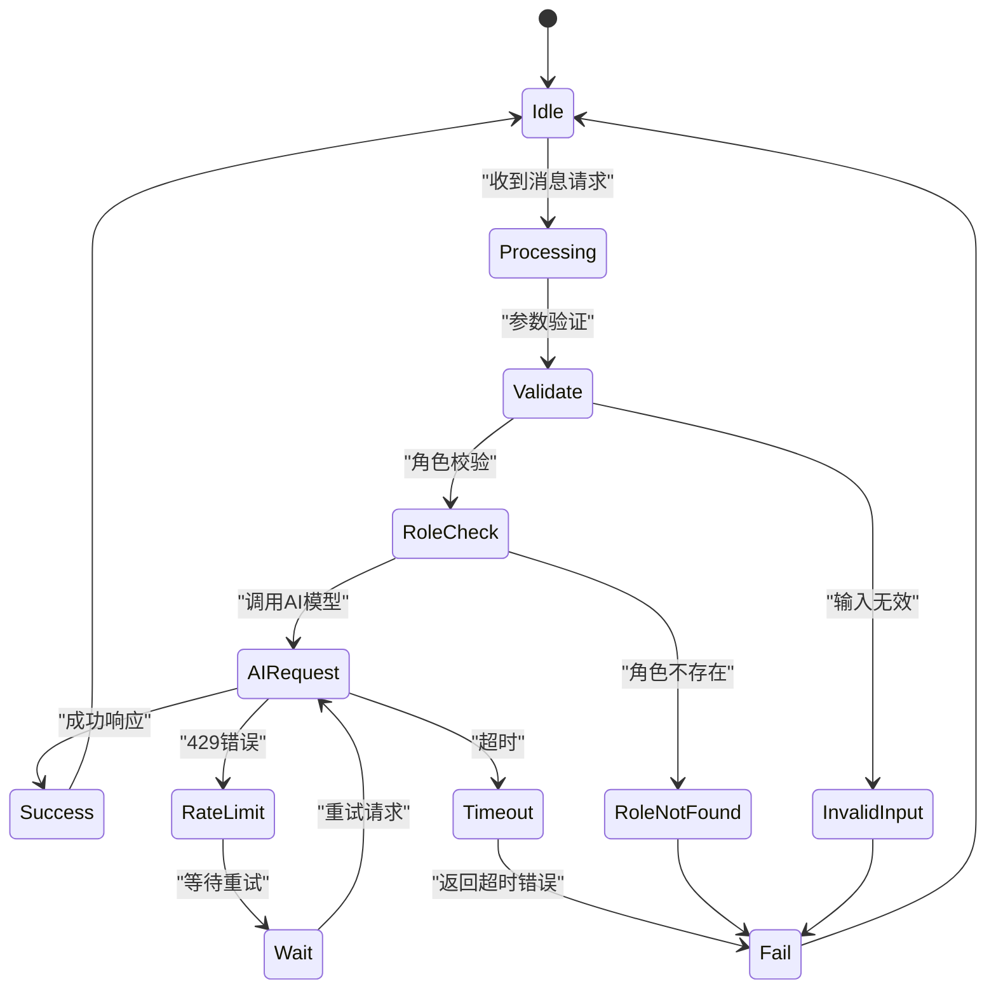

# 聊天消息API

<cite>
**本文档引用的文件**  
- [index.js](file://cloudfunctions/chat/index.js)
- [aiModelService.js](file://cloudfunctions/chat/aiModelService.js)
- [chatCacheService.js](file://miniprogram/services/chatCacheService.js)
- [eventBus.js](file://miniprogram/services/eventBus.js)
- [roles/index.js](file://cloudfunctions/roles/index.js)
</cite>

## 目录
1. [简介](#简介)
2. [API调用方式](#api调用方式)
3. [请求参数说明](#请求参数说明)
4. [响应字段说明](#响应字段说明)
5. [权限与依赖](#权限与依赖)
6. [内部处理机制](#内部处理机制)
7. [消息分段输出机制](#消息分段输出机制)
8. [本地缓存与延迟加载示例](#本地缓存与延迟加载示例)
9. [常见错误码](#常见错误码)
10. [附录](#附录)

## 简介

本API用于在小程序中通过云函数发送聊天消息，支持基于角色的AI对话功能。用户可通过`cloud.callFunction('chat', { roleId, message, history })`调用该接口，系统将根据角色ID加载对应的提示词模板，并调用Gemini或BigModel等AI模型生成回复。支持消息分段输出、本地缓存、情绪分析等功能，适用于构建智能对话体验。

**Section sources**
- [index.js](file://cloudfunctions/chat/index.js#L1-L50)

## API调用方式

通过微信小程序的云函数调用机制，使用以下方式发起聊天请求：

```javascript
wx.cloud.callFunction({
  name: 'chat',
  data: {
    action: 'sendMessage',
    roleId: '角色ID',
    content: '用户输入的文本',
    history: [/* 可选的历史消息数组 */]
  }
})
```

其中`action`参数指定子功能，`sendMessage`为发送消息的核心操作。该调用将触发云函数处理流程，返回AI生成的回复内容。

**Section sources**
- [index.js](file://cloudfunctions/chat/index.js#L500-L520)

## 请求参数说明

| 参数 | 类型 | 必填 | 说明 |
|------|------|------|------|
| `roleId` | string | 是 | 角色ID，用于关联预设的提示词模板，决定AI的对话风格和行为模式 |
| `message` | string | 是 | 用户输入的文本内容，不能为空或仅包含空白字符 |
| `history` | array | 否 | 最近N条对话记录数组，用于维持上下文记忆，提升对话连贯性 |



**Diagram sources**
- [index.js](file://cloudfunctions/chat/index.js#L500-L600)
- [aiModelService.js](file://cloudfunctions/chat/aiModelService.js#L300-L400)

**Section sources**
- [index.js](file://cloudfunctions/chat/index.js#L500-L600)

## 响应字段说明

成功响应返回以下字段：

| 字段 | 类型 | 说明 |
|------|------|------|
| `success` | boolean | 操作是否成功 |
| `content` | string | AI回复的完整文本内容 |
| `segments` | array | 分段后的消息数组，用于实现流式输出 |
| `emotionAnalysis` | object | 本次对话的情绪分析结果（可选） |
| `usage` | object | token使用情况，包含`prompt_tokens`、`completion_tokens`、`total_tokens` |
| `modelType` | string | 使用的AI模型类型（如gemini、bigmodel） |
| `timestamp` | number | 响应时间戳 |



**Diagram sources**
- [index.js](file://cloudfunctions/chat/index.js#L400-L450)
- [aiModelService.js](file://cloudfunctions/chat/aiModelService.js#L450-L500)

**Section sources**
- [index.js](file://cloudfunctions/chat/index.js#L400-L450)

## 权限与依赖

该接口依赖以下条件：

- **用户登录状态**：必须已通过微信登录，获取有效的`OPENID`，用于标识用户身份和数据隔离。
- **角色权限校验**：通过调用`roles`云函数的`getRoleDetail`接口验证角色ID的有效性，确保角色存在且用户有权访问。
- **环境变量配置**：需在云开发控制台配置各AI平台的API密钥（如`GEMINI_API_KEY`、`ZHIPU_API_KEY`等）。



**Diagram sources**
- [index.js](file://cloudfunctions/chat/index.js#L550-L580)
- [roles/index.js](file://cloudfunctions/roles/index.js#L97-L134)

**Section sources**
- [index.js](file://cloudfunctions/chat/index.js#L550-L580)
- [roles/index.js](file://cloudfunctions/roles/index.js#L97-L134)

## 内部处理机制

聊天云函数内部采用模块化设计，核心逻辑如下：

1. **参数验证**：检查`roleId`和`message`是否有效。
2. **角色信息获取**：通过`cloud.callFunction`调用`roles`云函数获取角色详情，包括提示词模板。
3. **AI模型调用**：使用`aiModelService`统一服务调用Gemini或BigModel等AI模型。
4. **上下文管理**：结合`history`参数和数据库中的历史消息，构建完整的对话上下文。
5. **回复生成**：AI模型根据系统提示词和用户输入生成回复。

`aiModelService`模块支持多平台AI模型，通过配置`MODEL_PLATFORMS`对象实现灵活切换。当前支持Gemini、智谱AI（GLM）、OpenAI、Claude等多种模型。



**Diagram sources**
- [aiModelService.js](file://cloudfunctions/chat/aiModelService.js#L100-L200)
- [index.js](file://cloudfunctions/chat/index.js#L400-L450)

**Section sources**
- [aiModelService.js](file://cloudfunctions/chat/aiModelService.js#L100-L200)

## 消息分段输出机制

为提升用户体验，避免AI回复一次性输出过长文本，系统采用分段输出机制：

- **分段策略**：根据标点符号（句号、问号、感叹号、逗号等）和换行符进行智能分割。
- **最大长度限制**：每段不超过150个字符，避免单段过长。
- **语义完整性**：优先保持句子和段落的完整性，避免在句子中间断开。
- **事件驱动**：通过`eventBus`发布`MESSAGE_CREATED`事件，前端监听并逐段显示。

分段逻辑由`splitMessage`函数实现，支持Markdown语法清理，并对列表、编号等特殊格式进行保护。



**Diagram sources**
- [index.js](file://cloudfunctions/chat/index.js#L100-L300)
- [eventBus.js](file://miniprogram/services/eventBus.js#L50-L100)

**Section sources**
- [index.js](file://cloudfunctions/chat/index.js#L100-L300)

## 本地缓存与延迟加载示例

在小程序端，可通过`chatCacheService`实现聊天记录的本地缓存与延迟加载，提升用户体验。

### 缓存服务使用示例

```javascript
// 引入缓存服务
const chatCacheService = require('services/chatCacheService.js');

// 保存新消息到缓存
chatCacheService.saveMessagesToCache(chatId, messages, true, null, roleInfo);

// 从缓存加载最新消息
const cachedMessages = chatCacheService.loadMessagesFromCache(chatId);

// 分页加载历史消息
const historyPage = chatCacheService.loadMessagesFromCache(chatId, pageNum);
```

### 延迟加载实现

```javascript
Page({
  data: {
    messages: [],
    pageNum: 1,
    hasMore: true
  },

  onLoad() {
    // 优先加载本地缓存
    const cached = chatCacheService.loadMessagesFromCache(this.data.chatId);
    if (cached) {
      this.setData({ messages: cached });
    }
    // 同步从云端获取最新数据
    this.loadLatestMessages();
  },

  async loadMoreHistory() {
    if (!this.data.hasMore) return;

    const history = chatCacheService.loadMessagesFromCache(this.data.chatId, this.data.pageNum);
    if (history) {
      this.setData({
        messages: [...history, ...this.data.messages],
        pageNum: this.data.pageNum + 1
      });
    } else {
      // 从云端分页获取
      await this.fetchHistoryFromCloud(this.data.pageNum);
    }
  }
})
```

**Section sources**
- [chatCacheService.js](file://miniprogram/services/chatCacheService.js#L1-L200)
- [eventBus.js](file://miniprogram/services/eventBus.js#L1-L50)

## 常见错误码

| 错误码 | 说明 | 处理建议 |
|--------|------|----------|
| `ROLE_NOT_FOUND` | 角色不存在或ID无效 | 检查`roleId`是否正确，确认角色已创建并发布 |
| `MODEL_REQUEST_FAILED` | AI模型请求失败 | 检查网络连接，确认API密钥配置正确，稍后重试 |
| `INVALID_MESSAGE` | 消息内容无效（空或仅空白） | 确保用户输入非空文本 |
| `AUTH_FAILED` | 认证失败（API密钥无效） | 检查云开发环境变量中的API密钥配置 |
| `RATE_LIMIT_EXCEEDED` | 请求频率过高（429错误） | 降低请求频率，增加重试间隔 |
| `CONNECTION_TIMEOUT` | 连接超时 | 检查网络状况，确认AI服务端点可达 |

错误处理采用重试机制，对于429错误会自动指数退避重试，最多3次。



**Diagram sources**
- [aiModelService.js](file://cloudfunctions/chat/aiModelService.js#L200-L300)
- [index.js](file://cloudfunctions/chat/index.js#L700-L800)

**Section sources**
- [aiModelService.js](file://cloudfunctions/chat/aiModelService.js#L200-L300)

## 附录

### 依赖环境变量

| 环境变量 | 说明 |
|----------|------|
| `GEMINI_API_KEY` | Google Gemini API密钥 |
| `ZHIPU_API_KEY` | 智谱AI（GLM）API密钥 |
| `OPENAI_API_KEY` | OpenAI API密钥 |
| `WHIMSY_API_KEY` | Whimsy AI API密钥 |
| `CROND_API_KEY` | Crond API密钥 |
| `CLOSEAI_API_KEY` | CloseAI API密钥 |
| `GROK_API_KEY` | Grok API密钥 |
| `CLAUDE_API_KEY` | Claude API密钥 |

### 事件总线事件类型

| 事件类型 | 说明 |
|----------|------|
| `MESSAGE_CREATED` | 新消息创建 |
| `MESSAGE_UPDATED` | 消息更新 |
| `EMOTION_ANALYZED` | 情绪分析完成 |
| `ROLE_SELECTED` | 角色被选择 |
| `USER_LOGGED_IN` | 用户登录 |

**Section sources**
- [aiModelService.js](file://cloudfunctions/chat/aiModelService.js#L50-L100)
- [eventBus.js](file://miniprogram/services/eventBus.js#L10-L50)