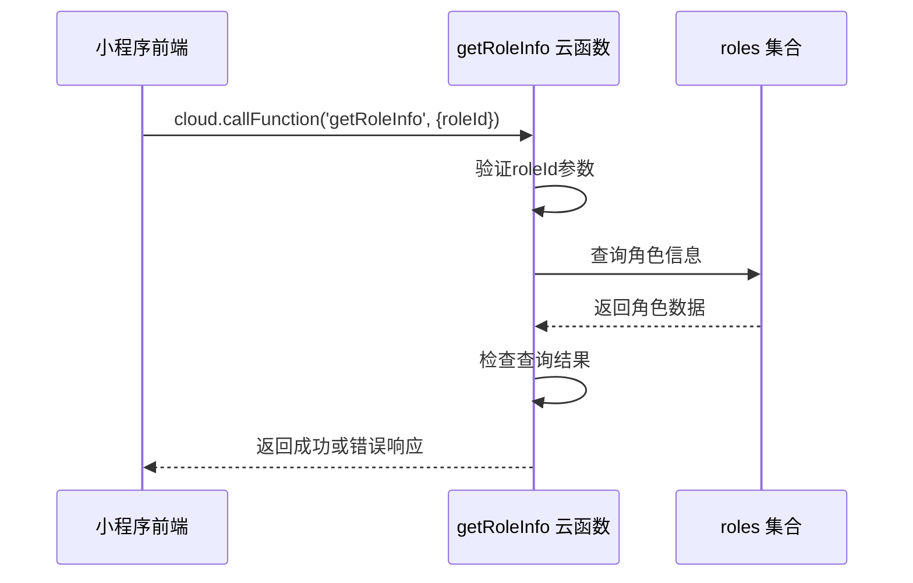
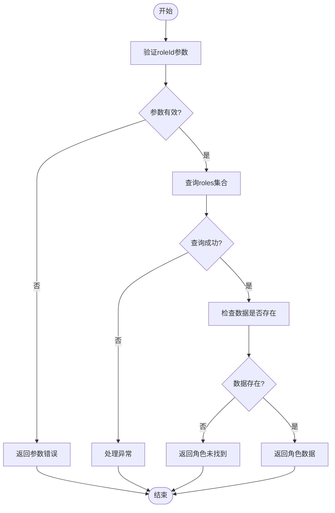
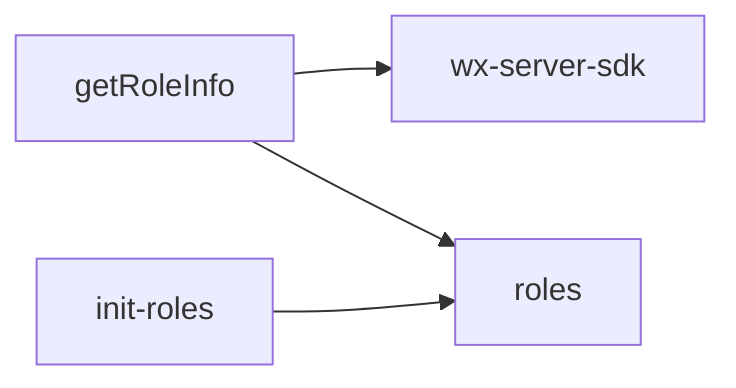

# 角色信息获取API

<cite>
**本文档引用文件**  
- [getRoleInfo/index.js](file://cloudfunctions/getRoleInfo/index.js)
- [roles/init-roles.js](file://cloudfunctions/roles/init-roles.js)
- [doc/开发文档/cloudfunctions/getRoleInfo.md](file://doc/开发文档/cloudfunctions/getRoleInfo.md)
- [doc/使用文档/roles云函数使用文档.md](file://doc/使用文档/roles云函数使用文档.md)
- [miniprogram/pages/role-select/role-select.js](file://miniprogram/pages/role-select/role-select.js)
- [miniprogram/pages/home/home.js](file://miniprogram/pages/home/home.js)
</cite>

## 目录
1. [简介](#简介)
2. [项目结构](#项目结构)
3. [核心组件](#核心组件)
4. [架构概述](#架构概述)
5. [详细组件分析](#详细组件分析)
6. [依赖分析](#依赖分析)
7. [性能考虑](#性能考虑)
8. [故障排除指南](#故障排除指南)
9. [结论](#结论)

## 简介
`getRoleInfo` 云函数为小程序提供角色信息查询服务，支持通过角色ID获取角色的元数据，包括名称、头像、性格描述、提示词模板（prompt）等。该接口在角色选择页和聊天页初始化时发挥关键作用，支持匿名访问，无需强制登录。接口设计简洁高效，结合数据库查询与初始化逻辑，确保数据一致性。

## 项目结构
`getRoleInfo` 云函数位于 `cloudfunctions/getRoleInfo` 目录下，包含主入口文件 `index.js` 和依赖配置 `package.json`。该函数独立部署，专用于角色信息查询，不涉及复杂业务逻辑。角色数据存储于 `roles` 集合，初始化逻辑由 `roles/init-roles.js` 统一管理。

```mermaid
graph TB
subgraph "云函数"
getRoleInfo[getRoleInfo/index.js]
end
subgraph "数据库"
roles[roles 集合]
end
subgraph "初始化逻辑"
initRoles[roles/init-roles.js]
end
getRoleInfo --> roles : "读取数据"
initRoles --> roles : "初始化数据"
```

**Diagram sources**
- [getRoleInfo/index.js](file://cloudfunctions/getRoleInfo/index.js#L1-L51)
- [roles/init-roles.js](file://cloudfunctions/roles/init-roles.js#L1-L104)

**Section sources**
- [getRoleInfo/index.js](file://cloudfunctions/getRoleInfo/index.js#L1-L51)
- [roles/init-roles.js](file://cloudfunctions/roles/init-roles.js#L1-L104)

## 核心组件
`getRoleInfo` 的核心逻辑集中在 `index.js` 中，实现参数验证、数据库查询和结果返回。函数通过 `wx-server-sdk` 初始化云环境，使用 `cloud.database()` 获取数据库实例，根据 `roleId` 查询 `roles` 集合。若角色存在，返回完整数据；否则返回 `ROLE_NOT_FOUND` 错误。该组件设计轻量，专注于单一职责，确保高可用性和低延迟。

**Section sources**
- [getRoleInfo/index.js](file://cloudfunctions/getRoleInfo/index.js#L1-L51)

## 架构概述
系统架构采用前后端分离模式，前端通过 `wx.cloud.callFunction` 调用 `getRoleInfo` 云函数，后端从 `roles` 集合读取数据并返回。`init-roles.js` 确保数据库初始化时预置系统角色，保证数据一致性。该架构支持高并发查询，适用于角色选择页和聊天页的初始化场景。



**Diagram sources**
- [getRoleInfo/index.js](file://cloudfunctions/getRoleInfo/index.js#L1-L51)
- [roles/init-roles.js](file://cloudfunctions/roles/init-roles.js#L1-L104)

## 详细组件分析

### getRoleInfo 函数分析
`getRoleInfo` 函数实现角色信息查询的核心逻辑。函数首先验证 `roleId` 参数，若缺失则返回错误。随后，通过数据库查询获取角色数据。若查询成功且数据存在，返回角色详情；否则返回 `未找到角色信息` 错误。异常被捕获并返回具体错误信息，便于前端处理。

#### 函数调用流程


**Diagram sources**
- [getRoleInfo/index.js](file://cloudfunctions/getRoleInfo/index.js#L1-L51)

**Section sources**
- [getRoleInfo/index.js](file://cloudfunctions/getRoleInfo/index.js#L1-L51)

### 批量获取角色列表示例
在角色选择页面，可通过批量查询优化性能。前端提取角色ID数组，使用 `db.command.in` 一次性查询多个角色。此方法减少网络请求次数，提升加载速度。

```javascript
[SPEC SYMBOL](file://miniprogram/pages/home/home.js#L653-L680)
```

### 数据一致性保障
`init-roles.js` 在系统初始化时检查 `roles` 集合是否为空，若为空则插入预置角色数据。此机制确保数据库始终有基础数据，避免因数据缺失导致查询失败。

```javascript
[SPEC SYMBOL](file://cloudfunctions/roles/init-roles.js#L50-L80)
```

## 依赖分析
`getRoleInfo` 依赖 `wx-server-sdk` 进行云环境初始化和数据库操作，依赖 `roles` 集合存储角色数据。`init-roles.js` 作为初始化脚本，确保数据一致性。无外部服务依赖，降低系统复杂性。



**Diagram sources**
- [getRoleInfo/index.js](file://cloudfunctions/getRoleInfo/index.js#L1-L51)
- [roles/init-roles.js](file://cloudfunctions/roles/init-roles.js#L1-L104)

**Section sources**
- [getRoleInfo/index.js](file://cloudfunctions/getRoleInfo/index.js#L1-L51)
- [roles/init-roles.js](file://cloudfunctions/roles/init-roles.js#L1-L104)

## 性能考虑
- **查询效率**：直接根据 `_id` 查询，数据库索引优化，响应迅速。
- **数据传输**：仅返回单个角色数据，减少网络开销。
- **缓存建议**：可对热门角色信息进行缓存，进一步提升性能。
- **批量查询**：支持一次查询多个角色，减少请求次数。

## 故障排除指南
- **ROLE_NOT_FOUND**：检查 `roleId` 是否正确，确认角色是否存在。
- **参数缺失**：确保请求中包含 `roleId` 参数。
- **数据库错误**：检查数据库连接和读权限设置。
- **系统错误**：查看云函数日志，获取详细错误信息。

**Section sources**
- [getRoleInfo/index.js](file://cloudfunctions/getRoleInfo/index.js#L1-L51)
- [doc/开发文档/cloudfunctions/getRoleInfo.md](file://doc/开发文档/cloudfunctions/getRoleInfo.md#L72-L135)

## 结论
`getRoleInfo` 云函数为角色信息查询提供了高效、可靠的解决方案。其简洁的设计、完善的数据一致性保障和明确的错误处理机制，使其成为角色选择页和聊天页初始化的关键组件。通过支持匿名访问和批量查询，进一步提升了用户体验和系统性能。