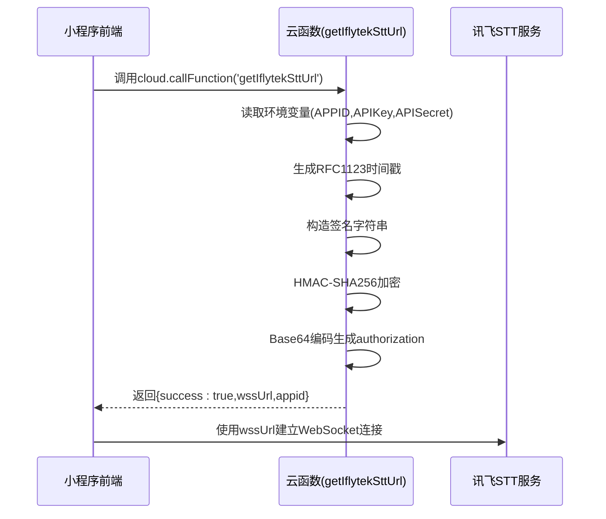
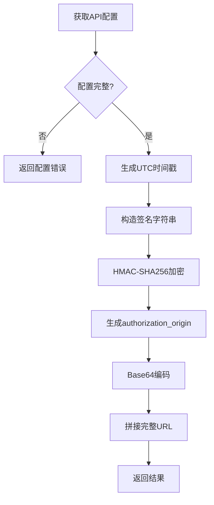
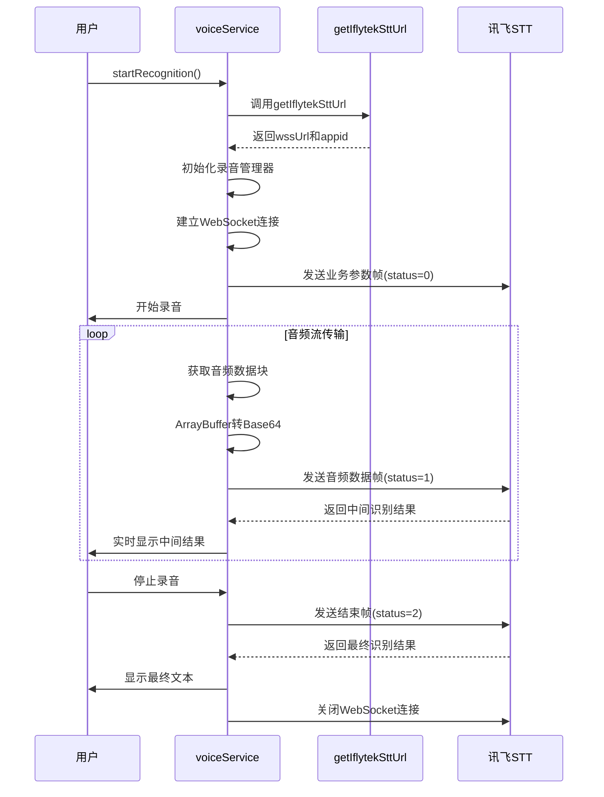

# 讯飞语音转文字临时URL获取API

<cite>
**本文档引用文件**  
- [getIflytekSttUrl/index.js](file://cloudfunctions/getIflytekSttUrl/index.js)
- [voiceService.js](file://miniprogram/services/voiceService.js)
- [chat-input/index.js](file://miniprogram/packageChat/components/chat-input/index.js)
- [getIflytekSttUrl.md](file://doc/开发文档/cloudfunctions/getIflytekSttUrl.md)
- [HeartChat 语音输入功能 (讯飞语音听写) 开发文档.md](file://doc/开发文档/HeartChat 语音输入功能 (讯飞语音听写) 开发文档.md)
</cite>

## 目录
1. [接口概述](#接口概述)
2. [API响应结构](#api响应结构)
3. [鉴权机制实现](#鉴权机制实现)
4. [前端集成流程](#前端集成流程)
5. [安全性设计](#安全性设计)
6. [常见问题排查](#常见问题排查)

## 接口概述

`getIflytekSttUrl`云函数用于生成讯飞语音听写服务所需的WebSocket连接地址。该接口通过`cloud.callFunction('getIflytekSttUrl')`调用，为前端提供带签名的WSS连接地址，支持实时语音流传输。此设计将敏感的API密钥安全地存储在后端环境变量中，避免在前端暴露。

**接口调用流程**


**Diagram sources**
- [getIflytekSttUrl/index.js](file://cloudfunctions/getIflytekSttUrl/index.js#L1-L69)
- [HeartChat 语音输入功能 (讯飞语音听写) 开发文档.md](file://doc/开发文档/HeartChat 语音输入功能 (讯飞语音听写) 开发文档.md#L19-L55)

**Section sources**
- [getIflytekSttUrl/index.js](file://cloudfunctions/getIflytekSttUrl/index.js#L1-L69)
- [getIflytekSttUrl.md](file://doc/开发文档/cloudfunctions/getIflytekSttUrl.md#L1-L62)

## API响应结构

该接口返回包含鉴权信息的完整WebSocket URL和相关元数据。

**成功响应示例**
```json
{
  "success": true,
  "wssUrl": "wss://iat-api.xfyun.cn/v2/iat?authorization=base64encoded&date=Mon%2C%2002%20Aug%202021%2008%3A41%3A30%20GMT&host=iat-api.xfyun.cn",
  "appid": "60f9a524"
}
```

**失败响应示例**
```json
{
  "success": false,
  "error": "语音服务配置错误"
}
```

**响应字段说明**
| 字段 | 类型 | 必填 | 说明 |
|------|------|------|------|
| success | boolean | 是 | 操作是否成功 |
| wssUrl | string | 是 | 带鉴权参数的完整WebSocket连接地址 |
| appid | string | 是 | 讯飞应用ID，用于前端业务参数帧 |
| error | string | 否 | 错误信息，仅在success为false时存在 |

**Section sources**
- [getIflytekSttUrl/index.js](file://cloudfunctions/getIflytekSttUrl/index.js#L50-L60)
- [getIflytekSttUrl.md](file://doc/开发文档/cloudfunctions/getIflytekSttUrl.md#L1-L62)

## 鉴权机制实现

云函数通过讯飞WebAPI 2.0协议生成符合要求的签名认证信息，确保请求的合法性。

**鉴权生成流程**


**核心实现步骤**
1. **配置获取**：从环境变量`IFLYTEK_APPID`、`IFLYTEK_API_SECRET`、`IFLYTEK_API_KEY`读取讯飞API配置
2. **时间生成**：获取当前UTC时间并格式化为RFC1123格式（如`Mon, 02 Aug 2021 08:41:30 GMT`）
3. **签名构造**：创建待签名字符串`host: ${host}\ndate: ${date}\nGET ${requestLine} HTTP/1.1`
4. **HMAC加密**：使用`API_SECRET`对签名字符串进行HMAC-SHA256加密并Base64编码
5. **授权生成**：构造`authorization_origin`字符串并进行Base64编码
6. **URL拼接**：组合`wss://${host}${requestLine}?authorization=${authorization}&date=${encodeURIComponent(date)}&host=${host}`

**Section sources**
- [getIflytekSttUrl/index.js](file://cloudfunctions/getIflytekSttUrl/index.js#L15-L45)
- [HeartChat 语音输入功能 (讯飞语音听写) 开发文档.md](file://doc/开发文档/HeartChat 语音输入功能 (讯飞语音听写) 开发文档.md#L56-L73)

## 前端集成流程

在`voiceService`中集成该URL实现完整的语音输入功能，包括录音管理、WebSocket连接和结果处理。

**语音识别流程**


**代码集成示例**
```javascript
// 导入语音服务模块
const voiceService = require('../../../services/voiceService');

// 开始语音识别
voiceService.startRecognition(
  // 中间结果回调
  (text) => {
    console.log('中间识别结果:', text);
    // 实时更新UI
  },
  // 错误回调
  (error) => {
    console.error('识别错误:', error);
  },
  // 最终结果回调
  (finalText) => {
    console.log('最终识别结果:', finalText);
    // 发送消息
  }
);

// 停止语音识别
voiceService.stopRecognition();
```

**Section sources**
- [voiceService.js](file://miniprogram/services/voiceService.js#L0-L485)
- [chat-input/index.js](file://miniprogram/packageChat/components/chat-input/index.js#L0-L590)

## 安全性设计

系统采用多层次安全设计，确保语音服务的安全性和防滥用。

**安全机制**
- **密钥隔离**：API密钥通过云函数环境变量存储，前端无法直接访问
- **临时URL**：生成的WebSocket URL包含时效性鉴权信息，有效期限制在5分钟内
- **HTTPS传输**：所有通信通过加密的WSS协议进行
- **签名验证**：讯飞服务端验证每次请求的签名合法性
- **域名白名单**：在微信小程序后台配置了`wss://iat-api.xfyun.cn`合法域名

**环境变量配置**
```javascript
// 必需的环境变量
IFLYTEK_APPID: '60f9a524'           // 讯飞应用ID
IFLYTEK_API_SECRET: 'ZDk4Yjg4NzNm...' // 讯飞API密钥
IFLYTEK_API_KEY: '4feb62558a67...'    // 讯飞API密钥
```

**Section sources**
- [getIflytekSttUrl/index.js](file://cloudfunctions/getIflytekSttUrl/index.js#L10-L15)
- [getIflytekSttUrl.md](file://doc/开发文档/cloudfunctions/getIflytekSttUrl.md#L132-L137)

## 常见问题排查

列出常见失败原因及相应的排查步骤。

**常见错误及解决方案**
| 错误现象 | 可能原因 | 排查步骤 |
|---------|--------|--------|
| 缺少讯飞API配置 | 环境变量未设置 | 1. 检查云开发控制台环境变量配置<br>2. 确认变量名正确(IFLYTEK_APPID, IFLYTEK_API_SECRET, IFLYTEK_API_KEY)<br>3. 验证变量值是否正确 |
| WebSocket连接失败 | 网络问题或域名未配置 | 1. 检查小程序后台`socket合法域名`是否包含`wss://iat-api.xfyun.cn`<br>2. 测试网络连接是否正常<br>3. 检查防火墙设置 |
| 录音权限拒绝 | 用户未授权 | 1. 引导用户在设置中开启录音权限<br>2. 检查`scope.record`权限请求是否正常触发<br>3. 确认用户已同意授权 |
| 识别结果为空 | 音频质量问题 | 1. 检查录音设备是否正常<br>2. 确认录音环境噪音较小<br>3. 验证音频格式是否符合要求(PCM,16kHz,单声道) |
| 签名验证失败 | 时间不同步 | 1. 确认服务器时间准确<br>2. 检查UTC时间格式是否正确<br>3. 验证签名字符串构造是否符合规范 |

**调试建议**
- 开启`voiceService.js`中的`isDev = true`以获取详细日志
- 使用微信开发者工具的网络面板监控WebSocket连接
- 检查云函数日志中的错误信息
- 确认讯飞开放平台的应用状态和配额使用情况

**Section sources**
- [getIflytekSttUrl/index.js](file://cloudfunctions/getIflytekSttUrl/index.js#L35-L40)
- [voiceService.js](file://miniprogram/services/voiceService.js#L0-L485)
- [HeartChat 语音输入功能 (讯飞语音听写) 开发文档.md](file://doc/开发文档/HeartChat 语音输入功能 (讯飞语音听写) 开发文档.md#L280-L350)