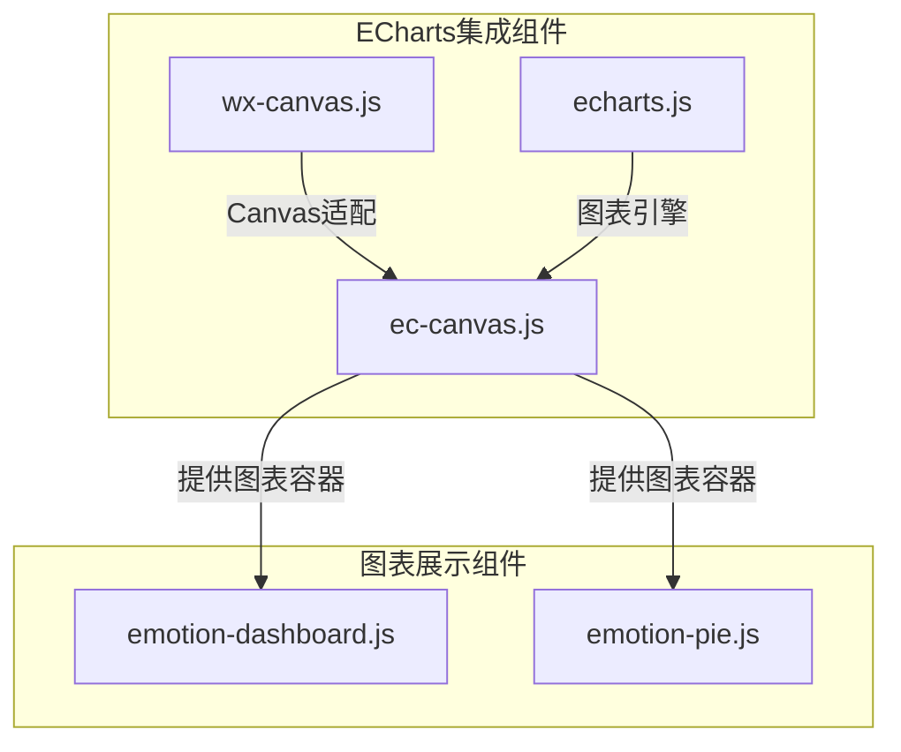
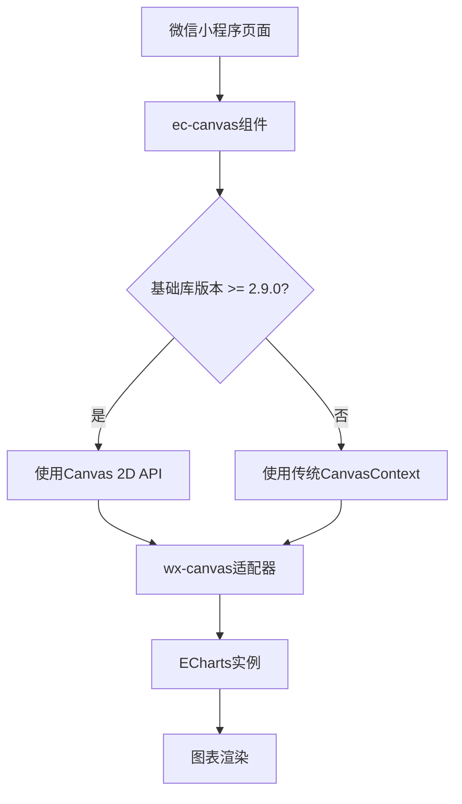
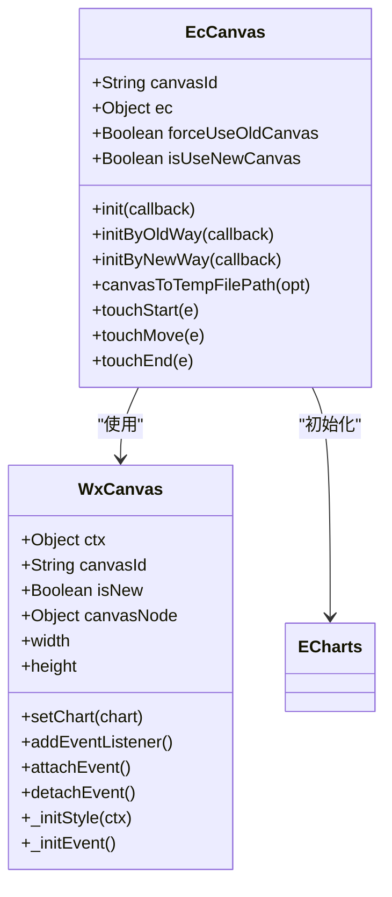
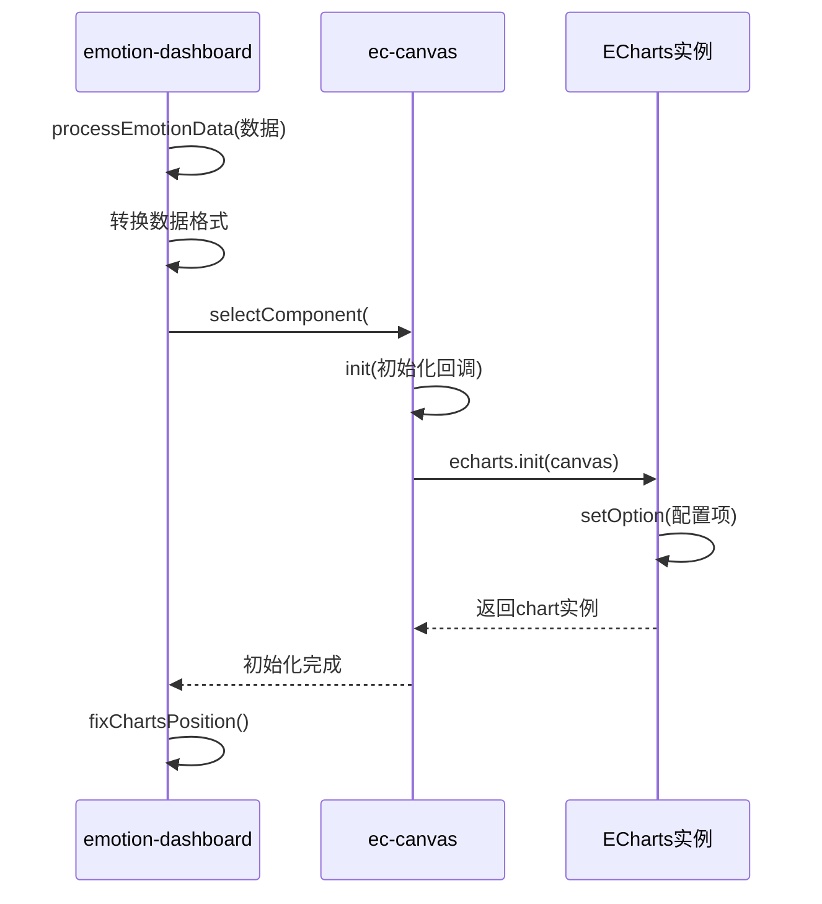
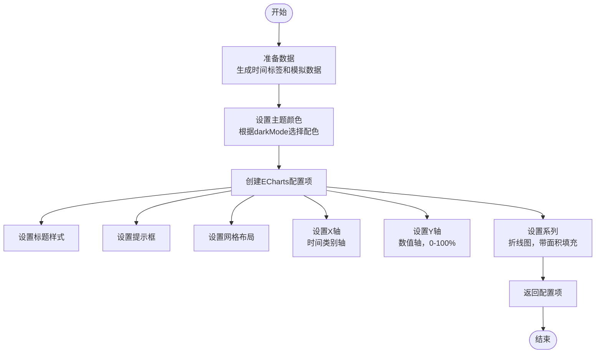
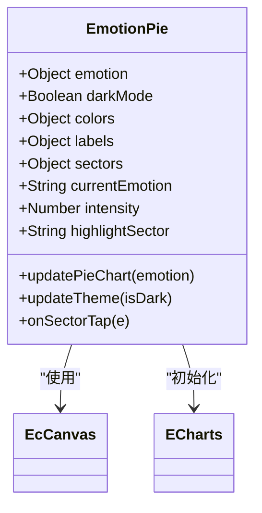
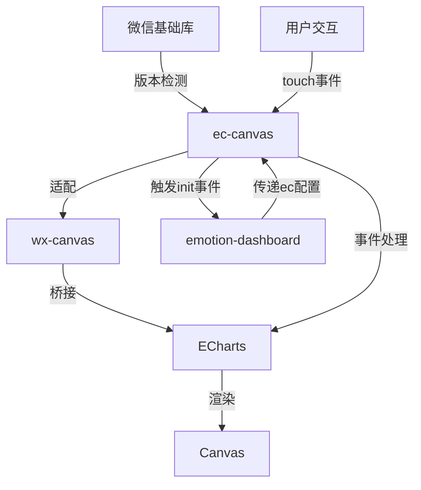

# ECharts集成组件

<cite>
**本文档引用文件**  
- [ec-canvas.js](file://miniprogram/components/ec-canvas/ec-canvas.js)
- [wx-canvas.js](file://miniprogram/components/ec-canvas/wx-canvas.js)
- [echarts.js](file://miniprogram/components/ec-canvas/echarts.js)
- [emotion-dashboard.js](file://miniprogram/components/emotion-dashboard/emotion-dashboard.js)
- [emotion-pie.js](file://miniprogram/components/emotion-pie/emotion-pie.js)
- [ECharts组件使用指南.md](file://doc/使用文档/ECharts组件使用指南.md)
</cite>

## 目录
1. [简介](#简介)
2. [项目结构](#项目结构)
3. [核心组件](#核心组件)
4. [架构概述](#架构概述)
5. [详细组件分析](#详细组件分析)
6. [依赖分析](#依赖分析)
7. [性能考虑](#性能考虑)
8. [故障排除指南](#故障排除指南)
9. [结论](#结论)

## 简介
ECharts集成组件（ec-canvas）是HeartChat小程序中用于实现数据可视化的关键模块。该组件基于ECharts for WeChat小程序适配方案，封装了在微信小程序环境中嵌入ECharts图表的能力。组件支持动态数据更新、响应式渲染，并通过双层Canvas机制实现高性能图表绘制。本文档详细说明该组件的实现原理、使用方法及在情绪分析场景中的具体应用。

## 项目结构
ECharts集成组件位于`miniprogram/components/ec-canvas/`目录下，包含核心逻辑文件、适配器和ECharts库文件。该组件被多个数据可视化组件（如emotion-dashboard、emotion-pie）所引用，形成完整的图表展示体系。

**图表来源**  
- [ec-canvas.js](file://miniprogram/components/ec-canvas/ec-canvas.js)
- [emotion-dashboard.js](file://miniprogram/components/emotion-dashboard/emotion-dashboard.js)
- [emotion-pie.js](file://miniprogram/components/emotion-pie/emotion-pie.js)

**章节来源**  
- [ec-canvas.js](file://miniprogram/components/ec-canvas/ec-canvas.js)
- [emotion-dashboard.js](file://miniprogram/components/emotion-dashboard/emotion-dashboard.js)

## 核心组件
ECharts集成组件的核心由`ec-canvas.js`实现，通过微信小程序的Component机制封装ECharts图表的初始化、渲染和交互。组件通过`ec`属性接收图表配置项，支持延迟加载（lazyLoad）模式，优化页面启动性能。`wx-canvas.js`作为适配层，桥接ECharts与微信小程序Canvas API，确保图表在不同基础库版本下的兼容性。

**章节来源**  
- [ec-canvas.js](file://miniprogram/components/ec-canvas/ec-canvas.js#L1-L284)
- [wx-canvas.js](file://miniprogram/components/ec-canvas/wx-canvas.js#L1-L111)

## 架构概述
ECharts集成组件采用分层架构设计，上层为微信小程序组件接口，中层为ECharts初始化逻辑，底层为Canvas适配器。组件根据微信基础库版本自动选择Canvas实现方式：2.9.0及以上版本使用`<canvas type="2d"/>`新API，更低版本则使用传统CanvasContext。

**图表来源**  
- [ec-canvas.js](file://miniprogram/components/ec-canvas/ec-canvas.js#L100-L200)

## 详细组件分析

### ec-canvas组件分析
ec-canvas组件是ECharts在微信小程序中的封装容器，负责图表的生命周期管理。

#### 组件属性与初始化
组件通过`properties`定义了关键属性：
- `canvasId`：Canvas元素的唯一标识
- `ec`：ECharts配置对象，包含图表类型、数据系列、坐标轴等配置
- `forceUseOldCanvas`：强制使用旧版Canvas的标志

组件在`ready`生命周期中进行初始化，根据微信基础库版本选择合适的Canvas实现方式。

**图表来源**  
- [ec-canvas.js](file://miniprogram/components/ec-canvas/ec-canvas.js#L20-L100)
- [wx-canvas.js](file://miniprogram/components/ec-canvas/wx-canvas.js#L1-L50)

### emotion-dashboard组件分析
emotion-dashboard组件展示了ECharts集成组件在实际业务场景中的应用，实现了情绪数据的多维度可视化。

#### 图表配置与数据处理
组件通过`processEmotionData`方法处理原始情感数据，将其转换为适合图表展示的格式。`initCharts`方法并行初始化多个ECharts实例，包括情绪波动图、雷达图和历史对比图。

**图表来源**  
- [emotion-dashboard.js](file://miniprogram/components/emotion-dashboard/emotion-dashboard.js#L100-L300)

#### 情绪波动折线图实现
情绪波动折线图通过`getEmotionChartOption`方法生成配置项，展示用户情绪强度随时间的变化趋势。图表支持暗黑模式，根据`darkMode`属性动态调整颜色主题。

**图表来源**  
- [emotion-dashboard.js](file://miniprogram/components/emotion-dashboard/emotion-dashboard.js#L300-L400)

#### 情感饼图实现
情感饼图组件独立实现了情感分布的可视化，通过扇区角度和颜色映射展示主要情感类型。

**图表来源**  
- [emotion-pie.js](file://miniprogram/components/emotion-pie/emotion-pie.js#L20-L50)

**章节来源**  
- [emotion-pie.js](file://miniprogram/components/emotion-pie/emotion-pie.js#L1-L171)

## 依赖分析
ECharts集成组件依赖于微信小程序的基础库版本，通过版本比较函数`compareVersion`确定Canvas实现方式。组件与上层业务组件（如emotion-dashboard）通过属性传递和事件机制进行通信，实现了良好的解耦。

**图表来源**  
- [ec-canvas.js](file://miniprogram/components/ec-canvas/ec-canvas.js#L1-L50)
- [emotion-dashboard.js](file://miniprogram/components/emotion-dashboard/emotion-dashboard.js#L1-L50)

**章节来源**  
- [ec-canvas.js](file://miniprogram/components/ec-canvas/ec-canvas.js#L1-L284)
- [emotion-dashboard.js](file://miniprogram/components/emotion-dashboard/emotion-dashboard.js#L1-L971)

## 性能考虑
ECharts集成组件在性能方面进行了多项优化：
1. **延迟加载**：通过`lazyLoad: true`配置，避免图表在页面初始化时阻塞渲染
2. **并行初始化**：在emotion-dashboard中使用Promise.all并行初始化多个图表
3. **防抖处理**：在滚动事件中使用`fixChartsPosition`方法，避免频繁重绘
4. **版本适配**：根据基础库版本选择最优的Canvas实现，提升渲染性能

## 故障排除指南
### 图表不显示
**问题**：图表容器存在但内容不显示。  
**解决方案**：
1. 确认`ec`属性已正确绑定
2. 检查容器是否有明确的宽高设置
3. 确保在`ready`生命周期后调用`init`方法

### 图表随页面滚动偏移
**问题**：页面滚动时图表位置异常。  
**解决方案**：
1. 在`onPageScroll`事件中调用`chart.resize()`
2. 使用`position: relative`而非`absolute`
3. 为容器添加`overflow: hidden`

### 暗黑模式颜色不更新
**问题**：切换暗黑模式后图表颜色未变化。  
**解决方案**：
1. 确保`darkMode`属性正确传递
2. 在主题变化时重新调用`setOption`更新颜色配置
3. 检查颜色映射表是否完整

**章节来源**  
- [ec-canvas.js](file://miniprogram/components/ec-canvas/ec-canvas.js#L200-L250)
- [emotion-dashboard.js](file://miniprogram/components/emotion-dashboard/emotion-dashboard.js#L800-L900)

## 结论
ECharts集成组件通过封装复杂的Canvas适配逻辑，为HeartChat小程序提供了稳定可靠的数据可视化能力。组件设计充分考虑了微信小程序的运行环境特点，实现了版本兼容、性能优化和主题适配。在情绪分析等实际应用场景中，该组件能够有效支持动态数据更新和响应式渲染，为用户提供直观的数据洞察体验。