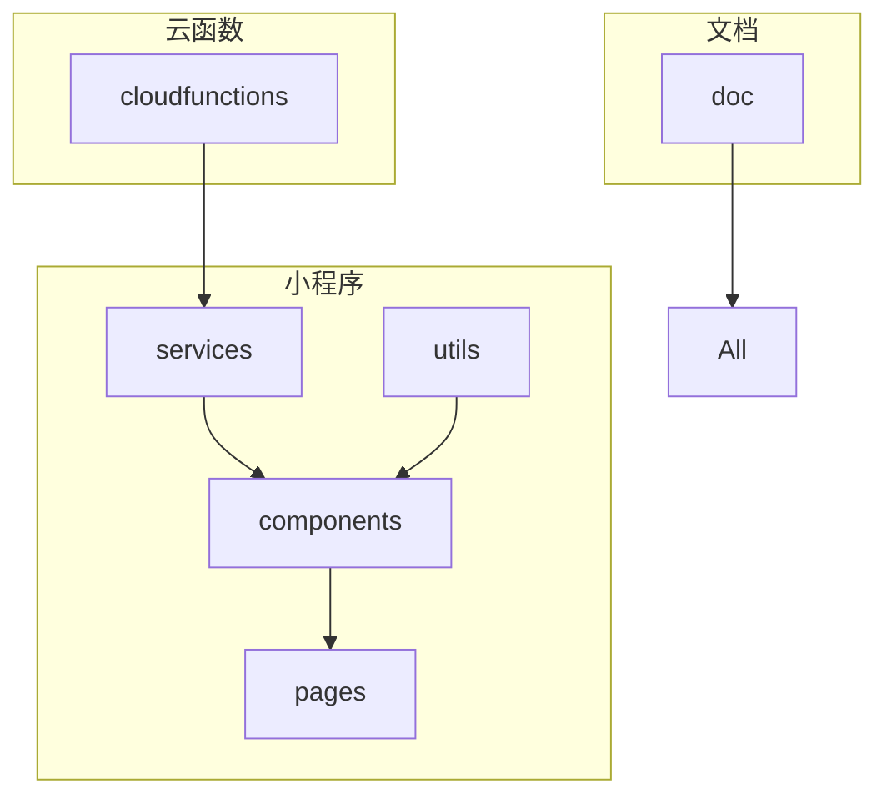
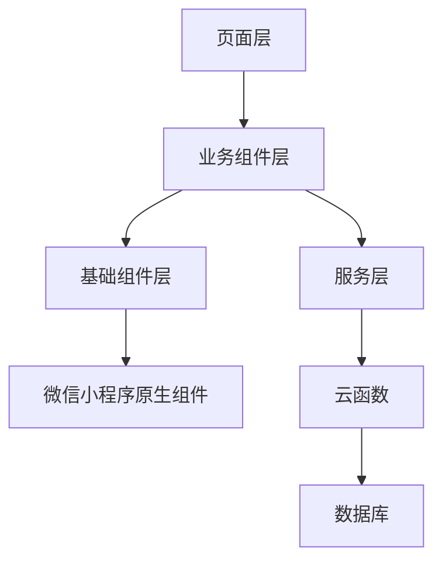
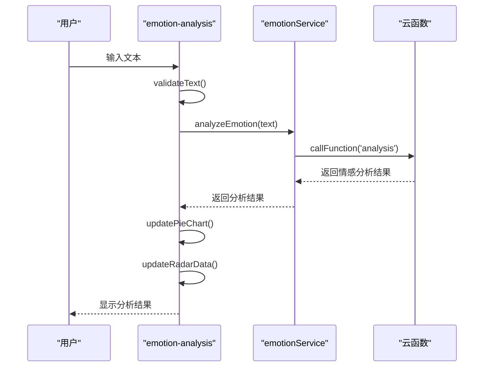
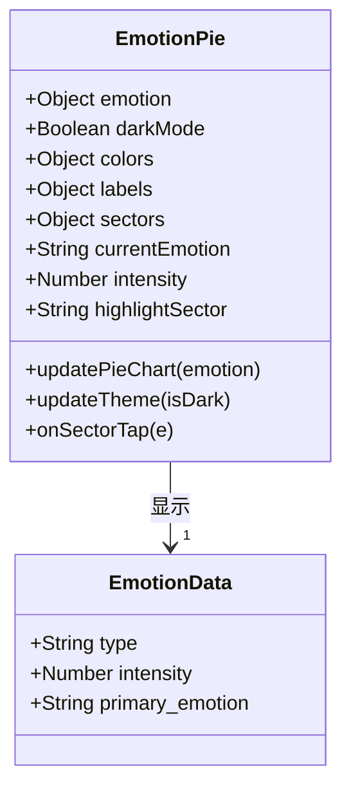
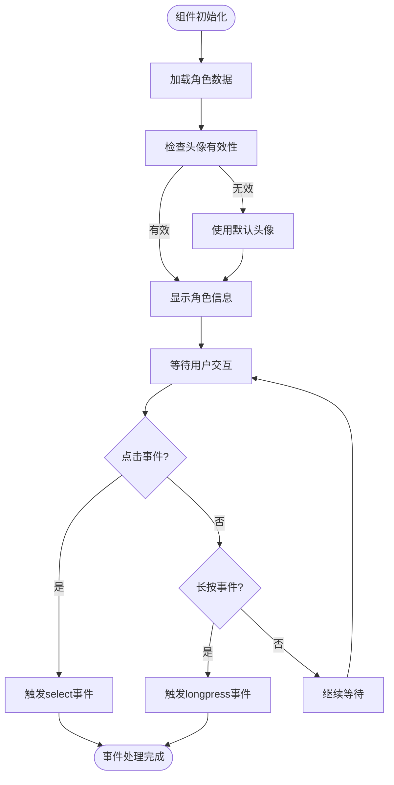
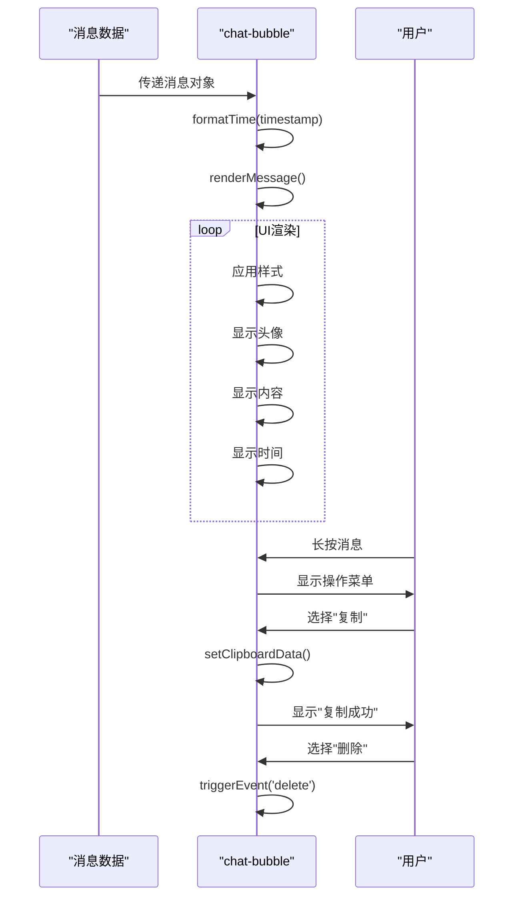
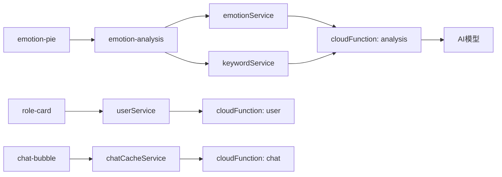

# UI组件库

<cite>
**本文档引用的文件**
- [emotion-analysis.js](file://miniprogram/components/emotion-analysis/emotion-analysis.js)
- [emotion-pie.js](file://miniprogram/components/emotion-pie/emotion-pie.js)
- [role-card.js](file://miniprogram/components/role-card/role-card.js)
- [chat-bubble/index.js](file://miniprogram/packageChat/components/chat-bubble/index.js)
- [ec-canvas.js](file://miniprogram/components/ec-canvas/ec-canvas.js)
- [ECharts组件使用指南.md](file://doc/使用文档/ECharts组件使用指南.md)
</cite>

## 目录
1. [简介](#简介)
2. [项目结构](#项目结构)
3. [核心组件](#核心组件)
4. [架构概览](#架构概览)
5. [详细组件分析](#详细组件分析)
6. [依赖分析](#依赖分析)
7. [性能考虑](#性能考虑)
8. [故障排除指南](#故障排除指南)
9. [结论](#结论)

## 简介
本文档系统化地记录了HeartChat项目中所有可复用的UI组件，包括emotion-analysis、emotion-pie、role-card、chat-bubble等。文档详细描述了每个组件的视觉表现、交互行为与使用场景，列出了组件支持的属性（props）、事件（events）与插槽（slots），并提供了WXML与JS的调用示例。同时，文档说明了ECharts组件的集成方式与图表定制选项，为前端开发者提供了组件使用规范与样式覆盖方法。

## 项目结构
HeartChat项目采用模块化设计，主要分为云函数、文档、小程序三大部分。小程序部分包含组件、页面、服务和工具等子目录，其中组件目录存放了所有可复用的UI组件。

**Diagram sources**
- [miniprogram/components](file://miniprogram/components)
- [miniprogram/pages](file://miniprogram/pages)
- [miniprogram/services](file://miniprogram/services)
- [cloudfunctions](file://cloudfunctions)
- [doc](file://doc)

**Section sources**
- [miniprogram](file://miniprogram)
- [cloudfunctions](file://cloudfunctions)
- [doc](file://doc)

## 核心组件
本文档重点分析了emotion-analysis、emotion-pie、role-card和chat-bubble四个核心UI组件。这些组件在HeartChat应用中扮演着关键角色，提供了情感分析、数据可视化、角色展示和聊天交互等核心功能。

**Section sources**
- [emotion-analysis.js](file://miniprogram/components/emotion-analysis/emotion-analysis.js)
- [emotion-pie.js](file://miniprogram/components/emotion-pie/emotion-pie.js)
- [role-card.js](file://miniprogram/components/role-card/role-card.js)
- [chat-bubble/index.js](file://miniprogram/packageChat/components/chat-bubble/index.js)

## 架构概览
HeartChat的UI组件架构基于微信小程序的组件化体系，采用分层设计模式。基础组件层提供通用UI元素，业务组件层实现特定功能，页面层组合组件构建完整用户界面。

**Diagram sources**
- [miniprogram/pages](file://miniprogram/pages)
- [miniprogram/components](file://miniprogram/components)
- [miniprogram/services](file://miniprogram/services)
- [cloudfunctions](file://cloudfunctions)

## 详细组件分析

### 情感分析组件 (emotion-analysis)
emotion-analysis组件提供全面的情感分析功能，包括实时情感识别、历史记录展示和数据可视化。组件通过调用后端服务分析用户输入的文本，提取情感特征和关键词，并以图表形式展示分析结果。

#### 属性 (Props)
- `userId`: 用户ID，用于关联用户数据
- `roleId`: 角色ID，用于区分不同角色的情感分析
- `emotion`: 当前情感分析结果对象
- `show`: 控制组件是否显示
- `darkMode`: 暗黑模式开关

#### 事件 (Events)
- `save`: 记录当前心情事件
- `share`: 分享情感分析结果事件
- `close`: 关闭分析面板事件

#### 方法
- `analyzeText(text)`: 分析指定文本的情感
- `loadEmotionHistory()`: 加载用户情感历史记录
- `initCharts()`: 初始化数据可视化图表

**Diagram sources**
- [emotion-analysis.js](file://miniprogram/components/emotion-analysis/emotion-analysis.js#L1-L420)
- [services/emotionService.js](file://miniprogram/services/emotionService.js)

**Section sources**
- [emotion-analysis.js](file://miniprogram/components/emotion-analysis/emotion-analysis.js)

### 情感饼图组件 (emotion-pie)
emotion-pie组件以饼图形式直观展示用户的情感状态，支持多种情感类型和暗黑模式。组件通过颜色编码和扇区角度来表示不同情感的强度和类型。

#### 属性 (Props)
- `emotion`: 情感分析结果对象，包含type和intensity字段
- `darkMode`: 暗黑模式开关，影响图表颜色主题

#### 事件 (Events)
- `update`: 图表更新事件，携带当前情感类型和强度
- `select`: 情感扇区选择事件，用于交互式探索

#### 数据结构
- `colors`: 情感类型颜色映射表
- `labels`: 情感类型标签映射表
- `sectors`: 饼图扇区角度配置

**Diagram sources**
- [emotion-pie.js](file://miniprogram/components/emotion-pie/emotion-pie.js#L1-L172)
- [emotion-analysis.js](file://miniprogram/components/emotion-analysis/emotion-analysis.js)

**Section sources**
- [emotion-pie.js](file://miniprogram/components/emotion-pie/emotion-pie.js)

### 角色卡片组件 (role-card)
role-card组件用于展示角色信息，包括头像、名称、描述和分类。组件支持点击和长按交互，适用于角色选择和角色详情展示场景。

#### 属性 (Props)
- `role`: 角色对象，包含name、description、category、avatar等字段
- `selected`: 选中状态，用于视觉反馈
- `darkMode`: 暗黑模式开关

#### 事件 (Events)
- `select`: 点击卡片事件，传递角色信息
- `longpress`: 长按卡片事件，用于更多操作

#### 辅助方法
- `getRoleName()`: 获取角色名称，支持多种字段别名
- `getRoleDescription()`: 获取角色描述，支持多种字段别名
- `getRoleCategory()`: 获取角色分类，支持多种字段别名
- `getRoleAvatar()`: 获取角色头像，支持默认头像

**Diagram sources**
- [role-card.js](file://miniprogram/components/role-card/role-card.js#L1-L92)
- [components/role-card](file://miniprogram/components/role-card)

**Section sources**
- [role-card.js](file://miniprogram/components/role-card/role-card.js)

### 聊天气泡组件 (chat-bubble)
chat-bubble组件用于展示聊天消息，支持发送方/接收方样式区分、时间显示、情感标签和多种气泡样式。组件提供了消息复制和删除等交互功能。

#### 属性 (Props)
- `message`: 消息对象，包含content、timestamp等字段
- `isSender`: 是否为发送方消息
- `showTime`: 是否显示时间
- `showEmotionTag`: 是否显示情感标签
- `darkMode`: 暗黑模式开关
- `bubbleStyle`: 气泡样式，可选default、rounded、square

#### 事件 (Events)
- `delete`: 删除消息事件，传递消息ID

#### 数据监听器
- `message.timestamp`: 监听时间戳变化，自动格式化显示时间
- `bubbleStyle`: 监听气泡样式变化，实时更新UI

**Diagram sources**
- [chat-bubble/index.js](file://miniprogram/packageChat/components/chat-bubble/index.js#L1-L147)
- [packageChat/components/chat-bubble](file://miniprogram/packageChat/components/chat-bubble)

**Section sources**
- [chat-bubble/index.js](file://miniprogram/packageChat/components/chat-bubble/index.js)

## 依赖分析
UI组件库依赖于多个内部服务和外部库，形成了清晰的依赖关系网络。组件通过服务层与云函数通信，获取数据和执行业务逻辑。

**Diagram sources**
- [services/emotionService.js](file://miniprogram/services/emotionService.js)
- [services/keywordService.js](file://miniprogram/services/keywordService.js)
- [services/userService.js](file://miniprogram/services/userService.js)
- [services/chatCacheService.js](file://miniprogram/services/chatCacheService.js)
- [cloudfunctions/analysis](file://cloudfunctions/analysis)
- [cloudfunctions/user](file://cloudfunctions/user)
- [cloudfunctions/chat](file://cloudfunctions/chat)

**Section sources**
- [miniprogram/services](file://miniprogram/services)
- [cloudfunctions](file://cloudfunctions)

## 性能考虑
UI组件在设计时考虑了性能优化，采用了延迟加载、数据缓存和按需渲染等策略。特别是ECharts组件，通过lazyLoad配置避免了不必要的资源消耗。

- **图表性能**: 使用`lazyLoad: true`配置延迟初始化ECharts实例
- **内存管理**: 及时释放不再使用的图表实例
- **渲染优化**: 避免频繁的`setOption`调用，批量更新图表配置
- **网络请求**: 合并相关数据请求，减少网络往返次数

## 故障排除指南
### 图表不显示
**问题**: ECharts图表容器显示但内容为空。

**解决方案**:
1. 确保容器有明确的宽高设置
2. 检查`ec-canvas`组件是否正确引入
3. 使用`setTimeout`延迟初始化图表
4. 确认数据格式正确且不为空

### 组件样式错乱
**问题**: 组件在不同设备上显示效果不一致。

**解决方案**:
1. 使用百分比而非固定像素值设置尺寸
2. 为关键样式添加`!important`确保优先级
3. 在页面滚动时调用`chart.resize()`
4. 使用响应式设计适配不同屏幕尺寸

### 交互无响应
**问题**: 组件点击事件无反应。

**解决方案**:
1. 检查事件绑定是否正确
2. 确认组件未被其他元素遮挡
3. 查看控制台是否有JavaScript错误
4. 验证数据传递是否完整

**Section sources**
- [ec-canvas.js](file://miniprogram/components/ec-canvas/ec-canvas.js)
- [ECharts组件使用指南.md](file://doc/使用文档/ECharts组件使用指南.md)

## 结论
HeartChat的UI组件库设计合理，功能完整，为应用提供了丰富的用户界面元素。通过组件化开发，提高了代码复用率和开发效率。建议在使用时遵循文档中的规范，充分利用组件提供的属性和事件，同时注意性能优化和用户体验。