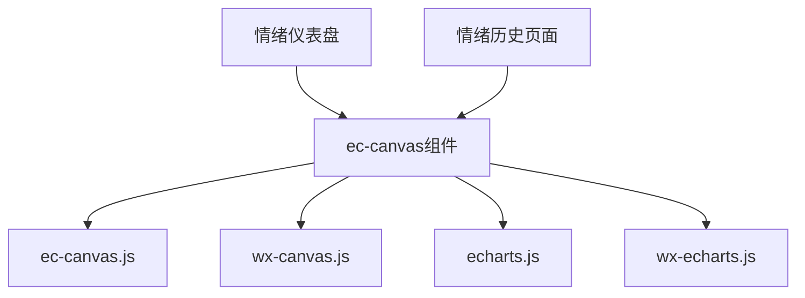
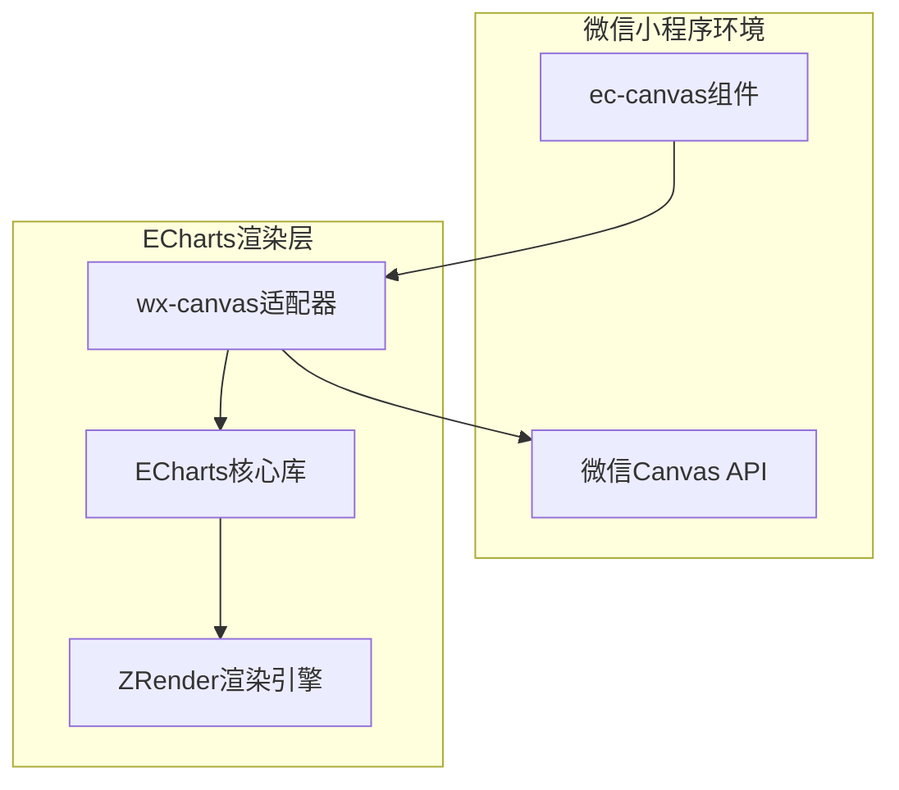
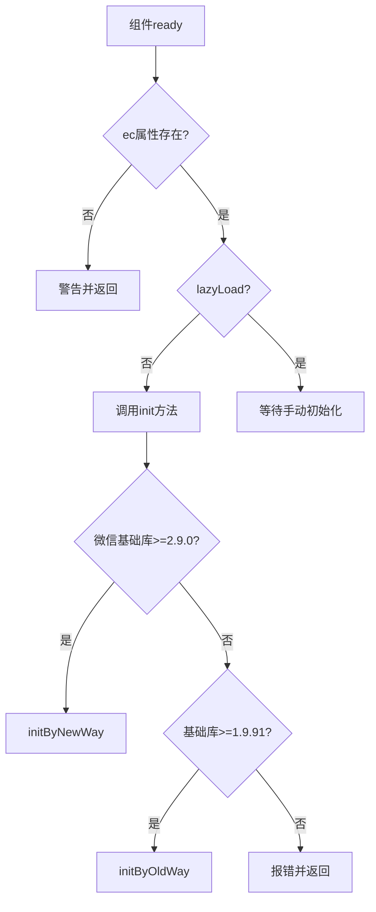
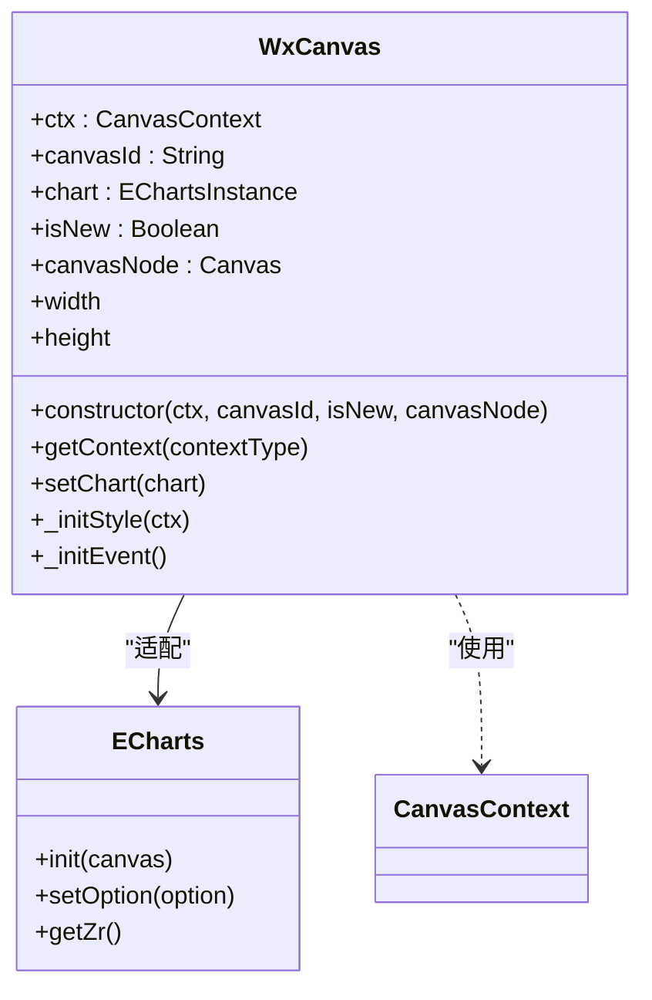
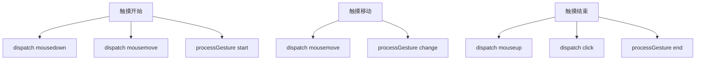
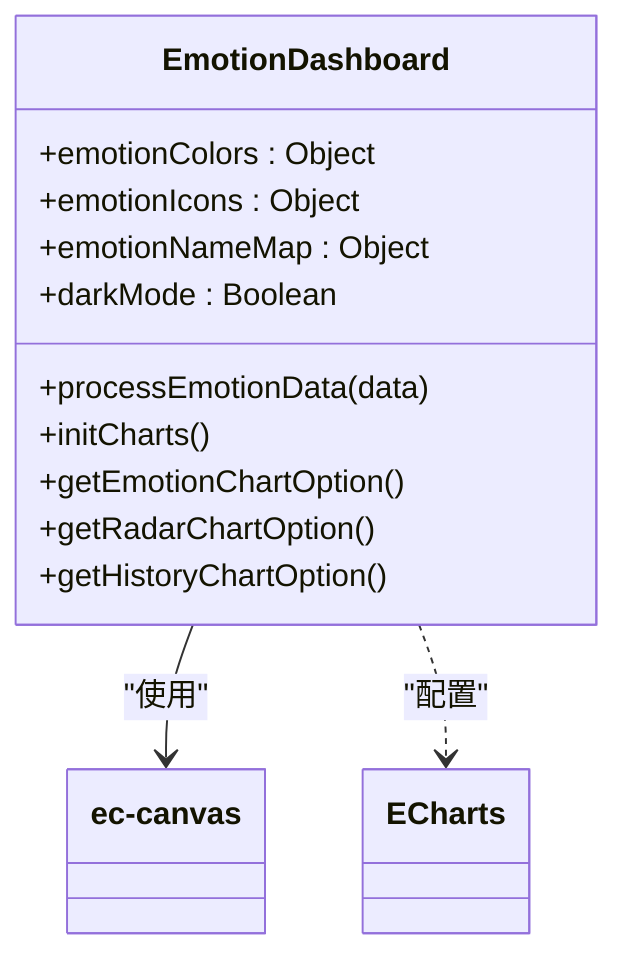
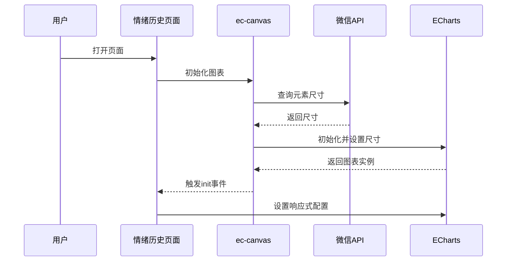
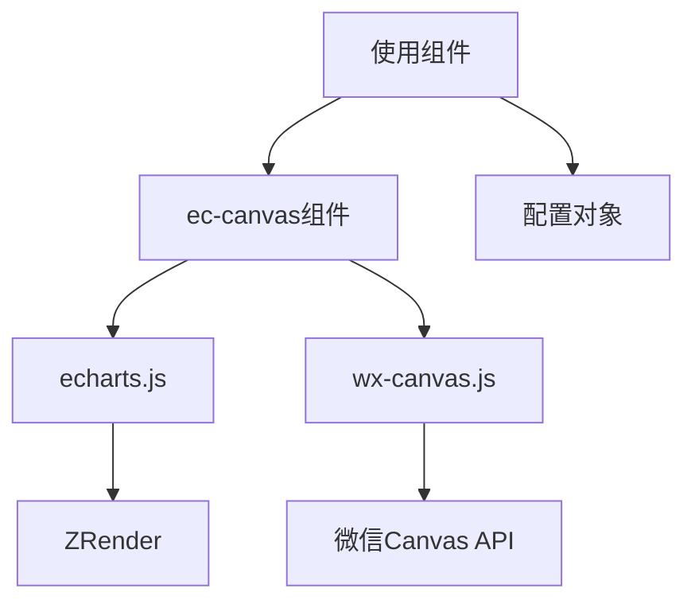

# ECharts基础画布组件

<cite>
**本文档引用文件**  
- [ec-canvas.js](file://miniprogram/components/ec-canvas/ec-canvas.js)
- [wx-canvas.js](file://miniprogram/components/ec-canvas/wx-canvas.js)
- [wx-echarts.js](file://miniprogram/components/ec-canvas/wx-echarts.js)
- [echarts.js](file://miniprogram/components/ec-canvas/echarts.js)
- [emotion-dashboard.js](file://miniprogram/components/emotion-dashboard/emotion-dashboard.js)
- [emotion-history.js](file://miniprogram/packageEmotion/pages/emotion-history/emotion-history.js)
</cite>

## 目录
1. [介绍](#介绍)
2. [项目结构](#项目结构)
3. [核心组件](#核心组件)
4. [架构概述](#架构概述)
5. [详细组件分析](#详细组件分析)
6. [依赖分析](#依赖分析)
7. [性能考虑](#性能考虑)
8. [故障排除指南](#故障排除指南)
9. [结论](#结论)

## 介绍
ec-canvas组件是ECharts在微信小程序中的基础渲染容器，通过wx-echarts适配层将ECharts核心库集成到小程序WebView环境中。该组件实现了canvas上下文桥接、事件代理和性能优化策略，支持在小程序中高效渲染复杂的可视化图表。组件通过WXML引用方式集成，利用observe属性实现图表的动态重绘，并提供refresh方法触发图表更新，有效处理大数据量渲染时的性能瓶颈。

## 项目结构
ec-canvas组件位于`miniprogram/components/ec-canvas/`目录下，包含核心实现文件和依赖库。该组件被多个页面和组件引用，如情绪仪表盘和情绪历史页面，用于展示用户情感分析数据。

**图表来源**  
- [ec-canvas.js](file://miniprogram/components/ec-canvas/ec-canvas.js#L1-L284)
- [emotion-dashboard.js](file://miniprogram/components/emotion-dashboard/emotion-dashboard.js#L1-L799)

**本节来源**  
- [ec-canvas.js](file://miniprogram/components/ec-canvas/ec-canvas.js#L1-L284)

## 核心组件
ec-canvas组件通过封装ECharts核心库，为微信小程序提供完整的图表渲染能力。组件支持两种初始化方式：基于旧版canvas的初始化和基于新版`<canvas type="2d"/>`的初始化，根据微信基础库版本自动选择最优方案。组件通过`ec`属性接收图表配置，并在`ready`生命周期中进行初始化。

**本节来源**  
- [ec-canvas.js](file://miniprogram/components/ec-canvas/ec-canvas.js#L59-L99)
- [ec-canvas.js](file://miniprogram/components/ec-canvas/ec-canvas.js#L0-L63)

## 架构概述
ec-canvas组件采用适配器模式，通过wx-canvas类桥接微信小程序的canvas API与ECharts的渲染需求。组件根据微信基础库版本智能选择渲染方式，确保在不同环境下都能提供最佳性能。

**图表来源**  
- [ec-canvas.js](file://miniprogram/components/ec-canvas/ec-canvas.js#L99-L132)
- [wx-canvas.js](file://miniprogram/components/ec-canvas/wx-canvas.js#L0-L68)

## 详细组件分析

### ec-canvas组件分析
ec-canvas组件作为ECharts在微信小程序中的基础渲染容器，实现了完整的图表生命周期管理。组件通过`properties`定义`canvasId`、`ec`和`forceUseOldCanvas`等属性，支持灵活的配置和控制。

#### 初始化流程

**图表来源**  
- [ec-canvas.js](file://miniprogram/components/ec-canvas/ec-canvas.js#L59-L99)
- [ec-canvas.js](file://miniprogram/components/ec-canvas/ec-canvas.js#L99-L132)

#### Canvas上下文桥接

**图表来源**  
- [wx-canvas.js](file://miniprogram/components/ec-canvas/wx-canvas.js#L0-L111)
- [ec-canvas.js](file://miniprogram/components/ec-canvas/ec-canvas.js#L130-L169)

#### 事件代理机制

**图表来源**  
- [ec-canvas.js](file://miniprogram/components/ec-canvas/ec-canvas.js#L201-L247)
- [wx-canvas.js](file://miniprogram/components/ec-canvas/wx-canvas.js#L62-L110)

**本节来源**  
- [ec-canvas.js](file://miniprogram/components/ec-canvas/ec-canvas.js#L0-L284)
- [wx-canvas.js](file://miniprogram/components/ec-canvas/wx-canvas.js#L0-L111)

### 配置示例分析
ec-canvas组件支持丰富的配置选项，包括主题定制、响应式布局和暗黑模式适配。

#### 主题与暗黑模式配置

**图表来源**  
- [emotion-dashboard.js](file://miniprogram/components/emotion-dashboard/emotion-dashboard.js#L1-L799)

#### 响应式布局处理

**图表来源**  
- [emotion-history.js](file://miniprogram/packageEmotion/pages/emotion-history/emotion-history.js#L1-L799)

**本节来源**  
- [emotion-dashboard.js](file://miniprogram/components/emotion-dashboard/emotion-dashboard.js#L1-L799)
- [emotion-history.js](file://miniprogram/packageEmotion/pages/emotion-history/emotion-history.js#L1-L799)

## 依赖分析
ec-canvas组件依赖于ECharts核心库和微信小程序的Canvas API，通过适配层实现两者之间的无缝集成。

**图表来源**  
- [ec-canvas.js](file://miniprogram/components/ec-canvas/ec-canvas.js#L0-L63)
- [echarts.js](file://miniprogram/components/ec-canvas/echarts.js#L35-L43)

**本节来源**  
- [ec-canvas.js](file://miniprogram/components/ec-canvas/ec-canvas.js#L0-L284)
- [echarts.js](file://miniprogram/components/ec-canvas/echarts.js#L1-L971)

## 性能考虑
ec-canvas组件通过多种策略优化性能，包括禁用渐进式渲染、智能选择Canvas版本和延迟加载。

- **渐进式渲染禁用**：由于`drawImage`不支持DOM参数，组件在预处理器中禁用所有系列的渐进式渲染
- **Canvas版本选择**：根据微信基础库版本自动选择新旧Canvas实现，确保最佳性能
- **延迟加载**：通过`lazyLoad`属性支持按需初始化，减少初始加载时间
- **大数渲染优化**：通过`progressive`配置控制渲染策略，避免界面卡顿

## 故障排除指南
当使用ec-canvas组件时，可能遇到以下常见问题：

- **微信基础库版本过低**：确保版本不低于1.9.91，建议升级到2.9.0以上以获得最佳性能
- **ec属性未绑定**：确保在WXML中正确绑定ec属性，如`ec="{{ ec }}"`
- **图片加载失败**：在2.7.0以下版本中，`Canvas.createImage()` API不可用，需升级基础库
- **图表不显示**：检查canvasId是否唯一，避免多个组件使用相同ID

**本节来源**  
- [ec-canvas.js](file://miniprogram/components/ec-canvas/ec-canvas.js#L59-L99)
- [ec-canvas.js](file://miniprogram/components/ec-canvas/ec-canvas.js#L99-L132)

## 结论
ec-canvas组件成功地将ECharts强大的可视化能力引入微信小程序环境，通过精心设计的适配层解决了小程序Canvas API的限制。组件不仅提供了完整的图表渲染功能，还通过智能版本选择、事件代理和性能优化策略，确保了在各种设备和微信版本上的稳定运行。结合observe属性和refresh方法，开发者可以轻松实现动态图表更新，满足复杂的数据可视化需求。