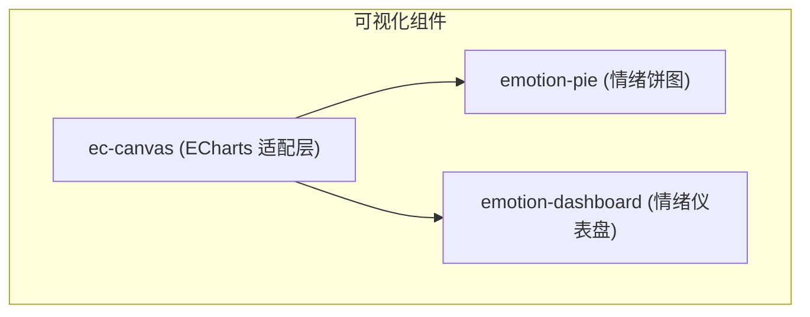
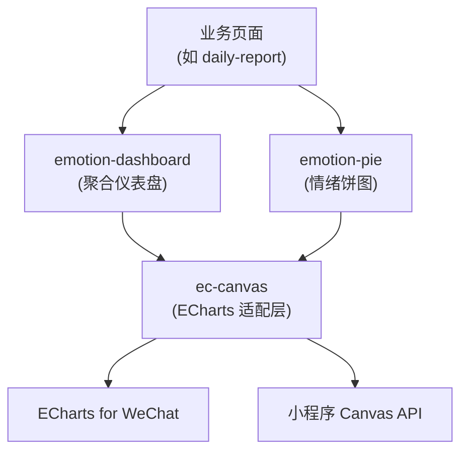
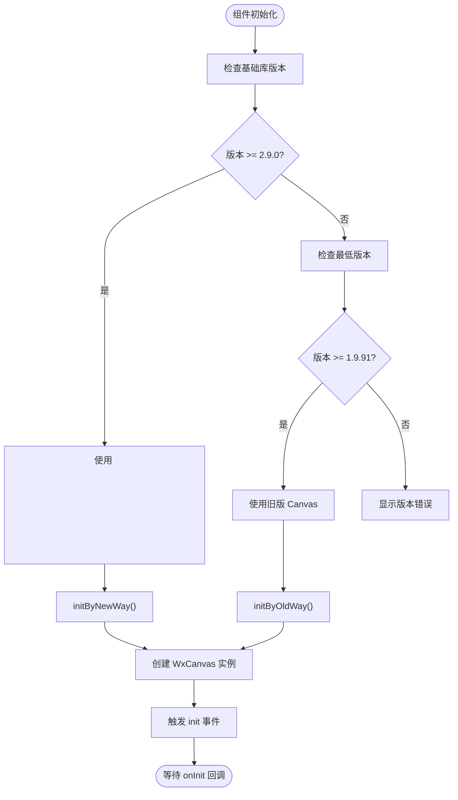
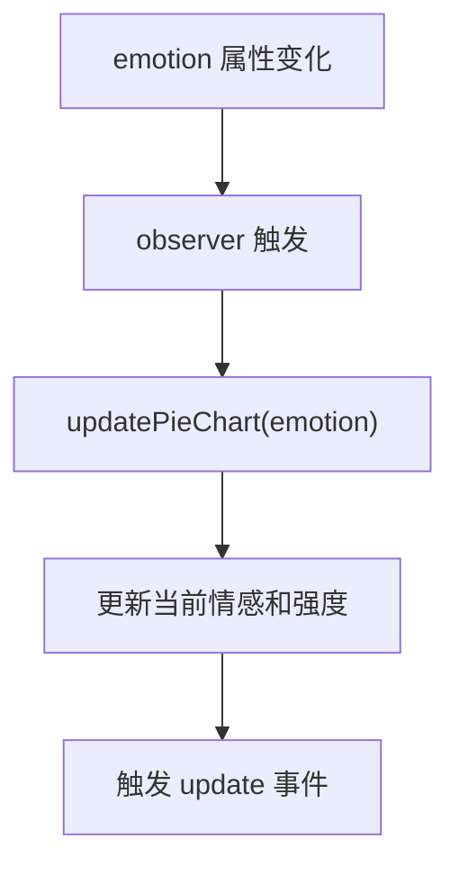
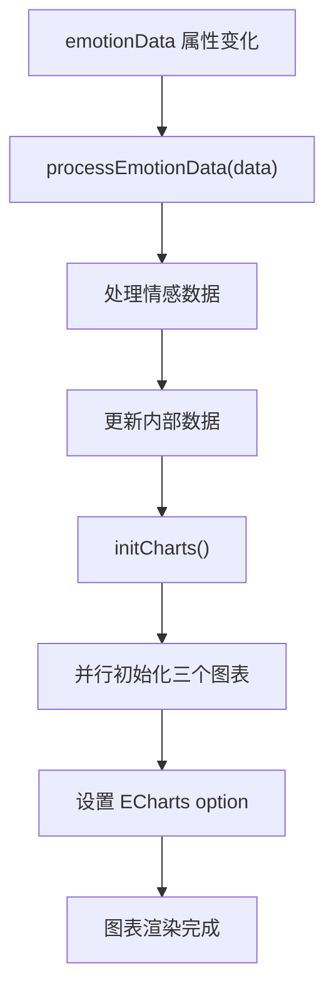
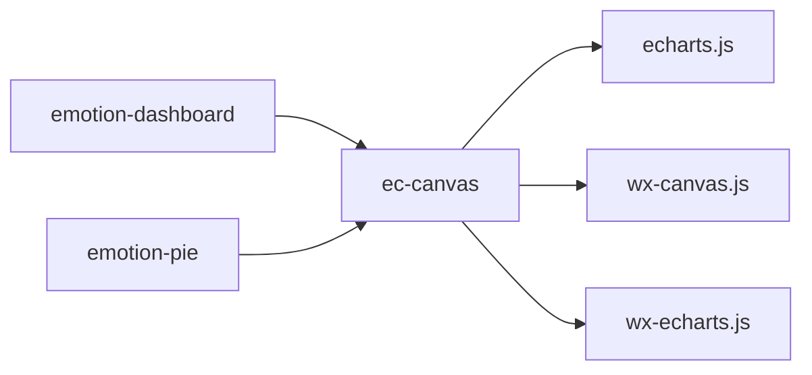

# 可视化组件

<cite>
**本文档中引用的文件**  
- [ec-canvas.js](file://miniprogram/components/ec-canvas/ec-canvas.js)
- [wx-canvas.js](file://miniprogram/components/ec-canvas/wx-canvas.js)
- [wx-echarts.js](file://miniprogram/components/ec-canvas/wx-echarts.js)
- [emotion-pie.js](file://miniprogram/components/emotion-pie/emotion-pie.js)
- [emotion-dashboard.js](file://miniprogram/components/emotion-dashboard/emotion-dashboard.js)
</cite>

## 目录
1. [引言](#引言)  
2. [项目结构](#项目结构)  
3. [核心组件](#核心组件)  
4. [架构概览](#架构概览)  
5. [详细组件分析](#详细组件分析)  
6. [依赖分析](#依赖分析)  
7. [性能考虑](#性能考虑)  
8. [故障排除指南](#故障排除指南)  
9. [结论](#结论)

## 引言
本文档详细说明了基于 ECharts 的可视化组件体系，包括 `ec-canvas`、`emotion-pie` 和 `emotion-dashboard`。重点阐述了 ECharts 在微信小程序中的集成机制、适配层工作原理、性能优化策略、数据格式要求、配置项结构、动态更新机制、WXML 引用方式、JS 配置示例、主题定制、交互事件绑定、动画控制、响应式布局及暗黑模式下的色彩适配方案。

## 项目结构
可视化组件位于 `miniprogram/components/` 目录下，主要包括：
- `ec-canvas/`：ECharts 小程序适配层，封装底层渲染逻辑
- `emotion-pie/`：单维度情绪分布饼图组件
- `emotion-dashboard/`：多维度情感指标聚合仪表盘组件

这些组件通过 `ec-canvas` 实现 ECharts 图表的渲染，并通过属性传递数据和配置，实现动态更新和主题切换。



**Diagram sources**  
- [ec-canvas.js](file://miniprogram/components/ec-canvas/ec-canvas.js#L1-L285)
- [emotion-pie.js](file://miniprogram/components/emotion-pie/emotion-pie.js#L1-L172)
- [emotion-dashboard.js](file://miniprogram/components/emotion-dashboard/emotion-dashboard.js#L1-L971)

**Section sources**  
- [ec-canvas.js](file://miniprogram/components/ec-canvas/ec-canvas.js#L1-L285)
- [emotion-pie.js](file://miniprogram/components/emotion-pie/emotion-pie.js#L1-L172)
- [emotion-dashboard.js](file://miniprogram/components/emotion-dashboard/emotion-dashboard.js#L1-L971)

## 核心组件
本系统的核心可视化组件包括：
- **ec-canvas**：提供 ECharts 在小程序中的渲染能力，支持新旧两种 canvas 模式
- **emotion-pie**：展示单维度情绪分布，支持点击交互和主题切换
- **emotion-dashboard**：聚合多维度情感指标，包含情绪波动图、雷达图和历史对比图

这些组件通过属性绑定实现数据驱动，支持动态更新和事件响应。

**Section sources**  
- [ec-canvas.js](file://miniprogram/components/ec-canvas/ec-canvas.js#L1-L285)
- [emotion-pie.js](file://miniprogram/components/emotion-pie/emotion-pie.js#L1-L172)
- [emotion-dashboard.js](file://miniprogram/components/emotion-dashboard/emotion-dashboard.js#L1-L971)

## 架构概览
系统采用分层架构，上层业务组件依赖底层 ECharts 适配层实现图表渲染。



**Diagram sources**  
- [ec-canvas.js](file://miniprogram/components/ec-canvas/ec-canvas.js#L1-L285)
- [emotion-pie.js](file://miniprogram/components/emotion-pie/emotion-pie.js#L1-L172)
- [emotion-dashboard.js](file://miniprogram/components/emotion-dashboard/emotion-dashboard.js#L1-L971)

## 详细组件分析

### ec-canvas 组件分析
`ec-canvas` 是 ECharts 在小程序中的核心适配层，负责处理不同版本小程序基础库的兼容性问题。

#### 适配层工作原理


**Diagram sources**  
- [ec-canvas.js](file://miniprogram/components/ec-canvas/ec-canvas.js#L1-L285)
- [wx-canvas.js](file://miniprogram/components/ec-canvas/wx-canvas.js#L1-L112)

**Section sources**  
- [ec-canvas.js](file://miniprogram/components/ec-canvas/ec-canvas.js#L1-L285)
- [wx-canvas.js](file://miniprogram/components/ec-canvas/wx-canvas.js#L1-L112)

#### 性能优化策略
- **禁用渐进式渲染**：由于小程序 `drawImage` 不支持 DOM 参数，禁用 ECharts 的渐进式渲染
- **版本适配**：根据基础库版本自动选择最优的 canvas 模式
- **延迟加载**：支持 `lazyLoad` 模式，避免不必要的初始化开销

### emotion-pie 组件分析
`emotion-pie` 组件用于展示单维度情绪分布。

#### 数据格式要求
```json
{
  "type": "joy",           // 情感类型
  "intensity": 0.7         // 情感强度 (0-1)
}
```

#### 配置项结构
| 属性名 | 类型 | 默认值 | 说明 |
|-------|------|--------|------|
| `emotion` | Object | {type: 'neutral', intensity: 0.5} | 情感数据 |
| `darkMode` | Boolean | false | 是否启用暗黑模式 |

#### 动态更新机制
当 `emotion` 属性变化时，通过 `observer` 监听器自动调用 `updatePieChart` 方法更新图表。



**Diagram sources**  
- [emotion-pie.js](file://miniprogram/components/emotion-pie/emotion-pie.js#L1-L172)

**Section sources**  
- [emotion-pie.js](file://miniprogram/components/emotion-pie/emotion-pie.js#L1-L172)

### emotion-dashboard 组件分析
`emotion-dashboard` 组件用于聚合展示多维度情感指标。

#### 多维度指标聚合
该组件整合了以下情感指标：
- 主要情绪和次要情绪
- 情绪强度、价态（valence）、唤醒度（arousal）
- 雷达图维度：信任度、开放度、控制感、抗拒度、压力水平
- 关键词、触发词、建议和总结

#### 图表配置与动态更新
组件包含三个 ECharts 图表：
- 情绪波动图（折线图）
- 情绪维度图（雷达图）
- 历史对比图（柱状图）



**Diagram sources**  
- [emotion-dashboard.js](file://miniprogram/components/emotion-dashboard/emotion-dashboard.js#L1-L971)

**Section sources**  
- [emotion-dashboard.js](file://miniprogram/components/emotion-dashboard/emotion-dashboard.js#L1-L971)

## 依赖分析
可视化组件体系的依赖关系如下：



**Diagram sources**  
- [ec-canvas.json](file://miniprogram/components/ec-canvas/ec-canvas.json)
- [emotion-pie.json](file://miniprogram/components/emotion-pie/emotion-pie.json)
- [emotion-dashboard.json](file://miniprogram/components/emotion-dashboard/emotion-dashboard.json)

**Section sources**  
- [ec-canvas.js](file://miniprogram/components/ec-canvas/ec-canvas.js#L1-L285)
- [emotion-pie.js](file://miniprogram/components/emotion-pie/emotion-pie.js#L1-L172)
- [emotion-dashboard.js](file://miniprogram/components/emotion-dashboard/emotion-dashboard.js#L1-L971)

## 性能考虑
- **图表懒加载**：`emotion-dashboard` 中的图表采用 `lazyLoad: true` 配置，避免初始渲染阻塞
- **并行初始化**：多个图表使用 `Promise.all` 并行初始化，提高加载效率
- **版本适配**：`ec-canvas` 根据基础库版本选择最优渲染模式，提升性能
- **事件节流**：触摸事件处理已内置防抖机制

## 故障排除指南
- **图表不显示**：检查基础库版本是否 >= 1.9.91
- **交互失效**：确保 `ec-canvas` 正确绑定了 `touchStart`、`touchMove`、`touchEnd` 事件
- **主题不生效**：检查 `darkMode` 属性是否正确传递
- **数据不更新**：确认数据属性已正确绑定且 observer 正常工作

**Section sources**  
- [ec-canvas.js](file://miniprogram/components/ec-canvas/ec-canvas.js#L1-L285)
- [emotion-pie.js](file://miniprogram/components/emotion-pie/emotion-pie.js#L1-L172)
- [emotion-dashboard.js](file://miniprogram/components/emotion-dashboard/emotion-dashboard.js#L1-L971)

## 结论
本文档详细说明了基于 ECharts 的可视化组件体系。`ec-canvas` 提供了稳定的小程序适配层，`emotion-pie` 和 `emotion-dashboard` 分别实现了单维度和多维度情绪数据的可视化。系统支持动态更新、主题切换、交互响应和性能优化，为情绪分析功能提供了强大的可视化支持。