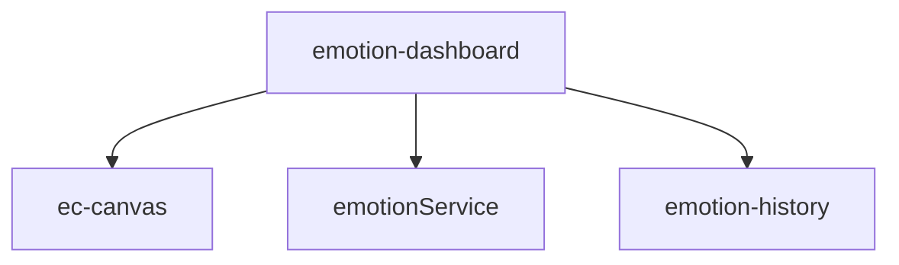
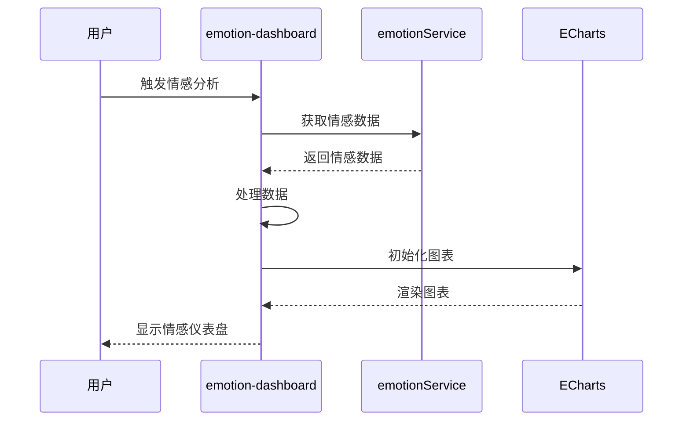
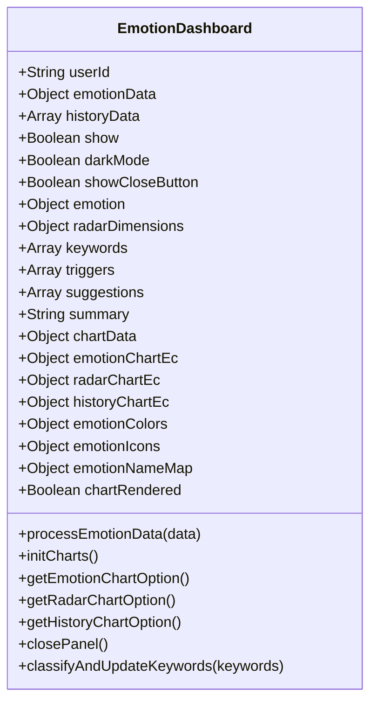
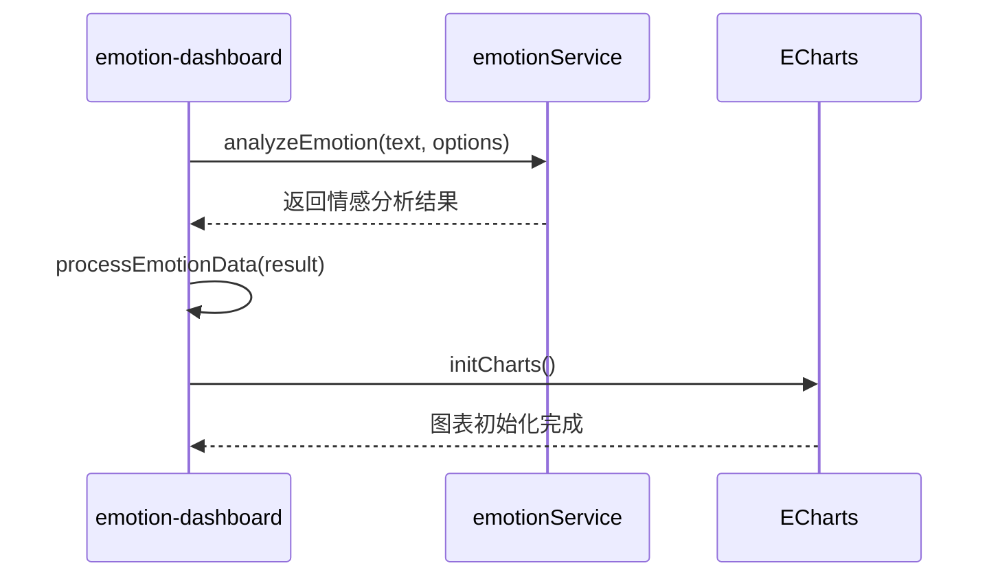
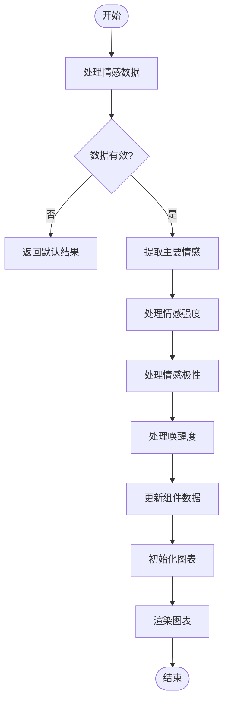
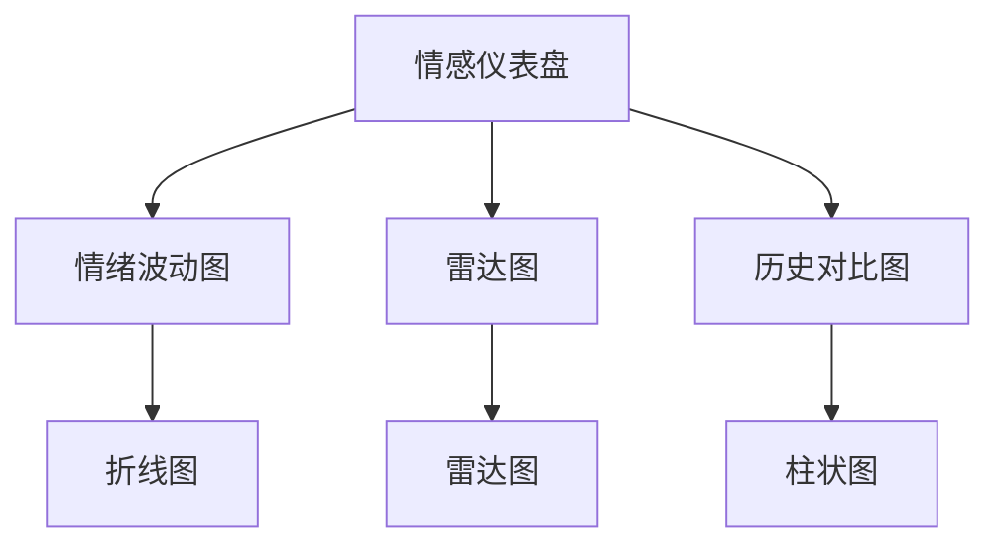
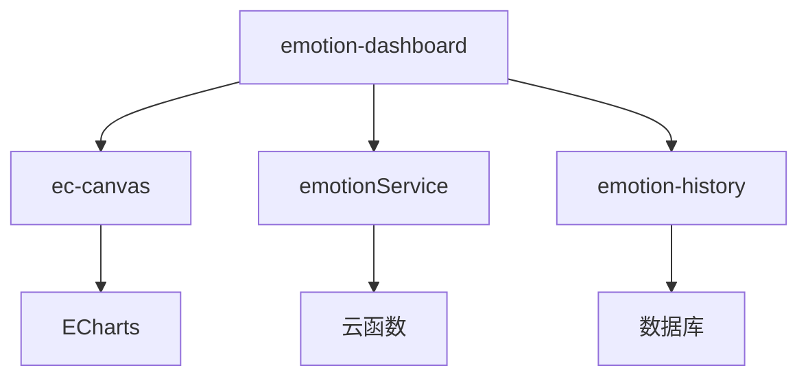

# 情感仪表盘组件

<cite>
**本文档引用文件**  
- [emotion-dashboard.js](file://miniprogram/components/emotion-dashboard/emotion-dashboard.js)
- [emotionService.js](file://miniprogram/services/emotionService.js)
- [emotion-history.js](file://miniprogram/components/emotion-history/emotion-history.js)
- [ec-canvas.js](file://miniprogram/components/ec-canvas/ec-canvas.js)
- [emotion-dashboard.json](file://miniprogram/components/emotion-dashboard/emotion-dashboard.json)
</cite>

## 目录
1. [简介](#简介)
2. [项目结构](#项目结构)
3. [核心组件](#核心组件)
4. [架构概览](#架构概览)
5. [详细组件分析](#详细组件分析)
6. [依赖分析](#依赖分析)
7. [性能考虑](#性能考虑)
8. [故障排除指南](#故障排除指南)
9. [结论](#结论)

## 简介
情感仪表盘组件是HeartChat应用中的核心可视化模块，用于聚合展示多维度情感分析指标。该组件通过整合多个ECharts图表，形成综合视图，展示情绪波动趋势、情感强度变化等复杂数据。它与emotion-history等组件协同工作，为用户提供全面的情绪分析体验。

## 项目结构
情感仪表盘组件位于`miniprogram/components/emotion-dashboard/`目录下，包含JavaScript逻辑文件和JSON配置文件。该组件依赖于`ec-canvas`组件进行图表渲染，并通过`emotionService`服务获取和处理情感数据。

**图表来源**  
- [emotion-dashboard.js](file://miniprogram/components/emotion-dashboard/emotion-dashboard.js)
- [ec-canvas.js](file://miniprogram/components/ec-canvas/ec-canvas.js)
- [emotionService.js](file://miniprogram/services/emotionService.js)

**章节来源**  
- [emotion-dashboard.js](file://miniprogram/components/emotion-dashboard/emotion-dashboard.js)
- [emotion-dashboard.json](file://miniprogram/components/emotion-dashboard/emotion-dashboard.json)

## 核心组件
情感仪表盘组件的主要功能包括处理情感数据、初始化图表、获取图表配置等。组件通过`processEmotionData`方法处理传入的情感数据，并根据数据初始化多个ECharts图表。

**章节来源**  
- [emotion-dashboard.js](file://miniprogram/components/emotion-dashboard/emotion-dashboard.js#L197-L248)
- [emotionService.js](file://miniprogram/services/emotionService.js#L672-L709)

## 架构概览
情感仪表盘组件采用事件驱动架构，通过属性观察器监听数据变化，并相应地更新UI。组件使用ECharts进行数据可视化，支持暗黑模式，并通过事件系统与其他组件交互。

**图表来源**  
- [emotion-dashboard.js](file://miniprogram/components/emotion-dashboard/emotion-dashboard.js)
- [emotionService.js](file://miniprogram/services/emotionService.js)

## 详细组件分析

### 情感仪表盘分析
情感仪表盘组件通过`processEmotionData`方法处理情感数据，包括主要情感、次要情感、情感强度等。数据处理后，组件调用`initCharts`方法初始化多个ECharts图表。

#### 对象导向组件

**图表来源**  
- [emotion-dashboard.js](file://miniprogram/components/emotion-dashboard/emotion-dashboard.js#L0-L799)

#### API/服务组件

**图表来源**  
- [emotion-dashboard.js](file://miniprogram/components/emotion-dashboard/emotion-dashboard.js)
- [emotionService.js](file://miniprogram/services/emotionService.js)

#### 复杂逻辑组件

**图表来源**  
- [emotion-dashboard.js](file://miniprogram/components/emotion-dashboard/emotion-dashboard.js#L281-L307)
- [emotionService.js](file://miniprogram/services/emotionService.js#L745-L786)

**章节来源**  
- [emotion-dashboard.js](file://miniprogram/components/emotion-dashboard/emotion-dashboard.js#L0-L799)
- [emotionService.js](file://miniprogram/services/emotionService.js#L672-L709)

### 概念概述
情感仪表盘组件通过整合多个ECharts图表，为用户提供全面的情绪分析视图。组件支持响应式布局，适配不同屏幕尺寸，并通过事件系统与其他组件协同工作。

## 依赖分析
情感仪表盘组件依赖于多个其他组件和服务，包括`ec-canvas`用于图表渲染，`emotionService`用于获取和处理情感数据，以及`emotion-history`用于显示历史记录。

**图表来源**  
- [emotion-dashboard.js](file://miniprogram/components/emotion-dashboard/emotion-dashboard.js)
- [emotionService.js](file://miniprogram/services/emotionService.js)
- [emotion-history.js](file://miniprogram/components/emotion-history/emotion-history.js)

**章节来源**  
- [emotion-dashboard.js](file://miniprogram/components/emotion-dashboard/emotion-dashboard.js)
- [emotionService.js](file://miniprogram/services/emotionService.js)
- [emotion-history.js](file://miniprogram/components/emotion-history/emotion-history.js)

## 性能考虑
情感仪表盘组件采用懒加载机制，仅在需要时初始化图表，以提高性能。组件还使用数据采样技术，避免处理过多数据点，确保图表渲染的流畅性。

## 故障排除指南
如果情感仪表盘无法正常显示，首先检查`emotionData`属性是否正确传递。确保`emotionService`能够成功获取情感数据，并检查ECharts是否正确初始化。

**章节来源**  
- [emotion-dashboard.js](file://miniprogram/components/emotion-dashboard/emotion-dashboard.js#L596-L643)
- [emotionService.js](file://miniprogram/services/emotionService.js#L705-L749)

## 结论
情感仪表盘组件是HeartChat应用中重要的可视化模块，通过整合多个ECharts图表，为用户提供全面的情绪分析视图。组件设计合理，性能优化良好，能够有效展示复杂的情感数据。