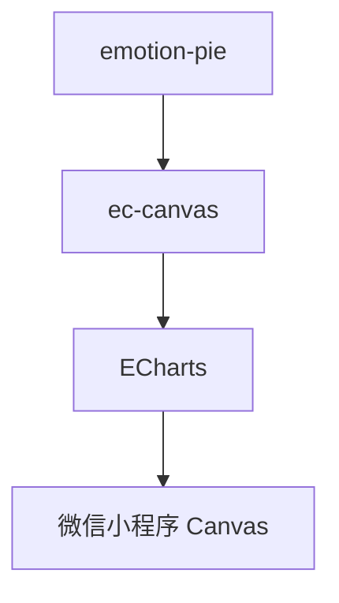
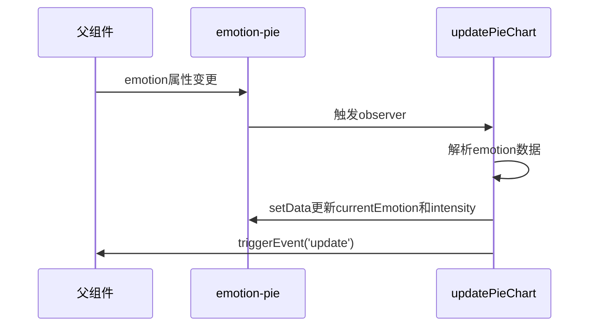
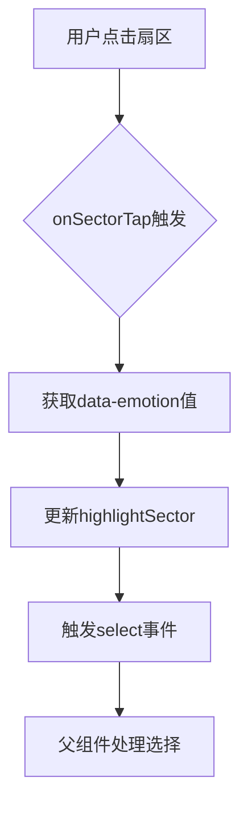
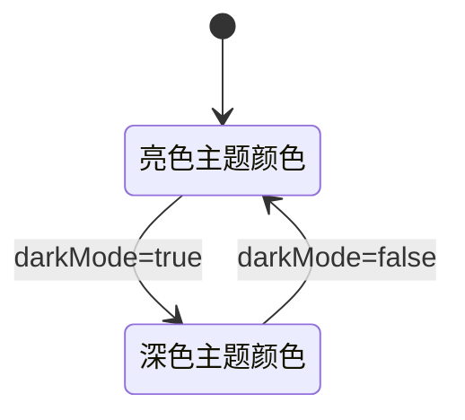

# 情绪分布饼图组件

<cite>
**本文档引用文件**  
- [emotion-pie.js](file://miniprogram/components/emotion-pie/emotion-pie.js)
- [emotion-pie.json](file://miniprogram/components/emotion-pie/emotion-pie.json)
- [ec-canvas.js](file://miniprogram/components/ec-canvas/ec-canvas.js)
- [emotion-panel.js](file://miniprogram/components/emotion-panel/emotion-panel.js)
- [emotion-panel.json](file://miniprogram/components/emotion-panel/emotion-panel.json)
</cite>

## 目录
1. [组件概述](#组件概述)
2. [架构与封装机制](#架构与封装机制)
3. [属性定义与数据结构](#属性定义与数据结构)
4. [图表更新与动画机制](#图表更新与动画机制)
5. [交互逻辑与事件系统](#交互逻辑与事件系统)
6. [暗黑模式适配实现](#暗黑模式适配实现)
7. [使用示例](#使用示例)

## 组件概述

`emotion-pie` 是一个用于展示单维度情绪分类分布比例的自定义组件，专为情感分析场景设计。该组件通过可视化方式呈现用户当前的主要情绪类型及其强度，帮助用户直观理解自身情绪状态。

该组件基于 `ec-canvas` 封装，利用 ECharts 引擎实现高性能、高保真的饼图渲染。支持多种情绪类型（如喜悦、伤感、愤怒、焦虑、平静等）的动态展示，并具备良好的交互反馈机制。

**组件来源**  
- [emotion-pie.js](file://miniprogram/components/emotion-pie/emotion-pie.js)
- [emotion-pie.json](file://miniprogram/components/emotion-pie/emotion-pie.json)

## 架构与封装机制

`emotion-pie` 组件采用分层封装架构，依赖于 `ec-canvas` 组件作为底层绘图引擎。`ec-canvas` 是对微信小程序 Canvas API 的高级封装，集成了 ECharts 图表库，提供了跨平台兼容的图表渲染能力。

### 组件依赖关系


**Diagram sources**  
- [emotion-pie.js](file://miniprogram/components/emotion-pie/emotion-pie.js)
- [ec-canvas.js](file://miniprogram/components/ec-canvas/ec-canvas.js)

`emotion-pie` 并不直接操作 ECharts 实例，而是通过配置数据驱动的方式，将情绪数据转换为适合 ECharts 渲染的格式，并通过事件机制与上层组件通信。

该组件被多个上层组件复用，例如 `emotion-panel` 在其 JSON 配置中明确引用了 `emotion-pie`：

```json
"usingComponents": {
  "emotion-pie": "/components/emotion-pie/emotion-pie"
}
```

**Section sources**  
- [emotion-panel.json](file://miniprogram/components/emotion-panel/emotion-panel.json#L3-L4)

## 属性定义与数据结构

`emotion-pie` 组件通过 `properties` 定义了两个核心属性，用于接收外部传入的数据和配置。

### properties 定义

| 属性名 | 类型 | 默认值 | 说明 |
|--------|------|--------|------|
| `emotion` | Object | `{type: 'neutral', intensity: 0.5}` | 情绪数据对象，包含情绪类型和强度 |
| `darkMode` | Boolean | `false` | 是否启用暗黑主题模式 |

**Section sources**  
- [emotion-pie.js](file://miniprogram/components/emotion-pie/emotion-pie.js#L6-L25)

### emotion 数据结构

`emotion` 属性期望接收一个对象，其结构如下：

```js
{
  primary_emotion?: string,  // 主要情绪类型（优先级高于 type）
  type?: string,             // 情绪类型（兼容旧版）
  intensity?: number         // 情绪强度（0-1）
}
```

支持的情绪类型包括：`joy`（喜悦）、`sadness`（伤感）、`anger`（愤怒）、`anxiety`（焦虑）、`neutral`（平静）、`calm`（平静）、`surprise`（惊讶）、`disgust`（厌恶）、`anticipation`（期待）、`urgency`（紧迫）、`disappointment`（失望）、`fatigue`（疲惫）。

组件内部通过 `labels` 对象将英文类型映射为中文标签，确保界面显示友好。

**Section sources**  
- [emotion-pie.js](file://miniprogram/components/emotion-pie/emotion-pie.js#L45-L67)

## 图表更新与动画机制

组件通过 `observer` 监听 `emotion` 属性的变化，实现数据驱动的图表更新。

### 更新流程


**Diagram sources**  
- [emotion-pie.js](file://miniprogram/components/emotion-pie/emotion-pie.js#L85-L103)

当 `emotion` 属性发生变化时，`observer` 会调用 `updatePieChart` 方法。该方法优先使用 `primary_emotion` 字段，若不存在则回退到 `type` 字段。随后通过 `setData` 更新组件内部数据，并触发 `update` 事件通知父组件。

虽然当前实现未直接调用 ECharts 的 `setOption`，但其数据更新机制为后续集成 ECharts 动画（如扇区展开、颜色渐变）提供了基础。通过 `setData` 触发的视图更新天然具备小程序的过渡动画能力。

## 交互逻辑与事件系统

组件实现了点击交互功能，允许用户通过点击饼图扇区进行情绪选择。

### 交互流程


**Diagram sources**  
- [emotion-pie.js](file://miniprogram/components/emotion-pie/emotion-pie.js#L158-L167)

点击事件通过 WXML 中的 `bindtap` 绑定到 `onSectorTap` 方法。该方法从 `e.currentTarget.dataset.emotion` 获取对应的情绪类型，更新 `highlightSector` 实现高亮效果，并通过 `triggerEvent('select')` 将选择结果冒泡至父组件。

事件冒泡机制确保了组件的高内聚、低耦合特性。父组件（如 `emotion-panel`）可以监听 `select` 事件，执行保存记录、切换角色等业务逻辑，而无需侵入 `emotion-pie` 内部实现。

**Section sources**  
- [emotion-pie.js](file://miniprogram/components/emotion-pie/emotion-pie.js#L158-L167)
- [emotion-panel.js](file://miniprogram/components/emotion-panel/emotion-panel.js#L109-L117)

## 暗黑模式适配实现

组件通过 `darkMode` 属性和 `updateTheme` 方法实现了暗黑模式的动态适配。

### 主题切换逻辑


**Diagram sources**  
- [emotion-pie.js](file://miniprogram/components/emotion-pie/emotion-pie.js#L140-L156)

当 `darkMode` 属性变化时，`observer` 调用 `updateTheme` 方法。该方法根据 `isDark` 参数切换两套预定义的颜色方案：

- **亮色主题**：使用明亮、饱和的颜色（如 `#2ECC71` 喜悦）
- **暗色主题**：使用更深、更柔和的颜色（如 `#26A65B` 喜悦）

颜色映射覆盖所有支持的情绪类型，确保视觉一致性。主题切换通过 `setData` 原子更新，保证界面渲染的连贯性。

全局主题状态由 `app.js` 管理，通过 `globalData.darkMode` 和 `watchTheme` 机制通知所有组件更新，`emotion-pie` 作为订阅者响应这一变化。

**Section sources**  
- [emotion-pie.js](file://miniprogram/components/emotion-pie/emotion-pie.js#L140-L156)

## 使用示例

### WXML 中引用组件

```xml
<emotion-pie 
  emotion="{{currentEmotion}}" 
  darkMode="{{darkMode}}" 
  bind:update="onChartUpdate" 
  bind:select="onEmotionSelect" />
```

### JS 中数据绑定与更新

```js
Page({
  data: {
    currentEmotion: {
      primary_emotion: 'joy',
      intensity: 0.8
    },
    darkMode: true
  },

  // 处理图表更新
  onChartUpdate(event) {
    console.log('图表已更新:', event.detail);
  },

  // 处理情绪选择
  onEmotionSelect(event) {
    const { type } = event.detail;
    wx.showToast({
      title: `选择了: ${this.data.emotionLabels[type]}`,
      icon: 'none'
    });
  },

  // 动态更新情绪数据
  updateEmotion(newEmotion) {
    this.setData({
      currentEmotion: newEmotion
    });
    // 组件将自动触发平滑过渡动画
  }
})
```

此示例展示了如何在页面中引用 `emotion-pie` 组件，绑定数据和事件，并通过 `setData` 实现动态更新。当 `currentEmotion` 变化时，组件将自动重新渲染并呈现视觉过渡效果。

**Section sources**  
- [emotion-pie.js](file://miniprogram/components/emotion-pie/emotion-pie.js)
- [emotion-panel.js](file://miniprogram/components/emotion-panel/emotion-panel.js)