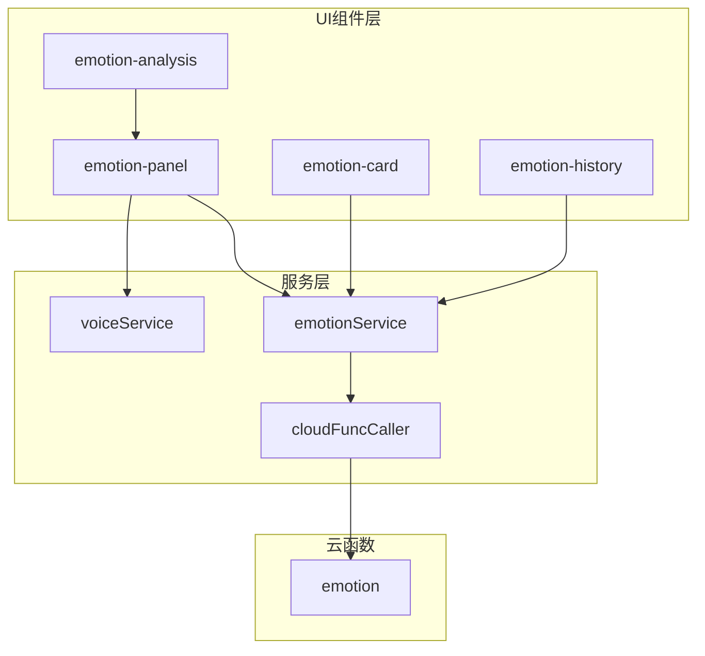
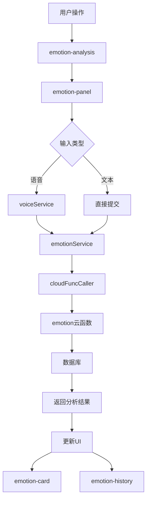
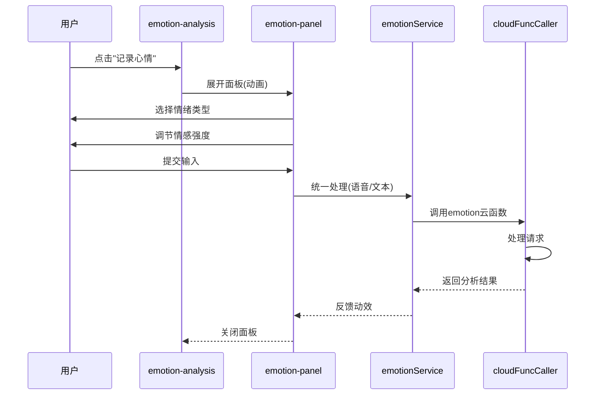
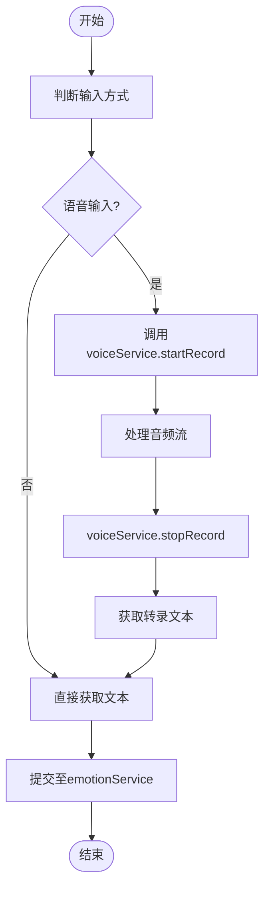
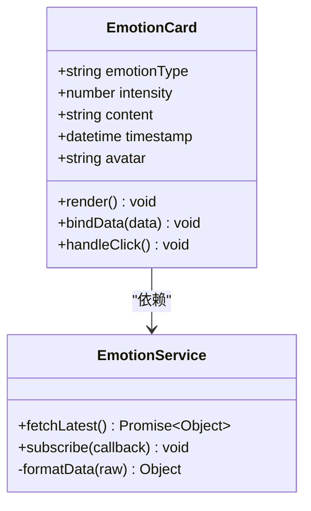
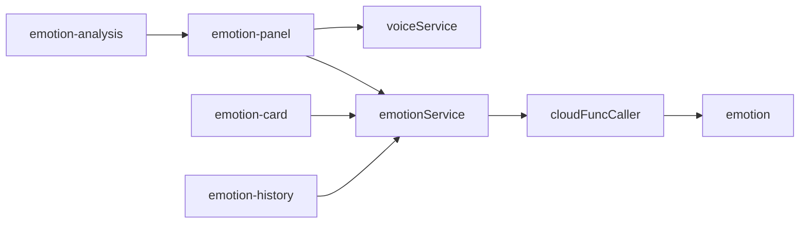

# 情感交互组件

<cite>
**本文档引用文件**  
- [emotion-analysis.js](file://miniprogram/components/emotion-analysis/emotion-analysis.js)
- [emotion-panel.js](file://miniprogram/components/emotion-panel/emotion-panel.js)
- [index.ts](file://miniprogram/components/emotion-card/index.ts)
- [emotion-history.js](file://miniprogram/components/emotion-history/emotion-history.js)
- [voiceService.js](file://miniprogram/services/voiceService.js)
- [emotionService.js](file://miniprogram/services/emotionService.js)
- [index.js](file://cloudfunctions/emotion/index.js)
</cite>

## 目录
1. [简介](#简介)
2. [项目结构](#项目结构)
3. [核心组件](#核心组件)
4. [架构概览](#架构概览)
5. [详细组件分析](#详细组件分析)
6. [依赖分析](#依赖分析)
7. [性能考虑](#性能考虑)
8. [故障排除指南](#故障排除指南)
9. [结论](#结论)

## 简介
本文档系统化描述了情感分析相关UI组件的设计与实现，重点阐述情绪录入入口的交互流程、语音与文本输入的统一处理逻辑、卡片式布局的数据绑定方式、历史记录的滚动加载策略，以及与后端云函数的集成机制。

## 项目结构
情感交互功能主要分布在小程序的`components`目录下，包含多个独立可复用的自定义组件，并通过`services`层与云端函数进行数据交互。



**Diagram sources**  
- [emotion-analysis.js](file://miniprogram/components/emotion-analysis/emotion-analysis.js#L1-L10)
- [emotion-panel.js](file://miniprogram/components/emotion-panel/emotion-panel.js#L1-L10)

**Section sources**
- [emotion-analysis.js](file://miniprogram/components/emotion-analysis/emotion-analysis.js#L1-L50)
- [emotion-panel.js](file://miniprogram/components/emotion-panel/emotion-panel.js#L1-L50)

## 核心组件
本系统包含四大核心UI组件：`emotion-analysis`作为情绪录入入口，`emotion-panel`提供情绪选择面板，`emotion-card`用于展示单条情绪记录，`emotion-history`负责历史数据的可视化呈现。

**Section sources**
- [emotion-analysis.js](file://miniprogram/components/emotion-analysis/emotion-analysis.js#L20-L100)
- [emotion-panel.js](file://miniprogram/components/emotion-panel/emotion-panel.js#L15-L80)
- [index.ts](file://miniprogram/components/emotion-card/index.ts#L10-L60)
- [emotion-history.js](file://miniprogram/components/emotion-history/emotion-history.js#L25-L90)

## 架构概览
系统采用分层架构设计，UI组件与业务逻辑分离，通过事件总线和统一服务接口进行通信。



**Diagram sources**  
- [emotionService.js](file://miniprogram/services/emotionService.js#L5-L30)
- [index.js](file://cloudfunctions/emotion/index.js#L1-L20)

## 详细组件分析

### emotion-analysis 组件分析
作为情绪录入的主入口，该组件管理情绪面板的显示状态和提交流程。



**Diagram sources**  
- [emotion-analysis.js](file://miniprogram/components/emotion-analysis/emotion-analysis.js#L30-L70)
- [emotion-panel.js](file://miniprogram/components/emotion-panel/emotion-panel.js#L40-L90)

**Section sources**
- [emotion-analysis.js](file://miniprogram/components/emotion-analysis/emotion-analysis.js#L1-L100)

### emotion-panel 组件分析
实现语音与文本输入的统一处理逻辑，集成voiceService服务。



**Diagram sources**  
- [emotion-panel.js](file://miniprogram/components/emotion-panel/emotion-panel.js#L20-L100)
- [voiceService.js](file://miniprogram/services/voiceService.js#L10-L50)

**Section sources**
- [emotion-panel.js](file://miniprogram/components/emotion-panel/emotion-panel.js#L1-L120)
- [voiceService.js](file://miniprogram/services/voiceService.js#L1-L60)

### emotion-card 组件分析
采用卡片式布局展示情绪数据，实现响应式数据绑定。



**Diagram sources**  
- [index.ts](file://miniprogram/components/emotion-card/index.ts#L5-L40)
- [emotionService.js](file://miniprogram/services/emotionService.js#L20-L40)

**Section sources**
- [index.ts](file://miniprogram/components/emotion-card/index.ts#L1-L80)
- [emotionService.js](file://miniprogram/services/emotionService.js#L15-L50)

### emotion-history 组件分析
负责情绪历史页面的滚动加载与时间轴渲染。

```mermaid
flowchart TD
A[页面初始化] --> B[加载首批数据]
B --> C[渲染时间轴]
C --> D[监听滚动事件]
D --> E{"滚动到底部?"}
E --> |否| F[等待]
E --> |是| G[检查是否有更多数据]
G --> H{"有更多数据?"}
H --> |是| I[加载下一页]
I --> J[追加渲染]
J --> D
H --> |否| K[显示"无更多数据"]
```

**Diagram sources**  
- [emotion-history.js](file://miniprogram/components/emotion-history/emotion-history.js#L30-L100)
- [emotionService.js](file://miniprogram/services/emotionService.js#L50-L70)

**Section sources**
- [emotion-history.js](file://miniprogram/components/emotion-history/emotion-history.js#L1-L120)
- [emotionService.js](file://miniprogram/services/emotionService.js#L45-L80)

## 依赖分析
各组件通过服务层与云函数解耦，形成清晰的依赖链。



**Diagram sources**  
- [package.json](file://cloudfunctions/emotion/package.json#L1-L10)
- [emotion-analysis.js](file://miniprogram/components/emotion-analysis/emotion-analysis.js#L10-L30)

**Section sources**
- [package.json](file://cloudfunctions/emotion/package.json#L1-L20)
- [cloudFuncCaller.js](file://miniprogram/services/cloudFuncCaller.js#L1-L40)

## 性能考虑
- 情绪面板采用懒加载和缓存机制减少重复渲染
- 历史记录实现分页加载避免一次性加载过多数据
- 语音转文本在后台线程处理防止阻塞UI
- 云函数调用添加超时和重试机制

## 故障排除指南
常见问题及解决方案：

| 问题现象 | 可能原因 | 解决方案 |
|--------|--------|--------|
| 语音输入无响应 | 权限未开启 | 检查麦克风权限设置 |
| 提交失败 | 网络异常 | 检查网络连接，重试提交 |
| 数据加载缓慢 | 数据量过大 | 优化查询条件，增加索引 |
| 动画卡顿 | 设备性能不足 | 降低动画复杂度，关闭非必要特效 |

**Section sources**
- [voiceService.js](file://miniprogram/services/voiceService.js#L60-L100)
- [emotionService.js](file://miniprogram/services/emotionService.js#L80-L120)
- [cloudFuncCaller.js](file://miniprogram/services/cloudFuncCaller.js#L40-L80)

## 结论
情感交互组件通过模块化设计实现了高内聚低耦合的架构，各组件职责清晰，交互流程顺畅。系统成功整合了语音与文本输入方式，提供了流畅的用户体验，并通过合理的数据加载策略保证了性能表现。