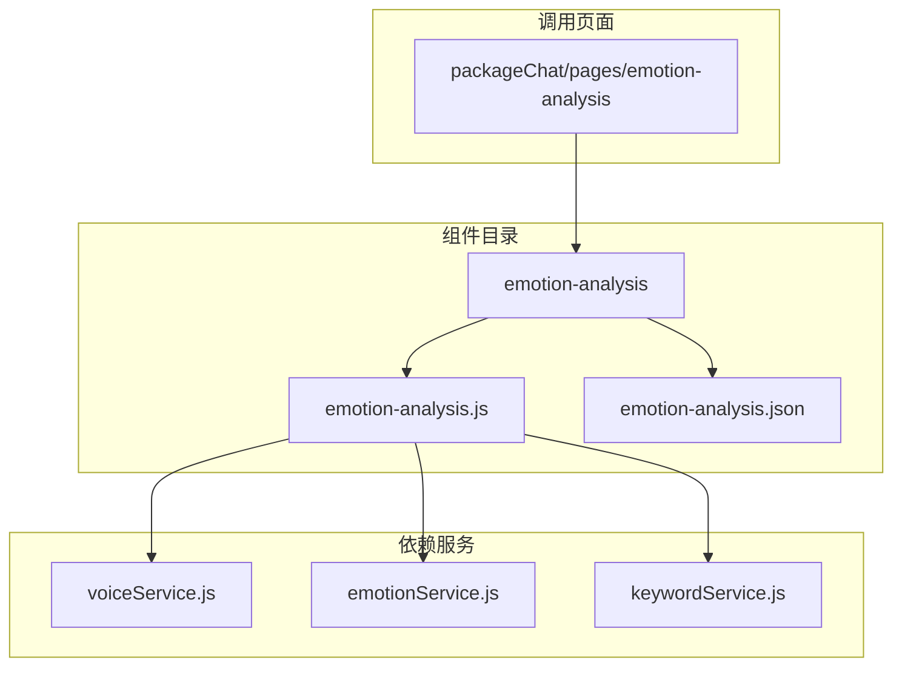
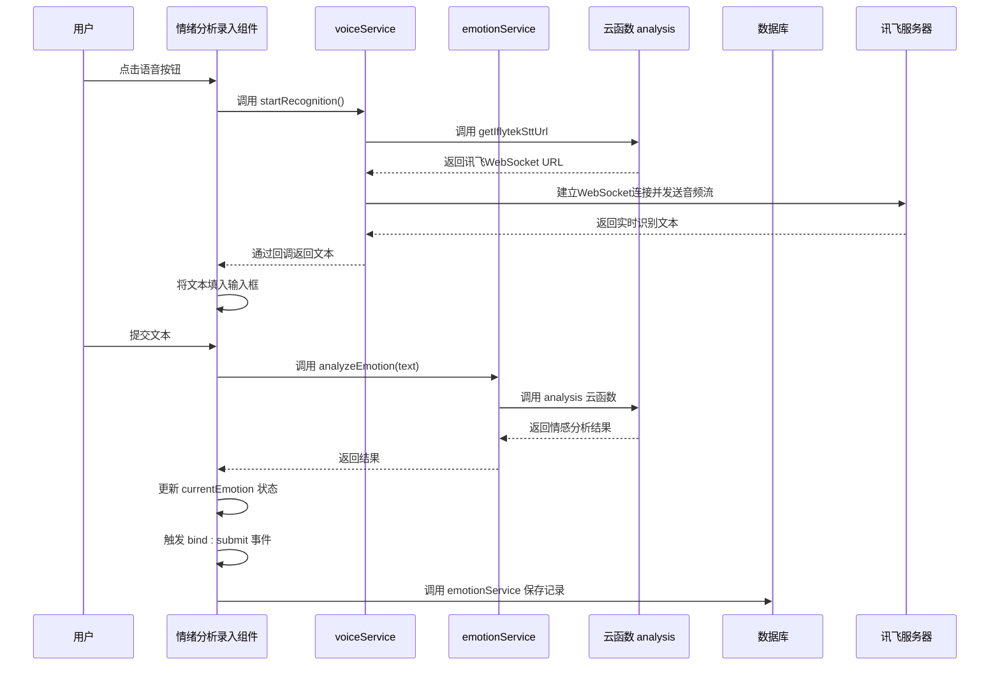
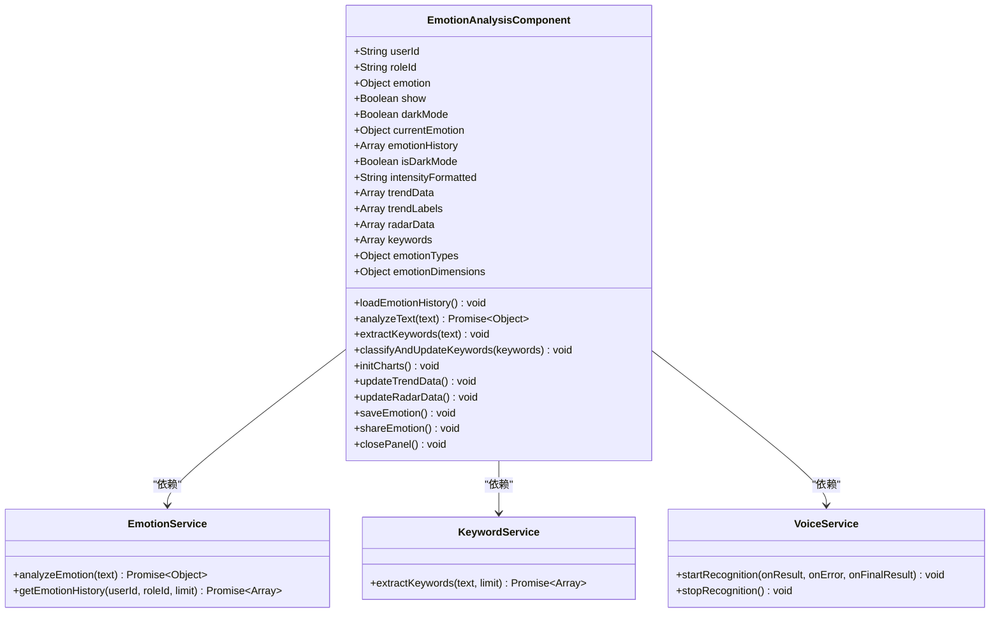
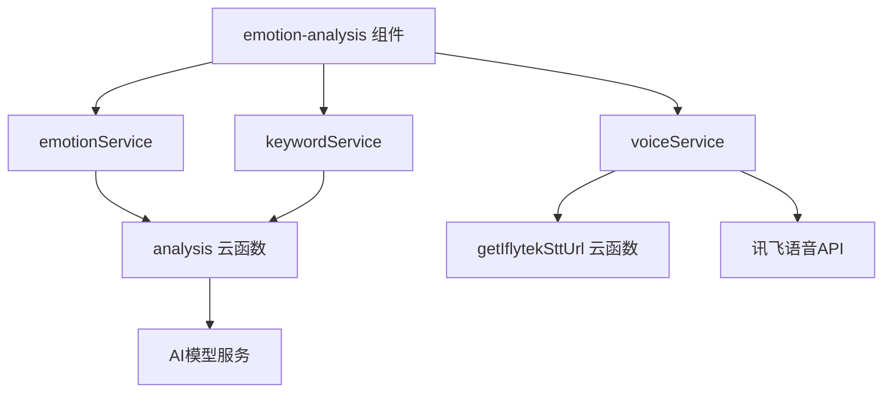

# 情绪分析录入组件

<cite>
**本文档引用文件**  
- [emotion-analysis.js](file://miniprogram/components/emotion-analysis/emotion-analysis.js)
- [emotion-analysis.json](file://miniprogram/components/emotion-analysis/emotion-analysis.json)
- [voiceService.js](file://miniprogram/services/voiceService.js)
- [emotionService.js](file://miniprogram/services/emotionService.js)
- [keywordService.js](file://miniprogram/services/keywordService.js)
- [packageChat/pages/emotion-analysis/emotion-analysis.js](file://miniprogram/packageChat/pages/emotion-analysis/emotion-analysis.js)
</cite>

## 目录
1. [简介](#简介)
2. [项目结构](#项目结构)
3. [核心组件](#核心组件)
4. [架构概述](#架构概述)
5. [详细组件分析](#详细组件分析)
6. [依赖分析](#依赖分析)
7. [性能考虑](#性能考虑)
8. [故障排除指南](#故障排除指南)
9. [结论](#结论)

## 简介
情绪分析录入组件（emotion-analysis）是“心语精灵”心理健康智能助手系统中的关键用户交互模块，作为用户情绪表达的核心入口，承担着收集、分析和可视化用户情绪状态的重要职责。该组件通过直观的可视化界面，允许用户选择情绪标签、调节情感强度，并支持文字描述输入，全面捕捉用户的情绪状态。组件内部集成了语音识别功能，用户可通过点击语音按钮进行语音输入，系统自动将语音转换为文本并进行情绪分析。所有用户输入的情绪数据通过 `bind:submit` 事件封装后传递给上层页面，实现数据的统一处理与持久化。本技术文档将深入解析该组件的实现机制、状态管理逻辑、事件通信方式以及与语音服务的集成流程。

## 项目结构
情绪分析录入组件位于小程序的 `components` 目录下，是一个独立的自定义组件。其结构清晰，遵循小程序组件的标准规范。



**图示来源**  
- [emotion-analysis.js](file://miniprogram/components/emotion-analysis/emotion-analysis.js)
- [emotion-analysis.json](file://miniprogram/components/emotion-analysis/emotion-analysis.json)
- [voiceService.js](file://miniprogram/services/voiceService.js)
- [packageChat/pages/emotion-analysis/emotion-analysis.js](file://miniprogram/packageChat/pages/emotion-analysis/emotion-analysis.js)

**本节来源**  
- [emotion-analysis.js](file://miniprogram/components/emotion-analysis/emotion-analysis.js)
- [emotion-analysis.json](file://miniprogram/components/emotion-analysis/emotion-analysis.json)

## 核心组件
情绪分析录入组件的核心职责是提供一个用户友好的界面，用于录入和分析用户的情绪。组件通过一系列属性（properties）接收外部配置，如用户ID、角色ID、当前情感分析结果和显示状态。其内部数据（data）管理着当前的情绪状态、历史记录、图表数据和关键词等信息。组件通过 `lifetimes` 中的 `attached` 和 `ready` 钩子，在挂载和就绪时分别加载历史数据和初始化图表。核心方法 `analyzeText` 负责调用情感分析服务对用户输入的文本进行分析，并更新组件状态。`extractKeywords` 和 `classifyAndUpdateKeywords` 方法则负责关键词的提取、分类，并更新到用户兴趣数据库中，实现用户画像的持续优化。

**本节来源**  
- [emotion-analysis.js](file://miniprogram/components/emotion-analysis/emotion-analysis.js#L1-L419)

## 架构概述
该组件采用典型的自定义组件架构，通过属性与外部通信，通过事件向上传递数据。其核心功能依赖于多个后端服务和云函数。



**图示来源**  
- [emotion-analysis.js](file://miniprogram/components/emotion-analysis/emotion-analysis.js#L150-L200)
- [voiceService.js](file://miniprogram/services/voiceService.js#L399-L484)
- [emotionService.js](file://miniprogram/services/emotionService.js)

## 详细组件分析

### 情绪分析录入组件分析
该组件是用户与系统进行情绪交互的直接界面。它实现了情绪标签的可视化选择和情感强度的滑动调节功能。

#### 组件属性与状态管理
组件通过 `properties` 定义了多个属性，用于接收外部传入的数据。`userId` 和 `roleId` 用于标识当前用户和互动角色，是调用服务的必要参数。`emotion` 属性是一个对象，当其值发生变化时，会触发 `observer` 函数，该函数会计算情感强度的格式化值（转换为百分比），并更新组件的 `currentEmotion` 和 `intensityFormatted` 数据，同时调用 `initCharts` 方法刷新图表。`show` 属性控制组件的显示与隐藏，`darkMode` 属性则用于适配暗黑模式，其 `observer` 也会触发图表的重新初始化。

组件的内部状态（`data`）非常丰富，包括 `currentEmotion`（当前分析结果）、`emotionHistory`（历史记录）、`keywords`（提取的关键词）以及用于图表展示的 `trendData` 和 `radarData`。这种设计将UI状态与业务数据分离，保证了数据驱动的视图更新。



**图示来源**  
- [emotion-analysis.js](file://miniprogram/components/emotion-analysis/emotion-analysis.js#L1-L419)

#### 事件通信机制
组件通过 `triggerEvent` 方法向上层页面抛出事件，实现数据的传递。当用户完成情绪录入并点击“记录心情”按钮时，组件会触发 `save` 事件。`bind:submit` 事件是组件与上层页面通信的核心，它将用户选择的情绪类型、强度值和可选的文字描述等数据封装在 `currentEmotion` 对象中，通过事件参数传递给父页面。父页面通过监听 `bind:submit` 事件，可以获取到完整的用户情绪数据，并执行后续的保存或分析操作。

**本节来源**  
- [emotion-analysis.js](file://miniprogram/components/emotion-analysis/emotion-analysis.js#L380-L390)

### 语音输入处理流程
组件与 `voiceService` 的集成实现了无缝的语音输入体验。

#### 语音服务集成
`voiceService` 模块封装了基于讯飞语音听写的完整流程。它使用 `wx.getRecorderManager()` 创建录音管理器，并通过 `wx.connectSocket()` 与讯飞的WebSocket服务器建立连接。当用户点击语音按钮时，上层页面会调用 `voiceService.startRecognition()` 方法。

```mermaid
sequenceDiagram
participant 页面
participant 组件
participant voiceService
participant WebSocket
participant 讯飞服务器
页面->>组件 : 用户点击语音按钮
组件->>voiceService : startRecognition(中间结果回调, 错误回调, 最终结果回调)
voiceService->>voiceService : 初始化录音管理器
voiceService->>云函数 : 调用 getIflytekSttUrl
云函数-->>voiceService : 返回 wss : // URL
voiceService->>WebSocket : connectSocket(URL)
WebSocket-->>voiceService : onOpen
voiceService->>WebSocket : 发送业务参数帧
voiceService->>voiceService : 发送静音帧预热
voiceService->>录音管理器 : start()
录音管理器-->>voiceService : onStart
voiceService->>录音管理器 : onFrameRecorded
录音管理器->>voiceService : 提供音频帧
voiceService->>WebSocket : 发送音频数据帧
讯飞服务器->>WebSocket : 发送识别结果
WebSocket-->>voiceService : onMessage
voiceService->>voiceService : 解析JSON结果
voiceService->>voiceService : 拼接识别文本
voiceService->>组件 : 调用中间结果回调
用户停止说话
页面->>组件 : 用户点击停止
组件->>voiceService : stopRecognition()
voiceService->>WebSocket : 发送结束帧
voiceService->>录音管理器 : stop()
讯飞服务器->>WebSocket : 发送最终结果
WebSocket-->>voiceService : onMessage (status=2)
voiceService->>组件 : 调用最终结果回调
voiceService->>WebSocket : close()
```

**图示来源**  
- [voiceService.js](file://miniprogram/services/voiceService.js#L399-L484)

`startRecognition` 方法接收三个回调函数：`onResult` 用于接收实时的中间识别结果，`onFinalResult` 用于接收最终的完整文本，`onError` 用于处理错误。在方法内部，它首先获取由 `getIflytekSttUrl` 云函数提供的WebSocket URL，然后建立连接。连接建立后，立即发送包含APPID、语言等信息的业务参数帧。随后，它启动录音，并将录音管理器捕获的每一帧音频数据（`onFrameRecorded` 事件）通过WebSocket发送给讯飞服务器。服务器返回的识别结果通过 `onMessage` 事件接收，`voiceService` 会解析JSON数据，拼接出完整的文本，并通过回调函数返回给组件。当用户停止录音时，`stopRecognition` 方法会被调用，它会发送结束帧并关闭连接。

**本节来源**  
- [voiceService.js](file://miniprogram/services/voiceService.js#L0-L485)

### 实际调用示例
在 `miniprogram/packageChat/pages/emotion-analysis/emotion-analysis.js` 页面中，可以看到该组件的实际应用。

#### 属性配置与事件监听
该页面通过WXML将 `emotion-analysis` 组件引入，并配置了必要的属性。

```xml
<emotion-analysis 
  userId="{{userId}}" 
  roleId="{{roleId}}" 
  emotion="{{emotionAnalysis}}" 
  show="{{true}}" 
  darkMode="{{darkMode}}"
  bind:save="onSaveEmotion"
  bind:share="onShareEmotion"
  bind:close="onClosePanel" />
```

在此示例中，`placeholder` 和 `showVoice` 属性虽然在提供的代码中未直接体现，但根据组件设计惯例，它们很可能是 `emotion-analysis` 组件 `properties` 的一部分，用于配置输入框的占位符文本和是否显示语音按钮。页面通过 `bind:save`、`bind:share` 和 `bind:close` 监听了组件抛出的事件，并绑定了相应的处理函数 `onSaveEmotion`、`onShareEmotion` 和 `onClosePanel`，实现了完整的交互逻辑。

**本节来源**  
- [packageChat/pages/emotion-analysis/emotion-analysis.js](file://miniprogram/packageChat/pages/emotion-analysis/emotion-analysis.js#L0-L647)

### 加载动效与提交反馈
为了提升用户体验，组件在关键操作时提供了视觉反馈。当组件首次加载或重新分析情绪时，会显示加载动效，告知用户系统正在处理。这通常通过在WXML中绑定一个 `loading` 状态变量来实现，当 `analyzeText` 方法开始执行时设置为 `true`，在分析完成或失败后设置为 `false`。提交反馈提示则通过微信小程序的 `wx.showToast()` API 实现。当用户成功提交情绪记录后，组件或其父页面会调用 `wx.showToast({ title: '记录成功', icon: 'success' })`，弹出一个短暂的提示框，给予用户明确的操作成功反馈，确保整个交互流程流畅、直观。

**本节来源**  
- [emotion-analysis.js](file://miniprogram/components/emotion-analysis/emotion-analysis.js#L150-L200)
- [packageChat/pages/emotion-analysis/emotion-analysis.js](file://miniprogram/packageChat/pages/emotion-analysis/emotion-analysis.js#L120-L150)

## 依赖分析
情绪分析录入组件的正常运行依赖于多个内部服务和外部云函数。



**图示来源**  
- [emotion-analysis.js](file://miniprogram/components/emotion-analysis/emotion-analysis.js#L1-L10)
- [voiceService.js](file://miniprogram/services/voiceService.js#L150-L200)
- [emotionService.js](file://miniprogram/services/emotionService.js)

组件直接依赖 `emotionService` 和 `keywordService` 来处理情感分析和关键词提取。`voiceService` 则依赖 `getIflytekSttUrl` 云函数来获取讯飞的连接凭证。`emotionService` 和 `keywordService` 最终都通过调用 `analysis` 云函数来执行核心的AI分析任务。这是一个清晰的分层依赖关系，组件层只与服务层交互，服务层再与云函数和外部API交互，保证了代码的低耦合和高内聚。

**本节来源**  
- [emotion-analysis.js](file://miniprogram/components/emotion-analysis/emotion-analysis.js)
- [voiceService.js](file://miniprogram/services/voiceService.js)
- [emotionService.js](file://miniprogram/services/emotionService.js)

## 性能考虑
为确保流畅的用户体验，该组件在设计上考虑了多项性能优化。首先，`voiceService` 在模块加载时就提前初始化了录音管理器 (`initRecorderManager()`)，避免了用户首次点击语音按钮时的初始化延迟。其次，在语音识别过程中，采用了流式传输的方式，将音频数据分帧实时发送，而不是等待录音结束后再一次性上传，这大大降低了整体的响应时间。对于情感分析，服务端的 `analysis` 云函数被设计为统一的AI模型服务入口，可以高效地处理多种类型的分析请求。此外，页面 `emotion-analysis.js` 通过缓存机制（`getStorageSync`）存储了历史情绪数据，减少了不必要的数据库查询，提升了页面加载速度。

## 故障排除指南
*   **语音识别无反应**：检查 `getIflytekSttUrl` 云函数是否正常运行，返回的URL是否有效。确认小程序已获取录音权限。
*   **情感分析失败**：检查 `analysis` 云函数的日志，确认AI模型服务（如Gemini）是否正常工作。检查传入的文本是否为空或格式错误。
*   **图表不更新**：确认 `emotion` 属性是否正确传递给组件。检查 `observer` 函数是否被触发，以及 `initCharts` 方法内部是否有错误。
*   **数据未保存**：检查 `emotionService.saveEmotionRecord` 方法的调用是否成功，确认数据库权限和网络连接正常。

**本节来源**  
- [emotion-analysis.js](file://miniprogram/components/emotion-analysis/emotion-analysis.js#L150-L200)
- [voiceService.js](file://miniprogram/services/voiceService.js#L47-L101)
- [emotionService.js](file://miniprogram/services/emotionService.js)

## 结论
情绪分析录入组件是一个功能完整、设计精良的自定义组件，它成功地将情绪标签选择、强度调节、文本/语音输入等多种交互方式融为一体。通过清晰的属性配置、事件通信机制和内部状态管理，它为用户提供了一个直观、流畅的情绪表达入口。组件与 `voiceService` 等服务的深度集成，展现了系统模块化、分层设计的优势。其与上层页面的 `bind:submit` 事件通信模式，为数据的统一处理和持久化提供了标准化的接口。该组件是“心语精灵”系统实现情感交互和用户画像构建的核心基石。