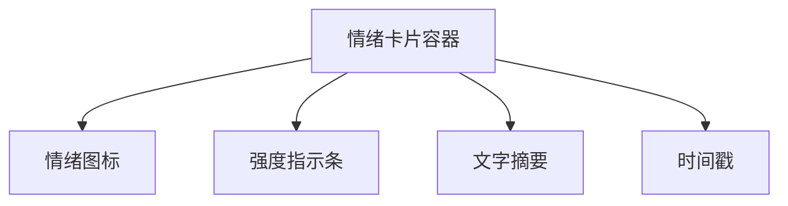
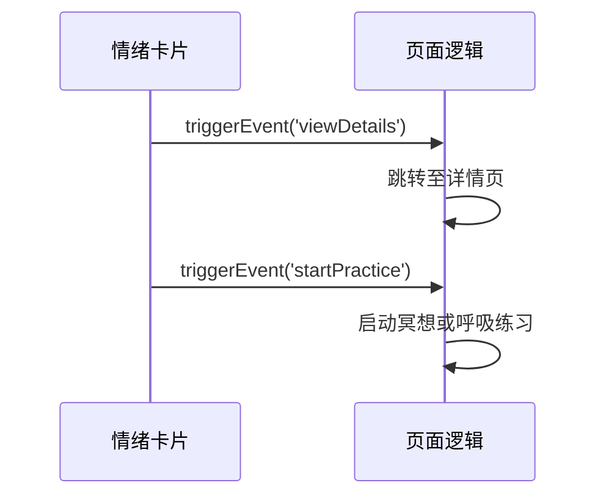
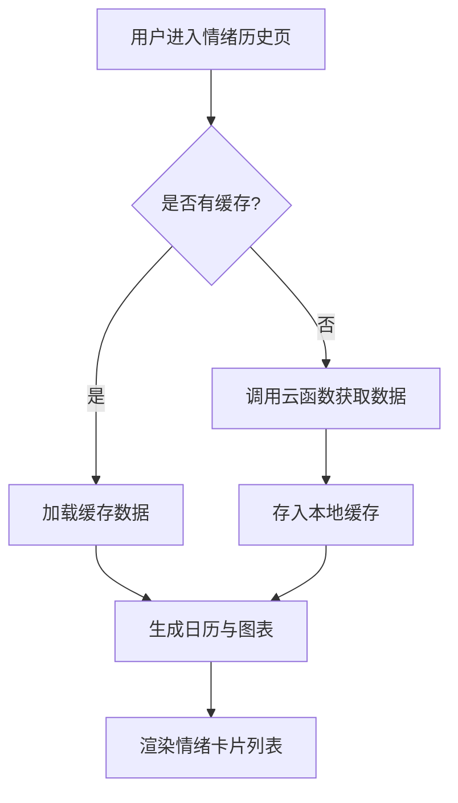

# 情绪卡片展示组件

<cite>
**本文档引用文件**  
- [index.ts](file://miniprogram/components/emotion-card/index.ts#L0-L79)
- [index.json](file://miniprogram/components/emotion-card/index.json#L0-L3)
- [emotion-history.js](file://miniprogram/packageEmotion/pages/emotion-history/emotion-history.js#L0-L1672)
- [emotion-history.json](file://miniprogram/packageEmotion/pages/emotion-history/emotion-history.json#L0-L9)
</cite>

## 目录
1. [简介](#简介)
2. [UI结构与布局](#ui结构与布局)
3. [数据绑定机制](#数据绑定机制)
4. [事件回调设计](#事件回调设计)
5. [自定义样式与主题适配](#自定义样式与主题适配)
6. [动画与交互效果](#动画与交互效果)
7. [列表渲染与性能优化](#列表渲染与性能优化)
8. [总结](#总结)

## 简介
情绪卡片组件（emotion-card）是用于在小程序中展示单条情绪记录的核心UI组件。该组件以可视化方式呈现用户的情绪状态，包括主要情绪类型、情绪强度、文字摘要和时间戳等信息。它被广泛应用于情绪历史页面、情绪分析报告等场景，为用户提供直观的情绪回顾体验。

**Section sources**
- [index.ts](file://miniprogram/components/emotion-card/index.ts#L0-L79)

## UI结构与布局
情绪卡片采用模块化布局设计，包含以下核心视觉元素：

- **情绪图标**：根据情绪类型（如“快乐”、“悲伤”、“焦虑”等）动态显示对应的表情符号或图形标识。
- **强度指示条**：通过颜色渐变的进度条形式展示情绪得分（score），反映情绪的强烈程度。
- **文字摘要**：显示情绪类型名称及格式化后的情绪分数（保留两位小数并以百分比表示）。
- **时间戳区域**：预留位置用于显示记录生成的时间，通常由父页面传入。

整体布局简洁清晰，符合移动端阅读习惯，支持响应式适配不同屏幕尺寸。



**Diagram sources**
- [index.ts](file://miniprogram/components/emotion-card/index.ts#L0-L79)

**Section sources**
- [index.ts](file://miniprogram/components/emotion-card/index.ts#L0-L79)

## 数据绑定机制
情绪卡片通过 `emotion` 属性接收一个包含情绪数据的对象 `emotionRecord`，其结构定义如下：

```typescript
interface IEmotionData {
  primary: {
    type: string;    // 情绪类型，如“平静”、“快乐”
    score: number;   // 情绪得分，范围0-1
  };
  details: Array<{
    type: string;
    score: number;
  }>;
  suggestions: string[];
}
```

组件通过 `properties` 定义 `emotion` 为对象类型，默认值包含“平静”状态。当父组件传递新的 `emotionRecord` 时，框架自动触发视图更新，调用内部方法 `formatScore` 将原始分数转换为百分比字符串，并使用 `getEmotionColor` 方法根据情绪类型获取对应的颜色值进行渲染。

**Section sources**
- [index.ts](file://miniprogram/components/emotion-card/index.ts#L10-L23)

## 事件回调设计
情绪卡片支持多种用户交互行为，并通过事件机制与父页面通信：

- **查看详细分析**：点击“查看详细”按钮时触发 `viewDetails` 自定义事件，通知父页面跳转至情绪详情页。
- **开始心理练习**：点击“开始练习”按钮触发 `startPractice` 事件，启动推荐的心理调节训练流程。
- **展开/收起详情**：通过 `toggleExpand` 方法切换 `isExpanded` 状态，控制详细情绪列表的显示与隐藏。

这些事件均通过 `triggerEvent` 方法派发，父组件可在 WXML 中使用 `bind:viewDetails` 或 `bind:startPractice` 进行监听和处理。



**Diagram sources**
- [index.ts](file://miniprogram/components/emotion-card/index.ts#L55-L67)

**Section sources**
- [index.ts](file://miniprogram/components/emotion-card/index.ts#L50-L70)

## 自定义样式与主题适配
组件内置了情绪类型与颜色的映射表 `emotionColors`，支持以下情绪类型的自动配色：

- “平静” → `#8e9aaf`
- “快乐” → `#ffd93d`
- “悲伤” → `#6c757d`
- “愤怒” → `#ff6b6b`
- “焦虑” → `#4d96ff`
- “惊讶” → `#6c5ce7`
- “恐惧” → `#a8e6cf`

此外，组件可通过外部样式类或全局主题变量实现亮色/暗黑模式动态适配。虽然当前实现未直接接收 `darkMode` 属性，但可通过父页面传递不同的样式类或使用小程序的 `mode` 属性配合 CSS 变量实现主题切换。

**Section sources**
- [index.ts](file://miniprogram/components/emotion-card/index.ts#L30-L40)

## 动画与交互效果
情绪卡片默认提供平滑的展开/收起动画效果。当用户点击“查看更多”时，组件通过 `setData` 更新 `isExpanded` 状态，结合 WXML 中的 `wx:if` 或 `hidden` 控制详细内容的显示，并配合 CSS 过渡效果实现视觉上的渐显/渐隐。

未来可扩展支持以下动画特性：
- 卡片入场动画（如淡入、滑入）
- 强度条填充动画
- 点击反馈微交互（涟漪效果）

**Section sources**
- [index.ts](file://miniprogram/components/emotion-card/index.ts#L50-L54)

## 列表渲染与性能优化
在情绪历史页面（`emotion-history`）中，情绪卡片通过 `wx:for` 指令批量渲染，展示用户的多条情绪记录。

### 批量渲染实现
```wxml
<block wx:for="{{recentRecords}}" wx:key="id">
  <emotion-card 
    emotion="{{item.emotion}}" 
    bind:viewDetails="onViewDetails"
    bind:startPractice="onStartPractice" />
</block>
```

### 性能优化策略
尽管当前代码未显式实现虚拟滚动，但已采用以下优化手段提升长列表性能：

1. **数据分页加载**：通过 `switchTimeRange` 方法按时间范围（周/月/年）请求数据，限制单次加载数量。
2. **本地缓存机制**：使用 `wx.setStorageSync` 缓存情绪历史数据，键名为 `emotionHistory_${userId}_${timeRange}`，避免重复请求。
3. **下拉刷新控制**：`onPullDownRefresh` 中清除缓存并重新加载，确保数据新鲜性。
4. **异步数据处理**：`generateRecentRecords` 方法异步生成最近记录列表，减少主线程阻塞。

对于未来更大数据量的场景，建议引入虚拟滚动（virtual list）技术，仅渲染可视区域内的卡片，显著降低内存占用和渲染开销。



**Diagram sources**
- [emotion-history.js](file://miniprogram/packageEmotion/pages/emotion-history/emotion-history.js#L200-L250)
- [emotion-history.js](file://miniprogram/packageEmotion/pages/emotion-history/emotion-history.js#L500-L550)

**Section sources**
- [emotion-history.js](file://miniprogram/packageEmotion/pages/emotion-history/emotion-history.js#L200-L800)

## 总结
情绪卡片组件是一个功能完整、结构清晰的可复用UI组件，能够有效展示用户的情绪记录。它通过标准化的数据接口实现灵活的内容渲染，支持丰富的交互行为，并已在情绪历史页面中实现基础的性能优化。未来可通过增强动画效果、完善主题适配机制以及引入虚拟滚动等手段进一步提升用户体验和系统性能。