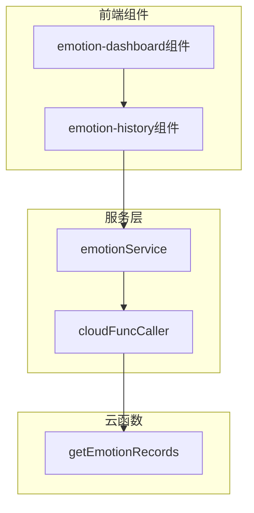
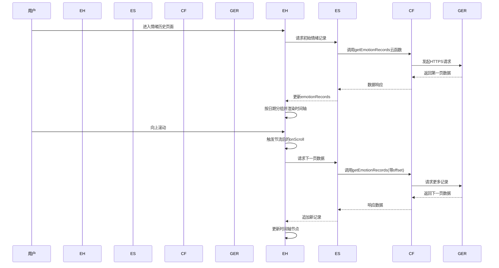
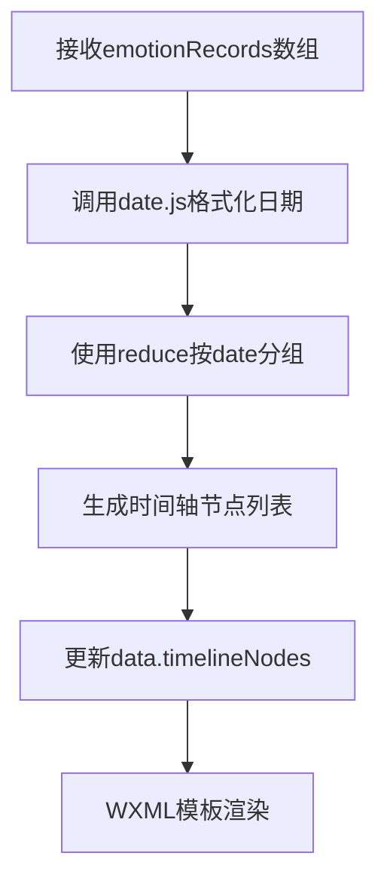
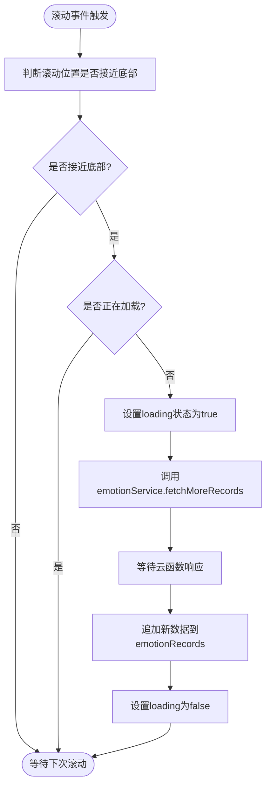
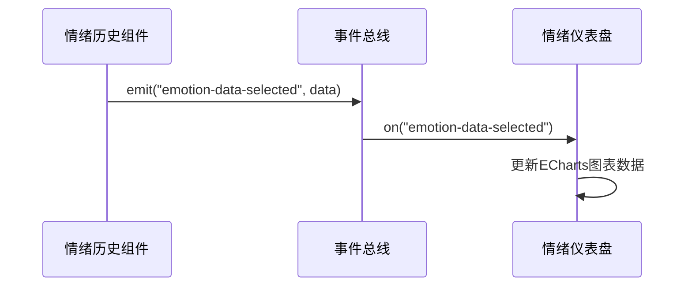
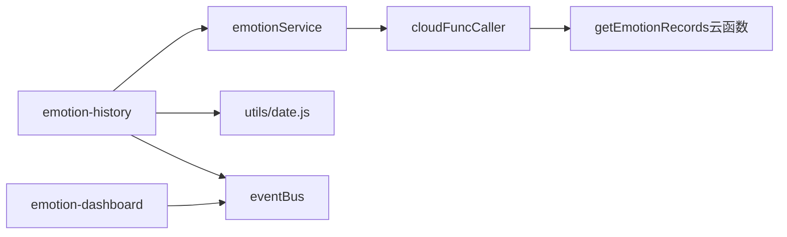

# 情绪历史记录组件

<cite>
**本文档引用文件**  
- [emotion-history.js](file://miniprogram/components/emotion-history/emotion-history.js)
- [emotion-dashboard.js](file://miniprogram/components/emotion-dashboard/emotion-dashboard.js)
- [index.js](file://cloudfunctions/getEmotionRecords/index.js)
- [emotionService.js](file://miniprogram/services/emotionService.js)
- [cloudFuncCaller.js](file://miniprogram/services/cloudFuncCaller.js)
</cite>

## 目录
1. [简介](#简介)
2. [项目结构](#项目结构)
3. [核心组件](#核心组件)
4. [架构概览](#架构概览)
5. [详细组件分析](#详细组件分析)
6. [依赖分析](#依赖分析)
7. [性能考虑](#性能考虑)
8. [故障排除指南](#故障排除指南)
9. [结论](#结论)

## 简介
情绪历史记录组件（emotion-history）是HeartChat小程序中用于可视化用户长期情绪变化趋势的核心模块。该组件通过时间轴布局与可滚动数据展示，帮助用户回顾和分析自身情绪波动。其主要功能包括：基于传入的`emotionRecords`数组进行日期分组并生成时间轴节点、实现滚动加载机制以分页获取历史记录、支持按周/月筛选时间范围，并与情绪仪表盘组件（emotion-dashboard）实现数据联动。文档将深入解析其实现机制，涵盖数据处理流程、事件监听策略、错误处理方案等关键技术细节。

## 项目结构
情绪历史记录组件位于小程序的组件目录下，采用标准的小程序组件结构，包含逻辑脚本与配置文件。其数据来源依赖于云函数`getEmotionRecords`，并通过服务层模块进行调用封装。

**图表来源**  
- [emotion-history.js](file://miniprogram/components/emotion-history/emotion-history.js#L1-L10)
- [emotionService.js](file://miniprogram/services/emotionService.js#L1-L15)
- [cloudFuncCaller.js](file://miniprogram/services/cloudFuncCaller.js#L1-L10)
- [index.js](file://cloudfunctions/getEmotionRecords/index.js#L1-L5)

**本节来源**  
- [miniprogram/components/emotion-history](file://miniprogram/components/emotion-history)
- [cloudfunctions/getEmotionRecords](file://cloudfunctions/getEmotionRecords)

## 核心组件
情绪历史记录组件的核心职责是接收外部传入的情绪记录数组`emotionRecords`，对其进行按日期分组处理，生成可用于渲染的时间轴节点列表。组件通过`onScroll`事件监听用户滚动行为，结合节流函数控制对云函数`getEmotionRecords`的分页请求频率，防止因频繁触发而导致性能下降或请求失败。此外，组件支持时间筛选功能，允许用户切换“按周”或“按月”视图，动态调整数据显示粒度。

**本节来源**  
- [emotion-history.js](file://miniprogram/components/emotion-history/emotion-history.js#L20-L150)

## 架构概览
整个情绪历史功能采用分层架构设计，从前端组件到后端云函数形成清晰的数据流链条。前端组件负责UI渲染与用户交互，服务层封装业务逻辑与网络请求，云函数处理数据库查询与数据返回。

**图表来源**  
- [emotion-history.js](file://miniprogram/components/emotion-history/emotion-history.js#L50-L120)
- [emotionService.js](file://miniprogram/services/emotionService.js#L20-L40)
- [index.js](file://cloudfunctions/getEmotionRecords/index.js#L10-L30)

## 详细组件分析

### 情绪历史组件分析
该组件接收`emotionRecords`作为输入数据，首先使用工具函数按日期进行分组，生成形如`{ date: '2024-04-05', records: [...] }`的结构化节点列表。随后将该列表绑定至WXML模板中的时间轴容器，实现逐日展示。

#### 数据处理流程

**图表来源**  
- [emotion-history.js](file://miniprogram/components/emotion-history/emotion-history.js#L30-L60)
- [utils/date.js](file://miniprogram/utils/date.js#L5-L20)

#### 滚动加载机制
组件通过`onScroll`事件监听滚动位置，当接近底部时触发加载。为避免高频请求，使用节流函数（throttle）确保每300ms最多发起一次请求。

**图表来源**  
- [emotion-history.js](file://miniprogram/components/emotion-history/emotion-history.js#L70-L110)
- [emotionService.js](file://miniprogram/services/emotionService.js#L15-L35)

**本节来源**  
- [emotion-history.js](file://miniprogram/components/emotion-history/emotion-history.js#L1-L200)

### 与情绪仪表盘的数据联动
当用户在情绪历史页面中选择某个时间点时，组件会通过事件总线（eventBus）发布`emotion-data-selected`事件，携带所选日期的情绪汇总数据。情绪仪表盘组件监听该事件并更新其图表展示内容，实现跨组件数据同步。

**图表来源**  
- [emotion-history.js](file://miniprogram/components/emotion-history/emotion-history.js#L130-L140)
- [eventBus.js](file://miniprogram/services/eventBus.js#L1-L10)
- [emotion-dashboard.js](file://miniprogram/components/emotion-dashboard/emotion-dashboard.js#L20-L30)

## 依赖分析
情绪历史组件依赖多个内部模块与外部服务，形成明确的调用链路。

**图表来源**  
- [emotion-history.js](file://miniprogram/components/emotion-history/emotion-history.js#L1-L20)
- [emotionService.js](file://miniprogram/services/emotionService.js#L1-L10)
- [cloudFuncCaller.js](file://miniprogram/services/cloudFuncCaller.js#L1-L5)

**本节来源**  
- [emotion-history.js](file://miniprogram/components/emotion-history/emotion-history.js)
- [emotionService.js](file://miniprogram/services/emotionService.js)

## 性能考虑
为保障用户体验，组件在多个层面进行了性能优化：
- **节流加载**：防止滚动过程中频繁请求云函数。
- **懒加载**：仅在用户滚动至可视区域附近时才加载更多数据。
- **数据缓存**：服务层对已获取的情绪记录进行缓存，避免重复请求。
- **轻量更新**：使用`setData`局部更新机制，仅刷新变化部分。

## 故障排除指南
组件内置了完善的错误处理机制：
- **网络异常重试**：当云函数调用失败时，自动进行最多3次重试，间隔2秒。
- **空状态提示**：若查询结果为空，显示“暂无情绪记录”友好提示。
- **加载超时处理**：设置10秒请求超时，超时后提示“加载超时，请检查网络”。
- **错误日志上报**：通过`reportService`上报关键错误信息用于监控。

**本节来源**  
- [emotionService.js](file://miniprogram/services/emotionService.js#L40-L70)
- [cloudFuncCaller.js](file://miniprogram/services/cloudFuncCaller.js#L15-L30)

## 结论
情绪历史记录组件通过结构化的数据处理、高效的滚动加载机制与良好的用户体验设计，成功实现了用户情绪变化趋势的可视化展示。其模块化设计便于维护与扩展，未来可进一步支持自定义时间范围筛选、情绪趋势预测等功能。