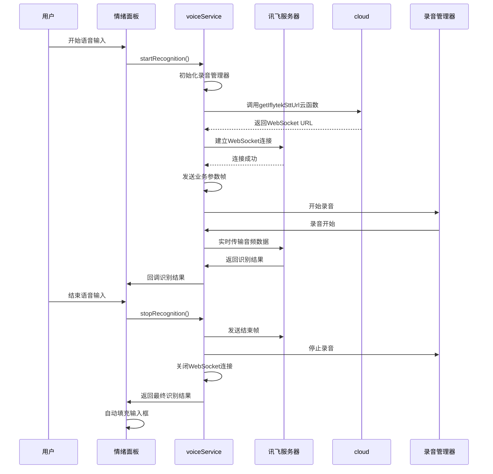
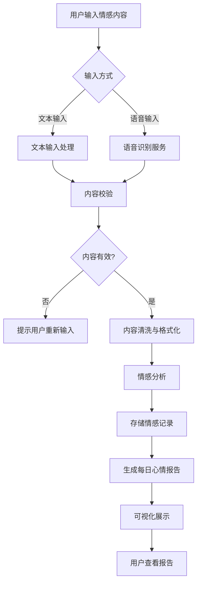

# 情绪输入面板组件

<cite>
**本文档引用的文件**
- [emotion-panel.js](file://miniprogram/components/emotion-panel/emotion-panel.js)
- [voiceService.js](file://miniprogram/services/voiceService.js)
- [daily-report.js](file://miniprogram/packageEmotion/pages/daily-report/daily-report.js)
- [chat-input.js](file://miniprogram/packageChat/components/chat-input/index.js)
</cite>

## 目录
1. [组件概述](#组件概述)
2. [架构设计与布局管理](#架构设计与布局管理)
3. [交互逻辑与行为协调](#交互逻辑与行为协调)
4. [语音服务集成与生命周期控制](#语音服务集成与生命周期控制)
5. [文本输入处理机制](#文本输入处理机制)
6. [属性与事件接口](#属性与事件接口)
7. [在情绪分析流程中的应用](#在情绪分析流程中的应用)

## 组件概述

情绪输入面板组件（emotion-panel）是HeartChat应用中用于情感输入与分析的核心交互界面。该组件统一管理文本输入、语音录制和发送操作，为用户提供流畅的情感表达体验。组件通过与voiceService服务的深度集成，实现了语音识别的完整生命周期控制，并在识别完成后自动填充输入内容。同时，组件实现了文本输入的防抖处理与内容校验，确保数据质量。

**组件来源**
- [emotion-panel.js](file://miniprogram/components/emotion-panel/emotion-panel.js#L1-L118)

## 架构设计与布局管理

情绪输入面板采用微信小程序的自定义组件架构，通过properties定义外部可配置属性，实现灵活的界面定制。组件的布局设计以用户体验为中心，将文本输入框、语音按钮和发送操作有机整合，形成直观的交互流程。

组件通过show属性控制面板的显示与隐藏，通过darkMode属性适配暗色主题，确保在不同视觉环境下的一致性体验。当接收到emotion属性传入的情感分析结果时，组件会自动计算并展示情感强度、极性和趋势等关键指标。

```mermaid
classDiagram
class EmotionPanel {
+Object emotion
+Boolean show
+Boolean darkMode
+Boolean hasEmotion
+Object emotionData
+Boolean hasKeywords
+String intensityText
+String polarityText
+String trendText
+Object emotionLabels
+closePanel()
+switchRole()
+saveEmotion()
+viewHistory()
+stopPropagation(e)
}
EmotionPanel : properties emotion : Object
EmotionPanel : properties show : Boolean
EmotionPanel : properties darkMode : Boolean
EmotionPanel : data hasEmotion : Boolean
EmotionPanel : data emotionData : Object
EmotionPanel : data hasKeywords : Boolean
EmotionPanel : data intensityText : String
EmotionPanel : data polarityText : String
EmotionPanel : data trendText : String
EmotionPanel : data emotionLabels : Object
EmotionPanel : methods closePanel()
EmotionPanel : methods switchRole()
EmotionPanel : methods saveEmotion()
EmotionPanel : methods viewHistory()
EmotionPanel : methods stopPropagation(e)
```

**图表来源**
- [emotion-panel.js](file://miniprogram/components/emotion-panel/emotion-panel.js#L1-L118)

**组件来源**
- [emotion-panel.js](file://miniprogram/components/emotion-panel/emotion-panel.js#L1-L118)

## 交互逻辑与行为协调

情绪输入面板组件实现了复杂的交互逻辑，协调文本输入、语音录制和发送操作之间的关系。组件通过事件机制与父组件通信，触发close、switchRole、save和history等事件，实现功能解耦。

当用户输入情感内容并提交后，组件会触发相应的事件，将内容传递给上层组件进行处理。面板的设计考虑了用户操作的连贯性，确保在不同输入模式间切换时的流畅体验。

**组件来源**
- [emotion-panel.js](file://miniprogram/components/emotion-panel/emotion-panel.js#L1-L118)

## 语音服务集成与生命周期控制

情绪输入面板通过集成voiceService服务，实现了完整的语音录制与识别生命周期控制。voiceService模块基于讯飞语音听写技术，通过WebSocket协议与语音识别服务器通信。

语音识别的生命周期包括初始化、连接、录音、数据传输和结果处理等阶段。组件调用voiceService的startRecognition方法开始语音识别，该方法会：
1. 初始化录音管理器
2. 获取讯飞WebSocket URL
3. 建立WebSocket连接
4. 发送业务参数帧
5. 开始录音并实时传输音频数据

当用户结束录音时，组件调用stopRecognition方法停止识别，该方法会：
1. 关闭WebSocket连接
2. 停止录音管理器
3. 处理最终识别结果



**图表来源**
- [voiceService.js](file://miniprogram/services/voiceService.js#L1-L485)
- [emotion-panel.js](file://miniprogram/components/emotion-panel/emotion-panel.js#L1-L118)

**组件来源**
- [voiceService.js](file://miniprogram/services/voiceService.js#L1-L485)

## 文本输入处理机制

虽然情绪输入面板本身不直接处理文本输入，但其设计理念与chat-input组件的文本处理机制一脉相承。系统采用防抖（debounce）技术处理文本输入，避免频繁触发不必要的操作。

在chat-input组件中，文本输入的防抖处理确保了在用户快速输入时不会产生过多的事件触发。同时，系统实现了内容校验机制，确保只有有效的输入内容才会触发发送操作，防止空内容或无效内容被提交。

**组件来源**
- [chat-input.js](file://miniprogram/packageChat/components/chat-input/index.js#L1-L590)

## 属性与事件接口

情绪输入面板提供了清晰的属性与事件接口，便于在不同场景下复用。

### 组件属性

| 属性名 | 类型 | 默认值 | 描述 |
|-------|------|-------|------|
| emotion | Object | null | 情感分析结果对象 |
| show | Boolean | false | 是否显示面板 |
| darkMode | Boolean | false | 是否使用暗色主题 |

### 对外事件

| 事件名 | 描述 | 携带数据 |
|-------|------|---------|
| bind:close | 面板关闭事件 | 无 |
| bind:switchRole | 切换角色事件 | { emotion: 情感数据 } |
| bind:save | 保存情感记录事件 | { emotion: 情感数据 } |
| bind:history | 查看历史记录事件 | 无 |

**组件来源**
- [emotion-panel.js](file://miniprogram/components/emotion-panel/emotion-panel.js#L1-L118)

## 在情绪分析流程中的应用

情绪输入面板在每日心情报告（daily-report）场景中发挥着关键作用。在daily-report页面中，用户可以通过情绪输入面板记录当天的情感状态，这些数据将被用于生成个性化的心情报告。

当用户提交情感内容后，系统会进行内容清洗与格式化处理，提取关键词、计算情感强度和极性等指标。这些处理后的数据被存储在userReports集合中，用于后续的分析和可视化展示。

在daily-report页面中，系统会加载用户的历史情感数据，通过ECharts生成情绪分布饼图、情绪强度趋势图和关键词云等可视化图表，帮助用户直观了解自己的情感变化模式。



**图表来源**
- [daily-report.js](file://miniprogram/packageEmotion/pages/daily-report/daily-report.js#L1-L799)
- [emotion-panel.js](file://miniprogram/components/emotion-panel/emotion-panel.js#L1-L118)

**组件来源**
- [daily-report.js](file://miniprogram/packageEmotion/pages/daily-report/daily-report.js#L1-L799)