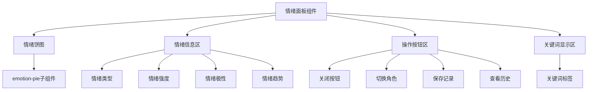

# 情绪面板组件

<cite>
**本文档引用的文件**  
- [emotion-panel.js](file://miniprogram/components/emotion-panel/emotion-panel.js)
- [emotion-panel.json](file://miniprogram/components/emotion-panel/emotion-panel.json)
- [emotionService.js](file://miniprogram/services/emotionService.js)
- [emotion-analysis.js](file://miniprogram/packageChat/pages/emotion-analysis/emotion-analysis.js)
</cite>

## 目录
1. [简介](#简介)
2. [UI布局结构](#ui布局结构)
3. [支持的属性](#支持的属性)
4. [事件说明](#事件说明)
5. [集成示例](#集成示例)
6. [无障碍访问支持](#无障碍访问支持)

## 简介
情绪面板组件（emotion-panel）是HeartChat应用中用于情绪记录和分析流程的核心UI组件。该组件提供直观的情绪可视化界面，允许用户查看、记录和分析其情绪状态。它在情绪分析、历史记录和用户交互中扮演关键角色，为用户提供情绪趋势洞察和个性化建议。

**Section sources**
- [emotion-panel.js](file://miniprogram/components/emotion-panel/emotion-panel.js#L1-L118)

## UI布局结构
情绪面板组件采用清晰的布局结构，包含以下主要区域：
- **情绪饼图**：通过`emotion-pie`子组件可视化当前情绪分布
- **情绪信息区**：显示情绪类型、强度、极性和趋势
- **操作按钮区**：提供关闭、切换角色、保存和查看历史记录的功能按钮
- **关键词显示区**：展示与当前情绪相关的关键词

组件支持暗色主题，通过`darkMode`属性控制视觉样式，确保在不同环境下都有良好的可读性。



**Diagram sources**
- [emotion-panel.js](file://miniprogram/components/emotion-panel/emotion-panel.js#L1-L118)
- [emotion-panel.json](file://miniprogram/components/emotion-panel/emotion-panel.json#L1-L6)

## 支持的属性
情绪面板组件支持以下属性配置：

| 属性名 | 类型 | 默认值 | 说明 |
|-------|------|-------|------|
| `emotion` | Object | null | 情感分析结果对象，包含情绪类型、强度等信息 |
| `show` | Boolean | false | 控制面板是否显示 |
| `darkMode` | Boolean | false | 是否启用暗色主题 |

其中，`emotion`对象包含以下关键字段：
- `type`: 情绪类型（如"joy"、"sadness"等）
- `intensity`: 情绪强度（0-1之间的数值）
- `valence`: 情绪极性（正数表示正面，负数表示负面）
- `trend`: 情绪趋势（"rising"、"falling"或"stable"）
- `topic_keywords`: 相关话题关键词

**Section sources**
- [emotion-panel.js](file://miniprogram/components/emotion-panel/emotion-panel.js#L1-L118)

## 事件说明
情绪面板组件触发以下事件，供父组件监听和处理：

| 事件名 | 携带数据 | 触发时机 |
|-------|---------|---------|
| `close` | 无 | 用户点击关闭按钮时 |
| `switchRole` | `{ emotion: emotionData }` | 用户点击切换角色按钮时 |
| `save` | `{ emotion: emotionData }` | 用户点击保存记录按钮时 |
| `history` | 无 | 用户点击查看历史记录按钮时 |

这些事件允许父组件根据用户操作执行相应的业务逻辑，如导航到不同页面、保存情绪记录或加载历史数据。

**Section sources**
- [emotion-panel.js](file://miniprogram/components/emotion-panel/emotion-panel.js#L80-L110)

## 集成示例
在`emotion-analysis`页面中集成情绪面板组件的完整代码示例：

```javascript
// emotion-analysis.js
Page({
  data: {
    emotionAnalysis: null,
    showEmotionPanel: false,
    darkMode: false
  },
  
  onLoad() {
    // 加载情绪分析数据
    this.loadEmotionAnalysis();
  },
  
  loadEmotionAnalysis() {
    // 调用emotionService获取情绪分析结果
    emotionService.analyzeEmotion(this.data.messageText)
      .then(result => {
        this.setData({
          emotionAnalysis: result.data,
          showEmotionPanel: true
        });
      });
  },
  
  handleSaveEmotion(e) {
    const emotionData = e.detail.emotion;
    // 保存情绪记录
    emotionService.saveEmotionRecord(emotionData);
    wx.showToast({ title: '记录已保存' });
  },
  
  handleSwitchRole(e) {
    const emotionData = e.detail.emotion;
    // 根据当前情绪推荐合适角色
    const recommendedRole = emotionService.matchRoleByEmotion(emotionData, this.data.roleList);
    this.setData({ currentRole: recommendedRole });
  }
})
```

组件与`emotionService`服务的交互逻辑：
1. 页面加载时调用`emotionService.analyzeEmotion()`获取情绪分析结果
2. 将分析结果通过`emotion`属性传递给情绪面板组件
3. 当用户点击"保存"按钮时，通过`save`事件获取情绪数据并调用`emotionService.saveEmotionRecord()`保存记录
4. 当用户点击"切换角色"按钮时，通过`switchRole`事件获取情绪数据并调用`emotionService.matchRoleByEmotion()`推荐合适角色

**Section sources**
- [emotion-analysis.js](file://miniprogram/packageChat/pages/emotion-analysis/emotion-analysis.js#L0-L647)
- [emotionService.js](file://miniprogram/services/emotionService.js#L0-L799)

## 无障碍访问支持
情绪面板组件充分考虑无障碍访问需求，提供以下支持：

1. **ARIA标签**：为所有交互元素添加适当的ARIA属性，如`aria-label`和`aria-role`，帮助屏幕阅读器用户理解组件功能
2. **键盘导航**：支持通过Tab键在组件内各元素间导航，Enter/Space键触发按钮操作
3. **焦点管理**：确保组件显示时焦点正确设置，隐藏时焦点返回到触发元素
4. **语义化HTML**：使用具有语义的HTML元素（如button、section等）增强可访问性
5. **对比度合规**：确保文本与背景的对比度符合WCAG 2.1 AA标准，即使在暗色主题下也能清晰阅读

这些无障碍特性确保所有用户，包括视障用户和键盘导航用户，都能顺利使用情绪面板组件。

**Section sources**
- [emotion-panel.js](file://miniprogram/components/emotion-panel/emotion-panel.js#L1-L118)
- [emotion-panel.json](file://miniprogram/components/emotion-panel/emotion-panel.json#L1-L6)