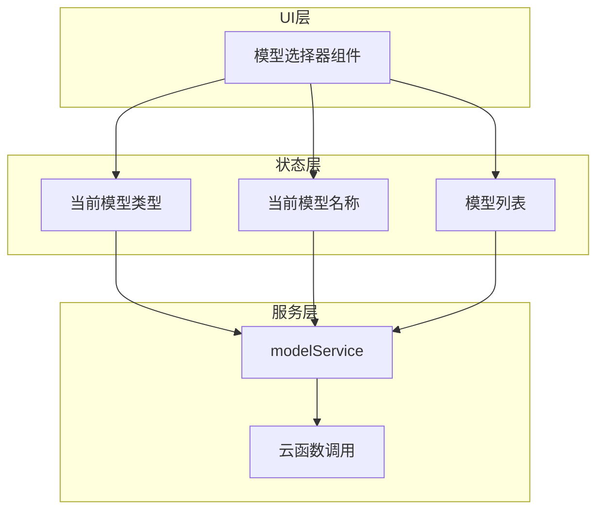
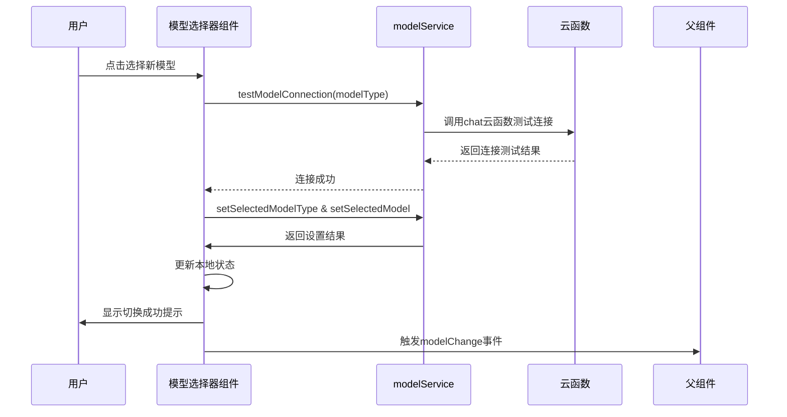
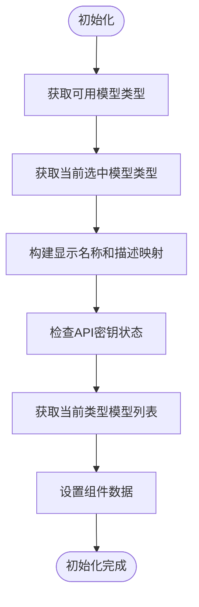
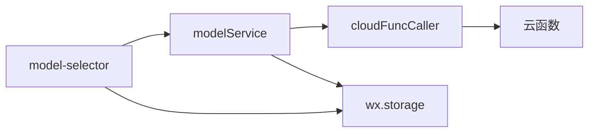

# 模型选择器组件

<cite>
**本文档引用的文件**  
- [model-selector.js](file://miniprogram/components/model-selector/model-selector.js)
- [modelService.js](file://miniprogram/services/modelService.js)
</cite>

## 目录
1. [简介](#简介)
2. [项目结构](#项目结构)
3. [核心组件](#核心组件)
4. [架构概述](#架构概述)
5. [详细组件分析](#详细组件分析)
6. [依赖分析](#依赖分析)
7. [性能考虑](#性能考虑)
8. [故障排除指南](#故障排除指南)
9. [结论](#结论)

## 简介
模型选择器组件（`model-selector`）是HeartChat小程序中的关键UI组件，用于支持用户在不同AI模型之间进行切换。该组件允许用户在Gemini、智谱AI、ChatGPT等多种AI模型中选择，以满足不同场景下的对话需求。组件具备良好的可扩展性，能够动态加载模型列表，并与`modelService`服务协同工作，实现模型状态的持久化和同步。此外，组件还支持暗黑模式下的主题适配，确保在各种视觉环境下均具备良好的可读性。

## 项目结构
模型选择器组件位于`miniprogram/components/model-selector/`目录下，包含`model-selector.js`和`model-selector.json`两个核心文件。该组件通过依赖`modelService`服务获取可用模型列表、当前选中模型等信息，并通过事件机制与父级页面进行通信。组件设计遵循微信小程序的自定义组件规范，具备良好的封装性和复用性。

**Section sources**
- [model-selector.js](file://miniprogram/components/model-selector/model-selector.js#L1-L341)

## 核心组件
模型选择器组件的核心功能包括：动态加载可用AI模型列表、显示当前选中模型、支持用户切换模型类型和具体模型实例、与`modelService`服务同步状态、响应主题变化以适配暗黑模式。组件通过`selectedModel`属性暴露当前选中的模型名称，并通过`bind:change`事件通知父组件模型变更。组件初始化时会从全局配置中读取模型信息，并根据API密钥状态动态调整可选项。

**Section sources**
- [model-selector.js](file://miniprogram/components/model-selector/model-selector.js#L25-L100)
- [modelService.js](file://miniprogram/services/modelService.js#L15-L80)

## 架构概述
模型选择器组件采用分层架构设计，上层为UI交互层，负责展示模型选项和处理用户操作；中层为状态管理层，维护当前选中的模型类型和具体模型；底层为服务集成层，通过`modelService`与后端服务通信，获取模型列表和测试连接状态。组件通过事件总线与外部通信，确保松耦合。



**Diagram sources**
- [model-selector.js](file://miniprogram/components/model-selector/model-selector.js#L10-L50)
- [modelService.js](file://miniprogram/services/modelService.js#L20-L40)

## 详细组件分析

### 模型选择器组件分析
模型选择器组件实现了完整的AI模型切换功能，支持用户在多个AI提供商之间进行选择。组件在初始化时调用`initModelSelector`方法，从`modelService`获取所有可用模型类型、当前选中模型类型及具体模型，并构建显示名称、描述和API密钥状态映射。

#### 属性与事件
组件通过`selectedModel`属性暴露当前选中的模型名称，并通过`bind:change`事件通知父组件模型变更。当用户选择新的模型时，组件会触发`modelChange`事件，携带`modelType`和`modelName`两个参数。



**Diagram sources**
- [model-selector.js](file://miniprogram/components/model-selector/model-selector.js#L20-L60)
- [modelService.js](file://miniprogram/services/modelService.js#L30-L80)

#### 模型列表动态生成
组件通过`modelService.getModelList()`方法从全局配置中读取可用模型列表，并动态生成选择项。模型列表支持缓存机制，有效期为24小时，以减少网络请求。若API调用失败，则回退到默认配置中的模型列表。



**Diagram sources**
- [model-selector.js](file://miniprogram/components/model-selector/model-selector.js#L45-L120)
- [modelService.js](file://miniprogram/services/modelService.js#L15-L50)

**Section sources**
- [model-selector.js](file://miniprogram/components/model-selector/model-selector.js#L1-L341)
- [modelService.js](file://miniprogram/services/modelService.js#L1-L335)

### 集成示例
在聊天设置页面中集成模型选择器组件时，需通过`bind:modelChange`监听模型变更事件，并与`modelService`服务同步状态。以下为代码集成示例：

```html
<model-selector 
  dark-mode="{{darkMode}}" 
  selected-model="{{selectedModel}}" 
  bind:modelChange="onModelChange" />
```

```javascript
Page({
  data: {
    darkMode: false,
    selectedModel: ''
  },
  onModelChange(e) {
    const { modelType, modelName } = e.detail;
    this.setData({ selectedModel: modelName });
    // 可在此处执行其他业务逻辑
  }
});
```

**Section sources**
- [model-selector.js](file://miniprogram/components/model-selector/model-selector.js#L150-L200)

## 依赖分析
模型选择器组件依赖`modelService`服务获取模型信息和管理状态，`modelService`又依赖`cloudFuncCaller`调用云函数。组件通过微信小程序的本地存储API实现状态持久化。



**Diagram sources**
- [model-selector.js](file://miniprogram/components/model-selector/model-selector.js#L1-L20)
- [modelService.js](file://miniprogram/services/modelService.js#L1-L10)

**Section sources**
- [model-selector.js](file://miniprogram/components/model-selector/model-selector.js#L1-L341)
- [modelService.js](file://miniprogram/services/modelService.js#L1-L335)

## 性能考虑
组件采用缓存机制减少对云函数的调用频率，模型列表缓存有效期为24小时。连接测试仅在切换模型类型时执行，避免频繁网络请求。组件初始化时异步加载数据，不影响主界面渲染。

## 故障排除指南
当模型选择器无法正常工作时，可检查以下方面：
- 确认`modelService`服务是否正确初始化
- 检查网络连接是否正常
- 验证云函数`chat`是否部署成功
- 确认API密钥是否有效
- 查看控制台日志是否有错误信息

**Section sources**
- [model-selector.js](file://miniprogram/components/model-selector/model-selector.js#L10-L50)
- [modelService.js](file://miniprogram/services/modelService.js#L15-L40)

## 结论
模型选择器组件为HeartChat提供了灵活的AI模型切换能力，支持用户根据需求选择最适合的AI模型。组件设计合理，具备良好的可维护性和扩展性，能够轻松集成新的AI模型。通过与`modelService`服务的紧密协作，确保了模型状态的一致性和持久化。组件的暗黑模式适配能力进一步提升了用户体验。