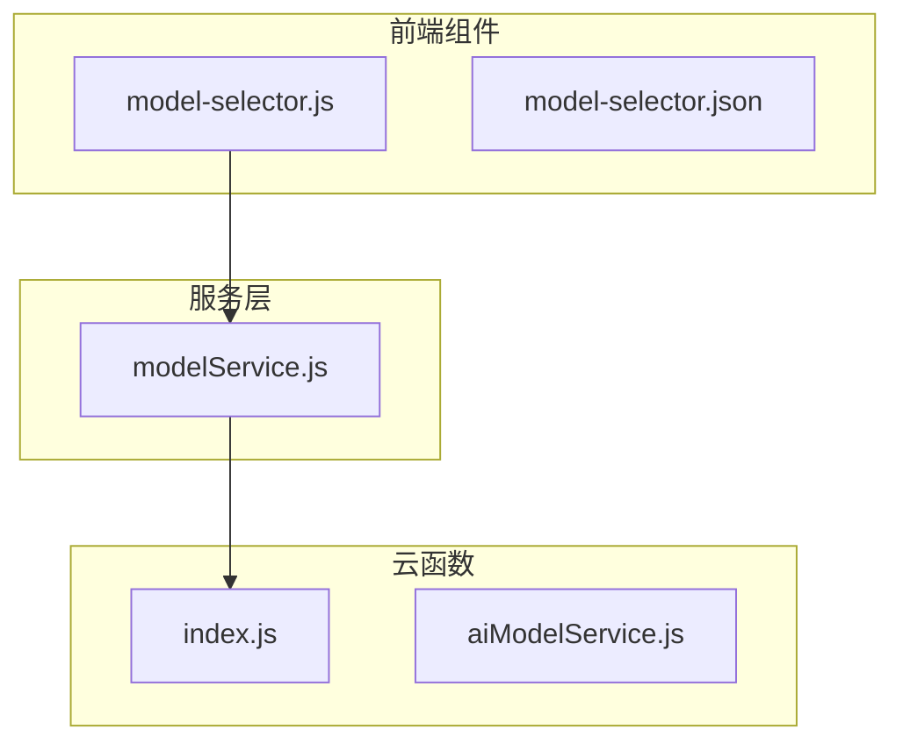
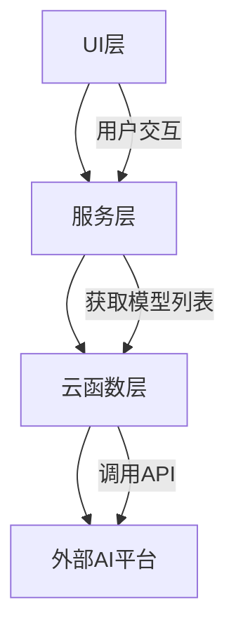
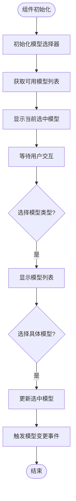
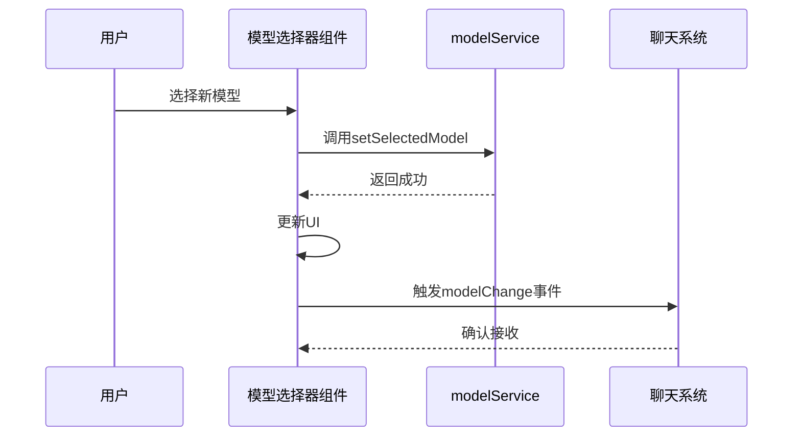
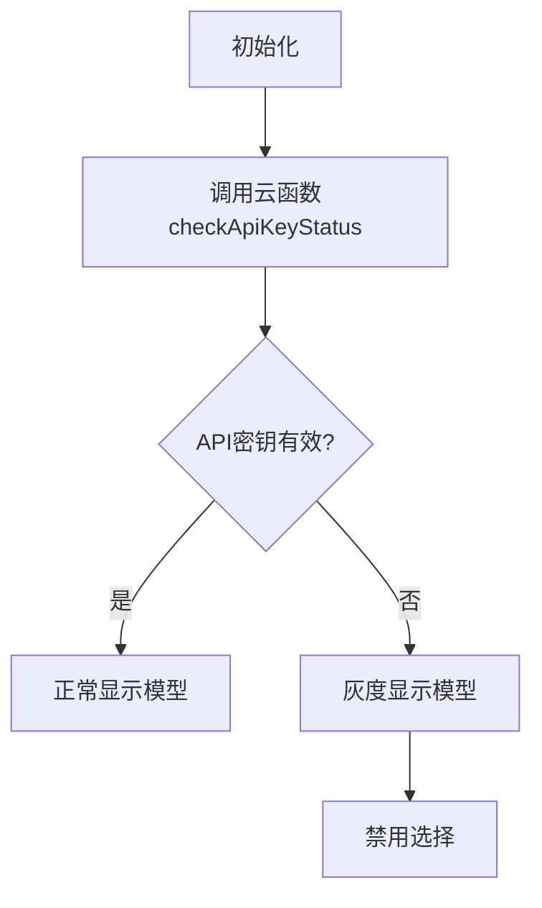
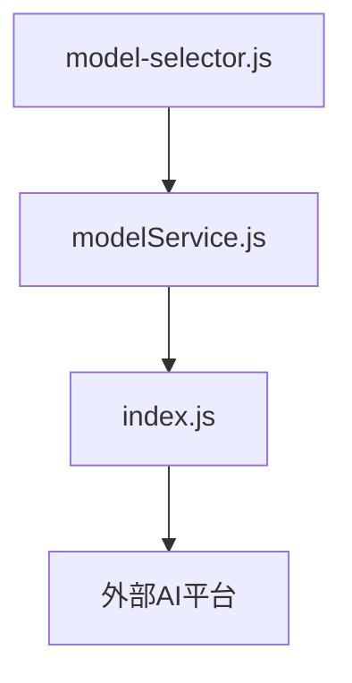

# AI模型选择器

<cite>
**本文档引用的文件**
- [model-selector.js](file://miniprogram/components/model-selector/model-selector.js)
- [modelService.js](file://miniprogram/services/modelService.js)
- [index.js](file://cloudfunctions/chat/index.js)
</cite>

## 目录
1. [简介](#简介)
2. [项目结构](#项目结构)
3. [核心组件](#核心组件)
4. [架构概览](#架构概览)
5. [详细组件分析](#详细组件分析)
6. [依赖分析](#依赖分析)
7. [性能考虑](#性能考虑)
8. [故障排除指南](#故障排除指南)
9. [结论](#结论)

## 简介
AI模型选择器组件是HeartChat应用中的关键功能模块，负责管理用户在不同AI模型之间的切换。该组件支持多种AI平台，包括Gemini、智谱AI、OpenAI等，并提供直观的UI界面供用户选择和切换模型。组件通过modelService.js获取可用模型列表，动态加载模型配置，并通过事件机制通知聊天系统更新当前使用的AI引擎。此外，组件还实现了灰度显示逻辑，用于处理用户无权限使用某些高级模型的情况。

## 项目结构
AI模型选择器组件位于`miniprogram/components/model-selector/`目录下，主要包括`model-selector.js`、`model-selector.json`等文件。模型服务逻辑位于`miniprogram/services/modelService.js`，而云函数相关逻辑则分布在`cloudfunctions/chat/`目录下。

**Diagram sources**
- [model-selector.js](file://miniprogram/components/model-selector/model-selector.js)
- [modelService.js](file://miniprogram/services/modelService.js)
- [index.js](file://cloudfunctions/chat/index.js)

**Section sources**
- [model-selector.js](file://miniprogram/components/model-selector/model-selector.js)
- [modelService.js](file://miniprogram/services/modelService.js)

## 核心组件
AI模型选择器组件实现了两级选择机制：第一级选择模型平台（如智谱AI、Google Gemini、OpenAI等），第二级选择具体模型（如gpt-4o-mini、deepseek-v3等）。组件通过`modelService.js`获取可用模型列表，并动态加载模型配置。用户选择模型后，组件会触发模型变更事件，通知聊天系统更新当前使用的AI引擎。

**Section sources**
- [model-selector.js](file://miniprogram/components/model-selector/model-selector.js)
- [modelService.js](file://miniprogram/services/modelService.js)

## 架构概览
AI模型选择器组件的架构分为三层：UI层、服务层和云函数层。UI层负责展示模型选择界面，服务层负责管理模型状态和配置，云函数层负责与外部AI平台通信。

**Diagram sources**
- [model-selector.js](file://miniprogram/components/model-selector/model-selector.js)
- [modelService.js](file://miniprogram/services/modelService.js)
- [index.js](file://cloudfunctions/chat/index.js)

## 详细组件分析

### 模型选择器组件分析
模型选择器组件通过`model-selector.js`实现，主要功能包括初始化模型选择器、显示/隐藏选择器、选择模型类型和具体模型。

#### UI实现
组件的UI实现包括当前选中模型的显示、下拉列表的展开动画与选项渲染。用户点击模型类型时，组件会显示模型列表选择器，用户可以选择具体模型。

**Diagram sources**
- [model-selector.js](file://miniprogram/components/model-selector/model-selector.js)

#### 模型切换事件
当用户选择新模型时，组件会触发`modelChange`事件，通知聊天系统更新当前使用的AI引擎。事件包含模型类型和模型名称。

**Diagram sources**
- [model-selector.js](file://miniprogram/components/model-selector/model-selector.js)
- [modelService.js](file://miniprogram/services/modelService.js)

### 灰度显示逻辑
当用户无权限使用某些高级模型时，组件会通过灰度显示逻辑处理。具体实现是通过调用云函数`chat`的`checkApiKeyStatus`方法检查API密钥状态，如果密钥无效，则对应模型会被灰度显示。

**Diagram sources**
- [model-selector.js](file://miniprogram/components/model-selector/model-selector.js)
- [index.js](file://cloudfunctions/chat/index.js)

**Section sources**
- [model-selector.js](file://miniprogram/components/model-selector/model-selector.js)
- [modelService.js](file://miniprogram/services/modelService.js)
- [index.js](file://cloudfunctions/chat/index.js)

## 依赖分析
AI模型选择器组件依赖于`modelService.js`和云函数`chat`。`modelService.js`负责管理模型状态和配置，云函数`chat`负责与外部AI平台通信。

**Diagram sources**
- [model-selector.js](file://miniprogram/components/model-selector/model-selector.js)
- [modelService.js](file://miniprogram/services/modelService.js)
- [index.js](file://cloudfunctions/chat/index.js)

**Section sources**
- [model-selector.js](file://miniprogram/components/model-selector/model-selector.js)
- [modelService.js](file://miniprogram/services/modelService.js)
- [index.js](file://cloudfunctions/chat/index.js)

## 性能考虑
模型选择器组件在性能方面做了多项优化。首先，模型列表会缓存24小时，避免频繁调用云函数。其次，组件在初始化时会并行获取模型类型和当前选择的模型类型，提高初始化速度。

## 故障排除指南
### 问题：切换模型后没有响应
可能原因：
1. API密钥无效
2. 云函数调用失败
3. 模型连接测试失败

解决方案：
1. 检查API密钥是否正确
2. 检查网络连接
3. 查看控制台日志，确认错误信息

**Section sources**
- [model-selector.js](file://miniprogram/components/model-selector/model-selector.js)
- [modelService.js](file://miniprogram/services/modelService.js)
- [index.js](file://cloudfunctions/chat/index.js)

## 结论
AI模型选择器组件是HeartChat应用中的重要功能模块，通过清晰的架构设计和合理的性能优化，为用户提供流畅的模型切换体验。组件的灰度显示逻辑有效处理了用户权限问题，确保了应用的稳定性和安全性。