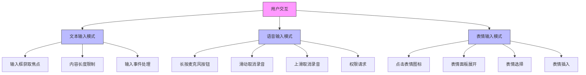
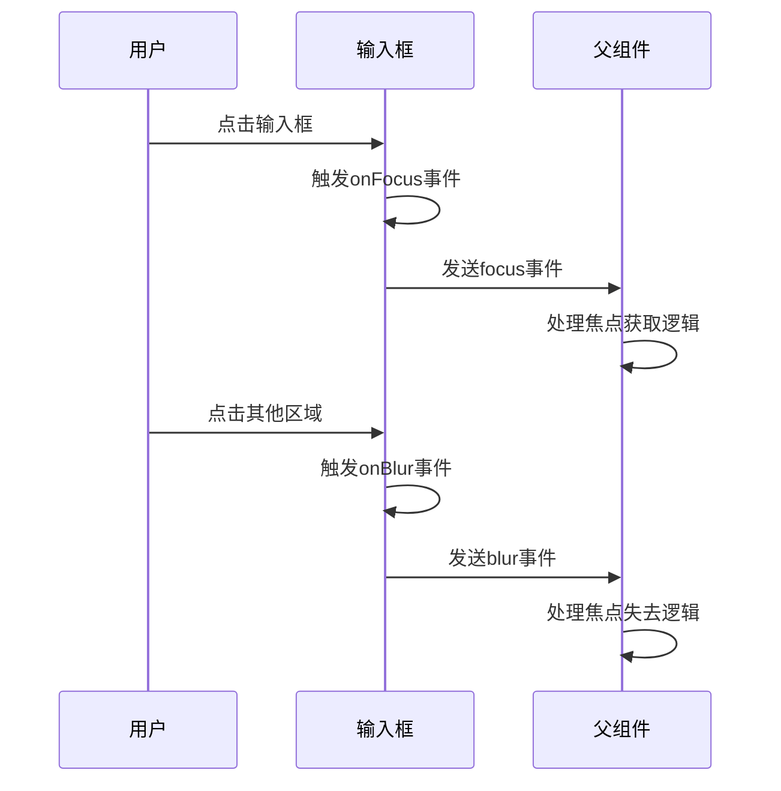
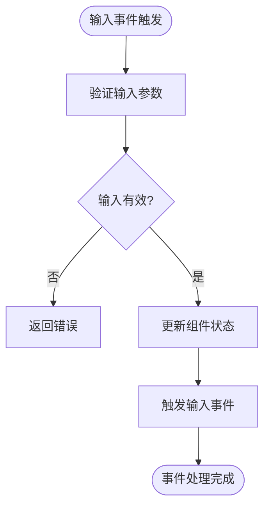
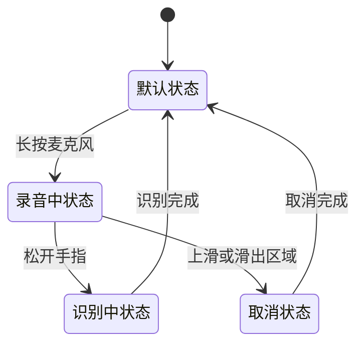
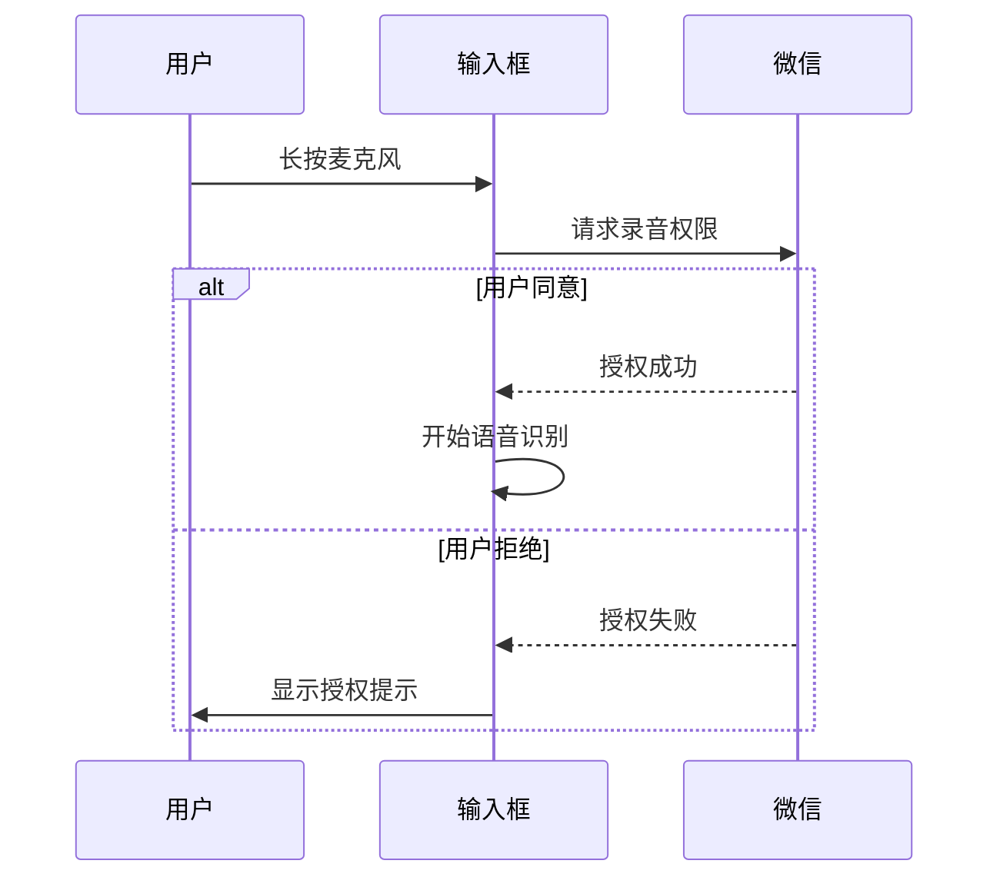
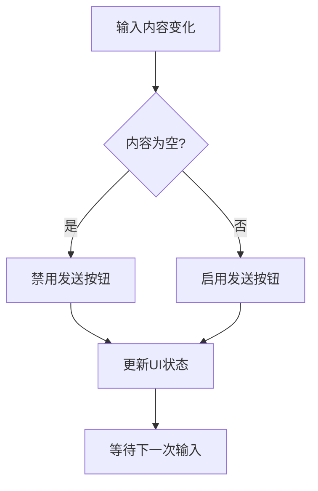
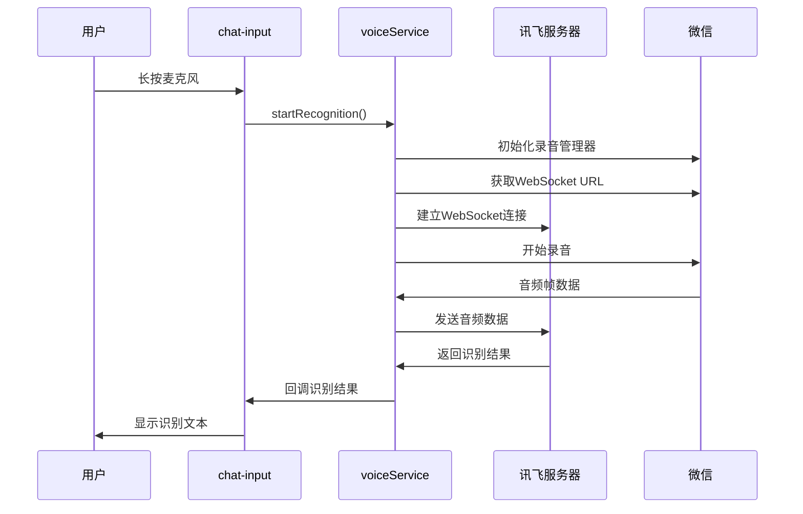
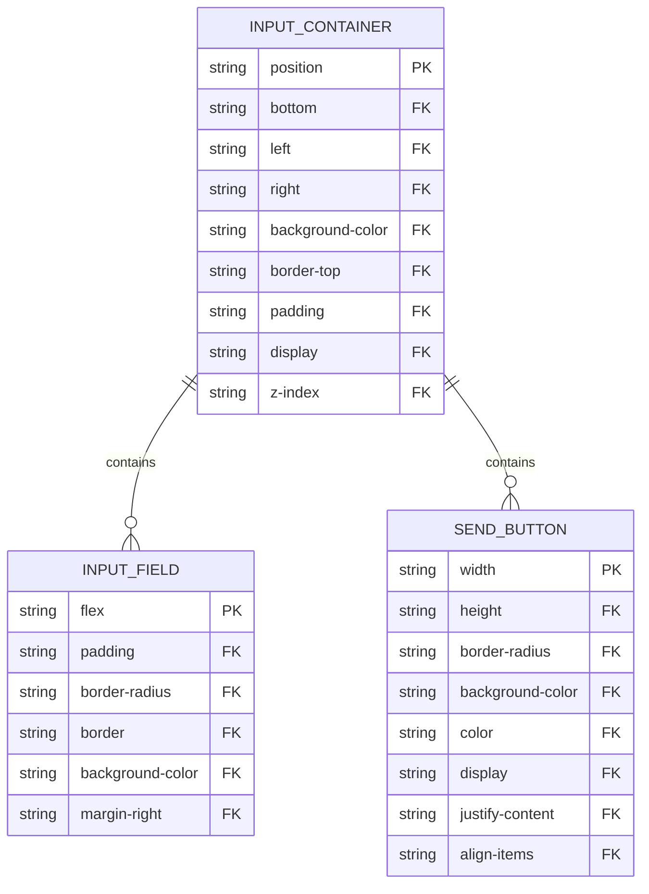

# 聊天输入控件

<cite>
**本文档引用的文件**
- [index.js](file://miniprogram/packageChat/components/chat-input/index.js)
- [voiceService.js](file://miniprogram/services/voiceService.js)
- [chat.json](file://miniprogram/packageChat/pages/chat/chat.json)
- [chat.html](file://doc/设计文档/原型设计图/chat.html)
- [HeartChat 语音输入功能 (讯飞语音听写) 开发文档.md](file://doc/开发文档/HeartChat 语音输入功能 (讯飞语音听写) 开发文档.md)
</cite>

## 目录
1. [简介](#简介)
2. [核心交互设计](#核心交互设计)
3. [文本输入功能实现](#文本输入功能实现)
4. [语音输入模式](#语音输入模式)
5. [表情面板集成](#表情面板集成)
6. [发送按钮状态控制](#发送按钮状态控制)
7. [语音服务集成流程](#语音服务集成流程)
8. [自适应布局策略](#自适应布局策略)
9. [键盘弹起事件协同处理](#键盘弹起事件协同处理)

## 简介
聊天输入控件是HeartChat应用中用户与AI角色进行交互的核心组件。该组件提供了文本输入、语音输入和表情输入三种主要的输入方式，旨在为用户提供流畅、便捷的聊天体验。本组件通过精心设计的交互逻辑和状态管理，实现了多种输入模式的无缝切换，并针对不同屏幕尺寸和设备环境进行了优化。

## 核心交互设计

**图示来源**
- [index.js](file://miniprogram/packageChat/components/chat-input/index.js#L1-L590)

**本节来源**
- [index.js](file://miniprogram/packageChat/components/chat-input/index.js#L1-L590)
- [chat.html](file://doc/设计文档/原型设计图/chat.html#L0-L82)

## 文本输入功能实现

### 焦点管理
聊天输入框实现了完整的焦点管理机制。当用户点击输入框时，会触发`onFocus`事件，通知父组件输入框已获得焦点。当用户点击其他区域或完成输入时，会触发`onBlur`事件，通知父组件输入框已失去焦点。这种设计使得父组件可以根据焦点状态调整页面布局，例如在键盘弹起时调整聊天消息列表的位置。

**图示来源**
- [index.js](file://miniprogram/packageChat/components/chat-input/index.js#L550-L565)

### 内容长度限制
组件通过`input`事件实时监听输入框内容的变化。每次用户输入字符时，都会触发`input`方法，该方法会更新组件内部的`inputValue`数据。虽然当前实现中没有明确的字符长度限制，但通过`inputValue`的双向绑定，可以轻松实现内容长度的监控和限制。

### 输入事件处理机制
输入事件处理机制基于微信小程序的事件系统。组件通过`bindinput`绑定`input`方法，当输入框内容发生变化时，会自动调用该方法。`input`方法接收事件对象`e`，从中提取`e.detail.value`作为最新的输入内容，并通过`setData`更新组件状态。

**图示来源**
- [index.js](file://miniprogram/packageChat/components/chat-input/index.js#L100-L110)

**本节来源**
- [index.js](file://miniprogram/packageChat/components/chat-input/index.js#L100-L110)
- [chat.html](file://doc/设计文档/原型设计图/chat.html#L41-L82)

## 语音输入模式

### 模式切换逻辑
语音输入与文本输入模式的切换通过`switchInputMode`方法实现。该方法会翻转`isVoiceMode`状态，从而在UI上切换显示文本输入框或语音输入按钮。这种设计使得用户可以快速在两种输入模式间切换，满足不同场景下的输入需求。

### 麦克风图标交互状态
麦克风图标的交互状态由多个因素共同决定：
- **默认状态**：显示麦克风图标，等待用户长按
- **录音中状态**：显示动态波形动画，表示正在录音
- **识别中状态**：显示"识别中"提示，表示正在处理语音
- **取消状态**：显示取消提示，表示录音已取消

**图示来源**
- [index.js](file://miniprogram/packageChat/components/chat-input/index.js#L180-L300)

### 权限请求流程
当用户首次尝试使用语音输入功能时，系统会自动请求录音权限。权限请求流程如下：
1. 用户长按麦克风按钮
2. 调用`wx.authorize`请求`scope.record`权限
3. 如果用户同意，开始语音识别
4. 如果用户拒绝，显示提示信息，引导用户手动授权

**图示来源**
- [index.js](file://miniprogram/packageChat/components/chat-input/index.js#L180-L200)

**本节来源**
- [index.js](file://miniprogram/packageChat/components/chat-input/index.js#L180-L380)
- [voiceService.js](file://miniprogram/services/voiceService.js#L0-L51)
- [HeartChat 语音输入功能 (讯飞语音听写) 开发文档.md](file://doc/开发文档/HeartChat 语音输入功能 (讯飞语音听写) 开发文档.md#L115-L299)

## 表情面板集成

### 事件冒泡机制
表情面板的集成采用了事件冒泡机制。当用户在表情面板中选择一个表情时，会触发一个自定义事件，该事件会沿着组件树向上传播，最终被聊天输入控件捕获。输入控件接收到事件后，会将选中的表情插入到输入框的当前位置。

### 表情插入流程
表情插入流程如下：
1. 用户点击表情面板中的某个表情
2. 表情组件触发`select-emotion`事件
3. 事件冒泡到聊天输入控件
4. 聊天输入控件处理事件，将表情代码插入输入框

虽然具体的实现代码未在提供的文件中，但从组件结构可以看出，`emotion-panel`组件与`chat-input`组件是独立的，通过事件系统进行通信。

**本节来源**
- [index.js](file://miniprogram/packageChat/components/chat-input/index.js#L1-L590)

## 发送按钮状态控制

### 启用/禁用逻辑
发送按钮的启用/禁用状态基于输入内容是否为空来控制。具体逻辑如下：
- 当输入框内容为空时，发送按钮处于禁用状态，视觉上表现为灰色
- 当输入框内容不为空时，发送按钮处于启用状态，视觉上表现为可点击

这种设计可以有效防止用户发送空消息，提升用户体验。

### 状态同步机制
发送按钮的状态与输入框内容实时同步。每次输入框内容发生变化时，都会重新评估发送按钮的状态。这种实时同步机制确保了UI状态的准确性。

**本节来源**
- [index.js](file://miniprogram/packageChat/components/chat-input/index.js#L115-L130)

## 语音服务集成流程

### voiceService.js集成
`chat-input`组件通过`require`引入`voiceService.js`模块，实现了与语音识别服务的集成。`voiceService.js`封装了与讯飞语音听写API的通信逻辑，提供了`startRecognition`和`stopRecognition`两个主要接口。

### 语音录制流程
语音录制流程如下：
1. 用户长按麦克风按钮
2. 请求录音权限
3. 调用`voiceService.startRecognition`开始识别
4. 录音管理器开始录制音频
5. 音频数据通过WebSocket发送到讯飞服务器
6. 服务器返回识别结果
7. 停止录音并处理最终结果

**图示来源**
- [voiceService.js](file://miniprogram/services/voiceService.js#L0-L51)
- [index.js](file://miniprogram/packageChat/components/chat-input/index.js#L180-L380)

### 语音上传流程
语音上传流程实际上是流式传输过程，而非传统意义上的"上传"。具体流程如下：
1. 建立WebSocket连接
2. 发送业务参数帧
3. 发送静音帧预热
4. 开始录音并实时发送音频帧
5. 发送结束帧
6. 接收并处理最终识别结果

**本节来源**
- [voiceService.js](file://miniprogram/services/voiceService.js#L0-L485)
- [index.js](file://miniprogram/packageChat/components/chat-input/index.js#L180-L380)
- [HeartChat 语音输入功能 (讯飞语音听写) 开发文档.md](file://doc/开发文档/HeartChat 语音输入功能 (讯飞语音听写) 开发文档.md#L115-L299)

## 自适应布局策略

### 响应式设计
聊天输入控件采用了响应式设计，能够适应不同屏幕尺寸。在移动设备上，输入框占据大部分宽度，发送按钮为圆形图标；在平板设备上，整体布局会根据屏幕宽度进行调整。

### 固定定位
输入控件使用了`position: fixed`定位，固定在页面底部。这种设计确保了无论聊天消息列表如何滚动，输入框始终可见，方便用户随时输入。

**图示来源**
- [chat.html](file://doc/设计文档/原型设计图/chat.html#L41-L82)

**本节来源**
- [chat.html](file://doc/设计文档/原型设计图/chat.html#L0-L82)
- [index.js](file://miniprogram/packageChat/components/chat-input/index.js#L1-L590)

## 键盘弹起事件协同处理

### 页面生命周期
聊天输入控件利用了小程序的页面生命周期函数来处理键盘弹起事件。`pageLifetimes`中的`resize`函数可以监听页面尺寸变化，当键盘弹起时，页面可视区域会缩小，触发`resize`事件。

### 最佳实践
与键盘弹起事件协同处理的最佳实践包括：
1. 监听输入框的`focus`和`blur`事件
2. 在`focus`事件中，调整聊天消息列表的滚动位置
3. 在`blur`事件中，恢复原始布局
4. 使用`scrollIntoView`确保新消息可见

虽然具体的实现细节未在提供的文件中，但从组件设计可以看出，`chat-input`组件通过事件系统与父组件通信，由父组件负责处理复杂的布局调整。

**本节来源**
- [index.js](file://miniprogram/packageChat/components/chat-input/index.js#L70-L90)
- [chat.json](file://miniprogram/packageChat/pages/chat/chat.json#L1-L9)