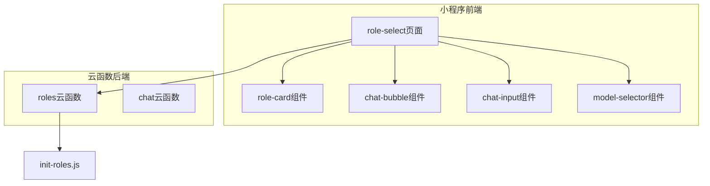
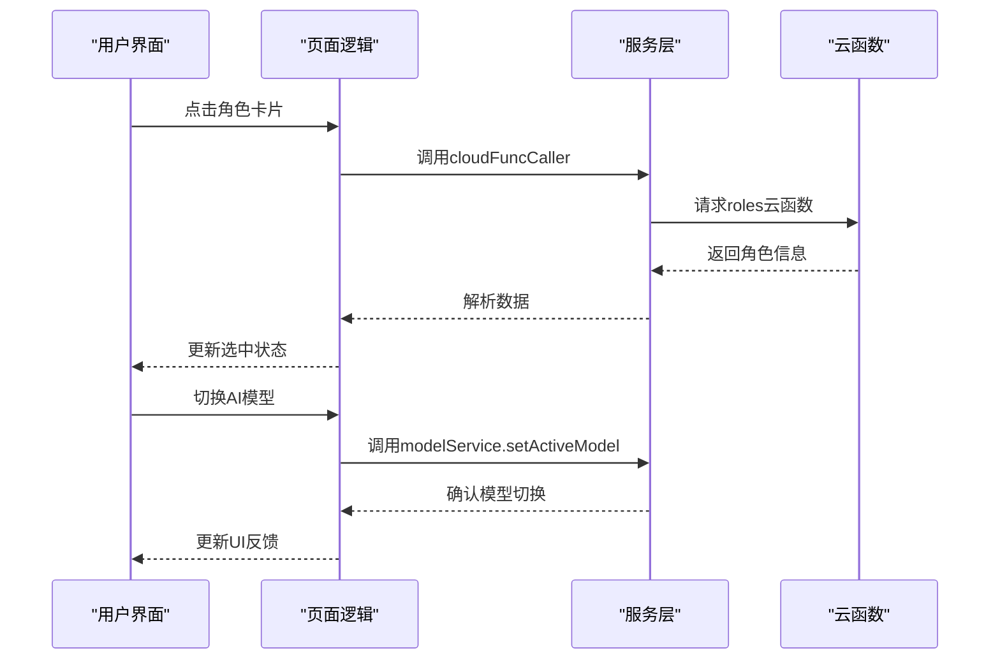
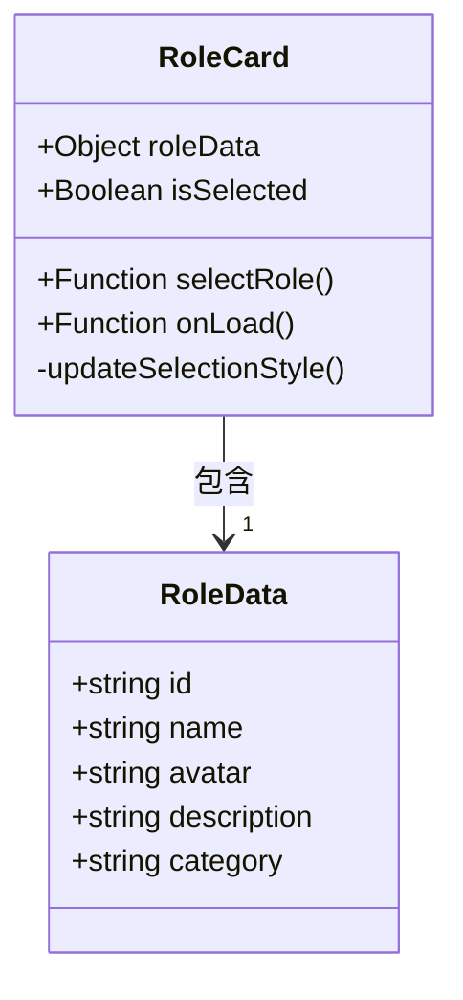
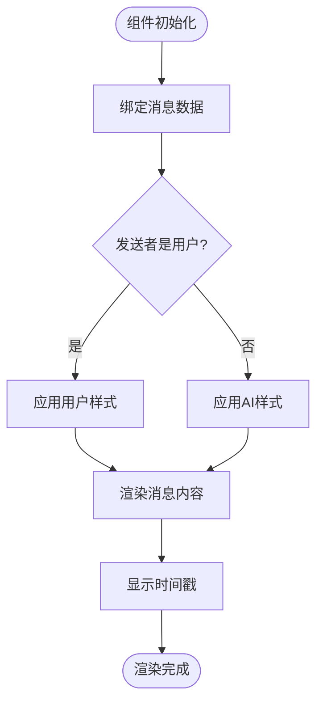
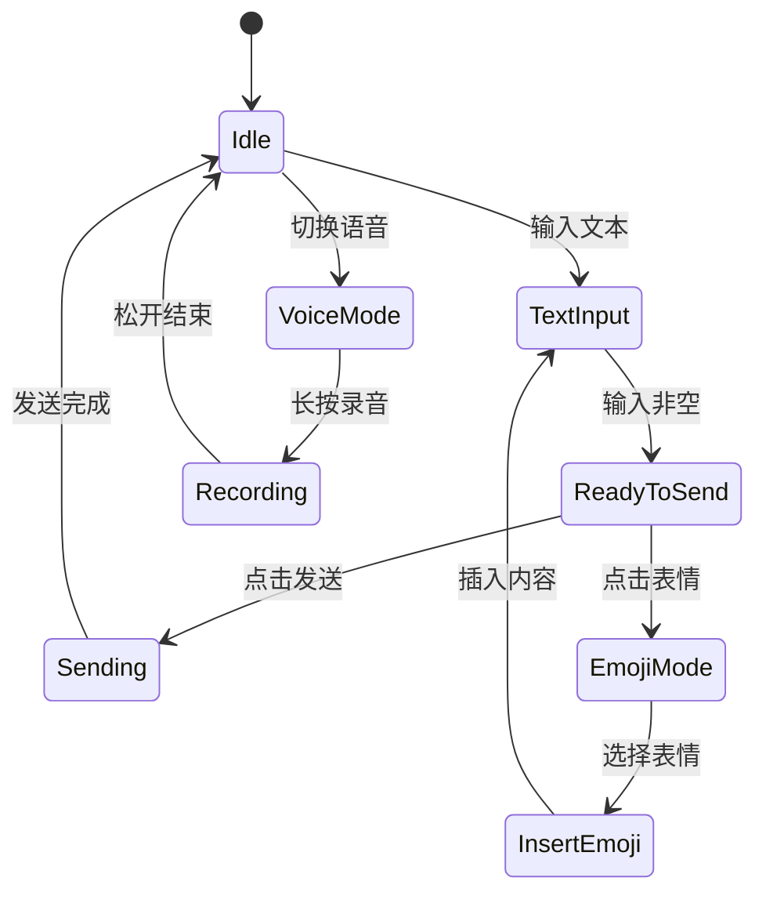
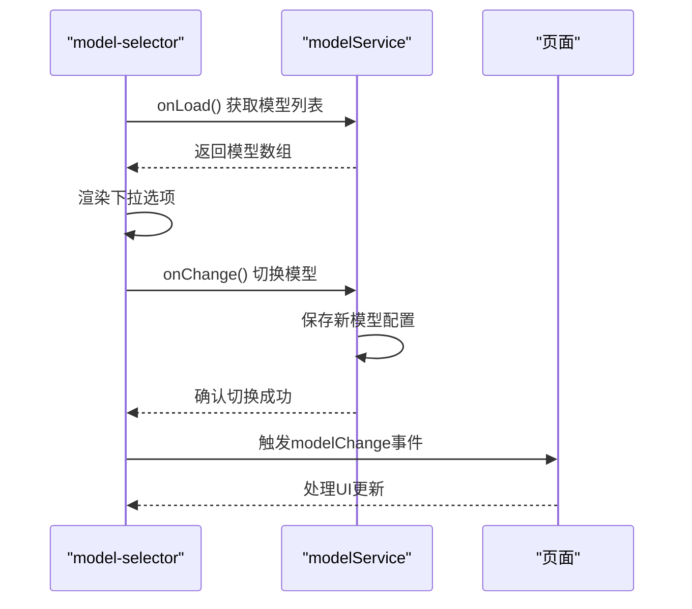

# 角色与聊天组件

<cite>
**本文档引用文件**  
- [role-card.js](file://miniprogram/components/role-card/role-card.js)
- [role-card.json](file://miniprogram/components/role-card/role-card.json)
- [index.js](file://miniprogram/packageChat/components/chat-bubble/index.js)
- [index.json](file://miniprogram/packageChat/components/chat-bubble/index.json)
- [chat-input.js](file://miniprogram/packageChat/components/chat-input/index.js)
- [chat-input.json](file://miniprogram/packageChat/components/chat-input/index.json)
- [model-selector.js](file://miniprogram/components/model-selector/model-selector.js)
- [model-selector.json](file://miniprogram/components/model-selector/model-selector.json)
- [role-select.js](file://miniprogram/pages/role-select/role-select.js)
- [index.js](file://cloudfunctions/roles/index.js)
- [init-roles.js](file://cloudfunctions/roles/init-roles.js)
- [modelService.js](file://miniprogram/services/modelService.js)
- [cloudFuncCaller.js](file://miniprogram/services/cloudFuncCaller.js)
</cite>

## 目录
1. [简介](#简介)
2. [项目结构](#项目结构)
3. [核心组件](#核心组件)
4. [架构概览](#架构概览)
5. [详细组件分析](#详细组件分析)
6. [依赖分析](#依赖分析)
7. [性能考虑](#性能考虑)
8. [故障排除指南](#故障排除指南)
9. [结论](#结论)

## 简介
本文档全面文档化HeartChat小程序中角色展示与聊天交互的核心组件。重点说明`role-card`、`chat-bubble`、`chat-input`和`model-selector`四个核心组件的设计、实现与集成方式，涵盖视觉表现、数据绑定、用户交互及后端云函数调用机制。

## 项目结构
HeartChat项目采用分包架构，核心聊天功能位于`packageChat`目录下，角色管理相关组件与页面独立存放。云函数集中于`cloudfunctions`目录，其中`roles`云函数负责角色信息的获取与初始化。



**图示来源**  
- [role-card.js](file://miniprogram/components/role-card/role-card.js)
- [chat-bubble/index.js](file://miniprogram/packageChat/components/chat-bubble/index.js)
- [chat-input.js](file://miniprogram/packageChat/components/chat-input/index.js)
- [model-selector.js](file://miniprogram/components/model-selector/model-selector.js)
- [role-select.js](file://miniprogram/pages/role-select/role-select.js)
- [cloudfunctions/roles](file://cloudfunctions/roles)

**本节来源**  
- [miniprogram/components/role-card](file://miniprogram/components/role-card)
- [miniprogram/packageChat/components](file://miniprogram/packageChat/components)
- [miniprogram/pages/role-select](file://miniprogram/pages/role-select)
- [cloudfunctions/roles](file://cloudfunctions/roles)

## 核心组件
本文档重点分析四个核心UI组件：`role-card`用于角色展示与选择，`chat-bubble`实现消息气泡渲染，`chat-input`处理用户输入，`model-selector`提供AI模型切换功能。这些组件共同构成HeartChat的交互基础。

**本节来源**  
- [role-card.js](file://miniprogram/components/role-card/role-card.js)
- [chat-bubble/index.js](file://miniprogram/packageChat/components/chat-bubble/index.js)
- [chat-input.js](file://miniprogram/packageChat/components/chat-input/index.js)
- [model-selector.js](file://miniprogram/components/model-selector/model-selector.js)

## 架构概览
系统采用前后端分离架构，前端组件通过云函数与后端交互。角色选择页面集成多个组件，用户操作触发云函数调用，实现数据动态加载与状态管理。



**图示来源**  
- [role-select.js](file://miniprogram/pages/role-select/role-select.js)
- [cloudFuncCaller.js](file://miniprogram/services/cloudFuncCaller.js)
- [modelService.js](file://miniprogram/services/modelService.js)
- [cloudfunctions/roles/index.js](file://cloudfunctions/roles/index.js)

## 详细组件分析

### role-card组件分析
`role-card`组件负责展示单个角色的视觉信息，包括头像、名称和描述。组件通过properties接收角色数据对象，实现数据绑定。点击事件触发`selectRole`方法，通过事件冒泡通知父页面角色选择行为。



**图示来源**  
- [role-card.js](file://miniprogram/components/role-card/role-card.js)
- [role-card.json](file://miniprogram/components/role-card/role-card.json)

**本节来源**  
- [role-card.js](file://miniprogram/components/role-card/role-card.js)
- [role-select.js](file://miniprogram/pages/role-select/role-select.js)

### chat-bubble组件分析
`chat-bubble`组件实现消息气泡的布局与渲染，通过`isUser`属性区分用户与AI消息，应用不同样式。支持文本内容渲染，并可通过扩展支持表情符号。时间戳显示由`formatTime`工具函数处理，确保格式统一。



**图示来源**  
- [index.js](file://miniprogram/packageChat/components/chat-bubble/index.js)
- [utils/format.js](file://miniprogram/utils/format.js)

**本节来源**  
- [index.js](file://miniprogram/packageChat/components/chat-bubble/index.js)
- [index.json](file://miniprogram/packageChat/components/chat-bubble/index.json)

### chat-input组件分析
`chat-input`组件管理用户输入，包含文本输入框、语音切换按钮、表情面板入口和发送按钮。组件状态受输入内容控制，仅当输入框有内容时发送按钮才启用。表情面板通过事件与父页面通信，实现内容插入。



**图示来源**  
- [index.js](file://miniprogram/packageChat/components/chat-input/index.js)
- [voiceService.js](file://miniprogram/services/voiceService.js)

**本节来源**  
- [index.js](file://miniprogram/packageChat/components/chat-input/index.js)
- [index.json](file://miniprogram/packageChat/components/chat-input/index.json)

### model-selector组件分析
`model-selector`组件实现AI模型切换功能，使用下拉选择器展示可用模型列表。组件初始化时从`modelService`加载模型配置，选择新模型时调用服务层方法更新全局配置，并通过事件通知页面刷新。



**图示来源**  
- [model-selector.js](file://miniprogram/components/model-selector/model-selector.js)
- [modelService.js](file://miniprogram/services/modelService.js)

**本节来源**  
- [model-selector.js](file://miniprogram/components/model-selector/model-selector.js)
- [model-selector.json](file://miniprogram/components/model-selector/model-selector.json)
- [modelService.js](file://miniprogram/services/modelService.js)

## 依赖分析
各组件通过服务层与云函数解耦，`cloudFuncCaller.js`统一处理云函数调用，`modelService.js`管理模型状态。角色数据依赖`roles`云函数的`index.js`和`init-roles.js`提供。

```mermaid
erDiagram
ROLE-CARD {
string roleData
boolean isSelected
}
CHAT-BUBBLE {
string content
boolean isUser
string timestamp
}
CHAT-INPUT {
string inputValue
boolean isVoiceMode
}
MODEL-SELECTOR {
array models
string activeModel
}
SERVICE {
function callCloudFunction
function setActiveModel
}
CLOUD-FUNCTION {
function getRoleInfo
function getRolesList
}
ROLE-CARD --> SERVICE : 调用
CHAT-INPUT --> SERVICE : 调用
MODEL-SELECTOR --> SERVICE : 调用
SERVICE --> CLOUD-FUNCTION : 调用
```

**图示来源**  
- [cloudFuncCaller.js](file://miniprogram/services/cloudFuncCaller.js)
- [modelService.js](file://miniprogram/services/modelService.js)
- [cloudfunctions/roles/index.js](file://cloudfunctions/roles/index.js)

**本节来源**  
- [services/cloudFuncCaller.js](file://miniprogram/services/cloudFuncCaller.js)
- [services/modelService.js](file://miniprogram/services/modelService.js)
- [cloudfunctions/roles](file://cloudfunctions/roles)

## 性能考虑
组件采用数据绑定而非直接DOM操作，减少渲染开销。云函数调用结果建议缓存，避免重复请求。`chat-bubble`组件应实现虚拟滚动以支持大量消息场景。

## 故障排除指南
若角色信息无法加载，请检查`roles`云函数日志及网络连接。模型切换无效时，验证`modelService`是否正确更新本地存储。输入组件无响应需检查事件绑定与父组件通信逻辑。

**本节来源**  
- [cloudFuncCaller.js](file://miniprogram/services/cloudFuncCaller.js)
- [modelService.js](file://miniprogram/services/modelService.js)
- [role-card.js](file://miniprogram/components/role-card/role-card.js)

## 结论
`role-card`、`chat-bubble`、`chat-input`和`model-selector`组件构成了HeartChat的核心交互界面。通过合理的分层设计与服务解耦，实现了高内聚、低耦合的组件化架构，为后续功能扩展提供了良好基础。