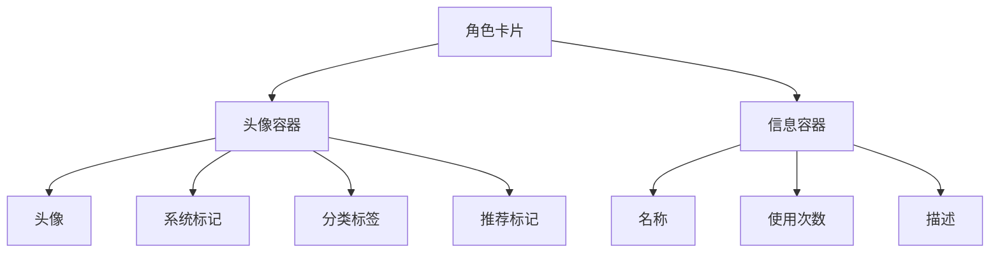
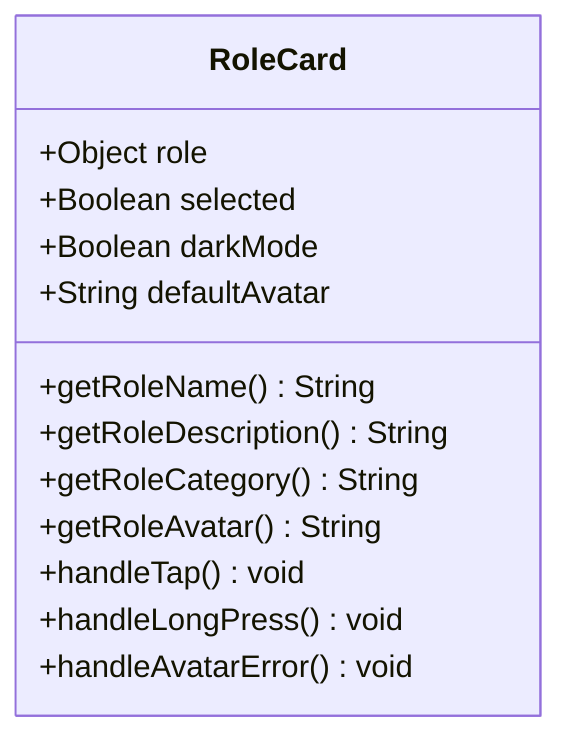
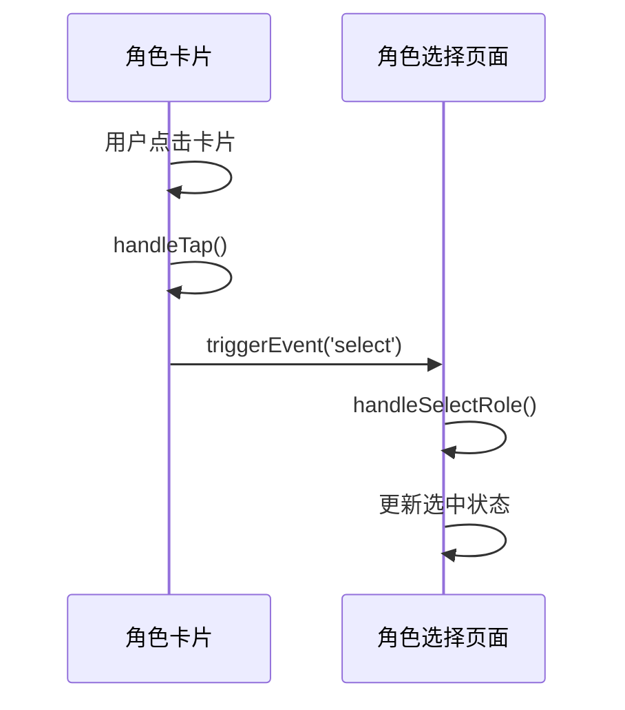
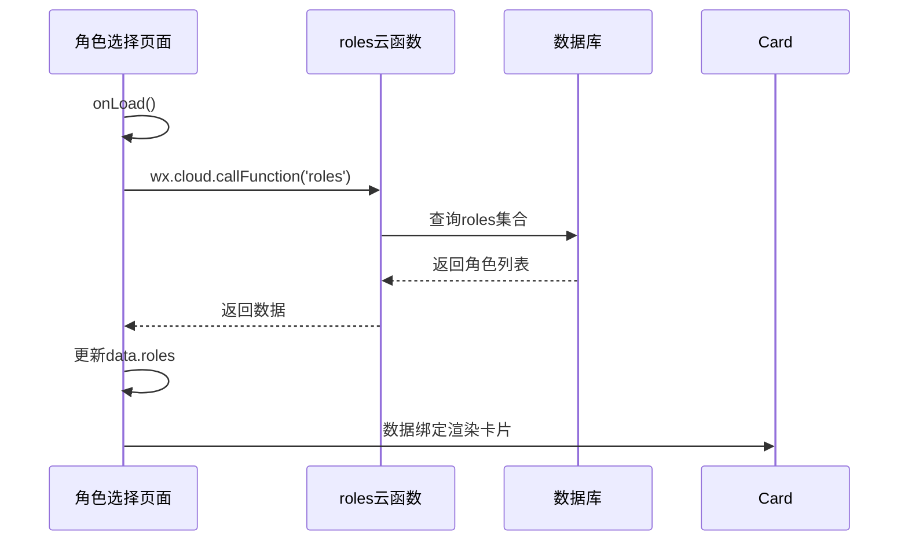

# 角色卡片组件

<cite>
**本文档引用的文件**
- [role-card.js](file://miniprogram/components/role-card/role-card.js)
- [role-card.wxml](file://miniprogram/components/role-card/role-card.wxml)
- [role-card.json](file://miniprogram/components/role-card/role-card.json)
- [role-select.js](file://miniprogram/pages/role-select/role-select.js)
- [getRoleInfo.md](file://doc/开发文档/cloudfunctions/getRoleInfo.md)
- [index.js](file://cloudfunctions/roles/index.js)
</cite>

## 目录
1. [简介](#简介)
2. [UI结构与样式布局](#ui结构与样式布局)
3. [属性与数据绑定](#属性与数据绑定)
4. [事件处理机制](#事件处理机制)
5. [与云函数交互流程](#与云函数交互流程)
6. [视觉反馈实现](#视觉反馈实现)
7. [使用示例](#使用示例)

## 简介
角色卡片组件（role-card）是角色选择页面中的核心UI元素，用于展示单个角色的头像、名称、描述等信息。该组件支持选中状态、暗夜模式，并通过自定义事件与父页面进行交互。组件设计注重用户体验，提供了丰富的视觉反馈和错误处理机制。

**Section sources**
- [role-card.js](file://miniprogram/components/role-card/role-card.js#L1-L10)
- [role-card.wxml](file://miniprogram/components/role-card/role-card.wxml#L1-L5)

## UI结构与样式布局
角色卡片组件采用Flex布局，分为头像容器和信息容器两部分。头像容器包含角色头像、系统角色标记、分类标签和推荐标记。信息容器包含角色名称和使用次数、角色描述。

头像使用`aspectFill`模式确保图片完整显示，组件支持暗夜模式切换，通过`darkMode`属性控制样式。选中状态通过`selected`属性添加CSS类实现视觉区分。



**Diagram sources**
- [role-card.wxml](file://miniprogram/components/role-card/role-card.wxml#L1-L42)
- [role-card.js](file://miniprogram/components/role-card/role-card.js#L10-L20)

## 属性与数据绑定
组件通过properties接收外部传入的角色数据，主要属性包括：

- **role**: 角色对象，包含角色的基本信息
- **selected**: 布尔值，表示角色是否被选中
- **darkMode**: 布尔值，表示是否启用暗夜模式

数据绑定通过WXML模板语法实现，使用多重备选方案确保数据的可靠性。例如角色名称会依次尝试`name`、`role_name`字段，若都不存在则显示默认文本"未命名角色"。



**Diagram sources**
- [role-card.js](file://miniprogram/components/role-card/role-card.js#L10-L35)
- [role-card.wxml](file://miniprogram/components/role-card/role-card.wxml#L1-L42)

**Section sources**
- [role-card.js](file://miniprogram/components/role-card/role-card.js#L10-L35)
- [role-card.wxml](file://miniprogram/components/role-card/role-card.wxml#L1-L42)

## 事件处理机制
组件实现了点击和长按两种交互事件：

- **点击事件**: 触发`select`自定义事件，携带角色数据作为参数，用于角色选择
- **长按事件**: 触发`longpress`自定义事件，用于唤出角色操作菜单

当头像加载失败时，组件会触发`handleAvatarError`方法，自动切换到默认头像并更新视图。这些事件机制确保了组件的健壮性和用户体验。



**Diagram sources**
- [role-card.js](file://miniprogram/components/role-card/role-card.js#L70-L85)
- [role-select.js](file://miniprogram/pages/role-select/role-select.js#L250-L260)

**Section sources**
- [role-card.js](file://miniprogram/components/role-card/role-card.js#L70-L85)
- [role-select.js](file://miniprogram/pages/role-select/role-select.js#L250-L260)

## 与云函数交互流程
角色卡片组件本身不直接调用云函数，而是通过角色选择页面（role-select）间接交互。角色选择页面在`onLoad`和`onShow`生命周期中调用`roles`云函数的`getRoles`接口获取角色列表。

`roles`云函数查询数据库的`roles`集合，返回角色详细信息。页面获取数据后，通过数据绑定将角色信息传递给角色卡片组件进行渲染。这种设计实现了数据获取与UI展示的分离。



**Diagram sources**
- [role-select.js](file://miniprogram/pages/role-select/role-select.js#L100-L180)
- [index.js](file://cloudfunctions/roles/index.js#L672-L722)

**Section sources**
- [role-select.js](file://miniprogram/pages/role-select/role-select.js#L100-L180)
- [index.js](file://cloudfunctions/roles/index.js#L672-L722)

## 视觉反馈实现
组件通过多种方式提供视觉反馈：

- **选中态**: 通过`selected`属性添加CSS类，改变卡片边框和阴影效果
- **暗夜模式**: 通过`darkMode`属性切换深色主题样式
- **推荐标记**: 根据`messageCount`或`isRecommended`字段显示"常用"或"推荐"标签
- **系统标记**: 标识系统预设角色
- **错误处理**: 头像加载失败时自动切换到默认头像

这些视觉反馈帮助用户快速识别角色状态和类型，提升界面的可读性和交互性。

**Section sources**
- [role-card.wxml](file://miniprogram/components/role-card/role-card.wxml#L1-L42)
- [role-card.js](file://miniprogram/components/role-card/role-card.js#L85-L91)

## 使用示例
在角色列表中循环渲染角色卡片的典型用法如下：

```wxml
<view class="role-list">
  <block wx:for="{{filteredRoles}}" wx:key="_id">
    <role-card 
      role="{{item}}" 
      selected="{{selectedRoleId === item._id}}" 
      darkMode="{{darkMode}}"
      bind:select="handleSelectRole"
      bind:longpress="handleLongPressRole"/>
  </block>
</view>
```

此示例展示了如何在`wx:for`循环中使用角色卡片组件，通过`bind:select`绑定事件监听器，实现角色选择功能。

**Section sources**
- [role-select.js](file://miniprogram/pages/role-select/role-select.js#L250-L260)
- [role-card.wxml](file://miniprogram/components/role-card/role-card.wxml#L1-L42)