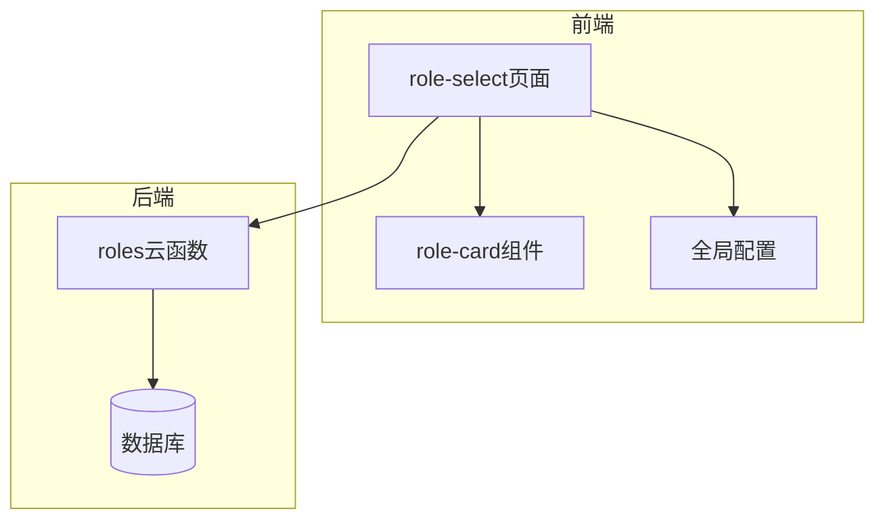
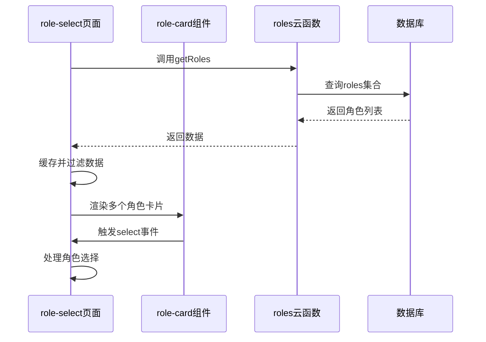
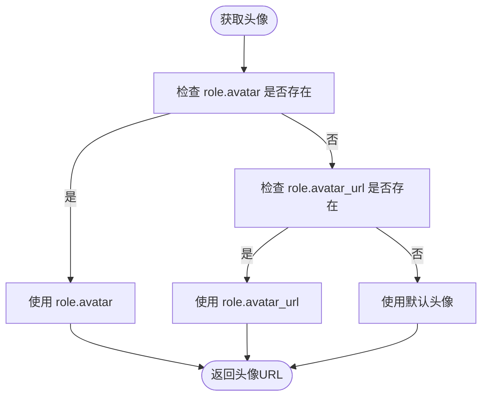
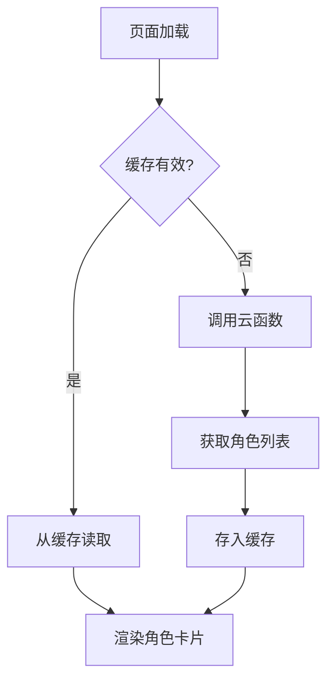
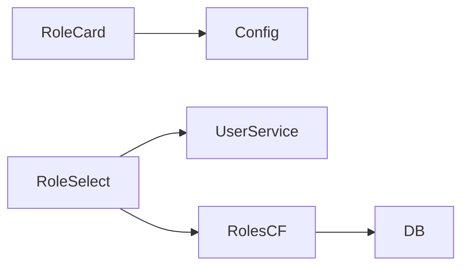

# 角色卡片组件

<cite>
**本文档引用文件**  
- [role-card.js](file://miniprogram/components/role-card/role-card.js)
- [role-card.json](file://miniprogram/components/role-card/role-card.json)
- [role-select.js](file://miniprogram/pages/role-select/role-select.js)
- [role-select.json](file://miniprogram/pages/role-select/role-select.json)
- [index.js](file://cloudfunctions/roles/index.js)
- [index.js](file://miniprogram/config/index.js)
</cite>

## 目录
1. [简介](#简介)
2. [项目结构](#项目结构)
3. [核心组件](#核心组件)
4. [架构概览](#架构概览)
5. [详细组件分析](#详细组件分析)
6. [依赖分析](#依赖分析)
7. [性能考虑](#性能考虑)
8. [故障排除指南](#故障排除指南)
9. [结论](#结论)

## 简介
角色卡片组件（role-card）是 HeartChat 应用中用于展示和选择角色的核心 UI 组件。它在角色选择页面（role-select）中被广泛使用，支持角色头像、名称、描述的展示，并可通过交互按钮触发选择、编辑、删除等操作。该组件具备响应式设计，适配不同屏幕尺寸与暗夜模式，支持通过 `role` 对象传递角色信息，并通过事件机制与父页面通信。

## 项目结构
角色卡片组件位于 `miniprogram/components/role-card/` 目录下，包含 JS 和 JSON 文件。其使用场景主要在 `miniprogram/pages/role-select/` 页面中，数据来源于 `cloudfunctions/roles` 云函数。配置信息（如角色分类）由 `miniprogram/config/index.js` 提供。



**图示来源**  
- [role-card.js](file://miniprogram/components/role-card/role-card.js)
- [role-select.js](file://miniprogram/pages/role-select/role-select.js)
- [index.js](file://cloudfunctions/roles/index.js)

**本节来源**  
- [miniprogram/components/role-card](file://miniprogram/components/role-card)
- [miniprogram/pages/role-select](file://miniprogram/pages/role-select)

## 核心组件
角色卡片组件是一个自定义小程序组件，接收 `role` 对象作为属性，展示角色的头像、名称和描述。组件支持点击选择和长按操作，可通过 `darkMode` 属性适配暗夜模式。当头像加载失败时，自动替换为默认头像。

**本节来源**  
- [role-card.js](file://miniprogram/components/role-card/role-card.js#L1-L91)

## 架构概览
角色卡片组件在角色选择页面中被批量渲染，通过 `wx:for` 指令遍历 `filteredRoles` 数据列表。页面通过调用 `roles` 云函数获取角色数据，并缓存于本地。用户交互（如点击、长按）通过事件冒泡机制传递至页面，触发相应逻辑（如跳转聊天、编辑角色）。



**图示来源**  
- [role-select.js](file://miniprogram/pages/role-select/role-select.js#L100-L200)
- [index.js](file://cloudfunctions/roles/index.js#L10-L50)

## 详细组件分析

### 角色卡片组件分析
角色卡片组件封装了角色信息的展示逻辑，通过 `properties` 接收外部数据，通过 `methods` 提供内部方法。

#### 属性定义
组件支持以下属性：

| 属性名 | 类型 | 默认值 | 说明 |
|--------|------|--------|------|
| `role` | Object | {} | 角色对象，包含 id、name、avatar、description 等字段 |
| `selected` | Boolean | false | 是否被选中，影响视觉样式 |
| `darkMode` | Boolean | false | 是否启用暗夜模式 |

**本节来源**  
- [role-card.js](file://miniprogram/components/role-card/role-card.js#L5-L20)

#### 方法与数据处理
组件内部通过方法统一处理字段兼容性，例如：
- `getRoleName()`：优先取 `name`，其次 `role_name`，最后默认值。
- `getRoleAvatar()`：优先取 `avatar`，其次 `avatar_url`，失败时使用默认头像。



**图示来源**  
- [role-card.js](file://miniprogram/components/role-card/role-card.js#L60-L75)

#### 事件机制
组件通过 `triggerEvent` 触发自定义事件：
- `select` 事件：用户点击卡片时触发，携带 `role` 对象作为参数。
- `longpress` 事件：用户长按卡片时触发，用于弹出操作菜单。

**本节来源**  
- [role-card.js](file://miniprogram/components/role-card/role-card.js#L77-L91)

### 角色选择页面分析
`role-select` 页面负责管理角色列表的加载、过滤与交互。

#### 数据加载与缓存
页面在 `onLoad` 和 `onShow` 时调用 `loadRoles` 方法，优先从本地缓存读取角色数据，若缓存过期或强制刷新则调用 `roles` 云函数重新获取。



**图示来源**  
- [role-select.js](file://miniprogram/pages/role-select/role-select.js#L150-L300)

#### 与云函数的数据关联
页面通过 `wx.cloud.callFunction` 调用 `roles` 云函数，传入 `action: 'getRoles'` 和 `userId` 参数。云函数查询数据库 `roles` 集合，返回系统角色和用户创建的角色。

**本节来源**  
- [role-select.js](file://miniprogram/pages/role-select/role-select.js#L250-L280)
- [index.js](file://cloudfunctions/roles/index.js#L10-L50)

#### 批量渲染示例
在 WXML 中，通过以下代码批量渲染角色卡片：

```xml
<view class="role-list">
  <block wx:for="{{filteredRoles}}" wx:key="_id">
    <role-card 
      role="{{item}}" 
      selected="{{selectedRoleId === item._id}}" 
      dark-mode="{{darkMode}}" 
      bind:select="handleSelectRole" 
      bind:longpress="handleLongPressRole" />
  </block>
</view>
```

**本节来源**  
- [role-select.js](file://miniprogram/pages/role-select/role-select.js)
- [role-select.json](file://miniprogram/pages/role-select/role-select.json)

## 依赖分析
角色卡片组件依赖于 `config/index.js` 中的默认头像路径和角色分类配置。页面依赖 `userService` 获取用户标识，并依赖云函数 `roles` 获取数据。



**图示来源**  
- [index.js](file://miniprogram/config/index.js)
- [role-select.js](file://miniprogram/pages/role-select/role-select.js)
- [index.js](file://cloudfunctions/roles/index.js)

**本节来源**  
- [miniprogram/config/index.js](file://miniprogram/config/index.js)
- [services/userService.js](file://miniprogram/services/userService.js)

## 性能考虑
- **缓存机制**：角色列表在本地缓存 30 分钟，减少云函数调用频率。
- **按需加载**：仅在需要时从数据库获取聊天统计，用于推荐角色。
- **响应式设计**：组件样式适配不同屏幕尺寸，确保在移动端良好显示。

## 故障排除指南
- **头像不显示**：检查 `role.avatar` URL 是否有效，或确认默认头像路径正确。
- **角色列表为空**：确认用户已登录，且 `roles` 云函数返回数据正常。
- **点击无响应**：检查事件绑定是否正确，确保 `bind:select` 已在父组件中定义。

**本节来源**  
- [role-card.js](file://miniprogram/components/role-card/role-card.js#L85-L91)
- [role-select.js](file://miniprogram/pages/role-select/role-select.js#L500-L550)

## 结论
角色卡片组件是 HeartChat 应用中实现角色管理的核心 UI 元素。它通过清晰的属性接口、事件机制和响应式设计，实现了角色的高效展示与交互。结合云函数的数据支持和本地缓存策略，确保了良好的用户体验和系统性能。