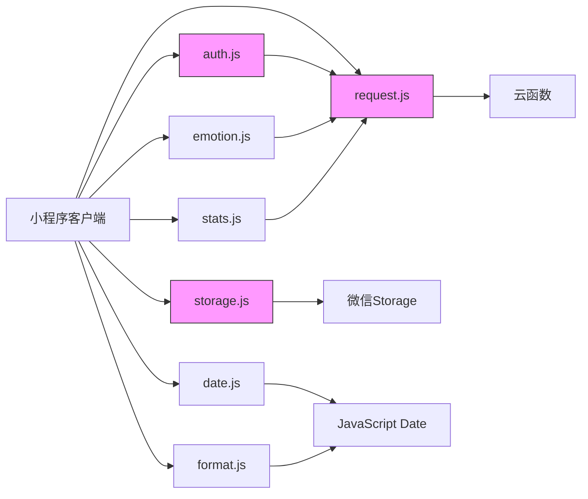
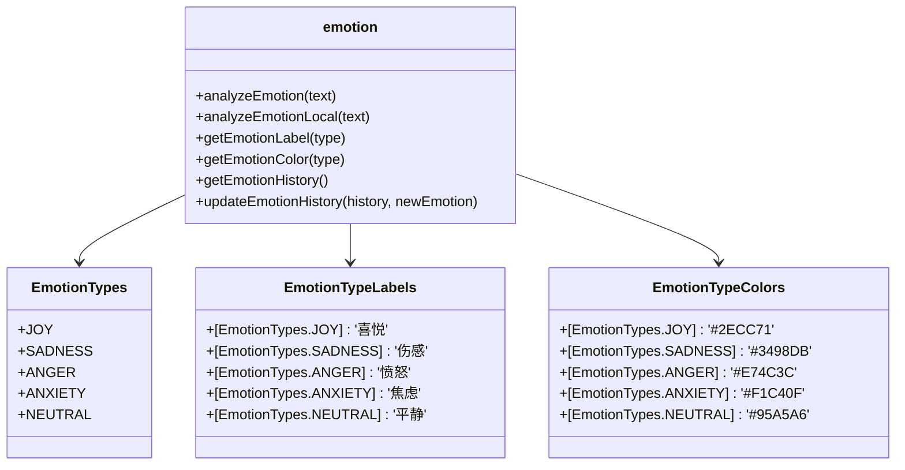
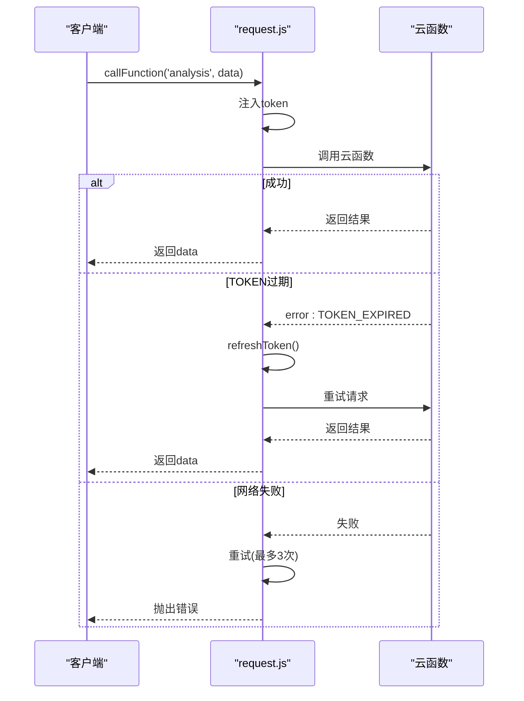
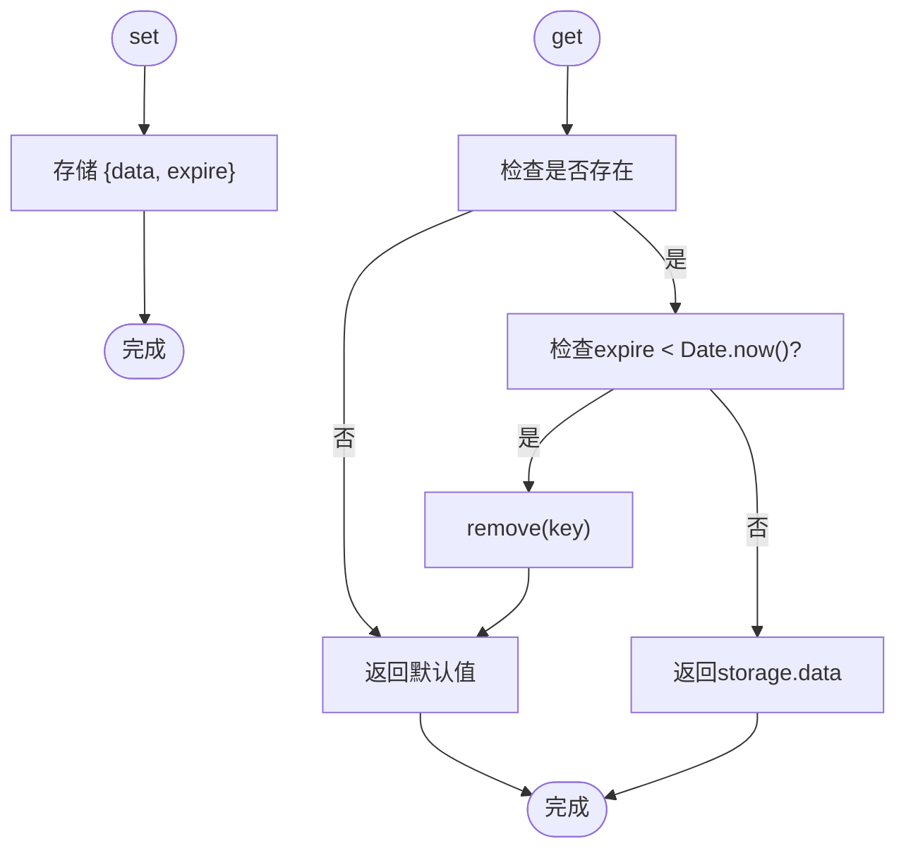
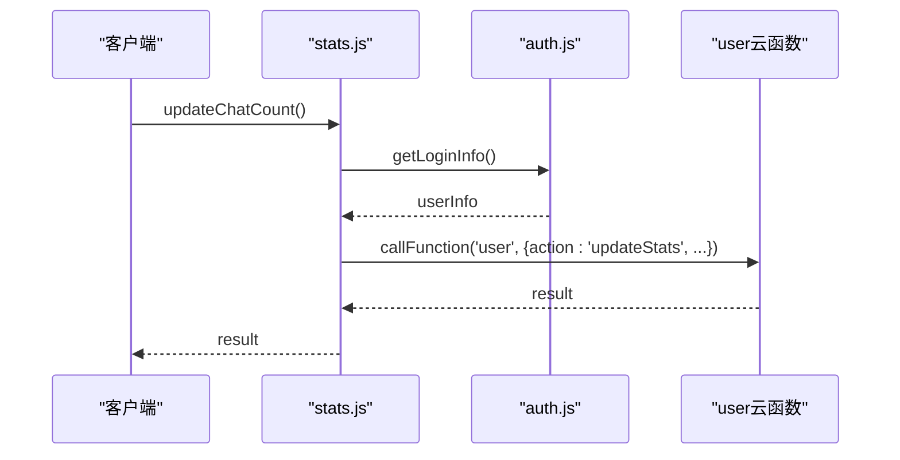
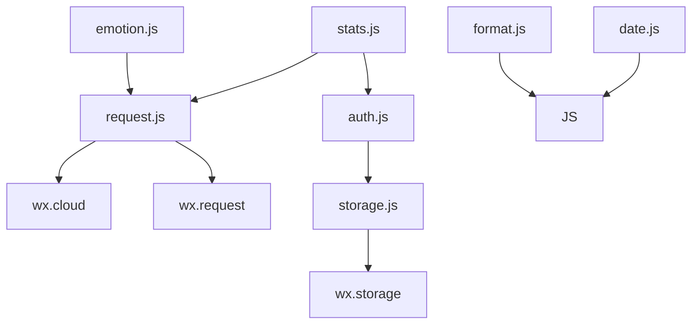

# 前端工具类

<cite>
**本文档引用文件**  
- [auth.js](file://miniprogram/utils/auth.js)
- [date.js](file://miniprogram/utils/date.js)
- [emotion.js](file://miniprogram/utils/emotion.js)
- [format.js](file://miniprogram/utils/format.js)
- [request.js](file://miniprogram/utils/request.js)
- [storage.js](file://miniprogram/utils/storage.js)
- [stats.js](file://miniprogram/utils/stats.js)
</cite>

## 目录
1. [简介](#简介)
2. [项目结构](#项目结构)
3. [核心组件](#核心组件)
4. [架构概览](#架构概览)
5. [详细组件分析](#详细组件分析)
6. [依赖分析](#依赖分析)
7. [性能考虑](#性能考虑)
8. [故障排除指南](#故障排除指南)
9. [结论](#结论)

## 简介
本文档系统性地介绍了 HeartChat 小程序中 `miniprogram/utils` 目录下的前端工具类模块。这些工具类为应用提供了用户认证、日期处理、情感分析、文本格式化、网络请求、数据存储和用户行为统计等基础能力。文档详细说明了各模块的实现机制、调用方式和最佳实践，旨在帮助开发者高效、正确地复用这些工具。

## 项目结构
`miniprogram/utils` 目录包含多个独立的工具类模块，每个模块专注于特定功能领域。这种模块化设计提高了代码的可维护性和复用性。

```mermaid
graph TB
subgraph "工具类模块"
A[auth.js] --> |用户登录状态管理| B
B[date.js] --> |日期格式化与计算| C
C[emotion.js] --> |情绪分析与映射| D
D[format.js] --> |文本标准化处理| E
E[request.js] --> |网络请求管理| F
F[storage.js] --> |数据持久化| G
G[stats.js] --> |用户行为统计|
end
```

**图示来源**  
- [auth.js](file://miniprogram/utils/auth.js)
- [date.js](file://miniprogram/utils/date.js)
- [emotion.js](file://miniprogram/utils/emotion.js)
- [format.js](file://miniprogram/utils/format.js)
- [request.js](file://miniprogram/utils/request.js)
- [storage.js](file://miniprogram/utils/storage.js)
- [stats.js](file://miniprogram/utils/stats.js)

**本节来源**  
- [miniprogram/utils](file://miniprogram/utils)

## 核心组件
本节概述了各工具类的核心功能与设计目标。

**本节来源**  
- [auth.js](file://miniprogram/utils/auth.js)
- [date.js](file://miniprogram/utils/date.js)
- [emotion.js](file://miniprogram/utils/emotion.js)
- [format.js](file://miniprogram/utils/format.js)
- [request.js](file://miniprogram/utils/request.js)
- [storage.js](file://miniprogram/utils/storage.js)
- [stats.js](file://miniprogram/utils/stats.js)

## 架构概览
整个工具类库采用模块化设计，各模块职责清晰，通过微信小程序原生 API（如 `wx` 对象）与外部系统（如云函数、云存储）交互。`request.js` 作为网络通信的核心，被其他需要远程调用的模块（如 `auth.js`、`emotion.js`、`stats.js`）所依赖。



**图示来源**  
- [auth.js](file://miniprogram/utils/auth.js)
- [request.js](file://miniprogram/utils/request.js)
- [storage.js](file://miniprogram/utils/storage.js)

**本节来源**  
- [miniprogram/utils](file://miniprogram/utils)

## 详细组件分析
本节对每个工具类模块进行深入分析。

### auth.js：用户登录状态管理
`auth.js` 模块负责管理用户的登录状态和 Token 信息，通过微信小程序的本地存储 API 实现持久化。

#### 功能分析
- **`saveLoginInfo`**: 将登录返回的 `token` 和 `userInfo` 分别存储到本地，确保数据隔离。
- **`getLoginInfo`**: 从本地存储中读取 `token` 和 `userInfo`，组合成对象返回。
- **`clearLoginInfo`**: 清除登录相关的所有本地存储项。
- **`checkLogin`**: 通过检查 `token` 和 `userInfo` 是否同时存在来判断用户登录状态。

```mermaid
classDiagram
class auth {
+saveLoginInfo(data)
+getLoginInfo()
+clearLoginInfo()
+checkLogin()
}
note right of auth
管理用户登录状态
使用微信Storage API
数据键：token, userInfo
end note
```

**图示来源**  
- [auth.js](file://miniprogram/utils/auth.js#L1-L68)

**本节来源**  
- [auth.js](file://miniprogram/utils/auth.js#L1-L68)

### date.js：日期格式化与时间计算
`date.js` 模块提供了一系列日期和时间处理工具，广泛应用于情绪历史展示等需要时间信息的场景。

#### 功能分析
- **`formatDate`**: 将 `Date` 对象格式化为 `YYYY-MM-DD` 字符串。
- **`formatTime`**: 格式化为 `HH:MM` 时间字符串。
- **`formatDateTime`**: 格式化为完整的 `YYYY-MM-DD HH:MM:SS` 字符串。
- **`getRelativeDate`**: 返回相对日期描述，如“今天”、“昨天”、“3天前”。
- **`getDateRange`**: 计算指定天数范围的起止日期。
- **`parseDate`**: 解析日期字符串（支持 `-` 和 `/` 分隔符）为 `Date` 对象。
- **`getDaysBetween`**: 计算两个日期之间的天数差。
- **`getDaysInMonth`**: 获取指定月份的总天数。

```mermaid
classDiagram
class date {
+formatDate(date)
+formatTime(date)
+formatDateTime(date)
+getRelativeDate(date)
+getDateRange(days, endDate)
+parseDate(dateStr)
+getDaysBetween(startDate, endDate)
+getDaysInMonth(date)
}
note right of date
日期处理工具集
支持格式化、解析、计算
用于情绪历史时间展示
end note
```

**图示来源**  
- [date.js](file://miniprogram/utils/date.js#L1-L165)

**本节来源**  
- [date.js](file://miniprogram/utils/date.js#L1-L165)

### emotion.js：情绪值映射与颜色编码
`emotion.js` 是情感分析功能的核心工具，负责调用云函数、处理结果、管理历史记录，并提供情绪值到标签和颜色的映射。

#### 功能分析
- **`analyzeEmotion`**: 异步调用 `analysis` 云函数进行情感分析，处理结果并更新本地历史记录。
- **`analyzeEmotionLocal`**: 提供本地关键词匹配的备选分析方案，当云函数不可用时使用。
- **`getEmotionLabel`**: 将情绪类型（如 `joy`）映射为中文标签（如“喜悦”）。
- **`getEmotionColor`**: 将情绪类型映射为预设的颜色值（如 `#2ECC71`）。
- **`getEmotionHistory` / `updateEmotionHistory`**: 管理本地情绪历史记录，最多保留10条。



**图示来源**  
- [emotion.js](file://miniprogram/utils/emotion.js#L1-L363)

**本节来源**  
- [emotion.js](file://miniprogram/utils/emotion.js#L1-L363)

### format.js：文本内容标准化处理
`format.js` 模块以 `class` 形式提供了多种文本和数据的格式化方法。

#### 功能分析
- **`datetime`**: 将时间戳格式化为指定模板的字符串。
- **`relativeTime`**: 将时间戳转换为“刚刚”、“3分钟前”等相对时间描述。
- **`fileSize`**: 将字节数格式化为带单位的字符串（如 KB, MB）。
- **`number`**: 为数字添加千分位分隔符。
- **`currency`**: 格式化金额，添加货币符号。
- **`percentage`**: 将小数转换为百分比字符串。
- **`phone` / `idCard` / `bankCard`**: 对敏感信息进行脱敏处理。
- **`textLength`**: 截取文本长度并添加后缀。

```mermaid
classDiagram
class Format {
+static datetime(timestamp, format)
+static relativeTime(timestamp)
+static fileSize(bytes, decimals)
+static number(num, decimals)
+static currency(amount, symbol, decimals)
+static percentage(value, decimals)
+static phone(phone)
+static idCard(idCard)
+static bankCard(cardNo)
+static textLength(text, maxLength, suffix)
}
note right of Format
静态工具类
提供多种格式化方法
用于数据展示
end note
```

**图示来源**  
- [format.js](file://miniprogram/utils/format.js#L1-L148)

**本节来源**  
- [format.js](file://miniprogram/utils/format.js#L1-L148)

### request.js：网络请求管理
`request.js` 模块封装了网络请求的拦截、超时控制和统一错误处理，是与后端通信的核心。

#### 功能分析
- **`callFunction`**: 封装 `wx.cloud.callFunction`，自动注入 `token`，处理 `TOKEN_EXPIRED` 错误并尝试刷新，支持请求重试。
- **`get` / `post`**: 基于 `wx.request` 的 HTTP 方法封装。
- **`uploadFile`**: 上传文件到云存储，包含重试机制和错误处理。
- **`downloadFile` / `deleteFile` / `getTempFileURLs`**: 文件操作的封装。



**图示来源**  
- [request.js](file://miniprogram/utils/request.js#L1-L284)

**本节来源**  
- [request.js](file://miniprogram/utils/request.js#L1-L284)

### storage.js：数据持久化方案
`storage.js` 模块基于微信 `Storage` API 封装了带过期时间管理的数据持久化方案。

#### 功能分析
- **`set`**: 存储数据时，附带一个 `expire` 时间戳（毫秒）。
- **`get`**: 读取数据时，检查是否过期，若过期则自动清除并返回默认值。
- **`remove` / `clear` / `has` / `info`**: 提供了清除、检查存在性和获取存储信息的便捷方法。



**图示来源**  
- [storage.js](file://miniprogram/utils/storage.js#L1-L111)

**本节来源**  
- [storage.js](file://miniprogram/utils/storage.js#L1-L111)

### stats.js：用户行为统计
`stats.js` 模块负责收集和上报用户行为数据，用于分析用户活跃度和满意度。

#### 功能分析
- **`updateUserStats`**: 通用方法，调用 `user` 云函数的 `updateStats` 接口更新指定类型的统计。
- **`updateChatCount` / `updateSolvedCount` / `updateRating` / `updateActiveDay`**: 针对不同统计类型的快捷方法。



**图示来源**  
- [stats.js](file://miniprogram/utils/stats.js#L1-L78)
- [auth.js](file://miniprogram/utils/auth.js)

**本节来源**  
- [stats.js](file://miniprogram/utils/stats.js#L1-L78)

## 依赖分析
各工具类模块之间存在明确的依赖关系，体现了良好的分层设计。



**图示来源**  
- [request.js](file://miniprogram/utils/request.js)
- [storage.js](file://miniprogram/utils/storage.js)
- [auth.js](file://miniprogram/utils/auth.js)
- [emotion.js](file://miniprogram/utils/emotion.js)
- [stats.js](file://miniprogram/utils/stats.js)

**本节来源**  
- [miniprogram/utils](file://miniprogram/utils)

## 性能考虑
- **`request.js`** 的重试机制和错误处理确保了网络请求的健壮性，但需注意重试次数避免无限循环。
- **`storage.js`** 的过期检查在每次 `get` 时执行，对性能影响较小。
- **`emotion.js`** 的本地分析 (`analyzeEmotionLocal`) 作为云函数的备选，避免了网络延迟，但准确性较低。
- 所有工具类均采用同步或异步的轻量级操作，未引入不必要的性能开销。

## 故障排除指南
- **登录状态丢失**: 检查 `auth.js` 中的 `TOKEN_KEY` 和 `USER_INFO_KEY` 是否被意外清除。
- **情感分析失败**: 检查网络连接，确认 `analysis` 云函数是否正常部署。
- **数据未持久化**: 确认 `storage.js` 的 `set` 方法传入了正确的 `expire` 参数（`null` 表示永不过期）。
- **请求频繁失败**: 查看 `request.js` 的日志输出，判断是网络问题、Token过期还是云函数内部错误。
- **统计未更新**: 确保用户已登录，`stats.js` 能够通过 `auth.js` 获取到 `userId`。

**本节来源**  
- [auth.js](file://miniprogram/utils/auth.js)
- [request.js](file://miniprogram/utils/request.js)
- [storage.js](file://miniprogram/utils/storage.js)
- [stats.js](file://miniprogram/utils/stats.js)

## 结论
`miniprogram/utils` 目录下的工具类模块设计精良，职责分明，为 HeartChat 小程序提供了坚实的基础能力。开发者在使用时应遵循各模块的约定，例如在发起网络请求时使用 `request.js` 而非直接调用 `wx.cloud.callFunction`，以确保 Token 管理和错误处理的一致性。通过复用这些工具，可以显著提高开发效率和代码质量。