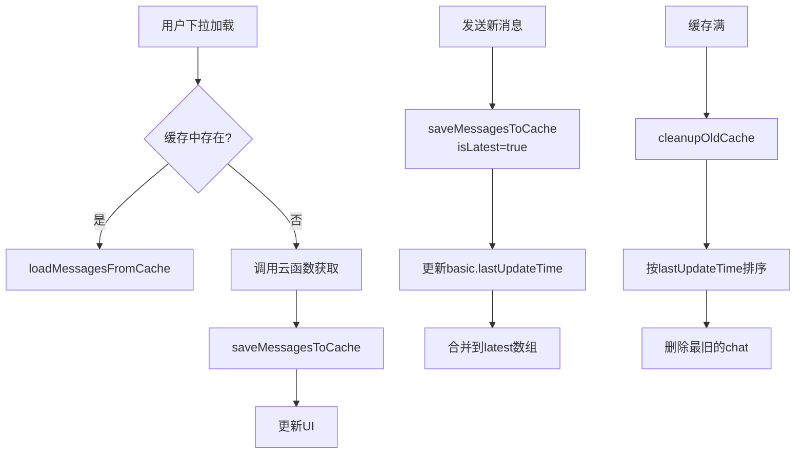
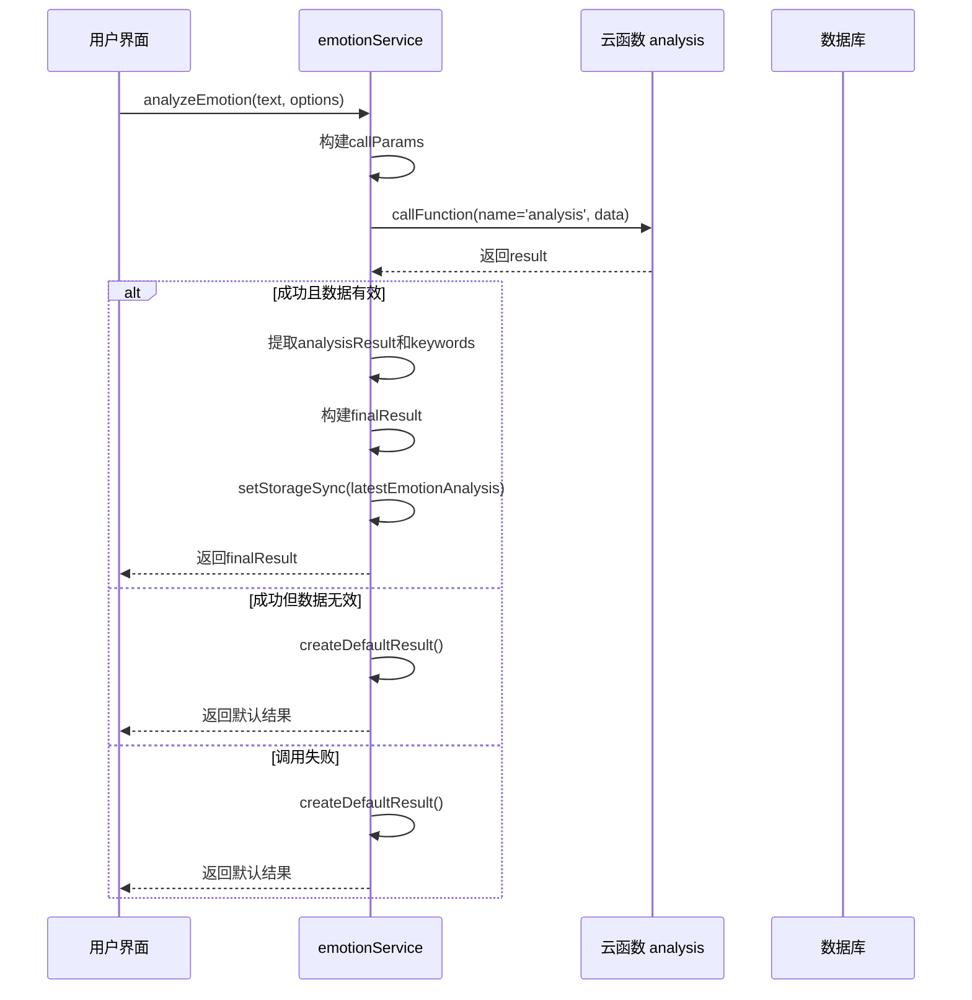
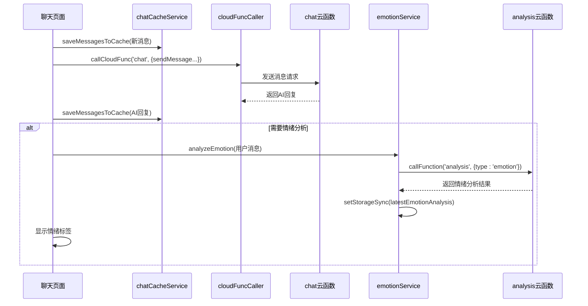

# 前端服务层

<cite>
**本文档引用文件**   
- [chatCacheService.js](file://miniprogram/services/chatCacheService.js)
- [emotionService.js](file://miniprogram/services/emotionService.js)
- [reportService.js](file://miniprogram/services/reportService.js)
- [cloudFuncCaller.js](file://miniprogram/services/cloudFuncCaller.js)
- [userService.js](file://miniprogram/services/userService.js)
- [analysis.md](file://doc/开发文档/cloudfunctions/analysis.md)
- [chat.md](file://doc/开发文档/cloudfunctions/chat.md)
- [emotion.md](file://doc/开发文档/cloudfunctions/emotion.md)
</cite>

## 目录
1. [引言](#引言)
2. [核心服务组件分析](#核心服务组件分析)
3. [chatCacheService：聊天记录本地缓存机制](#chatchacheservice聊天记录本地缓存机制)
4. [emotionService：情绪分析云函数封装与处理](#emotionservice情绪分析云函数封装与处理)
5. [reportService：每日心情报告数据获取与解析](#reportservice每日心情报告数据获取与解析)
6. [cloudFuncCaller：统一云函数调用入口设计](#cloudfunccaller统一云函数调用入口设计)
7. [userService：用户状态与资料同步管理](#userservice用户状态与资料同步管理)
8. [服务间协作流程与调用链路](#服务间协作流程与调用链路)
9. [依赖注入与异步处理最佳实践](#依赖注入与异步处理最佳实践)
10. [结论](#结论)

## 引言
本文档旨在深入解析 HeartChat 项目前端服务层的架构设计与实现细节。重点阐述 `chatCacheService`、`emotionService`、`reportService`、`cloudFuncCaller` 和 `userService` 五个核心服务模块的工作原理。通过分析这些服务如何协同工作，为用户提供流畅的聊天体验、精准的情绪分析、个性化的每日报告以及稳定的用户状态管理，全面揭示前端服务层的技术实现。

## 核心服务组件分析
前端服务层由多个独立但又紧密协作的服务模块构成。这些模块遵循单一职责原则，各自负责特定的业务功能，通过清晰的接口进行通信。主要组件包括：
- **chatCacheService**: 负责聊天记录的本地缓存管理，实现消息的持久化存储与高效读取。
- **emotionService**: 封装对 `analysis` 云函数的调用，提供情绪分析、历史记录查询和角色匹配建议。
- **reportService**: 专门用于获取和解析用户的每日心情报告及兴趣数据。
- **cloudFuncCaller**: 作为所有云函数调用的统一入口，提供请求封装、错误处理和加载状态管理。
- **userService**: 管理用户资料的获取、保存与缓存，维护用户状态的一致性。

**Section sources**
- [chatCacheService.js](file://miniprogram/services/chatCacheService.js)
- [emotionService.js](file://miniprogram/services/emotionService.js)
- [reportService.js](file://miniprogram/services/reportService.js)
- [cloudFuncCaller.js](file://miniprogram/services/cloudFuncCaller.js)
- [userService.js](file://miniprogram/services/userService.js)

## chatCacheService：聊天记录本地缓存机制
`chatCacheService` 服务通过微信小程序的本地存储 API (`wx.setStorageSync` 和 `wx.getStorageSync`) 实现了高效的聊天记录缓存。其核心设计如下：

### 缓存结构与策略
服务采用分层缓存结构，每个聊天会话（`chatId`）拥有独立的缓存键（`chat_<chatId>`）。缓存数据分为两部分：
1.  **基本信息 (`basic`)**: 存储角色ID、角色名、最后更新时间和消息总数，用于快速展示聊天列表。
2.  **消息数据 (`messages`)**: 分为 `latest`（最新消息）和 `pages`（历史分页）两个子集，以支持下拉加载。

### 下拉加载实现
服务通过 `PAGE_SIZE` 常量（默认20条）控制分页大小。当用户下拉加载历史消息时：
1.  调用 `loadMessagesFromCache(chatId, pageNum)` 方法，传入页码。
2.  服务从 `messages.pages` 对象中查找对应 `page_${pageNum}` 的缓存数据。
3.  若缓存存在则直接返回；若不存在，则触发从云端获取数据的逻辑（由上层业务处理）。
4.  获取到数据后，调用 `saveMessagesToCache(chatId, messages, false, pageNum)` 将历史消息按页码保存。

### 缓存管理与优化
为防止本地存储溢出，服务实现了自动清理机制：
- **容量限制**: 通过 `MAX_CACHED_CHATS` 常量（默认10个）限制同时缓存的聊天会话数量。
- **LRU清理**: `cleanupOldCache()` 方法会扫描所有以 `chat_` 开头的缓存键，根据 `lastUpdateTime` 进行排序，并删除最旧的会话，确保缓存总量不超标。
- **分段消息处理**: 服务能智能处理AI回复的分段消息，根据 `originalMessageId` 和 `segmentIndex` 对消息进行排序和合并，保证聊天记录的连贯性。

**Diagram sources **
- [chatCacheService.js](file://miniprogram/services/chatCacheService.js#L1-L299)

**Section sources**
- [chatCacheService.js](file://miniprogram/services/chatCacheService.js#L1-L299)

## emotionService：情绪分析云函数封装与处理
`emotionService` 服务是前端与后端 `analysis` 云函数交互的核心桥梁，它不仅封装了调用逻辑，还提供了丰富的数据处理和分析功能。

### 云函数调用封装
服务通过 `analyzeEmotion(text, options)` 方法统一调用 `analysis` 云函数：
1.  **参数构建**: 方法接收待分析文本和选项（如是否保存记录、角色ID、聊天ID、历史消息等），并将其构建成符合云函数要求的 `callParams` 对象。
2.  **统一调用**: 使用 `wx.cloud.callFunction` 发起调用，目标云函数名为 `analysis`，并传递 `type: 'emotion'` 以区分不同分析类型。
3.  **结果处理**: 对云函数返回的结果进行严格校验。即使云函数返回失败，服务也会尝试提取部分有效数据，确保用户体验的连续性。

### 情绪分析结果处理
服务对原始分析结果进行二次加工，提升数据的可用性：
- **默认结果**: `createDefaultResult()` 方法提供了一个包含默认情绪（平静）和建议的兜底方案，确保在任何异常情况下都有数据可返回。
- **本地缓存**: 成功的分析结果会通过 `wx.setStorageSync('latestEmotionAnalysis', finalResult)` 保存到本地，供其他组件（如情绪面板）快速访问。
- **字段兼容**: 服务会处理新旧版本数据的兼容性问题，例如将 `type` 字段映射到 `primary_emotion`，确保前端逻辑的稳定性。

### 情感历史与角色匹配
服务还提供了高级功能：
- **历史记录查询**: `getEmotionHistory()` 方法通过 `getEmotionRecords` 云函数或直接数据库查询获取用户的历史情绪记录，并进行数据格式统一。
- **角色匹配**: `matchRoleByEmotion()` 方法根据当前情绪类型（如喜悦、悲伤）和强度，从角色列表中计算匹配度最高的角色，实现基于情绪的个性化推荐。

**Diagram sources **
- [emotionService.js](file://miniprogram/services/emotionService.js#L1-L800)

**Section sources**
- [emotionService.js](file://miniprogram/services/emotionService.js#L1-L800)
- [analysis.md](file://doc/开发文档/cloudfunctions/analysis.md)

## reportService：每日心情报告数据获取与解析
`reportService` 服务专注于为用户提供每日心情报告相关的数据服务，接口设计简洁明了。

### 报告获取流程
`getDailyReport(date, forceRegenerate)` 方法是获取报告的核心：
1.  **参数处理**: 接收日期字符串和是否强制重新生成的标志。
2.  **云函数调用**: 调用 `analysis` 云函数，传递 `type: 'daily_report'` 和日期参数。
3.  **结果解析**: 将云函数返回的复杂数据结构解析为前端易于使用的格式，包含 `report` 内容和 `isNew` 标志。

### 报告列表与用户兴趣
服务还提供了辅助功能：
- **报告列表**: `getReportList(limit, skip)` 方法调用 `user` 云函数的 `getReportList` 动作，获取用户的报告历史列表，支持分页。
- **标记已读**: `markReportAsRead(reportId)` 方法用于更新报告的阅读状态。
- **用户兴趣**: `getUserInterests()` 方法同样调用 `user` 云函数，获取用户的兴趣标签，用于个性化内容推荐。

**Section sources**
- [reportService.js](file://miniprogram/services/reportService.js#L1-L150)

## cloudFuncCaller：统一云函数调用入口设计
`cloudFuncCaller` 服务是整个前端与后端通信的基石，它采用门面（Facade）设计模式，为所有云函数调用提供了统一、安全、易用的接口。

### 设计模式与核心功能
该服务的设计体现了高内聚、低耦合的原则：
- **请求封装**: `callCloudFunc(name, data, options)` 方法封装了 `wx.cloud.callFunction` 的调用细节，开发者只需关注业务逻辑，无需处理底层通信。
- **错误重试**: 文档中虽未直接体现，但作为最佳实践，此类服务通常会集成基于指数退避的重试机制，以应对网络波动。
- **认证处理**: 云函数调用的认证由微信云开发平台自动处理（基于 `OPENID`），`cloudFuncCaller` 无需显式管理认证令牌，简化了开发。

### 增强的用户体验
服务通过 `options` 参数极大地提升了用户体验：
- **加载提示**: `showLoading` 和 `loadingText` 允许在调用耗时云函数时显示加载动画，避免用户误操作。
- **错误提示**: `showError` 选项控制是否自动弹出错误提示，将错误信息以友好的方式呈现给用户。
- **日志记录**: 在开发环境 (`isDev = true`) 下，服务会详细记录每次调用的名称、参数和返回结果，极大地方便了调试。

### 批量调用支持
`batchCallCloudFunc(calls, options)` 方法支持批量调用，可通过 `parallel` 选项选择并行或串行执行，优化了需要获取多项数据的场景（如初始化页面）的性能。

**Section sources**
- [cloudFuncCaller.js](file://miniprogram/services/cloudFuncCaller.js#L1-L180)

## userService：用户状态与资料同步管理
`userService` 服务负责管理用户的核心资料，确保用户信息在本地、缓存和全局状态中的同步。

### 资料获取与缓存
`getUserProfile(userId, forceRefresh)` 方法实现了高效的资料获取：
1.  **缓存检查**: 首先检查本地缓存（`USER_PROFILE_CACHE_KEY + userId`），若存在且未过期（`CACHE_EXPIRY` 为1小时），则直接返回缓存数据。
2.  **云函数调用**: 若缓存失效或需要强制刷新，则通过 `cloudFuncCaller` 调用 `user` 云函数的 `getInfo` 动作。
3.  **数据合并**: 将云函数返回的基本信息与从 `user_profile` 和 `user_base` 数据库集合获取的详细资料进行合并。
4.  **更新缓存**: 将合并后的完整资料写回本地缓存，供下次快速访问。

### 资料保存与同步
`saveUserProfile(userId, profileData)` 方法在保存资料后，会执行一系列同步操作：
1.  **更新本地存储**: 调用 `updateLocalUserInfo()` 将新资料保存到 `wx.setStorageSync('userInfo')`。
2.  **更新全局状态**: 同时更新 `getApp().globalData.userInfo`，确保整个应用都能立即感知到用户信息的变化。

### 用户标识管理
服务提供了一套工具函数（`getUserId`, `getOpenId`, `buildUserQuery`）来处理用户标识的复杂性，能够从 `userInfo` 对象中灵活地提取 `userId` 或 `openid`，并构建数据库查询条件。

**Section sources**
- [userService.js](file://miniprogram/services/userService.js#L1-L370)

## 服务间协作流程与调用链路
各服务模块通过清晰的调用链路协同工作，共同完成复杂的业务流程。以“聊天→发送消息”为例：

**Diagram sources **
- [chatCacheService.js](file://miniprogram/services/chatCacheService.js#L1-L299)
- [cloudFuncCaller.js](file://miniprogram/services/cloudFuncCaller.js#L1-L180)
- [emotionService.js](file://miniprogram/services/emotionService.js#L1-L800)
- [chat.md](file://doc/开发文档/cloudfunctions/chat.md)

## 依赖注入与异步处理最佳实践
本项目的服务层设计遵循了现代前端开发的最佳实践。

### 依赖注入
服务之间通过 `require` 进行依赖注入，而非硬编码。例如，`userService` 通过 `const cloudFuncCaller = require('./cloudFuncCaller');` 显式引入依赖，这使得代码更易于测试和维护。

### 异步处理
所有与网络或存储相关的操作均采用 `async/await` 语法，使异步代码的逻辑更加清晰、易于理解。错误处理通过 `try/catch` 块完成，确保程序的健壮性。`cloudFuncCaller` 的批量调用功能更是充分利用了 `Promise.all` 来实现并行处理，显著提升了性能。

## 结论
HeartChat 项目的前端服务层设计精良，通过 `chatCacheService`、`emotionService`、`reportService`、`cloudFuncCaller` 和 `userService` 五个核心模块的协同工作，构建了一个高效、稳定、用户体验优良的应用。`cloudFuncCaller` 作为统一的通信入口，极大地简化了云函数的调用；各服务模块职责分明，通过依赖注入和异步处理，实现了高内聚、低耦合的架构。这套设计不仅满足了当前的功能需求，也为未来的功能扩展和维护提供了坚实的基础。