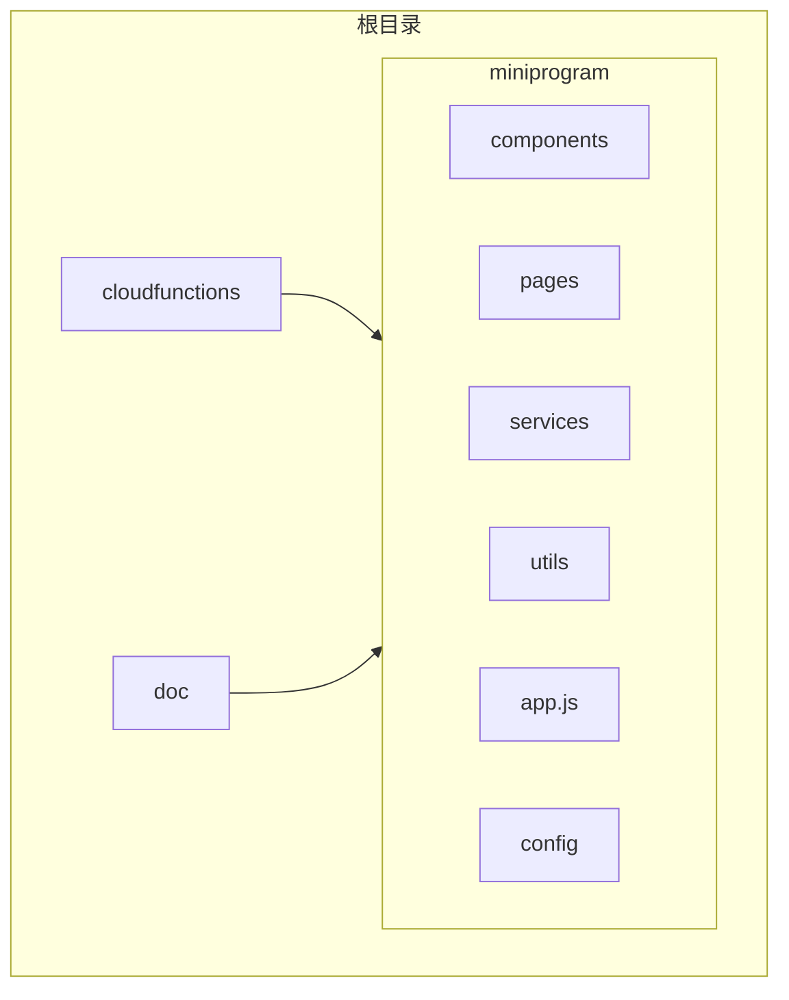
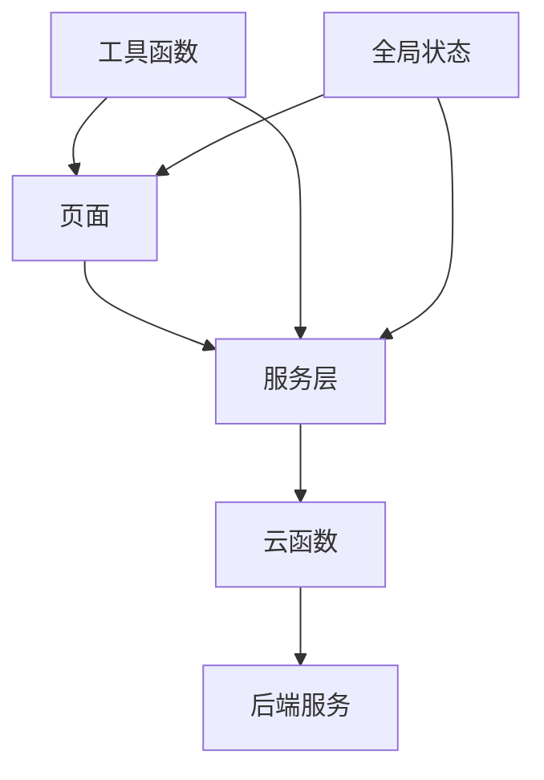
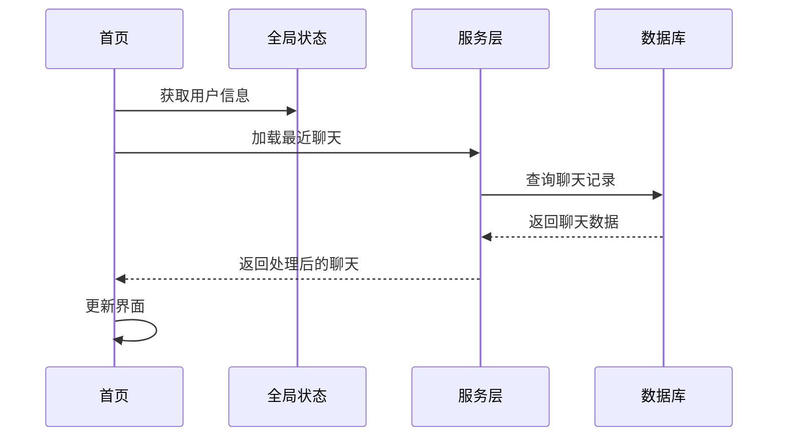
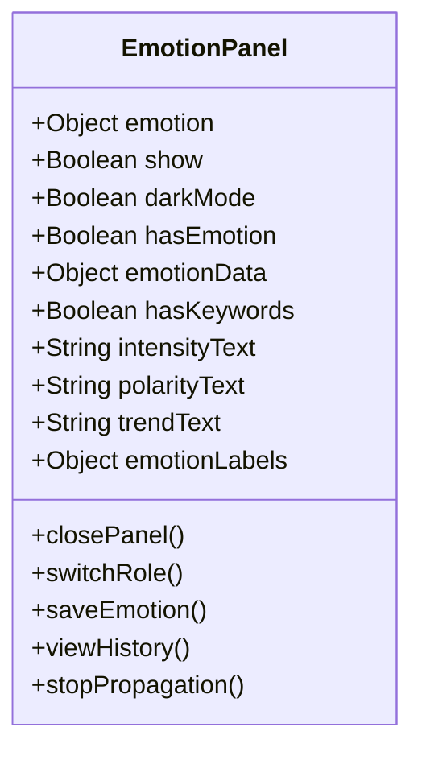
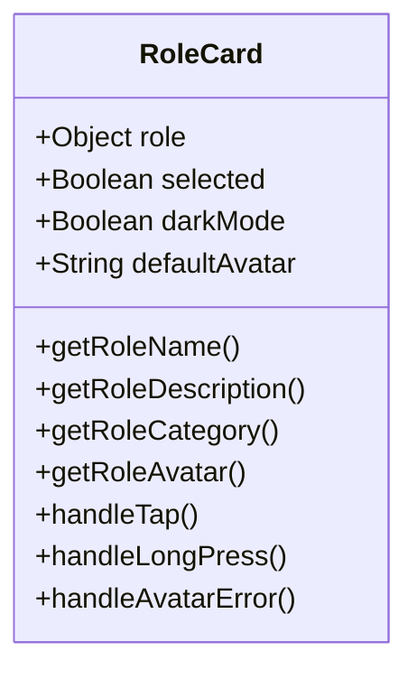
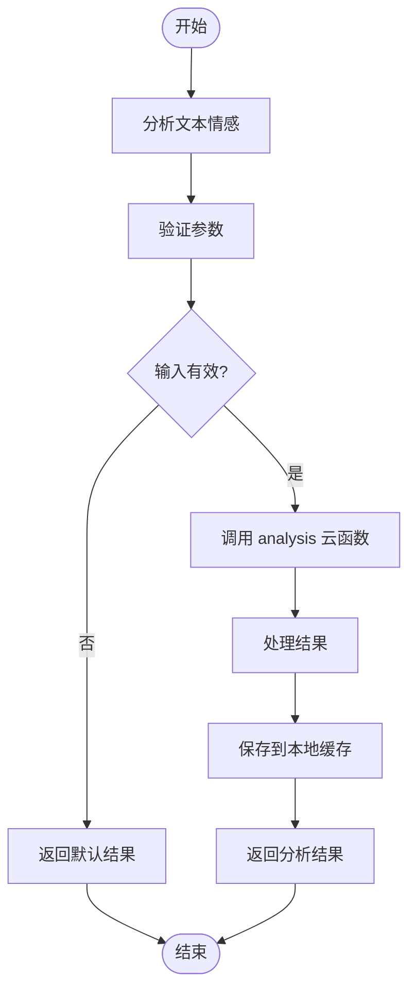
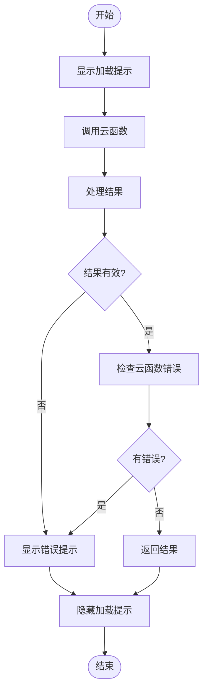
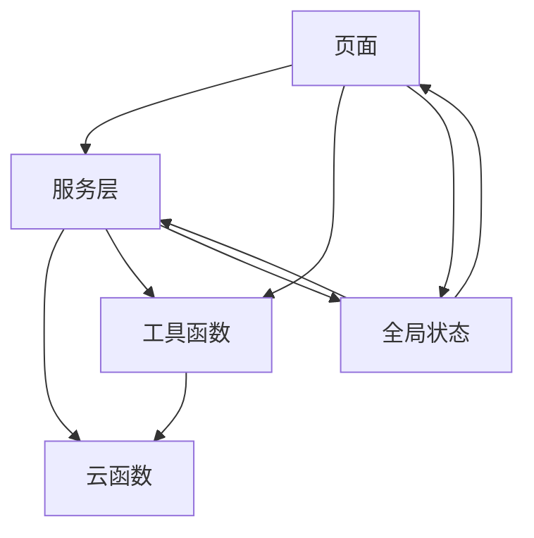

# 前端架构

<cite>
**本文档引用的文件**
- [app.js](file://miniprogram/app.js)
- [home.js](file://miniprogram/pages/home/home.js)
- [emotionService.js](file://miniprogram/services/emotionService.js)
- [cloudFuncCaller.js](file://miniprogram/services/cloudFuncCaller.js)
- [emotion-panel.js](file://miniprogram/components/emotion-panel/emotion-panel.js)
- [role-card.js](file://miniprogram/components/role-card/role-card.js)
- [config/index.js](file://miniprogram/config/index.js)
</cite>

## 目录
1. [简介](#简介)
2. [项目结构](#项目结构)
3. [核心组件](#核心组件)
4. [架构概览](#架构概览)
5. [详细组件分析](#详细组件分析)
6. [依赖分析](#依赖分析)
7. [性能考虑](#性能考虑)
8. [故障排除指南](#故障排除指南)
9. [结论](#结论)

## 简介
HeartChat 前端架构采用模块化设计，通过页面触发逻辑，调用服务层进行业务处理，并与云函数交互。该架构强调组件复用、服务封装和工具函数的全局支持。全局状态管理在 `app.js` 中实现，涵盖小程序生命周期和模块加载机制。本文档旨在为开发者提供全面的前端开发最佳实践指导。

## 项目结构
HeartChat 项目结构清晰，分为云函数、文档、小程序源码等主要目录。小程序源码位于 `miniprogram` 目录下，包含页面、组件、服务、工具函数等子目录。

**图示来源**
- [miniprogram](file://miniprogram)

**本节来源**
- [miniprogram](file://miniprogram)

## 核心组件
HeartChat 前端的核心组件包括页面、UI 组件、服务层和工具函数。页面负责用户交互和逻辑触发，UI 组件实现可复用的界面元素，服务层封装业务逻辑，工具函数提供全局支持。

**本节来源**
- [app.js](file://miniprogram/app.js#L1-L340)
- [home.js](file://miniprogram/pages/home/home.js#L1-L681)
- [emotionService.js](file://miniprogram/services/emotionService.js#L1-L799)

## 架构概览
HeartChat 前端架构采用分层设计，从页面到服务层再到云函数，形成清晰的数据流和控制流。

**图示来源**
- [app.js](file://miniprogram/app.js#L1-L340)
- [cloudFuncCaller.js](file://miniprogram/services/cloudFuncCaller.js#L1-L179)

**本节来源**
- [app.js](file://miniprogram/app.js#L1-L340)
- [cloudFuncCaller.js](file://miniprogram/services/cloudFuncCaller.js#L1-L179)

## 详细组件分析
### 页面分析
页面是用户交互的入口，通过触发事件调用服务层进行业务处理。

#### 首页分析
首页加载时获取系统信息和用户信息，并加载最近的聊天记录。

**图示来源**
- [home.js](file://miniprogram/pages/home/home.js#L1-L681)

**本节来源**
- [home.js](file://miniprogram/pages/home/home.js#L1-L681)

### UI 组件分析
UI 组件实现可复用的界面元素，提高开发效率和一致性。

#### 情绪面板组件
情绪面板组件显示情感分析结果，并提供关闭、切换角色、保存记录和查看历史等功能。

**图示来源**
- [emotion-panel.js](file://miniprogram/components/emotion-panel/emotion-panel.js#L1-L118)

**本节来源**
- [emotion-panel.js](file://miniprogram/components/emotion-panel/emotion-panel.js#L1-L118)

#### 角色卡片组件
角色卡片组件显示角色信息，并处理点击和长按事件。

**图示来源**
- [role-card.js](file://miniprogram/components/role-card/role-card.js#L1-L91)

**本节来源**
- [role-card.js](file://miniprogram/components/role-card/role-card.js#L1-L91)

### 服务层分析
服务层封装业务逻辑，提供统一的接口供页面调用。

#### 情感服务
情感服务提供情感分析相关功能，包括分析文本情感、保存情感记录、获取情感历史等。

**图示来源**
- [emotionService.js](file://miniprogram/services/emotionService.js#L1-L799)

**本节来源**
- [emotionService.js](file://miniprogram/services/emotionService.js#L1-L799)

### 工具函数分析
工具函数提供全局支持，包括认证、请求、存储等功能。

#### 云函数调用工具
云函数调用工具提供统一的云函数调用接口，包含错误处理和日志记录。

**图示来源**
- [cloudFuncCaller.js](file://miniprogram/services/cloudFuncCaller.js#L1-L179)

**本节来源**
- [cloudFuncCaller.js](file://miniprogram/services/cloudFuncCaller.js#L1-L179)

## 依赖分析
HeartChat 前端各组件之间存在明确的依赖关系，形成清晰的调用链。

**图示来源**
- [app.js](file://miniprogram/app.js#L1-L340)
- [home.js](file://miniprogram/pages/home/home.js#L1-L681)
- [emotionService.js](file://miniprogram/services/emotionService.js#L1-L799)
- [cloudFuncCaller.js](file://miniprogram/services/cloudFuncCaller.js#L1-L179)

**本节来源**
- [app.js](file://miniprogram/app.js#L1-L340)
- [home.js](file://miniprogram/pages/home/home.js#L1-L681)
- [emotionService.js](file://miniprogram/services/emotionService.js#L1-L799)
- [cloudFuncCaller.js](file://miniprogram/services/cloudFuncCaller.js#L1-L179)

## 性能考虑
HeartChat 前端在性能方面做了多项优化，包括缓存机制、批量查询和错误处理。

- **缓存机制**：情感分析结果缓存在本地，减少重复计算。
- **批量查询**：角色信息通过批量查询获取，减少数据库访问次数。
- **错误处理**：云函数调用包含完善的错误处理，确保用户体验。

## 故障排除指南
### 常见问题
- **云环境未初始化**：检查 `app.js` 中的云环境配置。
- **登录失败**：检查 `auth.js` 中的登录逻辑和云函数返回结果。
- **数据加载失败**：检查网络连接和数据库查询条件。

### 调试技巧
- 使用 `console.log` 输出关键变量的值。
- 检查云函数日志，定位后端问题。
- 使用微信开发者工具的调试功能，逐步执行代码。

**本节来源**
- [app.js](file://miniprogram/app.js#L1-L340)
- [auth.js](file://miniprogram/utils/auth.js)
- [cloudFuncCaller.js](file://miniprogram/services/cloudFuncCaller.js#L1-L179)

## 结论
HeartChat 前端架构设计合理，采用模块化和分层设计，提高了代码的可维护性和可扩展性。通过组件化设计、服务层封装和工具函数复用，实现了高效的开发和良好的用户体验。全局状态管理和小程序生命周期的合理利用，确保了应用的稳定运行。开发者应遵循本文档的最佳实践，持续优化前端架构。